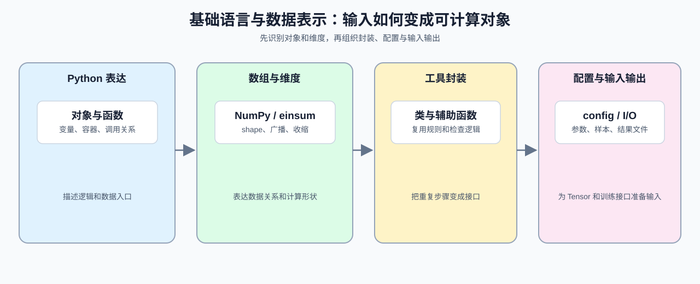

# Group 0A: Basic Language and Data Representation | 0A: 基础语言与数据表示

本组让学习者能够读懂 Python / NumPy 代码中的对象、数组和维度表达，并把这些表达转换成后续 Tensor、mask、batch 和 config 所需的输入。对 Part 2 来说，重点是识别数据结构、shape 和输入输出关系，不要求覆盖完整的语言语法。

## Group Overview | 组概览

这一组按“Python 对象与函数 → NumPy 数组与维度 → 工具类封装 → 配置与输入输出”的顺序组织。完成后，学习者应能读懂简单的模型输入、维度变换和配置代码，并判断数据从哪里进入、经过什么转换、以什么形式交给下一步。

这条线可以先记成：Python 负责把逻辑和对象关系写清楚，NumPy 负责把数组和 shape 看清楚，PyTorch 则在此基础上再加上 Tensor、device 和 autograd。

## Group Asset Overview | 组内资产总览

| 页 | 核心职责 | Q 数 | 验证数 | 覆盖 Q | 定位 |
|:---|:---|:---:|:---:|:---|:---|
| [01](./01_Python_Essentials_for_LLM.ipynb) | Python 数据结构与工程表达 | 3 | 3 | Q1, Q2, Q3 | 起步页 |
| [02](./02_NumPy_and_Einsum.ipynb) | NumPy、广播和维度表达 | 3 | 3 | Q1, Q2, Q3 |  主线页 |
| [03](./03_Python_OOP_and_Utility_Patterns.ipynb) | 对象封装和工具模式 | 3 | 3 | Q1, Q2, Q3 | 主线页 |
| [04](./04_Python_Config_and_Data_Entry.ipynb) | 配置与 I/O 的复现习惯 | 3 | 3 | Q1, Q2, Q3 | 收口页 |

## Learning Path | 学习路径

### Recommended Order | 推荐顺序

- 按 [01](./01_Python_Essentials_for_LLM.ipynb) -> [02](./02_NumPy_and_Einsum.ipynb) -> [03](./03_Python_OOP_and_Utility_Patterns.ipynb) -> [04](./04_Python_Config_and_Data_Entry.ipynb) 阅读：先识别对象和函数，再处理数组维度，随后把逻辑封装成工具，最后组织配置与输入输出。若要尽快进入 Part 2，优先完成 [02](./02_NumPy_and_Einsum.ipynb) 和 [03](./03_Python_OOP_and_Utility_Patterns.ipynb)，因为它们直接对应后续的维度表达和对象封装。

### Next Steps | 后续衔接

- 完成本组后进入 [0B](./0B.md)，把数组表达转换为 Tensor 和 Autograd 中的张量表达；如果 Part 2 中出现 shape 或类定义阅读困难，可回到对应的 02 或 03 查找示例。

如果你只熟 Python，可以先完成 01 和 03；如果你已经熟 NumPy，可以重点对照 `array -> Tensor` 的转换，再进入 0B。

## Environment Notes | 环境说明

- 默认按 `CPU-first` 阅读，优先把表达方式和维度关系看懂。
- 这里只写组级统一前提，不点到具体节号。
- 少数页面如需 `GPU optional`，以后续单页说明为准。
