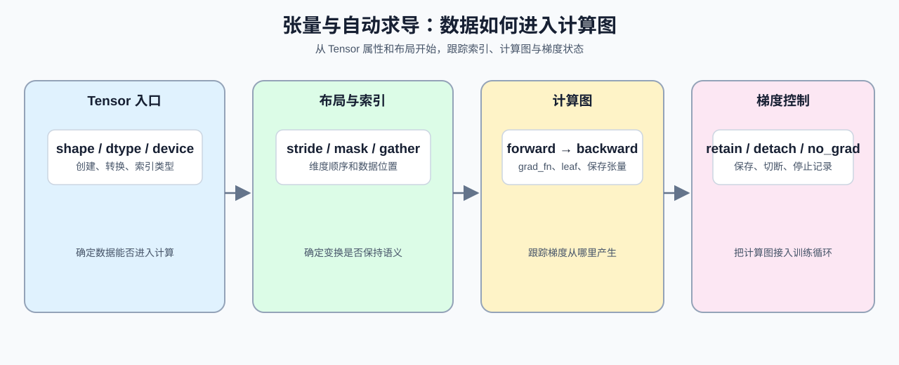

# Group 0B: PyTorch Tensors and Autograd | 0B: PyTorch 张量与自动求导

本组把 Python / NumPy 的数组表达转换为 PyTorch Tensor、layout 和 Autograd 操作。学习者将用 shape、mask、索引、计算图和梯度状态阅读基础算子与训练代码，并能定位维度不匹配或梯度未按预期传播的原因。

## Group Overview | 组概览

这一组沿着 `array -> Tensor`、`broadcast -> layout`、`slice -> index` 和 `forward -> backward` 四条关系展开：先创建并检查 Tensor，再处理布局和索引，接着观察计算图，最后控制梯度保存与停止。每一步都对应后续训练代码中的一个输入、变换或状态检查。

对 Part 2 来说，这一组先补的不是抽象理论，而是高频语法桥：`torch.tensor / from_numpy / as_tensor`、`to(dtype=...)`、`view / reshape / permute / transpose`、`unsqueeze / squeeze`、`stack / cat`、`expand / repeat`、`masked_fill`、`index_select / gather`、`requires_grad / grad_fn / is_leaf`、`retain_grad()`、`no_grad()` 和 `detach()`。

若你的目标是尽快进入 Part 2，按 `05 / 06 / 07 / 08` 阅读：05 处理 Tensor 入口，06 处理 layout 与查表，07 处理 Autograd，08 处理训练时的梯度状态。

## Group Asset Overview | 组内资产总览

| 页 | 核心职责 | Q 数 | 验证数 | 覆盖 Q | 定位 |
|:---|:---|:---:|:---:|:---|:---|
| [05](./05_PyTorch_Tensor_Fundamentals.ipynb) | Tensor、dtype、device 的最小判断 | 3 | 3 | Q1, Q2, Q3 | 起步页 |
| [06](./06_PyTorch_Tensor_Layout_and_Indexing.ipynb) | layout、stride、view、reshape 的契约 | 5 | 5 | Q1, Q2, Q3, Q4, Q5 | 主线页 |
| [07](./07_PyTorch_Autograd_and_Backward.ipynb) | Autograd、backward 和梯度边界 | 4 | 4 | Q1, Q2, Q3, Q4 | 核心页 |
| [08](./08_PyTorch_Grad_Hygiene_and_No_Grad.ipynb) | 梯度清理与无梯度模式 | 4 | 4 | Q1, Q2, Q3, Q4 | 收口页 |

## Learning Path | 学习路径

### Recommended Order | 推荐顺序

- 按 [05](./05_PyTorch_Tensor_Fundamentals.ipynb) -> [06](./06_PyTorch_Tensor_Layout_and_Indexing.ipynb) -> [07](./07_PyTorch_Autograd_and_Backward.ipynb) -> [08](./08_PyTorch_Grad_Hygiene_and_No_Grad.ipynb) 阅读，依次检查 Tensor 属性、布局和索引、梯度回传以及梯度控制。若要尽快进入 Part 2，优先完成 [06](./06_PyTorch_Tensor_Layout_and_Indexing.ipynb) 和 [07](./07_PyTorch_Autograd_and_Backward.ipynb)，它们直接对应维度变换、Embedding、反向传播和训练闭环。

### Part 2 重点 | Part 2 Focus

- [05](./05_PyTorch_Tensor_Fundamentals.ipynb)：先补 Tensor 创建、dtype 和索引类型判断，解决“数据能不能喂进去”的问题。
- [06](./06_PyTorch_Tensor_Layout_and_Indexing.ipynb)：先补 layout、mask、广播和查表语法，解决“维度和位置怎么对上”的问题。
- [07](./07_PyTorch_Autograd_and_Backward.ipynb)：先补 Autograd、leaf、`retain_grad()` 和自定义梯度，解决“梯度怎么回来”的问题。
- [08](./08_PyTorch_Grad_Hygiene_and_No_Grad.ipynb)：先补训练 / 验证 / 推理的边界、`zero_()`、`no_grad()` 和 `detach()`，解决“梯度什么时候该停”的问题。

### Next Steps | 后续衔接

- 完成本组后进入 [0C](./0C.md)，把 Tensor、计算图和梯度控制接到 `nn.Module`、Optimizer 与 Loss；遇到模型定义或训练循环问题时，可回看 06 和 07。NumPy 学习者优先回看 05 和 06，Python 学习者可先回看 0A 的对象与维度表达。

## Environment Notes | 环境说明

- 默认按 `CPU-first` 阅读，优先把 Tensor 和计算图关系看懂。
- 这里只写组级统一前提，不点到具体节号。
- 少数页面如需 `GPU optional`，以后续单页说明为准。
