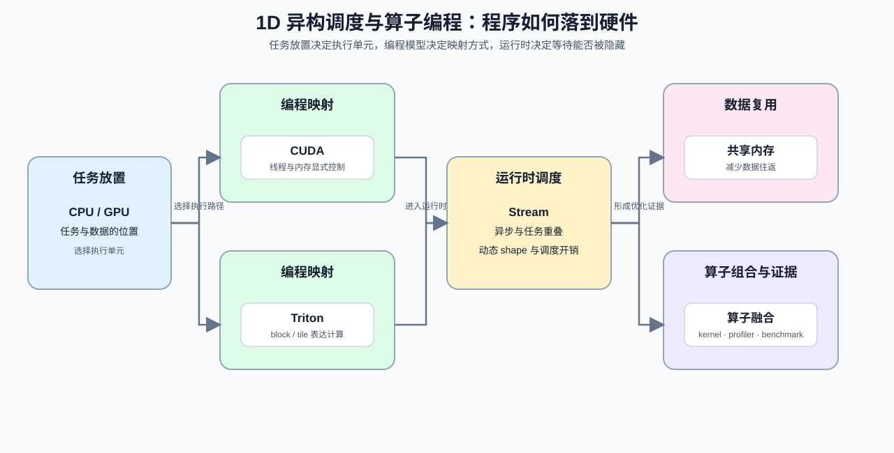

# Group 1D: Heterogeneous Scheduling and Operator Programming | 1D: 异构调度与算子编程

本组回答一个工程问题：程序如何从 CPU/GPU 的任务分配，落到线程、内存和算子执行。学习者会依次接触 CUDA/Triton 编程模型、Stream 异步调度、动态形状和算子融合，并用执行路径解释性能变化。

## Group Goal | 组定位与学习目标

先从 [1C](./1C.md) 接入多卡通信和运行时条件，再进入本组的执行模型与编程模型。完成本组后，学习者应能回答：任务放在哪个执行单元、数据如何在层级之间移动、异步任务能否重叠，以及算子融合是否改变了实际瓶颈。[19](./19_Operator_Fusion_Introduction.ipynb) 同时连接执行映射和编译优化，因此会在相邻组复用。

## Group Asset Overview | 组内资产总览

| 页 | 核心职责 | Q 数 | 代码块数 | 已有码的 Q | 待补代码的 Q | 定位 |
| --- | --- | ---: | ---: | --- | --- | --- |
| [07](./07_CPU_GPU_Heterogeneous_Scheduling.ipynb) | 分配 CPU/GPU 的执行边界 | 4 | 4 | Q1, Q2, Q3, Q4 | 无 | 主线页 |
| [08](./08_Programming_Models_CUDA_Triton.ipynb) | 选择合适的编程与映射方式 | 4 | 4 | Q1, Q2, Q3, Q4 | 无 | 主线页 |
| [29](./29_CUDA_Stream_Advanced_Scheduling.ipynb) | 压低 Stream 调度开销 | 5 | 6 | 全部 | 无 | 基础节 |
| [30](./30_Dynamic_Shape_Handling.ipynb) | 处理动态形状带来的波动 | 3 | 3 | 全部 | 无 | 基础节 |
| [31](./31_GPU_Virtualization_and_MIG.ipynb) | 评估 GPU 虚拟化与隔离收益 | 3 | 3 | 全部 | 无 | 基础节 |
| [15](./15_CUDA_Execution_Model.ipynb) | 理解 CUDA 执行层级 | 3 | 3 | Q1, Q2, Q3 | 无 | 主线页 |
| [16](./16_Warp_Block_SharedMemory_Basics.ipynb) | 用 Warp / Block / Shared Memory 提升复用 | 3 | 3 | Q1, Q2, Q3 | 无 | 主线页 |
| [17](./17_CUDA_Stream_and_Asynchrony.ipynb) | 看懂异步执行和重叠收益 | 3 | 3 | Q1, Q2, Q3 | 无 | 主线页 |
| [18](./18_Triton_Block_Model.ipynb) | 把程序块映射到执行块 | 3 | 3 | Q1, Q2, Q3 | 无 | 主线页 |
| [19](./19_Operator_Fusion_Introduction.ipynb) | 减少算子间中间张量往返 | 3 | 3 | Q1, Q2, Q3 | 无 | 主线页 |

## Learning Path | 学习路径

### Recommended Order | 推荐顺序

- 先读 [07](./07_CPU_GPU_Heterogeneous_Scheduling.ipynb) 和 [08](./08_Programming_Models_CUDA_Triton.ipynb)，建立任务放置、线程映射和 block / tile 表达的共同语境。
- 再读 [15](./15_CUDA_Execution_Model.ipynb)、[16](./16_Warp_Block_SharedMemory_Basics.ipynb)、[17](./17_CUDA_Stream_and_Asynchrony.ipynb)、[18](./18_Triton_Block_Model.ipynb) 和 [19](./19_Operator_Fusion_Introduction.ipynb)，把执行层级、片上复用、异步重叠和融合连接起来。
- 最后按需要阅读 [29](./29_CUDA_Stream_Advanced_Scheduling.ipynb)、[30](./30_Dynamic_Shape_Handling.ipynb) 和 [31](./31_GPU_Virtualization_and_MIG.ipynb)，分别处理高级 Stream、动态 shape 和 GPU 隔离问题。

这些内容直接衔接 Part 3 的 Triton kernel、系统调度和算子优化；具体页面是否需要 CUDA 工具链或 GPU，以单页环境说明为准。

## Environment Notes | 环境说明

- 默认按 `CPU-first` 阅读，先把执行模型和调度关系想清楚；`07 / 08` 的 Q 都配了验证代码，适合边读边核对。
- 组页只说明统一阅读条件；需要 CUDA 工具链或 `GPU required` 的页面，以单页环境说明为准。
