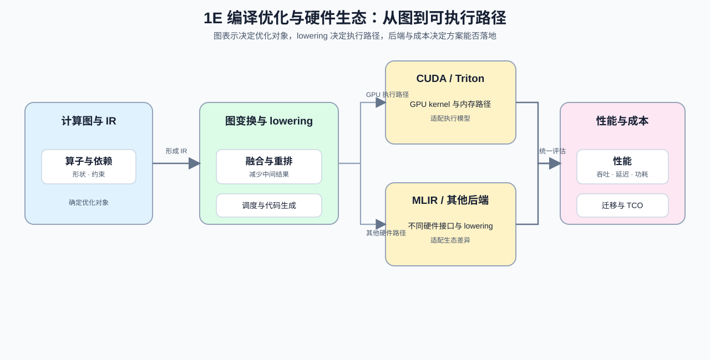

# Group 1E: Compiler Optimization and Hardware Ecosystem | 1E: 编译优化与硬件生态

本组回答一个系统问题：计算图如何经过中间表示、lowering 和代码生成，变成适配具体硬件的执行路径。学习者会继续分析图优化、后端约束、芯片选型和总体成本，并用可测量指标判断优化是否值得落地。

## Group Goal | 组定位与学习目标

先从 [1D](./1D.md) 接入执行模型、数据布局和算子组织，再进入本组的图表示、编译 lowering 和硬件后端。完成本组后，学习者应能回答：优化对象如何表示、编译器改变了哪条执行路径、后端约束如何影响方案，以及吞吐、延迟、功耗和迁移成本是否支持落地。[19](./19_Operator_Fusion_Introduction.ipynb) 同时连接算子执行与编译优化，因此会在相邻组复用。

## Group Asset Overview | 组内资产总览

| 页 | 核心职责 | Q 数 | 代码块数 | 已有码的 Q | 待补代码的 Q | 定位 |
| --- | --- | ---: | ---: | --- | --- | --- |
| [09](./09_AI_Compilers_and_Graph_Optimization.ipynb) | 找到图优化与后端约束的平衡 | 3 | 3 | 全部 | 无 | 主线页 |
| [10](./10_Domestic_AI_Chips_Overview.ipynb) | 做出芯片选型与落地判断 | 3 | 3 | 全部 | 无 | 选型页 |
| [32](./32_TVM_MLIR_Deep_Practice.ipynb) | 理解编译器分层和 lowering 流程 | 4 | 4 | Q1, Q2, Q3, Q4 | 无 | 基础节 |
| [33](./33_TCO_and_Cost_Model.ipynb) | 算清总体拥有成本 | 3 | 3 | Q1, Q2, Q3 | 无 | 基础节 |
| [19](./19_Operator_Fusion_Introduction.ipynb) | 减少融合中的中间结果开销 | 3 | 3 | Q1, Q2, Q3 | 无 | Q 结构页 |

## Learning Path | 学习路径

### Recommended Order | 推荐顺序

- 先读 [09](./09_AI_Compilers_and_Graph_Optimization.ipynb) 和 [10](./10_Domestic_AI_Chips_Overview.ipynb)，建立计算图、后端约束和芯片选型之间的联系。
- 再读 [32](./32_TVM_MLIR_Deep_Practice.ipynb) 和 [33](./33_TCO_and_Cost_Model.ipynb)，把编译器分层、lowering 流程和总体拥有成本放到同一决策链中。
- 最后按需要阅读 [19](./19_Operator_Fusion_Introduction.ipynb)，把算子融合、HBM 往返和 kernel 组织连接到 Part03 / Part04 的实现内容。

这组内容直接衔接 Part02 的模型与部署决策，以及 Part03 / Part04 的算子、编译和系统优化；具体页面的工具链要求以单页环境说明为准。

## Environment Notes | 环境说明

- 默认按 `CPU-first` 阅读，优先理解编译、选型和成本判断。
- 组页只说明统一阅读条件；需要完整工具链或 `GPU optional` 的页面，以单页环境说明为准。
