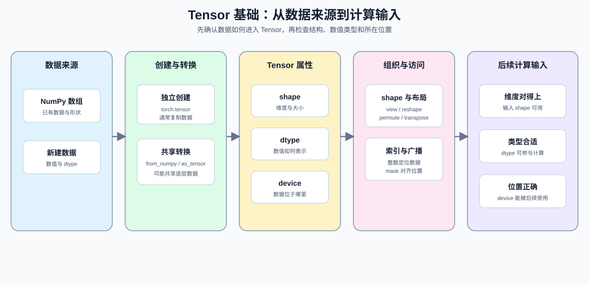

# 05. PyTorch Tensor Fundamentals | PyTorch 张量基础操作

**难度：** Easy | **环境：** CPU-first | **标签：** `PyTorch`, `张量`, `shape` | **目标人群：** 刚开始学习 PyTorch Tensor、shape 和 dtype 的学习者

> 🚀 **云端运行环境**
>
> 本章节的实战代码可以点击以下链接在免费 GPU 算力平台上直接运行：
>
> [](https://colab.research.google.com/github/datawhalechina/llm-algo-leetcode/blob/main/00_Prerequisites/05_PyTorch_Tensor_Fundamentals.ipynb)
> [](https://modelscope.cn/my/mynotebook) *(国内推荐：魔搭社区免费实例)*


本节聚焦：先读懂 Tensor 的 shape、dtype 和 device，再完成基本的 shape 变换和整数索引。学习时可以沿着一条固定顺序走：先确认数据的结构，再确认数值类型和所在位置，最后判断它能否作为后续计算的输入。代码会从 NumPy 数组和新建 Tensor 开始，覆盖 `torch.tensor`、`from_numpy`、`as_tensor` 以及 dtype/device 转换；这些属性也会影响数据对象的大小与所在位置。

如果你主要来自 NumPy，可以先把 Tensor 看成带 dtype 和 device 信息、能够参与 PyTorch 运算的数组容器；本节的重点不是记住 API 名字，而是把 `ndarray -> Tensor -> 后续计算输入` 这条转换链看顺。

**关键词：** `tensor`, `shape`, `dtype`



## 前置阅读
**导语：** 如果你刚从 Python / NumPy 进入 PyTorch，先确认数组如何转换成 Tensor、以及 shape / dtype / device 如何随转换变化，再开始本节的 Tensor 操作。
- [04. Python Config and Data Entry | Python 配置与数据入口](./04_Python_Config_and_Data_Entry.md)
- [0B 组页](./0B.md)
- [P1: 01. Data Types and Precision | 大模型的数据格式与混合精度](../01_Hardware_Math_and_Systems/01_Data_Types_and_Precision.md)

## Q1：如何读取 Tensor 的基本属性并完成 NumPy 转换？

进入 PyTorch 后，先确认 Tensor 的形状、数据类型和所在设备。对于主要用过 NumPy 的学习者，可以把 Tensor 看成带有 `shape`、`dtype` 和 `device` 属性的数组容器；这些属性帮助你判断数据能否进入下一步计算。

这里先把最常见的属性接口认熟：`x.shape` 看维度，`x.dtype` 看数值类型，`x.device` 看数据放在哪；顺手把最常见的创建和转换语法也认一下：`torch.tensor`、`torch.from_numpy`、`torch.as_tensor`、`to(dtype=...)`。


```python
import torch
import numpy as np


def describe_tensor(x):
    """返回 Tensor 的 shape、dtype 和 device，便于做最小属性检查。"""
    return {
        'shape': tuple(x.shape),
        'dtype': str(x.dtype).replace('torch.', ''),
        'device': str(x.device),
    }


# `torch.tensor` 会创建新 Tensor；`from_numpy` / `as_tensor` 会尽量复用 NumPy 的底层内存。
t = torch.tensor([[1, 2, 3], [4, 5, 6]], dtype=torch.float32)
n = np.array([[1, 2, 3], [4, 5, 6]], dtype=np.float32)
t_from_np = torch.from_numpy(n)
t_as = torch.as_tensor(n)
# 先看三个基础属性，再看不同构造方式的差异。
print('Tensor 描述：', describe_tensor(t))
print('NumPy 形状：', n.shape, 'dtype:', n.dtype)
print('from_numpy：', describe_tensor(t_from_np))
print('as_tensor：', describe_tensor(t_as))
print('Tensor->NumPy：', t.numpy())
print('dtype 转换为 int64：', t.to(torch.int64).dtype)

# 这里改 NumPy，观察共享内存的张量会一起变。
n[0, 0] = 99
print('修改 NumPy 后，from_numpy 的首元素：', t_from_np[0, 0].item())
print('修改 NumPy 后，as_tensor 的首元素：', t_as[0, 0].item())
print('torch.tensor 创建的 t 不受影响：', t[0, 0].item())

```

## Q1验证：Tensor 和 NumPy 的最小对照是否一致？

这里先确认两件事：Tensor 的 shape / dtype 是否正确，转换成 NumPy 后数值是否还一致。你可以把它理解成先确认“容器对不对”，再确认“里面的值对不对”。这一组最主要的语法目标，是先会读懂 `tensor -> numpy -> tensor` 这条最短转换链。


```python
t = torch.tensor([[1.0, 2.0], [3.0, 4.0]], dtype=torch.float32)
n = t.numpy()
assert tuple(t.shape) == (2, 2)
assert str(t.dtype) == 'torch.float32'
assert np.array_equal(n, np.array([[1.0, 2.0], [3.0, 4.0]], dtype=np.float32))
print('✅ Tensor 基本属性通过')

```

## Q2：不同 shape 变换分别改变了什么？

进入批量、序列和多头结构后，shape 变换会直接影响后续算子的输入契约。需要区分：`view` 依赖底层布局，`reshape` 会尽量返回视图但必要时可能复制，`permute` / `transpose` 主要改变维度顺序；这些操作的结果要结合 shape 和布局一起检查。

下面的对照表把四种操作的作用、布局要求和结果变化放在同一口径下。

| 操作 | 主要作用 | 需要关注 | 结果 |
| --- | --- | --- | --- |
| `view` | 在满足布局条件时重新解释形状 | 底层布局是否支持 | 通常不复制数据 |
| `reshape` | 调整形状 | 不满足视图条件时可能复制 | 返回目标 shape |
| `permute` | 按指定顺序重排维度 | 维度顺序和连续性 | 通常产生新的 stride 视图 |
| `transpose` | 交换两个维度 | 被交换的维度 | 改变维度顺序 |


```python
x = torch.arange(24).reshape(2, 3, 4)
# 先看最常见的几个变换：展平、重排、换维度顺序。
print('原始 shape：', x.shape)
print('flatten 后：', x.view(-1).shape)
print('reshape 成 (3, 8)：', x.reshape(3, 8).shape)
print('permute 后：', x.permute(0, 2, 1).shape)
print('transpose 后：', x.transpose(1, 2).shape)
print('permute 和 transpose 结果一致吗：', torch.equal(x.permute(0, 2, 1), x.transpose(1, 2)))
# 这里重点感受不同 API 的语义，而不是死记输出。

```

## Q2验证：形状和维度顺序是否保持？

这里直接检查几个最常见的变换：能不能展平、能不能转回、维度顺序有没有按预期交换，以及 `permute` 后布局是否仍然连续。你要把 `view / reshape / permute / transpose` 的输出 shape 和它们的语义一起看；同时记住，改 dtype 不是改 shape。


```python
x = torch.arange(24).reshape(2, 3, 4)
y = x.permute(0, 2, 1)
z = y.transpose(1, 2)
# `view` 依赖当前布局，`permute` / `transpose` 负责换轴，`reshape` 会按条件返回视图或创建副本。
assert x.view(-1).shape == (24,)
assert y.shape == (2, 4, 3)
assert z.shape == (2, 3, 4)
assert x.is_contiguous()
assert not y.is_contiguous()
print('✅ shape 变换通过')

```

## Q3：dtype 和 device 如何决定 Tensor 的使用方式？

进入后续算子之前，要同时确认 dtype 和 device。浮点张量通常用于数值计算，整型张量通常用于索引或 id；`device` 则决定 Tensor 所在的计算位置。这里使用 `float()`、`long()` 和 `to(...)` 完成最小转换，并保持本节的 CPU 环境。


```python
idx = torch.tensor([0, 1, 2], dtype=torch.long)
vals = idx.float()
# 整型张量更适合做索引；浮点张量更适合做数值计算。
print('idx dtype：', idx.dtype)
print('vals dtype：', vals.dtype)
print('to int64：', vals.to(torch.int64).dtype)

# `to(dtype=...)` 是最常见的类型转换入口。
float_x = torch.tensor([1.0, 2.0, 3.0], dtype=torch.float32)
print('float_x -> long：', float_x.to(torch.int64))

```

## Q3验证：dtype、整数索引和 device 是否清楚？

这里检查三件事：整数索引是否保持整型，浮点张量转换后 dtype 是否变化，以及 Tensor 是否位于预期的 CPU device。


```python
idx = torch.tensor([0, 1, 2], dtype=torch.long)
vals = idx.float()
assert idx.dtype == torch.int64
assert vals.to(torch.int64).dtype == torch.int64
assert vals.dtype == torch.float32
cpu_x = torch.tensor([1.0, 2.0, 3.0])
assert cpu_x.device.type == 'cpu'
assert cpu_x.to(dtype=torch.float64).dtype == torch.float64
print('✅ dtype、索引和 device 通过')

```

### 本节小结

- 先把 `Tensor / shape / dtype / device` 认清，再看后面的训练接口。
- `shape` 负责结构，`dtype` 负责数值语义，`device` 负责运行位置。
- `from_numpy` 和 `as_tensor` 可能共享 NumPy 的底层数据，修改一侧时要留意另一侧是否同步变化。

## 相关阅读
**导语：** 完成本节后，可以继续查阅 Tensor 创建、视图规则和下一节的布局索引实践。
- [PyTorch Tensor 官方文档](https://pytorch.org/docs/stable/tensors.html)：查阅 Tensor 的属性、创建方式和基础 API。
- [PyTorch Tensor Views 官方文档](https://pytorch.org/docs/stable/tensor_view.html)：理解 `view`、`reshape`、stride 与连续性。
- [06. PyTorch Tensor Layout and Indexing | PyTorch 张量布局与索引](./06_PyTorch_Tensor_Layout_and_Indexing.md)：继续练习布局、切片和索引。
