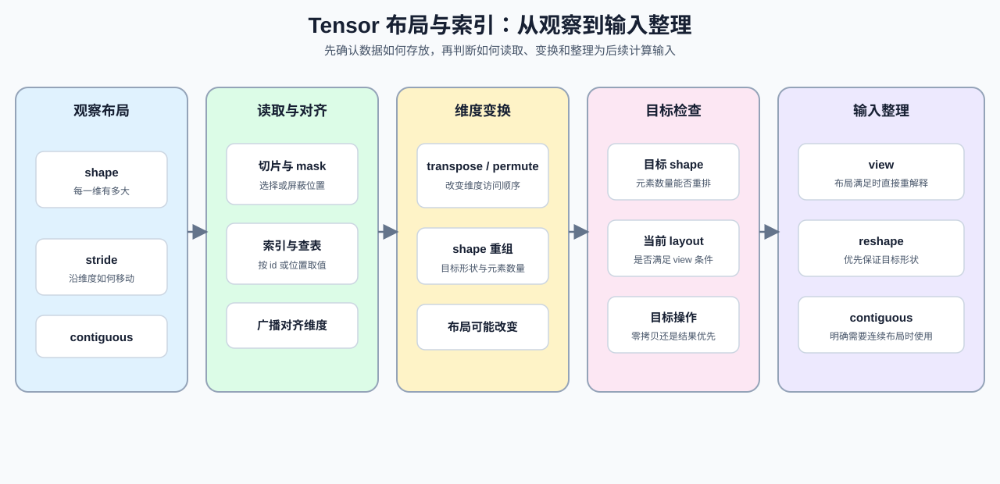

# 06. PyTorch Tensor Layout and Indexing | PyTorch 张量布局与索引

**难度：** Easy | **环境：** CPU-first | **标签：** `PyTorch`, `布局`, `索引` | **目标人群：** 已会创建 Tensor、准备理解 shape 与内存布局的学习者

> 🚀 **云端运行环境**
>
> 本章节的实战代码可以点击以下链接在免费 GPU 算力平台上直接运行：
>
> [](https://colab.research.google.com/github/datawhalechina/llm-algo-leetcode/blob/main/00_Prerequisites/06_PyTorch_Tensor_Layout_and_Indexing.ipynb)
> [](https://modelscope.cn/my/mynotebook) *(国内推荐：魔搭社区免费实例)*


本节聚焦：先读懂 Tensor 的 shape、stride 和连续性，再判断索引、广播与维度变换是否保持预期语义。学习时可以沿着“观察布局 → 读取数据 → 变换维度 → 选择操作”的顺序推进；后面 Attention、KV Cache 和序列变换中的 `permute / reshape / view / contiguous` 都会复用这套判断方式。

**关键词：** `shape`, `stride`, `contiguous`

布局变换是否触发数据复制，要结合具体工作负载观察；本节先把判断复制可能性的布局条件练清楚。



## 前置阅读
**导语：** 先回顾 Tensor 的形状和基础属性，再进入本节的布局、索引和连续性判断。
- [05. PyTorch Tensor Fundamentals | PyTorch 张量基础操作](./05_PyTorch_Tensor_Fundamentals.md)
- [0B 组页](./0B.md)

## Q1：如何用 shape、stride 和 contiguous 观察 Tensor 布局？

看到一个 Tensor 时，先看它的 shape、stride 和连续性。shape 说明维度大小，stride 说明沿各维移动一个位置要跨过多少元素，contiguous 则帮助判断后续能否直接使用依赖连续布局的操作。这里用切片和转置制造两个布局不同的示例，再读取这三个信号。


```python
import torch


def describe_layout(x):
    """返回 Tensor 的 shape、stride 和连续性，帮助观察布局变化。"""
    return {
        'shape': tuple(x.shape),
        'stride': x.stride(),
        'contiguous': x.is_contiguous(),
    }


x = torch.arange(12).reshape(3, 4)
y = x[:, 1:3]
z = x.t()

# `shape`、`stride` 和 `contiguous` 是 layout 里的三个核心信号。
print('x:', describe_layout(x))
print('y:', describe_layout(y))
print('z:', describe_layout(z))

# 在当前示例中，切片和转置都会得到非连续 Tensor；实际判断仍应以 `is_contiguous()` 为准。
assert x.is_contiguous() is True
assert y.is_contiguous() is False
assert z.is_contiguous() is False
print('✅ layout 基本判断通过')

```

## Q2：如何判断索引、mask 和广播是否保持原有语义？

取局部片段、屏蔽位置、按 id 查表或把一个偏置加到每一行时，先确认索引和广播是否改变了结果的含义。下面的对照表把这些操作的作用和检查重点放在一起，读完表格再看代码中的具体输出。

| 操作 | 解决的问题 | 需要检查 |
| --- | --- | --- |
| `masked_fill` | 按布尔条件替换位置 | mask 的 shape 是否一致 |
| `unsqueeze / squeeze` | 增加或删除维度 | 维度数量和位置 |
| `index_select` | 按指定索引选择整行或整列 | 索引 dtype 和选择维度 |
| `gather` | 按每个位置的索引取值 | index shape 与取值维度 |
| 广播加法 | 将低维张量对齐到高维张量 | 从右侧开始逐维匹配 |


```python
x = torch.arange(1, 13).reshape(3, 4)
mask = x % 2 == 0
row = x[0]
# `masked_fill` 会把 `~mask` 为 True 的位置替换成指定值。
print('原始张量：')
print(x)
print('布尔 mask：')
print(mask)
print('masked 后：')
print(x.masked_fill(~mask, -1))

# `unsqueeze / squeeze` 负责加一维 / 去一维，先检查维度变化再继续计算。
row_2d = row.unsqueeze(0)
print('unsqueeze 后 shape：', row_2d.shape)
print('squeeze 后 shape：', row_2d.squeeze(0).shape)
# `index_select` / 高级索引常用于按 id 查表；`gather` 常用于按位置取值。
table = torch.tensor([[10, 11, 12, 13], [20, 21, 22, 23], [30, 31, 32, 33]])
ids = torch.tensor([2, 0], dtype=torch.long)
print('高级索引查表：', table[ids])
print('index_select 查表：', torch.index_select(table, 0, ids))
pos = torch.tensor([[0], [3], [1]])
print('gather 取值：', torch.gather(table, 1, pos))

# 一维张量会自动广播到二维张量的每一行。
bias = torch.tensor([10, 20, 30, 40])
print('广播加 bias：')
print(x + bias)

masked = x.masked_fill(~mask, -1)
# 通过断言把输出形状和数值都固定下来。
assert masked.tolist() == [[-1, 2, -1, 4], [-1, 6, -1, 8], [-1, 10, -1, 12]]
broadcasted = x + bias
assert broadcasted.tolist() == [[11, 22, 33, 44], [15, 26, 37, 48], [19, 30, 41, 52]]
assert row_2d.squeeze(0).shape == (4,)
assert torch.index_select(table, 0, ids).tolist() == [[30, 31, 32, 33], [10, 11, 12, 13]]
assert torch.gather(table, 1, pos).tolist() == [[10], [23], [31]]
print('✅ mask、广播和查表通过')

```

## Q3：transpose / permute 后，为什么 view 可能无法使用？

`transpose / permute` 会改变维度访问顺序，但不会自动重排底层数据；因此 Tensor 的 shape 可能仍然正确，layout 却不再满足 `view()` 的条件。本题用一个最小例子观察 `view()` 的失败、`reshape()` 的兜底，以及连续性检查在其中扮演的角色。


```python
x = torch.arange(24).reshape(2, 3, 4)
y = x.transpose(1, 2)

# `transpose` 会交换维度，但不会帮你重排内存。
print('x contiguous:', x.is_contiguous())
print('y contiguous:', y.is_contiguous())

# 当前示例中的非连续 Tensor 直接 `view()` 会抛出 RuntimeError。
try:
    y.view(-1)
except RuntimeError as e:
    print('view 失败：', str(e).split(':', 1)[0])

# `reshape()` 会在需要时帮你返回正确结果，更适合不确定连续性的场景。
print('reshape 结果 shape：', y.reshape(-1).shape)
assert y.is_contiguous() is False
assert y.reshape(-1).shape == (24,)
print('✅ contiguous 和 reshape 通过')

```

## Q4：如何根据 shape、layout 和目标操作选择变换方式？

shape 解决维度能否对齐，layout 解决这些维度是否按当前顺序存放；两者都满足时才适合直接 `view()`。如果目标只是得到正确形状，可以使用 `reshape()`；如果后续接口明确要求连续 Tensor，再使用 `contiguous()`，但要意识到这可能产生复制。


```python
def layout_decision(x, target_shape, need_view=False):
    """区分元素数量是否可重排，以及当前布局是否支持 view。"""
    target_shape = tuple(target_shape)
    target_numel = 1
    for size in target_shape:
        target_numel *= size
    if x.numel() != target_numel:
        return {'status': 'shape_fail', 'next': 'fix_shape_first'}
    if need_view and not x.is_contiguous():
        return {'status': 'layout_fail', 'next': 'use_reshape_or_make_contiguous'}
    next_step = 'view' if need_view else 'view_or_reshape'
    return {'status': 'ok', 'next': next_step, 'target_shape': target_shape}


base = torch.arange(24).reshape(2, 3, 4)
transposed = base.transpose(1, 2)
# 同样的元素数量不等于同样的 layout；这里把真实 Tensor 传入判断函数。
print('连续 Tensor：', layout_decision(base, (6, 4), need_view=True))
print('转置 Tensor：', layout_decision(transposed, (6, 4), need_view=True))
print('只要求结果形状：', layout_decision(transposed, (6, 4), need_view=False))
assert layout_decision(base, (6, 4), need_view=True)['next'] == 'view'
assert layout_decision(transposed, (6, 4), need_view=True)['status'] == 'layout_fail'
assert layout_decision(transposed, (5, 5), need_view=False)['status'] == 'shape_fail'
print('✅ shape、layout 与目标操作的判断通过')

```

## Q5：如何把索引、维度变换和布局检查串成一次输入整理？

这一题把前面的判断串成一条输入整理流程：先从批量数据中选取需要的片段，再调整维度顺序，最后检查连续性并选择 `reshape()`。重点不是再记一个 API，而是确认每一步都同时满足目标 shape 和后续操作的布局要求。


```python
tokens = torch.arange(24).reshape(2, 3, 4)
mask = tokens[:, :, 0] % 3 == 0
selected_mask = mask[:, :2]
selected = tokens[:, :2, :]
reordered = selected.permute(0, 2, 1)
# 先检查索引结果，再观察维度变换是否改变连续性。
print('selected shape：', selected.shape)
print('reordered shape：', reordered.shape)
print('reordered contiguous:', reordered.is_contiguous())

# `reshape` 在需要时处理非连续布局，返回目标 shape。
masked_selected = selected.masked_fill(~selected_mask.unsqueeze(-1), 0)
ready = reordered.reshape(2, 4, 2)
assert selected.shape == (2, 2, 4)
assert reordered.shape == (2, 4, 2)
assert ready.shape == (2, 4, 2)
assert mask.shape == (2, 3)
assert selected_mask.shape == (2, 2)
assert masked_selected[0, 0].tolist() == [0, 1, 2, 3]
assert masked_selected[0, 1].tolist() == [0, 0, 0, 0]
print('✅ 索引、维度变换和布局检查通过')

```

### 本节小结

- `shape` 负责对齐，`stride / contiguous` 负责决定能不能直接重排。
- `mask / 广播 / 查表` 是高频语法，先看语义再看实现。
- `reshape` 是更稳的默认选择，`view` 只适合布局已经对齐的场景。

## 相关阅读
**导语：** 完成本节后，可以继续看 Tensor 的视图规则、自动求导中的张量保存，以及 Attention 对布局和显存的要求。
- [PyTorch Tensor Views 官方文档](https://pytorch.org/docs/stable/tensor_view.html)：理解 `view`、`reshape`、stride 与连续性。
- [07. PyTorch Autograd and Backward | PyTorch 自动求导与反向传播](./07_PyTorch_Autograd_and_Backward.md)：观察布局与反向传播中保存张量的联系。
- [P1: 04. Attention Memory Optimization | Attention 显存优化](../01_Hardware_Math_and_Systems/04_Attention_Memory_Optimization.md)：继续理解 Attention 中的张量布局和工作集。
