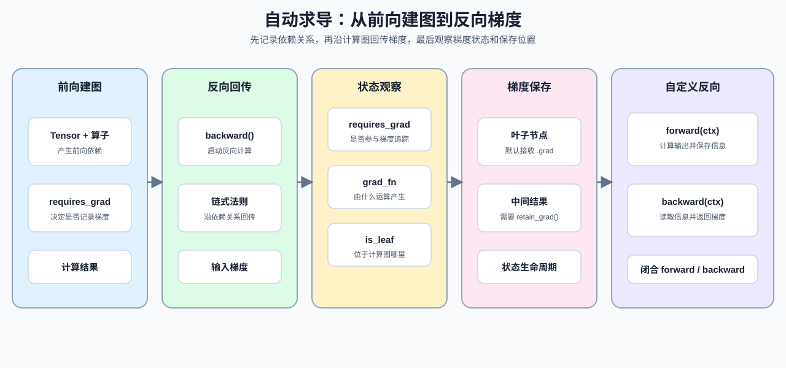

# 07. PyTorch Autograd and Backward | PyTorch 自动求导与反向传播

**难度：** Easy | **环境：** CPU-first | **标签：** `PyTorch`, `自动求导`, `反向传播` | **目标人群：** 刚开始学习训练循环、反向传播或显存管理的学习者

> 🚀 **云端运行环境**
>
> 本章节的实战代码可以点击以下链接在免费 GPU 算力平台上直接运行：
>
> [](https://colab.research.google.com/github/datawhalechina/llm-algo-leetcode/blob/main/00_Prerequisites/07_PyTorch_Autograd_and_Backward.ipynb)
> [](https://modelscope.cn/my/mynotebook) *(国内推荐：魔搭社区免费实例)*


## 本节导读

本节从一个最小计算图开始，建立 Tensor、算子和梯度之间的关系。你会依次观察 `backward()` 如何回传梯度、Tensor 属性如何反映计算图状态、叶子节点与中间结果的梯度差异，以及自定义 Function 如何连接 forward 和 backward。

完成后，你应能根据 `requires_grad`、`grad_fn`、`is_leaf` 和 `grad` 判断梯度是否正在流动，并理解计算图中保存的中间结果为什么会影响后续训练和显存管理。

**关键词：** `requires_grad`, `backward`, `detach`



---
## 前置阅读
**导语：** 先回顾张量的形状、布局和索引，再进入自动求导；这样可以把“数据如何排列”和“梯度如何沿计算图传播”区分开。
- [06. PyTorch Tensor Layout and Indexing | PyTorch 张量布局与索引](./06_PyTorch_Tensor_Layout_and_Indexing.md)
- [0B 组页](./0B.md)
---

## Q1：Autograd 如何建立计算图并回传梯度？

PyTorch 的 autograd 会在前向计算中记录 Tensor 与算子的依赖关系，并在 `backward()` 时沿着这张图应用链式法则，把梯度回传到需要梯度的叶子节点。这里先观察前向如何生成计算图，再跟踪反向如何把结果写入 `.grad`。

```python
import torch


x = torch.tensor(2.0, requires_grad=True)
y = x * x + 3 * x
print('y.item()：', y.item())
# `backward()` 会沿着前向图把梯度写回叶子节点的 `.grad`。
y.backward()
print('x.grad：', x.grad.item())
print('x.is_leaf：', x.is_leaf)

```

## Q1验证：最小反向传播是否正确？

这里直接检查解析结果：`y = x^2 + 3x` 在 `x=2` 时，梯度应该是 `2x + 3 = 7`。这类最小算例的目的，是先把反传的方向和数值对上。


```python
x = torch.tensor(2.0, requires_grad=True)
y = x * x + 3 * x
y.backward()
assert x.grad.item() == 7.0

# 梯度默认会累积；新的图可以验证第二次 backward 的结果。
x2 = torch.tensor(2.0, requires_grad=True)
for _ in range(2):
    (x2 * x2 + 3 * x2).backward()
assert x2.grad.item() == 14.0
x2.grad.zero_()
assert x2.grad.item() == 0.0
print('✅ backward、梯度累积和清零通过，x.grad =', x.grad.item())

```

## Q2：如何通过 Tensor 属性判断梯度是否正在流动？

调试计算图时，可以用 Tensor 的属性观察梯度状态：`requires_grad` 表示是否参与梯度追踪，`grad_fn` 表示它是否由带历史记录的运算产生，`is_leaf` 则帮助区分输入节点和中间结果。把这三个观察点放在一起，才能判断梯度记录从哪里开始、经过了哪些运算。


```python
a = torch.tensor(1.0)
b = torch.tensor(1.0, requires_grad=True)
c = b * 2 + 1
# `requires_grad` 只管要不要追踪，`grad_fn` 只管它是不是前面运算生成的结果。
print('a.requires_grad =', a.requires_grad, '| a.grad_fn =', a.grad_fn)
print('b.requires_grad =', b.requires_grad, '| b.grad_fn =', b.grad_fn)
print('c.grad_fn =', type(c.grad_fn).__name__)
print('a.is_leaf =', a.is_leaf, '| b.is_leaf =', b.is_leaf, '| c.is_leaf =', c.is_leaf)

leaf = b
print('leaf.is_leaf =', leaf.is_leaf)

```

## Q2验证：Tensor 属性是否反映了计算图状态？

这里确认三种状态：默认张量不追踪梯度，显式打开后会追踪，运算结果会带上 `grad_fn`；叶子节点通常没有 `grad_fn`，但会在 `.grad` 中接收回传结果。


```python
a = torch.tensor(1.0)
b = torch.tensor(1.0, requires_grad=True)
c = b * 2 + 1
assert a.requires_grad is False
assert b.requires_grad is True
assert c.grad_fn is not None
assert a.grad_fn is None

with torch.no_grad():
    no_grad_result = b * 2
assert no_grad_result.requires_grad is False
assert b.detach().requires_grad is False
print('✅ requires_grad、grad_fn、no_grad 和 detach 通过')

```

## Q3：为什么中间结果默认没有 `.grad`，如何显式保留？

如果你想观察中间张量的梯度，先要区分叶子节点和非叶子节点。默认情况下，叶子节点会接收 `.grad`；中间结果如果也要保留梯度，就需要显式调用 `retain_grad()`。这说明计算图记录和梯度保存是两个相关但不同的动作。


```python
a = torch.tensor(2.0, requires_grad=True)
b = a * 3
# `b` 是中间结果，默认不会把 `.grad` 留下来；需要时要显式 `retain_grad()`。
b.retain_grad()
loss = b * b
loss.backward()
print('a.is_leaf =', a.is_leaf, '| a.grad =', a.grad.item())
print('b.is_leaf =', b.is_leaf, '| b.grad =', b.grad.item())

# 更复杂的调试场景里，还会配合 `register_hook()` 看梯度流过哪里。

```

## Q3验证：叶子节点和中间结果的梯度是否都清楚？

这里直接检查两件事：叶子节点是否能接到 `.grad`，中间结果在显式 `retain_grad()` 之后是否也能保留梯度。你要记住的是，Autograd 会自动记录图，但中间结果默认不会替你把梯度存起来。


```python
a = torch.tensor(2.0, requires_grad=True)
b = a * 3
b.retain_grad()
loss = b * b
loss.backward()
assert a.is_leaf is True
assert b.is_leaf is False
assert a.grad.item() == 36.0
assert b.grad.item() == 12.0
print('✅ leaf 和 retain_grad 通过')

```

## Q4：自定义 `Function` 如何连接 forward 和 backward？

当默认 autograd 不能直接表达一个操作时，可以用 `autograd.Function` 明确写出 forward 和 backward。`forward(ctx, ...)` 负责计算输出并保存反向所需的中间信息，`backward(ctx, grad_output)` 读取这些信息，再按链式法则返回输入梯度。保存哪些信息会影响反向计算，也会影响中间状态的生命周期。


```python
from torch.autograd import Function


class Square(Function):
    @staticmethod
    def forward(ctx, x):
        # `ctx` 是前向和反向之间传递信息的容器。
        # forward 里先把输入存下来，backward 时还要用它恢复梯度链路。
        ctx.save_for_backward(x)
        return x * x

    @staticmethod
    def backward(ctx, grad_output):
        (x,) = ctx.saved_tensors
        # 自定义反向只要按链式法则把局部梯度乘回去即可。
        return grad_output * 2 * x


x = torch.tensor(3.0, requires_grad=True)
# `apply` 是自定义 Function 的标准调用入口。
y = Square.apply(x)
y.backward()
print('自定义梯度：', x.grad.item())

```

## Q4验证：自定义反向是否和解析结果一致？

这里直接检查 `x=3` 时的梯度是否为 `6`，先确认最小接口写对，再谈更复杂的算子。这个验证的作用，是确认 `forward` 存的信息和 `backward` 用的信息能够闭环。


```python
x = torch.tensor(3.0, requires_grad=True)
y = Square.apply(x)
y.backward()
assert x.grad.item() == 6.0
print('✅ 自定义 autograd 通过')

```

### 本节小结

- `backward()` 依赖计算图把梯度往回传。
- `requires_grad / grad_fn / is_leaf / retain_grad()` 是最重要的观察点。
- 自定义 `autograd.Function` 时，关键是让 `forward` 和 `backward` 用同一套中间信息闭环。

---
## 相关阅读
如果想继续深入，可以按“官方接口 → 自动微分原理 → 训练与显存应用”的顺序阅读：
- [PyTorch Autograd 官方文档](https://pytorch.org/docs/stable/autograd.html)：查阅计算图、`backward()`、`grad` 和自定义 `Function` 的正式接口。
- [PyTorch Autograd mechanics](https://pytorch.org/docs/stable/notes/autograd.html)：理解动态图、梯度模式、叶子张量和保存张量等实现细节。
- [`torch.autograd.Function` 官方文档](https://pytorch.org/docs/stable/notes/extending.html)：查看自定义 forward、backward 和保存中间状态的接口约定。
- [PyTorch Autograd 源码](https://github.com/pytorch/pytorch/tree/main/torch/csrc/autograd)：从开源实现中了解计算图节点和反向执行的组织方式。
- [Automatic Differentiation in Machine Learning: a Survey](https://arxiv.org/abs/1502.05767)：对比自动微分的前向模式、反向模式和计算图。
- [08. PyTorch Grad Hygiene and No-Grad | PyTorch 梯度习惯与无梯度模式](./08_PyTorch_Grad_Hygiene_and_No_Grad.md)：继续学习梯度清理、`detach` 和无梯度推理。
- [18. Memory Profiling and Optimization | 显存分析与优化](./18_Memory_Profiling_and_Optimization.md)：把激活、反向传播和显存对象联系起来。
- [20. Profiling and Memory Ledger | 性能剖析与显存账本](./20_Profiling_and_Memory_Ledger.md)：进一步学习如何用账本和 profiling 验证资源压力。
---