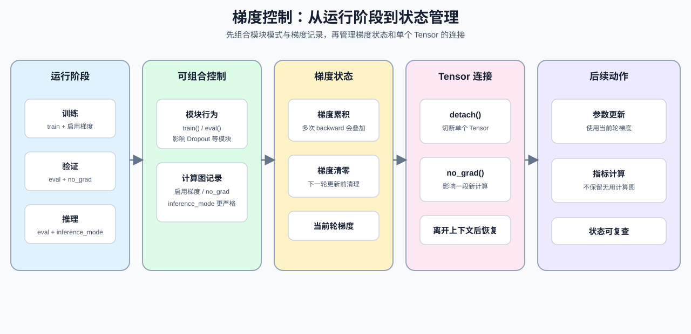

# 08. PyTorch Grad Hygiene and No Grad | PyTorch 梯度习惯与无梯度模式

**难度：** Medium | **环境：** CPU-first | **标签：** `PyTorch`, `梯度控制`, `无梯度模式` | **目标人群：** 已会基本 backward、准备学习训练循环和评估流程的学习者

> 🚀 **云端运行环境**
>
> 本章节的实战代码可以点击以下链接在免费 GPU 算力平台上直接运行：
>
> [](https://colab.research.google.com/github/datawhalechina/llm-algo-leetcode/blob/main/00_Prerequisites/08_PyTorch_Grad_Hygiene_and_No_Grad.ipynb)
> [](https://modelscope.cn/my/mynotebook) *(国内推荐：魔搭社区免费实例)*


本节聚焦：先区分模块处于训练还是评估状态，再控制计算图是否继续记录梯度；随后处理梯度累积和中间结果的切断。它承接上一节的计算图机制，把“梯度如何传播”落实到训练循环和评估流程中的具体开关。

`zero_grad()`、`no_grad()` 和 `detach()` 分别影响梯度累积、计算图记录和张量连接；掌握这些开关后，就能更稳定地组织训练和评估代码。

**关键词：** `zero_grad`, `no_grad`, `detach`



## 前置阅读
**导语：** 先理解计算图如何生成梯度，再进入本节学习训练、评估和推理时的梯度控制。
- [07. PyTorch Autograd and Backward | PyTorch 自动求导与反向传播](./07_PyTorch_Autograd_and_Backward.md)
- [0B 组页](./0B.md)

## Q1：训练、验证和推理的梯度边界分别是什么？

如果一段代码只是在算指标或做推理，它通常不该继续追踪梯度。训练、验证和推理通常需要同时设置模块模式与梯度记录方式；下面的对照表先把这两组开关分开，再结合代码观察它们的实际效果。

| 操作 | 控制对象 | 是否改变模块模式 | 是否记录计算图 | 常见场景 |
| --- | --- | --- | --- | --- |
| `model.train()` | 模块行为 | 是，进入训练模式 | 不决定 | 训练 |
| `model.eval()` | 模块行为 | 是，进入评估模式 | 不决定 | 验证、推理 |
| `torch.no_grad()` | 梯度记录 | 否 | 否 | 验证、普通推理 |
| `torch.inference_mode()` | 梯度记录与推理状态 | 否 | 否，限制更强 | 纯推理 |


```python
import torch


x = torch.tensor([2.0], requires_grad=True)
y = x * 3
# 训练时这里会建立计算图，`backward()` 后梯度会写回叶子节点。
y.backward()
print('训练时 grad:', x.grad.item())

# `no_grad` 包住的整段代码都不会继续追踪梯度，常用于验证 / 推理。
with torch.no_grad():
    z = x * 4
print('推理时 requires_grad:', z.requires_grad)

# `inference_mode()` 是更偏纯推理的上下文，也不会建图。
with torch.inference_mode():
    z2 = x * 5
print('inference_mode 下 requires_grad:', z2.requires_grad)

# `train()` / `eval()` 控制模块行为，不负责关闭梯度记录。
mode_probe = torch.nn.Dropout(p=0.5)
mode_probe.train()
print('train 模式：', mode_probe.training)
mode_probe.eval()
eval_output = x * 6
print('eval 模式：', mode_probe.training)
print('eval 模式下仍记录梯度：', eval_output.requires_grad)

```

## Q1验证：边界切换是否符合预期？

这里确认两组开关各自负责什么：训练计算会产生梯度，`no_grad()` 和 `inference_mode()` 不会继续记录计算图，`eval()` 只改变模块状态。梯度边界关注的是计算图是否继续生长。


```python
x = torch.tensor([2.0], requires_grad=True)
y = x * 3
y.backward()
assert x.grad.item() == 3.0

with torch.no_grad():
    z = x * 4
with torch.inference_mode():
    z2 = x * 5
mode_probe = torch.nn.Dropout(p=0.5)
mode_probe.eval()
eval_output = x * 6
assert z.requires_grad is False
assert z2.requires_grad is False
assert mode_probe.training is False
assert eval_output.requires_grad is True
print('✅ 梯度记录与模块模式边界通过')

```

## Q2：什么时候必须先清零梯度？

只要你准备开始下一轮参数更新，就要先清零梯度。不然上一轮残留会继续累积，最后你看到的不是当前 batch 的结果，而是累计后的混合结果。这里用叶子 Tensor 的 `zero_()` 演示最小机制，再用一个参数和优化器确认真实训练循环中的 `optimizer.zero_grad(set_to_none=True)` 会把参数梯度设为 `None`。


```python
w = torch.tensor(1.0, requires_grad=True)
loss1 = w * 2
# 如果不清零，梯度就会叠加到上一次的结果上。
loss1.backward()
print('第一次 grad:', w.grad.item())
loss2 = w * 3
loss2.backward()
print('累积后的 grad:', w.grad.item())

# `zero_()` 是原地清零，训练循环里通常在下一轮 backward 前调用。
w.grad.zero_()
loss3 = w * 4
loss3.backward()
print('清零后 grad:', w.grad.item())

param = torch.nn.Parameter(torch.tensor(1.0))
optimizer = torch.optim.SGD([param], lr=0.1)
(param * 2).backward()
print('optimizer 清零前 grad:', param.grad.item())
optimizer.zero_grad(set_to_none=True)
print('optimizer 清零后 grad:', param.grad)

```

## Q2验证：梯度累积和清零是否可控？

这里确认三件事：梯度会累加，`zero_()` 能清掉旧值，下一次 backward 会重新开始。你要把它看成训练循环里最基本的“先清再算”语法习惯。


```python
w = torch.tensor(1.0, requires_grad=True)
loss1 = w * 2
loss1.backward()
loss2 = w * 3
loss2.backward()
assert w.grad.item() == 5.0
w.grad.zero_()
loss3 = w * 4
loss3.backward()
assert w.grad.item() == 4.0
param = torch.nn.Parameter(torch.tensor(1.0))
optimizer = torch.optim.SGD([param], lr=0.1)
(param * 2).backward()
assert param.grad.item() == 2.0
optimizer.zero_grad(set_to_none=True)
assert param.grad is None
print('✅ 梯度累积和清零通过')

```

## Q3：什么时候该用 `detach()`，什么时候该用 `no_grad()`？

`no_grad()` 是用来包住一段不需要追踪的代码；`detach()` 是把某个中间结果从计算图里切出来。前者影响上下文中的新计算，后者只影响被调用的那个 Tensor；离开 `no_grad()` 后，后续计算会恢复默认的梯度记录行为。


```python
a = torch.tensor(2.0, requires_grad=True)
b = a * 2
# `detach()` 会保留数值，但切断后续梯度传播。
c = b.detach()

# `no_grad()` 是一整段不建图的上下文，里面的结果默认不追踪梯度。
with torch.no_grad():
    d = a * 4

print('b.requires_grad =', b.requires_grad)
print('c.requires_grad =', c.requires_grad)
print('d.requires_grad =', d.requires_grad)

```

## Q3验证：`detach()` 和 `no_grad()` 是否切断梯度？

这里检查三件事：`detach()` 只切断指定中间结果，`no_grad()` 影响上下文中的计算，离开上下文后梯度记录会恢复。两者都能停止某一段梯度传播，但作用范围不同。


```python
a = torch.tensor(2.0, requires_grad=True)
b = a * 2
c = b.detach()
with torch.no_grad():
    d = a * 4
e = a * 5
detached_backward_failed = False
try:
    c.backward()
except RuntimeError:
    detached_backward_failed = True
e.backward()
assert c.requires_grad is False
assert c.item() == b.item()
assert d.requires_grad is False
assert e.requires_grad is True
assert detached_backward_failed is True
assert a.grad.item() == 5.0
print('✅ detach、no_grad 及其作用范围通过')

```

### 本节小结

- `train / eval / no_grad / detach` 负责把梯度边界管住。
- `zero_grad` 是训练循环里最基础的清零习惯。
- `train / eval` 控制模块行为，`no_grad / inference_mode` 控制计算图记录，`detach` 控制单个 Tensor 的梯度连接。

## 相关阅读
**导语：** 完成本节后，可以继续学习模块模式、训练循环和显存状态之间的联系。
- [09. PyTorch nn.Module Basics | PyTorch nn.Module 基础](./09_PyTorch_nn_Module_Basics.md)：继续学习 `train()` / `eval()` 与模块行为。
- [18. Memory Profiling and Optimization | 显存分析与优化](./18_Memory_Profiling_and_Optimization.md)：观察梯度状态与显存对象的关系。
- [20. Profiling and Memory Ledger | 性能剖析与显存账本](./20_Profiling_and_Memory_Ledger.md)：把状态变化放入显存账本和 profiling 证据中。
