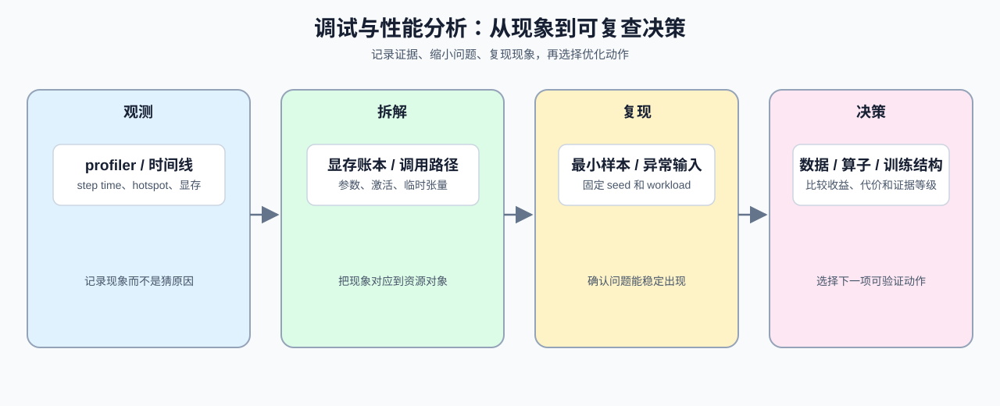

# Group 0E: Debugging and Performance | 0E: 调试与性能

本组把性能测量、显存分析和异常定位组织成一套问题处理流程。学习者先记录时间证据，再拆分显存对象，确认结果是否可信，最后根据证据选择下一项验证，而不是直接修改参数。

## Group Overview | 组概览

这一组按“测时间 → 拆显存 → 查异常 → 做决策”组织：17 负责时间热点，18 负责显存对象和训练策略，19 负责正确性与异常定位，20 负责把前面得到的证据汇总为下一项验证动作。

对 Part 2 来说，这一组最常补的能力是：`torch.profiler`、CPU/CUDA 时间拆分、显存账本、异常复现、梯度检查和最小化问题样本。它更像是你在 Part 2 遇到“跑得慢、爆显存、结果怪”时，先回到证据，再决定下一步如何验证的工具组。

## Group Asset Overview | 组内资产总览

| 页 | 核心职责 | Q 数 | 验证数 | 覆盖 Q | 定位 |
|:---|:---|:---:|:---:|:---|:---|
| [17](./17_PyTorch_Profiling_Basics.md) | 记录 CPU/CUDA 时间并定位阶段热点 | 4 | 4 | Q1, Q2, Q3, Q4 | 起步页 |
| [18](./18_Memory_Profiling_and_Optimization.md) | 拆分显存对象并比较训练策略 | 6 | 6 | Q1, Q2, Q3, Q4, Q5, Q6 | 主线页 |
| [19](./19_Debugging_and_Anomaly_Localization.md) | 检查张量契约、数值和梯度链路 | 6 | 6 | Q1, Q2, Q3, Q4, Q5, Q6 | 核心页 |
| [20](./20_Profiling_and_Memory_Ledger.md) | 汇总性能与显存证据并安排验证 | 4 | 4 | Q1, Q2, Q3, Q4 | 收口页 |

## Learning Path | 学习路径

### Recommended Order | 推荐顺序

- 按 [17](./17_PyTorch_Profiling_Basics.md) -> [18](./18_Memory_Profiling_and_Optimization.md) -> [19](./19_Debugging_and_Anomaly_Localization.md) -> [20](./20_Profiling_and_Memory_Ledger.md) 阅读，依次记录时间、拆分显存、确认异常并形成验证决策。训练变慢、显存不足或结果异常时，可从对应页面回查相应证据。

### Part 2 重点 | Part 2 Focus

- [17](./17_PyTorch_Profiling_Basics.md)：补 `torch.profiler` 和 CPU/CUDA 时间判断，回答“时间花在哪里”。
- [18](./18_Memory_Profiling_and_Optimization.md)：补显存账本和训练策略，回答“显存花在哪里”。
- [19](./19_Debugging_and_Anomaly_Localization.md)：补最小复现、张量契约和梯度检查，回答“结果是否可信”。
- [20](./20_Profiling_and_Memory_Ledger.md)：汇总前面三类证据，回答“下一步验证什么”。

### Next Steps | 后续衔接

- 完成本组后，Part 2 的训练验证、项目分析和跨页排障都可以沿“先观测、再拆解、最后决策”的流程进行；遇到具体问题时，优先回到产生证据的页面，而不是直接修改参数。

### Role Boundaries | 职责边界

- 17 只负责时间证据：Profiler、CPU/CUDA 时间、trace 和阶段热点。
- 18 只负责显存证据：参数、梯度、优化器状态、激活以及训练侧策略。
- 19 只负责正确性证据：shape、dtype、device、NaN/Inf 和梯度链路。
- 20 负责收束证据并安排验证，不重新讲解前三页的基础概念。

## Environment Notes | 环境说明

- 默认按 `CPU-first` 阅读，优先把观测方法和排错习惯看懂。
- 这里只写组级统一前提，不点到具体节号。
- 少数页面如需 `GPU optional` 或 `GPU required`，以后续单页说明为准。
