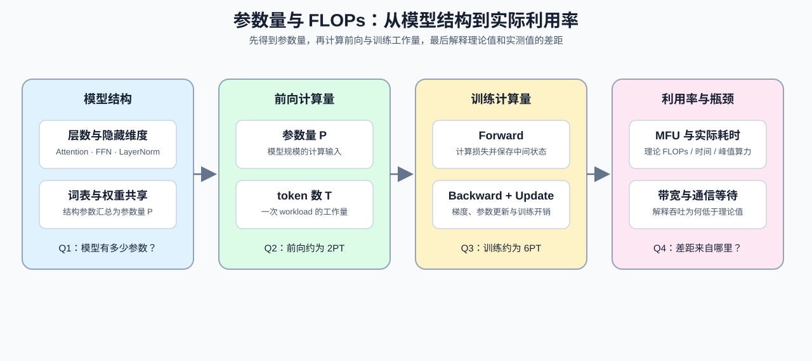

# 02. LLM Params and FLOPs | 大模型参数量与算力推导

**难度：** Medium | **环境：** CPU-first | **标签：** `数值基础`, `参数估算`, `FLOPs` | **目标人群：** 需要估算模型规模与计算预算的学习者

> 🚀 **云端运行环境**
>
> 本章节的实战代码可以点击以下链接在免费 GPU 算力平台上直接运行：
>
> [](https://colab.research.google.com/github/datawhalechina/llm-algo-leetcode/blob/main/01_Hardware_Math_and_Systems/02_LLM_Params_and_FLOPs.ipynb)
> [](https://modelscope.cn/my/mynotebook) *(国内推荐：魔搭社区免费实例)*


---

## 本节导读

模型名称里的 7B、14B 或 70B 只是规模标签；要判断它能否装入显存、一次请求或一次训练要做多少计算，还需要把层数、隐藏维度、词表、FFN 结构和 token 数拆开。参数量描述模型有多大，FLOPs 描述给定 workload 要做多少计算，两者不能混为一谈。
本节沿着“模型结构 → 工作量与 FLOPs → 利用率与瓶颈”展开：先从配置推导参数量，再估算不同 workload 的计算量，最后用 MFU 和时间占比理解理论 FLOPs 与实际吞吐的差距。完成后，你应能把一个模型配置转换成可检查的参数与计算预算，并知道训练方式变化时哪些量需要重新计算。

**关键词：** `parameters`, `FLOPs`, `MFU`



---
## 前置阅读
**导语：** 进入本节前，先确认参数量如何进入 FLOPs 计算，再把前向、训练和硬件利用率放到同一条估算链上；这些数值会在后续微调、性能分析和 GPU 实验中继续使用。

- [01. Data Types and Precision | 大模型的数据格式与混合精度](./01_Data_Types_and_Precision.md)
- [Group 0B: PyTorch Tensors and Autograd | 0B: PyTorch 张量与自动求导](../00_Prerequisites/0B.md)
  
---
## Q1：假设隐藏层维度为 $d$，词表大小为 $V$。请推导一个 Decoder 的总参数量，并比较标准 FFN 与 SwiGLU。

<details>
<summary>点击展开查看解析</summary>

我们把 Transformer 拆解为三大部分（忽略极小的 bias 和 LayerNorm 的权重，它们对百亿参数的占比不到千分之一）：

**1. 嵌入层 (Embedding Layer) 与 输出层 (LM Head)**
- Token Embedding: 形状 $[V, d]$，参数量为 $V \times d$。
- LM Head (输出映射): 形状 $[d, V]$，参数量为 $V \times d$。
- *(注：很多模型如 Gemma/Qwen 会共享这两个权重，参数量减半。这里我们假设不共享)*。

**2. 注意力机制 (Multi-Head Attention, MHA)**
在每个 Decoder 块中：
- 投影 Q, K, V：三个形状为 $[d, d]$ 的矩阵。参数量 $3d^2$。
- 投影 Output (O)：一个形状为 $[d, d]$ 的矩阵。参数量 $d^2$。
- **MHA 总参数量 = $4d^2$**。
*(如果采用 GQA，K 和 V 的参数量会大幅减少，这里按最原始的 MHA 计算)*。

**3. 前馈神经网络 (Feed Forward Network, FFN / MLP)**
在标准 GPT 架构中，隐藏层会先升维到 $4d$，再降维回 $d$：
- 升维矩阵 $W_{up}$：$[d, 4d]$，参数量 $4d^2$。
- 降维矩阵 $W_{down}$：$[4d, d]$，参数量 $4d^2$。
- **FFN 总参数量 = $8d^2$**。
*(如果在 LLaMA 中使用 SwiGLU，通常会把中间维度缩放到约 $\frac{8}{3}d$；虽然有 3 个矩阵，但总参数量仍约为 $3 \times \frac{8}{3}d^2 = 8d^2$。如果直接使用 $4d$ 作为 SwiGLU 中间维度，参数量会变成 $12d^2$，不能与标准 FFN 的公式混用。)*

**综上所述：**
- 一个 Block 的参数量 = $4d^2$ (Attn) + $8d^2$ (MLP) = **$12d^2$**。
- 总参数量 $\approx 2Vd + L \times 12d^2$。

*以一个约 7B 参数规模的配置为例：$d=4096, L=32, V=32000$*
*Block 参数 = $32 \times 12 \times 4096^2 \approx 6.4 \text{ Billion}$*
*Embedding = $2 \times 32000 \times 4096 \approx 0.26 \text{ Billion}$*
*总计约 6.7B，也就是所谓的 7B 模型！*
</details>
### Q1小验证：参数量计算

实现一个函数，显式选择 `dense FFN` 或 `SwiGLU`，按照 `Embedding + Attention + FFN + LayerNorm + LM Head` 的方式估算 Transformer 参数量。

```python
def calculate_transformer_params(vocab_size, hidden_dim, num_layers, intermediate_size=None, tie_embeddings=False, ffn_type='swiglu'):
    """按 dense Decoder-only Transformer 的简化结构估算参数量。

    忽略 bias、具体 norm 变体和 MoE 路由差异；结果用于数量级预算，
    不替代具体模型 config 或 checkpoint 的参数统计。
    ffn_type='dense' 使用两个 FFN 矩阵；ffn_type='swiglu' 使用三个矩阵。
    """
    if min(vocab_size, hidden_dim, num_layers) <= 0:
        raise ValueError('vocab_size、hidden_dim 和 num_layers 必须为正数')
    if ffn_type not in {'dense', 'swiglu'}:
        raise ValueError("ffn_type 必须为 'dense' 或 'swiglu'")
    if intermediate_size is not None and intermediate_size <= 0:
        raise ValueError('intermediate_size 必须为正数')
    if intermediate_size is None:
        intermediate_size = 4 * hidden_dim if ffn_type == 'dense' else round(8 * hidden_dim / 3)

    embedding_params = vocab_size * hidden_dim
    attention_params = num_layers * (4 * hidden_dim * hidden_dim)
    ffn_matrix_count = 2 if ffn_type == 'dense' else 3
    ffn_params = num_layers * (ffn_matrix_count * hidden_dim * intermediate_size)
    layernorm_params = num_layers * (2 * hidden_dim)
    lm_head_params = 0 if tie_embeddings else vocab_size * hidden_dim

    total_params = embedding_params + attention_params + ffn_params + layernorm_params + lm_head_params
    return total_params
```


```python
def test_calculate_transformer_params():
    try:
        result = calculate_transformer_params(1000, 64, 2, 256, tie_embeddings=True)
        assert result == 195328, f"错误：期望 195328，实际 {result}"

        result = calculate_transformer_params(1000, 64, 2, 256, tie_embeddings=False)
        assert result == 259328, f"错误：期望 259328，实际 {result}"
        dense = calculate_transformer_params(1000, 64, 2, 256, tie_embeddings=True, ffn_type='dense')
        assert dense == 162560, f"标准 FFN 参数量不符合预期，实际 {dense}"

        result = calculate_transformer_params(32000, 4096, 32, 11008, tie_embeddings=False)
        assert result > 6000000000, f"错误：LLaMA 级别模型参数量应大于 6B，实际 {result}"

        print("✅ 参数量函数测试通过！")
    except AssertionError as e:
        print(f"❌ 测试失败: {e}")
    except Exception as e:
        print(f"❌ 运行错误: {e}")

test_calculate_transformer_params()
```

### Q1扩展验证：估算 LLaMA-7B 的参数量

使用上面的函数估算一个 7B 级模型的大致参数规模，并观察各模块的占比。

```python
vocab_size = 32000
hidden_dim = 4096
num_layers = 32
intermediate_size = 11008

total_params = calculate_transformer_params(vocab_size, hidden_dim, num_layers, intermediate_size, tie_embeddings=False)
print(f"估算参数量: {total_params / 1e9:.2f}B")
print("提示：不同实现会因为是否共享词嵌入、是否计入偏置而略有差异。")
```

## Q2：已知参数量和 token 数，一次前向需要多少 FLOPs？

<details>
<summary>点击展开查看解析</summary>

这一问只计算一次前向的 FLOPs；训练阶段为什么需要更多计算，放到下一问拆解。这里的公式是 dense Transformer 的数量级估算，不把前向 FLOPs 当成完整训练成本。

在了解了参数量之后，我们来看大模型在进行推理（前向传播）时需要多少算力。

**核心数量级估算：对 dense Transformer，1 个参数处理 1 个 Token 常用约 2 次浮点运算（FLOPs）估算。**
为什么是 2 次？因为在矩阵乘法 $Y = W \times X$ 中，对于每一个权重元素，我们需要做一次**乘法**和一次**加法**（Multiply-Accumulate, MAC）。

**推理 FLOPs 公式：**
$$ C_{forward} \approx 2 \times P \times T $$
其中：
- $C_{forward}$ 是前向传播需要的计算量（FLOPs）
- $P$ 是模型的总参数量（Parameters）
- $T$ 是处理的 Token 数量（Tokens）

*(注：这里忽略了 Attention 矩阵乘积、归一化、激活函数、padding 和其他算子；占比会随序列长度、模型结构和 batch 改变，不能固定写成 99%。)*
</details>
### Q2小验证：根据参数量和 token 数计算前向 FLOPs

先用 `2 × 参数量 × token 数` 估算一次前向。训练 FLOPs 的拆分放到下一问，避免把公式结论提前当作机制解释。

```python
def calculate_forward_flops(num_params_b, num_tokens, flops_per_param_token=2):
    """粗估 dense Transformer 一次前向的 FLOPs。

    默认 2 FLOPs/parameter/token 是乘加操作的教学近似，
    不包含序列长度相关的 attention 项、归一化和其他算子。
    """
    if num_params_b < 0 or num_tokens < 0 or flops_per_param_token < 0:
        raise ValueError('参数量、token 数和 FLOPs 系数不能为负数')
    return num_params_b * 1_000_000_000 * num_tokens * flops_per_param_token

```


```python
def test_calculate_flops():
    try:
        result = calculate_forward_flops(7, 1_000_000_000_000)
        assert result == 14_000_000_000_000_000_000_000, f"错误：期望 1.4e22，实际 {result}"

        print("✅ FLOPs 函数测试通过！")
    except AssertionError as e:
        print(f"❌ 测试失败: {e}")
    except Exception as e:
        print(f"❌ 运行错误: {e}")

test_calculate_flops()
```

### Q2扩展验证：观察前向 FLOPs 对 token 数的敏感性

固定参数量，比较不同 token 数下的一次前向 FLOPs；训练时间估算放到 Q3。

```python
def compare_forward_token_scales(num_params_b, token_counts):
    """比较不同 token 数下的一次前向 FLOPs；结果不是实测耗时。"""
    if not token_counts or any(tokens < 0 for tokens in token_counts):
        raise ValueError('token_counts 不能为空且不能包含负数')
    return {tokens: calculate_forward_flops(num_params_b, tokens) for tokens in token_counts}

print('7B 模型不同 token 数的前向 FLOPs：')
for tokens, flops in compare_forward_token_scales(7, [1_000, 8_000, 32_000]).items():
    print(f'{tokens:>6} tokens -> {flops:.2e} FLOPs')

```

## Q3：完整训练为什么比一次前向需要更多 FLOPs？

<details>
<summary>点击展开查看解析</summary>

训练不仅包含前向传播计算损失，还包含反向传播计算梯度。

在反向传播中，我们需要：
1. 计算激活值（Activations）的梯度，以便将误差继续向后传（大约需要 $2 \times P \times T$ FLOPs）。
2. 计算权重（Weights）的梯度，用于模型参数更新（大约也需要 $2 \times P \times T$ FLOPs）。

因此，反向传播的计算量大约是前向传播的 **2 倍**。

**训练 FLOPs 公式（数量级近似）：**
$$ C_{train} = C_{forward} + C_{backward} \approx 2PT + 4PT = 6 \times P \times T $$

**不同训练方式的口径：**
| 训练方式 | 前向与反向 | 优化器状态 | 底座权重 | 本节处理方式 |
|---|---|---|---|---|
| 全参数训练 / 微调 | 全模型参与 | 覆盖全部参数 | 通常可更新 | 作为 `6PT` 基线 |
| LoRA | 经过底座并更新 Adapter | 主要维护 Adapter | 通常冻结 | 只作概念对照 |
| QLoRA | 量化底座参与计算并更新 Adapter | 主要维护 Adapter | 低比特冻结 | 只作资源边界说明 |

LoRA 和 QLoRA 的收益不能只从 FLOPs 公式判断；激活、量化反量化、kernel 和实际 workload 仍需在 Part02 项目中测量。

**实战估算：**
假设我们要从头预训练一个 LLaMA-7B（70亿参数）模型，训练数据量是 1T（1万亿）个 Tokens。
需要的总理论算力 $C = 6 \times (7 \times 10^9) \times (1 \times 10^{12}) = 4.2 \times 10^{22}$ FLOPs。

如果按每张 A100 的 312 TFLOPs 理论峰值、35% 的有效效率和 1000 张卡估算，有效集群算力约为 $1000 \times 312 \times 0.35$ TFLOPs，训练时间约为 4.5 天。这个结果随效率假设变化，只用于建立数量级直觉。
</details>
### Q3小验证：拆分训练 FLOPs 并估算场景时间

先把前向、激活梯度和权重梯度拆开，再把总 FLOPs 接到不同 GPU 规模的训练时间估算。

```python
def calculate_training_flops(num_params_b, num_tokens, flops_per_param_token=6):
    """粗估 dense Transformer 训练 FLOPs，不代表真实训练耗时。"""
    if num_params_b < 0 or num_tokens < 0 or flops_per_param_token < 0:
        raise ValueError('参数量、token 数和 FLOPs 系数不能为负数')
    return num_params_b * 1_000_000_000 * num_tokens * flops_per_param_token


def estimate_training_time(num_params_b, num_tokens, gpu_tflops, num_gpus, efficiency=0.35):
    """按理论训练 FLOPs 和假设效率估算时间，不是 GPU 实测时间。"""
    if gpu_tflops <= 0 or num_gpus <= 0 or not 0 < efficiency <= 1:
        raise ValueError('gpu_tflops、num_gpus 必须为正数，efficiency 必须在 (0, 1]')
    total_flops = calculate_training_flops(num_params_b, num_tokens)
    effective_flops = gpu_tflops * 1e12 * num_gpus * efficiency
    return total_flops / effective_flops / 3600


def training_flops_breakdown(num_params_b, num_tokens):
    """拆出前向、反向和训练总 FLOPs；是 dense Transformer 的数量级模型。"""
    forward = calculate_forward_flops(num_params_b, num_tokens)
    activation_backward = 2 * num_params_b * 1_000_000_000 * num_tokens
    weight_backward = 2 * num_params_b * 1_000_000_000 * num_tokens
    return {
        'forward': forward,
        'activation_backward': activation_backward,
        'weight_backward': weight_backward,
        'total': forward + activation_backward + weight_backward,
    }

breakdown = training_flops_breakdown(7, 1_000_000_000_000)
assert breakdown['total'] == calculate_training_flops(7, 1_000_000_000_000)
assert calculate_training_flops(7, 1_000_000_000_000) == 3 * calculate_forward_flops(7, 1_000_000_000_000)
print('训练 FLOPs 拆分:', {key: f'{value:.2e}' for key, value in breakdown.items()})

scenarios = [
    ('1x A100 80GB', 312, 1, 0.35),
    ('8x A100 80GB', 312, 8, 0.35),
    ('1000x A100 80GB', 312, 1000, 0.35),
    ('8x H100 80GB', 500, 8, 0.45),
]

print('LLaMA-7B 训练时间粗估（1T tokens）：')
print('-' * 70)
for name, gpu_tflops, num_gpus, eff in scenarios:
    hours = estimate_training_time(7, 1_000_000_000_000, gpu_tflops, num_gpus, eff)
    print(f"{name:<16} {hours:>12.1f} 小时  ({hours/24:>8.1f} 天)")
```

## Q4：训练大模型时，什么是算力利用率 (MFU, Model FLOPs Utilization)？

<details>
<summary>点击展开查看解析</summary>

通过前面的 Q3 我们算出了**理论所需算力**。但在实际工程中，硬件不会把所有时间都花在矩阵乘法上。这就引入了 MFU；它是观察模型计算利用率的一个重要指标，但不能单独代表训练工程质量。

- **理论算力 (Peak FLOPs)**：显卡说明书上写的算力。比如 A100 BF16 理论峰值是 312 TFLOPs（每秒执行 312 万亿次浮点运算）。
- **实际算力 (Observed FLOPs)**：即我们用 $6PT$ 算出的整个训练所需的理论运算量，除以跑完这些步骤所花的**实际时间**。
- **MFU = 实际模型 FLOPs / 硬件理论峰值 FLOPs**。实际模型 FLOPs 通常需要结合模型结构和 token 数估算，不能直接把一个时间占比当成 MFU。

**为什么 MFU 很难达到 100%？**
因为在真正的训练集群中，存在 **Memory-bound (显存墙)** 和 **Communication (通信瓶颈)**。GPU 很多时间在等待数据从内存搬运过来，或者在等其他机器的 All-Reduce 数据传过来，并没有在做有效的乘加运算。

目前顶级的工业界预训练集群，MFU 通常在 **40% 到 60%** 之间。如果你微调时的 MFU 只有 10%，说明你的代码里存在严重的通信或 IO 阻塞（比如没开梯度累加，或者数据读取成了瓶颈）。
</details>
### Q4小验证：计算时间占比与瓶颈分解

把计算、显存等待和通信等待拆开，观察时间线上哪些部分在拖慢执行。下面同时给出 MFU 的公式估算和时间线占比：前者使用模型 FLOPs、实际耗时与硬件峰值，后者只描述时间线上计算与等待的比例，两者不能互相替代。


```python
def calculate_mfu(model_flops, elapsed_seconds, peak_tflops):
    """根据模型 FLOPs、实际耗时和硬件峰值估算 MFU；不是 profiler 实测值。"""
    if model_flops < 0 or elapsed_seconds <= 0 or peak_tflops <= 0:
        raise ValueError('model_flops 不能为负数，elapsed_seconds 和 peak_tflops 必须为正数')
    achieved_flops = model_flops / elapsed_seconds
    return achieved_flops / (peak_tflops * 1e12)


def compute_time_fraction(compute_ms, memory_wait_ms, comm_wait_ms):
    total_ms = compute_ms + memory_wait_ms + comm_wait_ms
    if total_ms <= 0:
        return {'compute_time_fraction': 0.0, 'dominant_stall': 'none', 'stall_ratio': 0.0}
    compute_fraction = compute_ms / total_ms
    stalls = {'memory': memory_wait_ms, 'communication': comm_wait_ms}
    dominant = max(stalls, key=stalls.get)
    return {
        'compute_time_fraction': round(compute_fraction, 3),
        'dominant_stall': dominant,
        'stall_ratio': round((memory_wait_ms + comm_wait_ms) / total_ms, 3),
    }

cases = [
    (100, 30, 20),
    (100, 60, 40),
    (100, 10, 5),
]
for case in cases:
    print(case, '->', compute_time_fraction(*case))
print('MFU example:', round(calculate_mfu(1e15, 10, 312), 4))
assert 0 < calculate_mfu(1e15, 10, 312) < 1
assert compute_time_fraction(0, 0, 0)['dominant_stall'] == 'none'
print('A high compute-time fraction does not by itself prove high MFU')

```

---

## 相关阅读
本节可以继续接到显存预算、MoE 结构和微调成本；如果要把理论计算与真实硬件利用率连接起来，再看模型配置、性能分析和 scaling law。
- [Hugging Face Transformers 模型配置](https://huggingface.co/docs/transformers/main_classes/configuration)：查看 hidden size、层数、词表和 attention 配置如何落到参数估算。
- [Training Compute-Optimal Large Language Models](https://arxiv.org/abs/2203.15556)：理解参数量、训练 token 数与计算预算之间的 scaling 关系。
- [06. VRAM Calculation and ZeRO | 显存计算与 ZeRO 优化](./06_VRAM_Calculation_and_ZeRO.md)
- [22. MoE Parameter and Compute | MoE 模型参数量计算](./22_MoE_Parameter_and_Compute.md)
- [10. LoRA Tutorial | LoRA 教程](../02_PyTorch_Algorithms/10_LoRA_Tutorial.md)

  
---