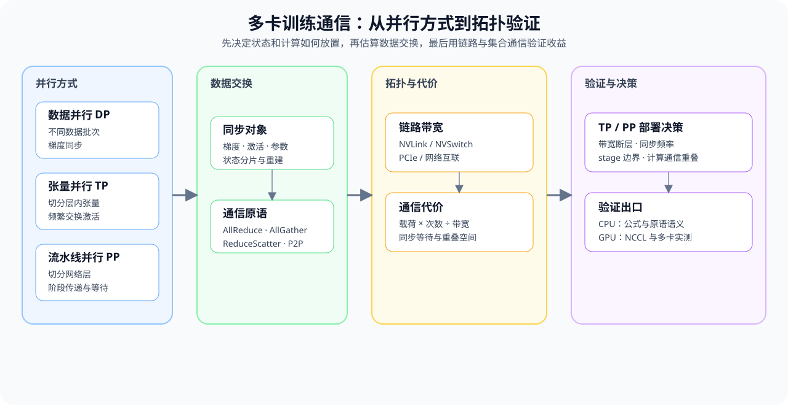

# 05. Communication Topologies | 通信拓扑与分布式基石

**难度：** Medium | **环境：** CPU-first | **标签：** `并行通信`, `分布式训练`, `通信拓扑` | **目标人群：** 需要理解多卡训练通信代价的学习者

> 🚀 **云端运行环境**
>
> 本章节的实战代码可以点击以下链接在免费 GPU 算力平台上直接运行：
>
> [](https://colab.research.google.com/github/datawhalechina/llm-algo-leetcode/blob/main/01_Hardware_Math_and_Systems/05_Communication_Topologies.ipynb)
> [](https://modelscope.cn/my/mynotebook) *(国内推荐：魔搭社区免费实例)*


---

## 本节导读

大模型训练从单卡扩展到多卡后，性能取决于两件事：每张卡如何切分数据、张量或网络层，以及切分后需要交换多少数据。先从 DP、TP、PP 的切分对象入手，再追踪 All-Reduce、All-Gather、Reduce-Scatter 和点到点传输，最后把链路带宽与同步等待放回吞吐判断。

本节沿着“并行方式 → 数据交换 → 拓扑带宽 → 计算与通信重叠”推进。完成后，你应能为一种并行方案指出主要通信原语，做出通信量级的初步估算，并解释链路带宽和同步等待如何影响并行收益。

**关键词：** `DP`, `TP`, `PP`



---

## 前置阅读
**导语：** 先复习 GPU 内存层级和设备间连接，再用 DP、TP、PP 的示例回答三个问题：数据放在哪里、哪些数据需要交换、链路带宽如何改变并行收益。
- [03. GPU Architecture and Memory | GPU 物理架构与内存层级](./03_GPU_Architecture_and_Memory.md)
- [Group 1C: Distributed Communication and Memory Sharing | 1C: 多卡通信与显存共享](./1C.md)

---
## Q1：DP、TP、PP 分别如何切分数据、张量和层？

<details><summary>点击展开查看解析</summary>

先分别看清数据并行（DP）、张量并行（TP）和流水线并行（PP）各自切分什么，再说明它们组合后为什么称为 3D 并行，最后追踪切分产生的数据交换。

- **DP**：不同卡处理不同数据批次，再同步梯度。
- **TP**：把单层中的大张量切到多卡上共同计算。
- **PP**：把不同层切到不同设备或设备组上形成流水线。

将 DP、TP、PP 组合使用时，通常称为 3D 并行。它们的目标不是“越多越好”，而是让模型、算力和通信拓扑能一起匹配。先把切分对象、主要交换的数据和常见通信方式分开看：

| 并行方式 | 切分对象 | 主要交换的数据 | 常见通信方式 |
| --- | --- | --- | --- |
| DP | 不同数据批次 | 梯度或参数更新结果 | 常见 All-Reduce |
| TP | 层内张量或激活 | 局部激活、局部结果 | 可能使用 All-Gather、Reduce-Scatter 或 All-Reduce |
| PP | 不同层或阶段 | 相邻阶段的激活 | 点到点传输，并伴随流水线等待 |
</details>
### Q1小验证：对照并行维度的切分对象与通信关注点

逐项检查每种并行方式切分什么、需要交换什么，以及对应的通信方式。

```python
def three_d_parallel(dp, tp, pp):
    """组合 DP、TP、PP 三个并行维度，返回切分关系和通信关注点。"""
    if any(value <= 0 for value in (dp, tp, pp)):
        raise ValueError('dp、tp、pp 必须为正数')
    # 先记录三个并行维度，再观察它们组合后的 worker 数量和通信关系。
    return {
        'dp_groups': dp,
        'tp_shards': tp,
        'pp_stages': pp,
        'effective_workers': dp * tp * pp,
        'partition_axis': {'dp': 'data', 'tp': 'tensor', 'pp': 'layers'},
        'communication_focus': {
            'dp': 'gradient synchronization',
            'tp': 'activation gather / reduce-scatter',
            'pp': 'stage activation transfer',
        },
    }

cases = [
    three_d_parallel(8, 1, 1),
    three_d_parallel(4, 2, 2),
    three_d_parallel(2, 4, 4),
]
for case in cases:
    print(case)
assert cases[0]['partition_axis'] == {'dp': 'data', 'tp': 'tensor', 'pp': 'layers'}
assert 'gradient' in cases[1]['communication_focus']['dp']
assert 'activation' in cases[2]['communication_focus']['pp']
print('3D parallelism = DP × TP × PP')

```

## Q2：All-Reduce、All-Gather、Reduce-Scatter 分别有什么区别？

<details><summary>点击展开查看解析</summary>

这三种集合通信原语的区别，先从每张卡的输入、输出和数据变化看起。下面的形状只是数据流示意；实际耗时还会受到消息大小、world size、拓扑、collective 算法和通信库实现影响。代码只模拟这些输入 / 输出形状，不执行真实 NCCL 通信。

| 通信原语 | 每卡输入 | 每卡输出 | 数据变化 | 常见使用场景 |
| --- | --- | --- | --- | --- |
| All-Reduce | 局部张量 | 相同形状的归约结果 | 归约后复制到每卡 | DP 梯度同步 |
| All-Gather | 局部分片 | 拼接后的完整张量 | 收集各卡分片 | TP 激活或参数收集 |
| Reduce-Scatter | 较大的局部输入 | 归约后的局部结果 | 先归约，再切分 | 分片梯度或参数同步 |
</details>
### Q2小验证：通信原语如何改变每张卡看到的数据

先观察“聚合”“收集”“切分再发回”三种数据流。

```python
def collective_shape(kind, world_size, local_shape):
    """返回集合通信的输入 / 输出形状；只模拟数据流，不执行真实通信。"""
    if world_size <= 0 or not local_shape or any(dim <= 0 for dim in local_shape):
        raise ValueError('world_size 和 local_shape 必须为正数')
    table = {
        'allreduce': {'operation': 'reduce + broadcast', 'input_per_rank': local_shape, 'output_per_rank': local_shape},
        'allgather': {'operation': 'gather all pieces', 'input_per_rank': local_shape, 'output_per_rank': (local_shape[0] * world_size, *local_shape[1:])},
        'reducescatter': {'operation': 'reduce then scatter', 'input_per_rank': (local_shape[0] * world_size, *local_shape[1:]), 'output_per_rank': local_shape},
    }
    if kind not in table:
        raise ValueError(f'未知通信原语: {kind}')
    return table[kind]

world_size = 4
local_shape = (8, 1024)
for kind in ['allreduce', 'allgather', 'reducescatter']:
    print(kind, '->', collective_shape(kind, world_size, local_shape))
assert collective_shape('allreduce', 4, (8, 1024))['output_per_rank'] == (8, 1024)
assert collective_shape('allgather', 4, (8, 1024))['output_per_rank'] == (32, 1024)
assert collective_shape('reducescatter', 4, (8, 1024))['input_per_rank'] == (32, 1024)
try:
    collective_shape('unknown', 4, (8, 1024))
except ValueError:
    print('✅ 非法通信原语校验通过')
else:
    raise AssertionError('未知通信原语应报错')
```

## Q3：通信拓扑如何改变通信代价？

<details><summary>点击展开查看解析</summary>

先区分通信发生在哪里，再比较相同消息大小经过不同链路的理想传输时间。下表中的带宽统一按 Gb/s 表示，只是教学示例，不代表所有 GPU、主板、驱动或网络配置；真实实验应以 `nvidia-smi topo -m`、NCCL 测试或厂商规格为准。

| 通信位置 | 常见链路 | 教学示例带宽（Gb/s） | 主要特点 | 适合承载的通信 |
| --- | --- | ---: | --- | --- |
| GPU 机内 | NVLink / NVSwitch | 900 级 | 带宽高、延迟较低 | 高频 TP 或集合通信 |
| GPU 到 CPU | PCIe | 64 级 | 带宽较低、路径更长 | 参数搬运、低频同步 |
| 跨节点 | 网络互连 | 以实际集群为准 | 受网络和拓扑影响大 | 低频或可重叠通信 |
</details>
### Q3小验证：相同消息经过不同链路需要多久

在相同消息大小下，比较不同链路的理想传输时间。

```python
def bandwidth_ratio(intra_gbps=900, inter_gbps=64):
    """返回同一单位下的链路带宽比；数值只是拓扑教学假设。"""
    if intra_gbps <= 0 or inter_gbps <= 0:
        raise ValueError('intra_gbps 和 inter_gbps 必须为正数')
    return intra_gbps / inter_gbps

print(f'ratio ≈ {bandwidth_ratio():.1f}x')
```

## Q4：如何根据通信代价选择并行策略？

<details><summary>点击展开查看解析</summary>

用下面的条件表把并行方式、带宽、同步频率和计算重叠连接起来。表中的“初步策略”只表示通信账本给出的方向，不替代真实系统测量。

| 观察条件 | 可能的风险 | 初步策略 |
| --- | --- | --- |
| DP 需要跨低带宽链路同步梯度 | 梯度通信拖慢每轮更新 | 减少同步频率，或提高通信与计算重叠 |
| TP 需要跨低带宽链路频繁同步 | 集合通信成为瓶颈 | 缩小 TP 范围，优先放在高速互连内 |
| PP 跨阶段传输激活较多 | 阶段间等待、pipeline bubble | 调整 stage 边界或 micro-batch |
| 通信时间接近计算时间 | 扩展收益下降 | 尝试通信与计算重叠 |
| 只有理想带宽估算 | 无法确认真实部署收益 | 把同一 workload 带入后续系统实验 |
</details>
### Q4小验证：比较并行策略的通信占比

```python
def comm_time_ms(size_mb, bandwidth_gbps, sync_rounds=1):
    """估算重复同步的理想单向传输时间；只作为带宽下界。"""
    if size_mb < 0:
        raise ValueError('size_mb must be non-negative')
    if bandwidth_gbps <= 0 or sync_rounds <= 0:
        raise ValueError('bandwidth_gbps 和 sync_rounds 必须为正数')
    # MB -> Mb，除以 Gb/s，再换算为毫秒；忽略协议、同步和重叠开销。
    return size_mb * 8 / bandwidth_gbps * sync_rounds

payload_mb = 256
sync_rounds = 4
nvlink_gbps = 900
pcie_gbps = 64
nvlink_time = comm_time_ms(payload_mb, nvlink_gbps, sync_rounds)
pcie_time = comm_time_ms(payload_mb, pcie_gbps, sync_rounds)
ratio = pcie_time / nvlink_time

print(f'{payload_mb} MB × {sync_rounds} sync rounds over NVLink: {nvlink_time:.2f} ms')
print(f'{payload_mb} MB × {sync_rounds} sync rounds over PCIe: {pcie_time:.2f} ms')
print(f'PCIe / NVLink time ratio: {ratio:.1f}x')

def parallel_strategy_report(strategy, payload_mb, bandwidth_gbps, sync_rounds, compute_ms):
    """用理想通信时间比较 DP、TP、PP 的通信占比；不模拟真实 collective。"""
    if strategy not in {'DP', 'TP', 'PP'}:
        raise ValueError('strategy 必须是 DP、TP 或 PP')
    if compute_ms <= 0:
        raise ValueError('compute_ms 必须为正数')
    communication_ms = comm_time_ms(payload_mb, bandwidth_gbps, sync_rounds)
    ratio = communication_ms / compute_ms
    if strategy == 'DP':
        action = '检查梯度同步频率与重叠'
    elif strategy == 'TP':
        action = '优先放在高速互连内'
    else:
        action = '检查 stage 边界与 micro-batch'
    return {
        'strategy': strategy,
        'communication_ms': round(communication_ms, 3),
        'communication_compute_ratio': round(ratio, 3),
        'next_action': action,
    }

reports = [
    parallel_strategy_report('DP', 256, 64, 4, 20),
    parallel_strategy_report('TP', 256, 900, 8, 20),
    parallel_strategy_report('PP', 64, 64, 2, 20),
]
print('并行策略通信占比：', reports)
assert {row['strategy'] for row in reports} == {'DP', 'TP', 'PP'}

```

---
## 相关阅读
本节可以继续接到 NCCL 原语、并行策略选择和通信调度；论文与开源实现用于补充真实系统中的数据交换路径。
- [NCCL Documentation](https://docs.nvidia.com/deeplearning/nccl/user-guide/docs/)：查看 AllReduce、AllGather、ReduceScatter 和拓扑选择。
- [Megatron-LM](https://github.com/NVIDIA/Megatron-LM)：观察张量并行、流水线并行和数据并行如何组合。
- [Megatron-LM: Training Multi-Billion Parameter Language Models](https://arxiv.org/abs/1909.08053)：理解大模型并行训练中的通信组织。
- [20. NCCL and AllReduce Basics | NCCL 与 AllReduce 基础](./20_NCCL_and_AllReduce_Basics.md)
- [26. Parallel Strategy Decision Framework | 并行策略决策框架](./26_Parallel_Strategy_Decision_Framework.md)
- [27. Communication Scheduling Optimization | 通信调度优化](./27_Communication_Scheduling_Optimization.md)
---