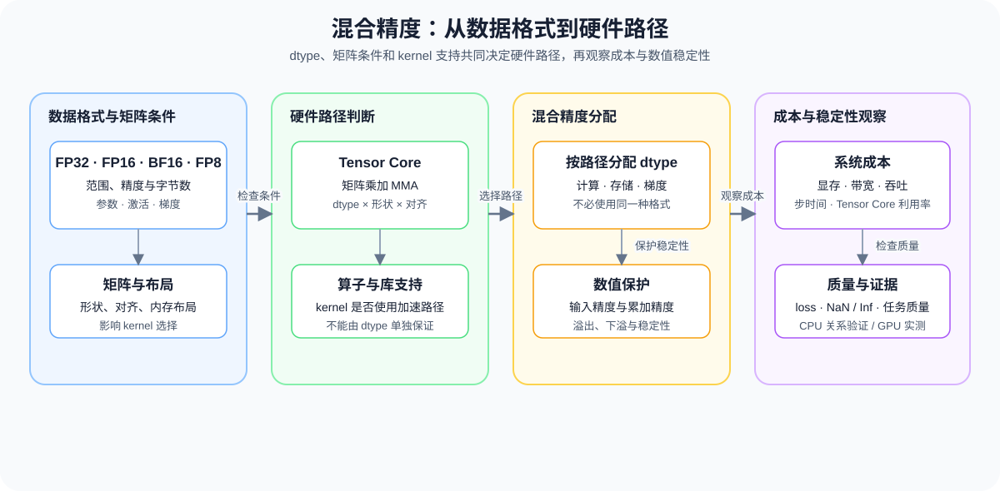

# 12. TensorCore and Mixed Precision | Tensor Core 与混合精度

**难度：** Medium | **环境：** CPU-first | **标签：** `硬件系统`, `Tensor Core`, `混合精度` | **目标人群：** 需要理解低精度训练与推理成本的学习者

> 🚀 **云端运行环境**
>
> 本章节的实战代码可以点击以下链接在免费 GPU 算力平台上直接运行：
>
> [](https://colab.research.google.com/github/datawhalechina/llm-algo-leetcode/blob/main/01_Hardware_Math_and_Systems/12_TensorCore_and_Mixed_Precision.ipynb)
> [](https://modelscope.cn/my/mynotebook) *(国内推荐：魔搭社区免费实例)*


---

## 本节导读

本节把数据类型、Tensor Core 和混合精度放到同一条判断路径中：先区分存储 dtype、计算 dtype 和累加 dtype，再理解低精度如何改变矩阵计算、显存占用与数值稳定性。

CPU 练习用于检查 dtype 转换、存储量和误差关系；真实 GPU 实验再判断硬件路径、吞吐和峰值显存是否真的发生变化。


**关键词：** `FP16`, `BF16`, `Tensor Core`



---

## 前置阅读

**导语：** 先掌握数据类型和 GPU 显存层级，再看 Tensor Core 如何处理矩阵乘加，以及混合精度如何在吞吐、显存和稳定性之间取舍。

- [Part 01 · 01 数据类型与精度](./01_Data_Types_and_Precision.md)
- [Part 01 · 03 GPU 架构与显存](./03_GPU_Architecture_and_Memory.md)
- [Part 01 · 06 显存计算与 ZeRO](./06_VRAM_Calculation_and_ZeRO.md)

## Q1：Tensor Core 到底是什么，为什么它比普通 CUDA Core 更适合矩阵计算？

<details>
<summary>点击展开查看解析</summary>

Tensor Core 不是“更快的标量算术单元”，而是专门为矩阵乘加设计的硬件路径。普通 CUDA Core 更像是按元素执行标量 FMA，而 Tensor Core 会把一小块矩阵乘加打包成一次 MMA（Matrix Multiply-Accumulate）完成。

这件事的重要性在于：大模型里最贵的计算几乎都来自 GEMM，也就是矩阵乘法。如果计算单元一次能处理更多乘加，且数据复用路径更短，那么同样的时钟预算就能完成更多工作。

混合精度和 Tensor Core 的关系也在这里：低精度输入可以让乘法吞吐更高，而高精度累加器保住结果稳定性。也就是说，Tensor Core 不是单独在“提速”，而是在用更合适的数据组织方式把吞吐做上去。
</details>
### Q1小验证：矩阵计算为什么更适合打包执行

把标量 FMA 和块状 MMA 的思路对比一下，观察矩阵块处理如何改变单位时间内的计算量。

```python
def gemm_flops(m, n, k):
    """计算 dense GEMM 的乘加 FLOPs 数量；不代表硬件实际耗时。"""
    if min(m, n, k) <= 0:
        raise ValueError('m、n、k 必须为正数')
    return 2 * m * n * k

# 一个 1024x1024 的矩阵乘法
m = n = k = 1024
flops = gemm_flops(m, n, k)
print(f'GEMM FLOPs: {flops / 1e9:.2f} GFLOPs')
print('Tensor Core 的意义不是改变 FLOPs 数量，而是提高单位时间可完成的矩阵乘加密度。')
```

## Q2：FP16、BF16、FP32 的差别在哪里，为什么混合精度不会简单等于“越低越差”？

<details>
<summary>点击展开查看解析</summary>

精度选择要同时看表示范围、每元素字节数和计算路径。混合精度的做法不是把所有数据都改成最低精度，而是让适合低精度的输入走低精度路径，让敏感的累加或状态保留较高精度。下面的表格先把常见 dtype 放在同一口径下。

| dtype | 每元素字节数 | 主要特点 | 常见用途 | 需要 GPU 验证的内容 |
| --- | ---: | --- | --- | --- |
| FP32 | 4 | 范围和精度较高 | 数值稳定基线、累加 | 实际吞吐与峰值显存 |
| FP16 | 2 | 存储和传输成本较低，动态范围较窄 | Tensor Core 输入、推理 | 是否溢出、是否走硬件加速 |
| BF16 | 2 | 指数范围接近 FP32，尾数精度较低 | 训练和部分推理路径 | 硬件是否原生支持、吞吐变化 |
| FP8 | 1 | 字节数更低，但范围和精度约束更强 | 特定硬件和量化路径 | kernel 支持与任务质量 |
</details>
### Q2小验证：不同精度的显存占用差多少？

同样一个张量，只改 dtype，就能直观看到显存和带宽压力的变化。

```python
def tensor_storage_bytes(numel, dtype_bytes):
    """计算张量理论存储字节数，不包含 allocator 和临时 workspace。"""
    if numel < 0 or dtype_bytes <= 0:
        raise ValueError('numel 不能为负数，dtype_bytes 必须为正数')
    return numel * dtype_bytes

shape = (4096, 4096)
numel = shape[0] * shape[1]
for name, bytes_per_elem in [('FP32', 4), ('BF16/FP16', 2), ('FP8', 1)]:
    size_mb = tensor_storage_bytes(numel, bytes_per_elem) / 1024 / 1024
    print(f'{name:8s}: {size_mb:8.2f} MB')

assert tensor_storage_bytes(1024, 4) == 4096
assert tensor_storage_bytes(1024, 2) == 2048
print('✅ dtype 存储量计算通过；实际 GPU peak memory 仍需单独测量')
```

## Q3：精度选择为什么会同时影响内存、吞吐和计算路径？

<details>
<summary>点击展开查看解析</summary>

精度不是单纯的数值选择，它会同时改写三个成本：

1. **内存成本**：每个元素占多少字节，决定了模型参数、激活值和 KV cache 的体积。
2. **传输成本**：同样的总字节数，搬运时间会直接影响带宽瓶颈是否明显。
3. **计算路径成本**：某些硬件路径对特定低精度格式有专门加速，Tensor Core 就是典型例子。

这也是为什么低精度推理、混合精度训练和吞吐比较经常放在一起讨论：dtype 会同时改变模型执行时的内存、带宽和计算路径。

因此，看精度问题时，不能只问“还能不能算对”，还要问“这条路径是不是更省内存、更少搬运、也更容易跑满硬件”。下面的 INT8 结果只表示每元素 1 字节的理论下界；真实量化模型还要考虑 scale、zero-point、packing、metadata 和对应 kernel。
</details>
### Q3小验证：字节数如何影响模型体积

把参数量固定，看看不同 dtype 对模型大小的直接影响。

```python
def precision_impact_ledger(params, activation_elements, kv_elements, dtype_bytes):
    """按同一 dtype 估算权重、激活和 KV Cache 的理论存储量。

    结果不包含 optimizer state、CUDA allocator、workspace 或实际 kernel 吞吐。
    """
    values = (params, activation_elements, kv_elements)
    if any(value < 0 for value in values) or dtype_bytes <= 0:
        raise ValueError('元素数量不能为负数，dtype_bytes 必须为正数')
    return {
        'weights_gb': round(tensor_storage_bytes(params, dtype_bytes) / 1e9, 3),
        'activation_gb': round(tensor_storage_bytes(activation_elements, dtype_bytes) / 1e9, 3),
        'kv_cache_gb': round(tensor_storage_bytes(kv_elements, dtype_bytes) / 1e9, 3),
    }

params = 7_000_000_000
activation_elements = 2_000_000_000
kv_elements = 1_000_000_000
for name, bytes_per_elem in [('FP32', 4), ('BF16/FP16', 2), ('INT8', 1)]:
    ledger = precision_impact_ledger(params, activation_elements, kv_elements, bytes_per_elem)
    print(name, '->', ledger)

fp32 = precision_impact_ledger(params, activation_elements, kv_elements, 4)
bf16 = precision_impact_ledger(params, activation_elements, kv_elements, 2)
assert bf16['weights_gb'] == fp32['weights_gb'] / 2
assert bf16['activation_gb'] == fp32['activation_gb'] / 2
assert bf16['kv_cache_gb'] == fp32['kv_cache_gb'] / 2
try:
    precision_impact_ledger(params, activation_elements, kv_elements, 0)
except ValueError:
    print('✅ dtype 字节数校验通过')
else:
    raise AssertionError('dtype_bytes 为 0 时应报错')
```

## 相关阅读
本节可以从 dtype 的存储差异进入混合精度训练，再连接到量化和真实 GPU 验证；阅读时要区分理论字节数、硬件加速和任务质量。
- [01. 数据类型与精度](./01_Data_Types_and_Precision.md)
- [PyTorch Automatic Mixed Precision 文档](https://pytorch.org/docs/stable/amp.html)
- [25. W8A16 通用量化](../02_PyTorch_Algorithms/25_Quantization_W8A16.md)
- [26. QLoRA 与 4-bit 量化](../02_PyTorch_Algorithms/26_QLoRA_and_4bit_Quantization.md)
- [65. QLoRA 选型项目](../02_PyTorch_Algorithms/65_QLoRA_Selection_Project.md)