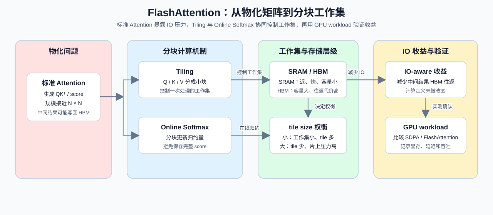

# 14. FlashAttention Memory Model | FlashAttention 显存模型

**难度：** Medium | **环境：** CPU-first | **标签：** `推理优化`, `FlashAttention`, `显存模型` | **目标人群：** 需要理解 Attention 访存成本的学习者

> 🚀 **云端运行环境**
>
> 本章节的实战代码可以点击以下链接在免费 GPU 算力平台上直接运行：
>
> [](https://colab.research.google.com/github/datawhalechina/llm-algo-leetcode/blob/main/01_Hardware_Math_and_Systems/14_FlashAttention_Memory_Model.ipynb)
> [](https://modelscope.cn/my/mynotebook) *(国内推荐：魔搭社区免费实例)*


---

## 本节导读

本节先解释标准 Attention 为什么会物化接近 $N \times N$ 的中间结果，再看 FlashAttention 如何用 tiling 和 online softmax 把计算拆成局部工作集，最后比较序列长度、tile size 和数据搬运对显存与吞吐判断的影响。

学习重点是 Attention 计算过程中的临时 score / softmax 工作集，以及它们如何在 HBM 与 SRAM 之间移动；长期保存的 KV Cache 表示和增长规律，分别在 Attention 显存优化与 KV Cache 章节中继续展开。


**关键词：** `FlashAttention`, `tiling`, `SRAM`




---
## 前置阅读

**导语：** 先理解 Attention 的 score、softmax 和输出计算，再观察 FlashAttention 如何用分块工作集减少中间结果物化，并据此判断显存压力和数据搬运成本。

- [Part 01 · 03 GPU 架构与显存](./03_GPU_Architecture_and_Memory.md)
- [Part 01 · 04 Attention 与显存优化](./04_Attention_Memory_Optimization.md)
---
## Q1：为什么标准 Attention 会在长序列下迅速变成显存瓶颈？

<details>
<summary>点击展开查看解析</summary>

标准 Attention 的问题，不是“算不动”，而是中间结果太大。

在长序列场景里，$QK^T$ 会生成一个接近 $N 	imes N$ 的注意力矩阵。如果这个矩阵要频繁写回 HBM，再读出来做 Softmax 和后续乘法，显存访问次数就会非常多。

这意味着两件事：
- 中间结果占用的显存会迅速膨胀；
- 数据搬运会比计算本身更容易成为瓶颈。

所以 FlashAttention 要解决的，不是“让矩阵更小”，而是“不要让大矩阵长期落到 HBM 上”。
</details>
### Q1小验证：计算序列长度对应的中间矩阵规模

根据序列长度计算 score 矩阵的元素数和字节数，再判断它写入 HBM 后的容量与搬运代价。

```python
def attention_score_bytes(seq_len, batch_size=1, num_heads=1, dtype_bytes=2):
    """估算物化 score 张量的理论大小，不代表真实 HBM 流量。"""
    values = (seq_len, batch_size, num_heads, dtype_bytes)
    if any(value <= 0 for value in values):
        raise ValueError('序列长度、batch、头数和 dtype 字节数必须为正数')
    return batch_size * num_heads * seq_len * seq_len * dtype_bytes

for n in [1024, 2048, 4096]:
    naive_gb = attention_score_bytes(n) / 1024 / 1024 / 1024
    print(f'seq_len={n:4d} -> score matrix ≈ {naive_gb:6.2f} GB')

```

## Q2：FlashAttention 为什么要用 tiling 和 online softmax？

<details>
<summary>点击展开查看解析</summary>

FlashAttention 的变化可以拆成两个动作：用 tiling 控制一次处理的工作集，用 online softmax 在分块过程中完成归约。表格中的大小和工作集都是理论模型，不代表完整 kernel 的 shared memory、寄存器或 CUDA workspace；下面把标准 Attention 与分块工作集放在同一口径下。

| 对比项 | 标准 Attention | FlashAttention 工作集模型 |
| --- | --- | --- |
| score 结果 | 接近 $N \times N$ 的完整矩阵 | 单个 score tile |
| softmax | 对完整矩阵统一处理 | 按块更新局部统计量 |
| 中间结果 | 可能长期写回 HBM | 尽量留在片上工作集 |
| 主要参数 | 序列长度决定矩阵规模 | tile size、head dim、dtype |
| 结论类型 | 理论物化规模 | 理论工作集，不是 kernel 实测 |
</details>
### Q2小验证：分块之后为什么更稳

把一个大矩阵拆成多个小块，再区分一维 tile 数、二维 score tile 数和单个 score tile 的理论大小。这里的数值是工作集模型，不是完整 kernel 的 shared memory 或寄存器占用。

```python
def num_1d_tiles(seq_len, tile_size):
    """返回一条序列维度上的 tile 数；不代表 Attention 的二维 tile 总数。"""
    if seq_len <= 0 or tile_size <= 0:
        raise ValueError('seq_len 和 tile_size 必须为正数')
    return (seq_len + tile_size - 1) // tile_size

def num_score_tiles(seq_len, tile_size):
    """返回 Q tile 与 K tile 组合形成的二维 score tile 数。"""
    tiles_1d = num_1d_tiles(seq_len, tile_size)
    return tiles_1d * tiles_1d

def score_tile_bytes(tile_size, dtype_bytes=2):
    """只估算一个 score tile，不代表完整 FlashAttention 工作集。"""
    if tile_size <= 0 or dtype_bytes <= 0:
        raise ValueError('tile_size 和 dtype_bytes 必须为正数')
    return tile_size * tile_size * dtype_bytes

def flashattention_working_set_bytes(tile_size, head_dim, dtype_bytes=2):
    """估算 Q/K/V、score 和输出块的教学工作集。

    这是块级容量模型，不等于完整 kernel 的 shared memory、寄存器
    或 CUDA workspace 占用。
    """
    if tile_size <= 0 or head_dim <= 0 or dtype_bytes <= 0:
        raise ValueError('tile_size、head_dim 和 dtype_bytes 必须为正数')
    qkv = 3 * tile_size * head_dim
    score = tile_size * tile_size
    output = tile_size * head_dim
    return (qkv + score + output) * dtype_bytes


seq_len = 4096
for tile in [64, 128, 256]:
    tiles_1d = num_1d_tiles(seq_len, tile)
    score_tiles = num_score_tiles(seq_len, tile)
    score_tile_kb = score_tile_bytes(tile) / 1024
    working_set_kb = flashattention_working_set_bytes(tile, head_dim=128) / 1024
    print(f'tile={tile:3d} -> 1D tiles={tiles_1d:3d}, score tiles={score_tiles:4d}, score tile ≈ {score_tile_kb:6.1f} KB, working set ≈ {working_set_kb:6.1f} KB')

assert flashattention_working_set_bytes(128, 128) > score_tile_bytes(128)
try:
    flashattention_working_set_bytes(0, 128)
except ValueError:
    print('✅ 工作集参数校验通过')
else:
    raise AssertionError('tile_size 为 0 时应报错')

```

## Q3：如何根据工作集、tile size 和数据搬运判断 FlashAttention 的收益？

<details>
<summary>点击展开查看解析</summary>

HBM 容量大但访问代价高，SRAM 容量小但离计算更近。tile size 需要在单块工作集和分块次数之间取舍：tile 越小，片上占用越低但调度次数越多；tile 越大，分块次数减少但片上存储压力上升。

| tile size | 单块 score / 工作集 | tile 数量 | 主要权衡 |
| ---: | --- | ---: | --- |
| 小 | 较小 | 较多 | 片上压力低，循环和调度开销可能增加 |
| 中 | 中等 | 中等 | 工作集与调度成本较平衡 |
| 大 | 较大 | 较少 | 调度次数少，但片上存储压力更高 |

FlashAttention 的 IO-aware 价值在于减少大规模中间结果的 HBM 往返；具体收益仍取决于序列长度、dtype、硬件和 kernel 实现，不能只凭理论工作集推出端到端加速。
</details>
### Q3小验证：物化矩阵与分块工作集的对照

改变序列长度和 tile 大小，比较物化 score 矩阵与分块工作集的数量级，再判断数据搬运是否可能成为主要代价。

```python
def tile_tradeoff(seq_len, tile_size, head_dim=128, dtype_bytes=2):
    """返回 tile 数量、单块 score 和工作集，便于比较 tile size。"""
    return {
        'tile_count': num_score_tiles(seq_len, tile_size),
        'score_tile_bytes': score_tile_bytes(tile_size, dtype_bytes),
        'working_set_bytes': flashattention_working_set_bytes(tile_size, head_dim, dtype_bytes),
    }

def score_materialization_ratio(seq_len, tile_size, dtype_bytes=2):
    """比较完整 score 矩阵与单个 score tile 的理论存储规模。

    这不是实际 HBM 流量、kernel 加速比或端到端性能指标。
    """
    if seq_len <= 0 or tile_size <= 0 or dtype_bytes <= 0:
        raise ValueError('seq_len、tile_size 和 dtype_bytes 必须为正数')
    full = attention_score_bytes(seq_len, dtype_bytes=dtype_bytes)
    tile = score_tile_bytes(tile_size, dtype_bytes)
    return full / tile

tile_rows = {}
for tile in [64, 128, 256]:
    tile_rows[tile] = tile_tradeoff(4096, tile)
    print(f'tile={tile:3d} -> {tile_rows[tile]}, materialization ratio ≈ {score_materialization_ratio(4096, tile):.0f}x')
print('smaller tile => smaller working set, but more tiles and more scheduling work')
assert score_materialization_ratio(4096, 64) > score_materialization_ratio(4096, 256)

```

---
## 相关阅读

本节可以从 IO-aware Attention 论文回到工作集模拟，再进入 Triton 实现和推理侧 prefill 验证。

- [FlashAttention 论文](https://arxiv.org/abs/2205.14135)
- [20. FlashAttention 模拟](../02_PyTorch_Algorithms/20_FlashAttention_Sim.md)
- [08. Triton Flash Attention 前向算子](../03_Triton_Kernels/08_Triton_Flash_Attention.md)
---