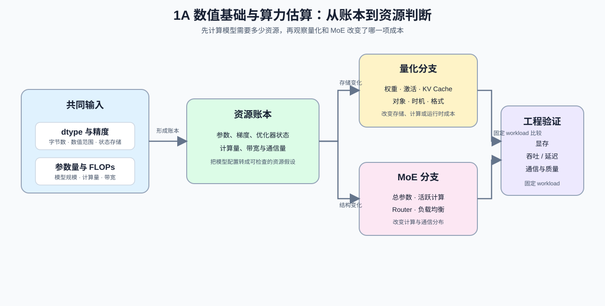

# Group 1A: Numerical Foundations and Scale Estimation | 1A: 数值基础与算力估算

本组回答“面对一个模型，先计算哪些资源指标”：从精度和参数存储量开始，继续估算参数量、FLOPs、带宽与通信成本，再判断量化和 MoE 改变了哪一项成本。

## Group Goal | 组定位与学习目标

学习者在这一组完成三类可复查计算：根据 dtype 换算参数和状态的存储量，根据模型结构估算参数量与 FLOPs，再比较量化和 MoE 如何改变显存、计算、带宽或通信成本。完成这些计算后，可以把一份模型配置转成资源假设，并为后续实验明确需要测量的指标。

阅读顺序和 Part 级前导路径见 [intro](./intro.md)。

## Group Assets and Reading Order | 组内资产与阅读顺序

| 页 | 核心职责 | Q 数 | 代码块数 | 已有码的 Q | 待补代码的 Q | 定位 |
| --- | --- | ---: | ---: | --- | --- | --- |
| [01](./01_Data_Types_and_Precision.md) | 建立显存与精度账本直觉 | 6 | 12 | 全部 | 无 | 样板页 |
| [02](./02_LLM_Params_and_FLOPs.md) | 估清参数量与 FLOPs 数量级 | 4 | 8 | 全部 | 无 | 已对齐样板 |
| [21](./21_Quantization_Theory_and_INT4_INT8.md) | 判断量化何时值得做 | 5 | 8 | 全部 | 无 | 基础节 |
| [22](./22_MoE_Parameter_and_Compute.md) | 看清 MoE 的参数与计算分离 | 4 | 8 | 全部 | 无 | 基础节 |

先完成 [01](./01_Data_Types_and_Precision.md) 和 [02](./02_LLM_Params_and_FLOPs.md)，能够从 dtype 和模型配置计算参数存储量、前向 / 训练 FLOPs 以及 MFU；然后按学习目标选择 [21](./21_Quantization_Theory_and_INT4_INT8.md) 或 [22](./22_MoE_Parameter_and_Compute.md)，分别分析量化成本和稀疏专家的参数—计算关系。

## Follow-up Use | 后续用途

这组内容为 Part02 的显存、推理和训练项目提供数量级输入，也为 Part03 / Part04 的算子、带宽和通信分析提供计算依据。这里得到的是容量与计算的估算；具体 kernel、backend、吞吐和多卡通信效果，需要在对应项目中用固定 workload 单独测量。

## Environment Notes | 环境说明

- 默认按 `CPU-first` 阅读，先完成公式、账本和机制判断。
- 如果某页提供 `GPU optional` 实验，以该页的配置和环境说明为准。
- 本组不要求统一安装推理 backend；真实 kernel、backend、吞吐和多卡通信验证进入对应项目后执行。
