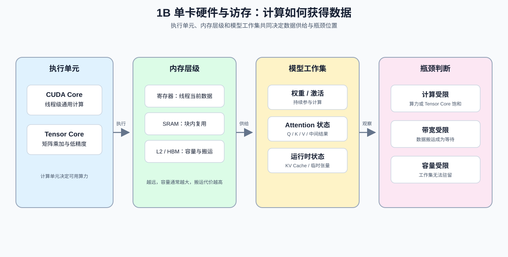

# Group 1B: Single-GPU Hardware and Memory Optimization | 1B: 单卡硬件与访存优化

本组解决“单张 GPU 怎么算得快”的问题，核心是理解 GPU 架构、内存层次和 Attention 访存优化。

## Group Goal | 组定位与学习目标

这一组建立单卡性能判断所需的三条线索：GPU 执行单元负责什么，数据经过哪些内存层级，以及模型工作集如何形成。学习者先用硬件和访存关系解释 Attention、KV Cache 与 Tensor Core 的成本，再把计算、带宽和容量假设交给 profiling 验证。阅读顺序和 Part 级前导路径见 [intro](./intro.md)，建议从 [1A](./1A.md) 进入后再学习本组。

## Group Assets and Reading Order | 组内资产与阅读顺序

| 页 | 核心职责 | Q 数 | 代码块数 | 已有码的 Q | 待补代码的 Q | 定位 |
| --- | --- | ---: | ---: | --- | --- | --- |
| [03](./03_GPU_Architecture_and_Memory.md) | 识别 GPU 层次结构与访存瓶颈 | 5 | 5 | 全部 | 无 | 主线页 |
| [04](./04_Attention_Memory_Optimization.md) | 压低 Attention 的显存压力 | 4 | 4 | 全部 | 无 | 主线页 |
| [11](./11_KV_Cache_and_Memory_Growth.md) | 解释 KV Cache 为什么增长 | 3 | 3 | Q1, Q2, Q3 | 无 | 延展主线页 |
| [12](./12_TensorCore_and_Mixed_Precision.md) | 判断混合精度怎样影响吞吐 | 3 | 3 | Q1, Q2, Q3 | 无 | 延展主线页 |
| [13](./13_Profiling_and_Bottleneck_Analysis.md) | 找到性能瓶颈并定位来源 | 3 | 3 | Q1, Q2, Q3 | 无 | profiling 主线页 |
| [14](./14_FlashAttention_Memory_Model.md) | 看懂 FlashAttention 的显存收益 | 3 | 3 | Q1, Q2, Q3 | 无 | 延展主线页 |
| [23](./23_TensorCore_Deep_Dive.md) | 看清 TensorCore 的加速边界 | 4 | 4 | 全部 | 无 | 基础节 |
| [24](./24_SRAM_Optimization_Techniques.md) | 利用 Shared Memory 降低回流 | 4 | 4 | 全部 | 无 | 基础节 |
| [25](./25_Sparse_Computation_and_Sparse_Attention.md) | 判断稀疏何时真正有效 | 4 | 4 | 全部 | 无 | 基础节 |

- 主线先看 [03](./03_GPU_Architecture_and_Memory.md) 和 [04](./04_Attention_Memory_Optimization.md)，分别回答“计算由哪些执行单元完成”和“数据如何在内存层级之间移动”；其中 [04](./04_Attention_Memory_Optimization.md) 进一步解释 KV Cache 与注意力显存的关系，并用少量代码核对关键机制。
- 再看 [11](./11_KV_Cache_and_Memory_Growth.md)、[12](./12_TensorCore_and_Mixed_Precision.md)、[13](./13_Profiling_and_Bottleneck_Analysis.md) 和 [14](./14_FlashAttention_Memory_Model.md)，分别分析显存随序列增长的原因、混合精度对计算路径的影响、如何用 profiling 定位瓶颈，以及 FlashAttention 如何改变中间结果的存储方式。
- 最后按需要继续看 [23](./23_TensorCore_Deep_Dive.md)、[24](./24_SRAM_Optimization_Techniques.md) 和 [25](./25_Sparse_Computation_and_Sparse_Attention.md)，把 TensorCore、shared memory 和稀疏 Attention 的实现层理解补完；这三页都给前 3 个 Q 配了验证代码，第 4 个 Q 保留纯原理收口。

## Follow-up Use | 后续用途

本组内容为 Part 2 的推理、显存和性能分析项目提供单卡基础：03 / 04 建立硬件与 Attention 访存直觉，11 / 12 / 14 补充 KV Cache、混合精度和 FlashAttention，13 负责把瓶颈假设转成 profiling 证据；23–25 再进入 Tensor Core、SRAM 和稀疏实现。显存优化路线中的真实峰值、吞吐和策略收益，仍在对应项目中用固定 workload 验证。

## Environment Notes | 环境说明

- 默认按 `CPU-first` 阅读，先把硬件关系、数量级和访存账本算清楚。
- 这里只写组级统一前提，不点到具体节号。
- 少量页面如需 `GPU optional` 或 `GPU required`，以后续单页说明为准，不在组页重复展开。
