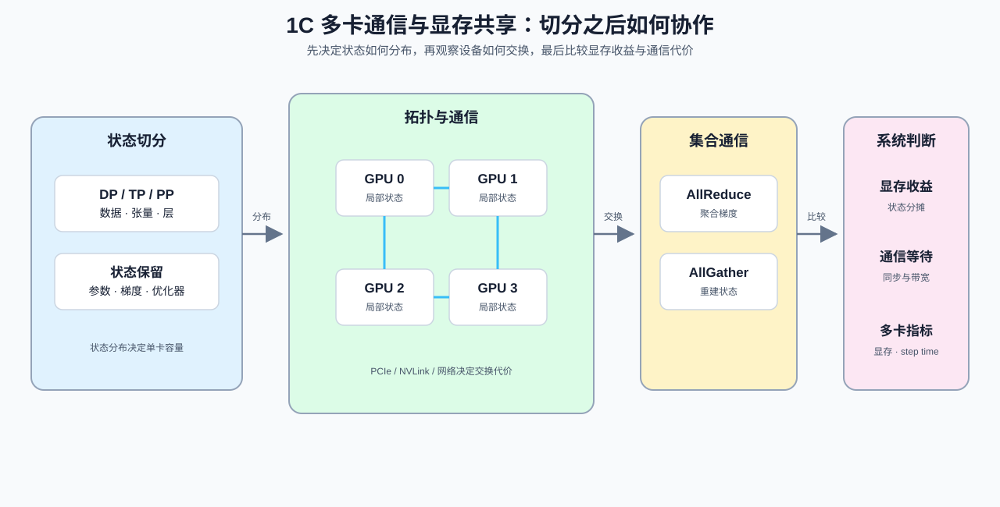

# Group 1C: Distributed Communication and Memory Sharing | 1C: 多卡通信与显存共享

本组解决“一张卡不够怎么办”的问题，核心是通信拓扑、ZeRO 和并行策略选择。

## Group Goal | 组定位与学习目标

学习者在这一组回答三个工程问题：哪些训练状态可以切分，每一步需要交换哪些数据，以及显存节省是否覆盖了通信和同步代价。先用拓扑、参数 / 梯度 / 优化器状态和 ZeRO 账本描述分布方式，再用 AllReduce / AllGather、带宽、延迟和同步等待解释多卡开销。阅读顺序和 Part 级前导路径见 [intro](./intro.md)，建议在 [1B](./1B.md) 的单卡访存基础上进入本组。

## Group Assets and Reading Order | 组内资产与阅读顺序

| 页 | 核心职责 | Q 数 | 代码块数 | 已有码的 Q | 待补代码的 Q | 定位 |
| --- | --- | ---: | ---: | --- | --- | --- |
| [05](./05_Communication_Topologies.md) | 判断通信拓扑和显存共享关系 | 4 | 4 | Q1, Q2, Q3, Q4 | 无 | 主线页 |
| [06](./06_VRAM_Calculation_and_ZeRO.md) | 估算显存开销与 ZeRO 收益 | 3 | 7 | Q1, Q2, Q3 | 无 | 基础节 |
| [26](./26_Parallel_Strategy_Decision_Framework.md) | 选择合适的并行策略 | 4 | 4 | 全部 | 无 | 基础节 |
| [27](./27_Communication_Scheduling_Optimization.md) | 压缩通信调度的关键路径 | 4 | 4 | Q1, Q2, Q3, Q4 | 无 | 基础节 |
| [28](./28_Fault_Tolerance_and_Checkpointing.md) | 评估容错与 checkpoint 代价 | 4 | 4 | 全部 | 无 | 基础节 |
| [20](./20_NCCL_and_AllReduce_Basics.md) | 讲清 NCCL 和 AllReduce 原语 | 4 | 4 | Q1, Q2, Q3, Q4 | 无 | 主线页 |

主线先看 [05](./05_Communication_Topologies.md) 和 [06](./06_VRAM_Calculation_and_ZeRO.md)，分别建立拓扑选择、状态分摊和 ZeRO 显存账本；再看 [20](./20_NCCL_and_AllReduce_Basics.md)、[26](./26_Parallel_Strategy_Decision_Framework.md)、[27](./27_Communication_Scheduling_Optimization.md) 和 [28](./28_Fault_Tolerance_and_Checkpointing.md)，继续分析集合通信、并行策略、通信调度和 checkpoint 容错。

## Follow-up Use | 后续用途

本组为 Part 02 的多卡训练、显存分摊和分布式项目提供判断依据：05 / 06 说明状态如何放置和分摊，20 / 26 / 27 说明通信原语、并行策略和调度代价，28 补充故障恢复与 checkpoint 成本。单卡账本可以估算容量变化，但多卡收益仍需在固定 rank、拓扑和 workload 下测量显存、通信时间、step time 与扩展效率。

## Environment Notes | 环境说明

- 默认按 `CPU-first` 阅读，先完成状态分摊、通信量和带宽的估算。
- 这里只写组级统一前提，不点到具体节号。
- 少量页面如需多卡环境或 `GPU required`，以后续单页说明为准，不在组页重复展开。
