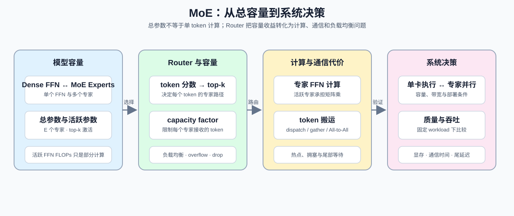
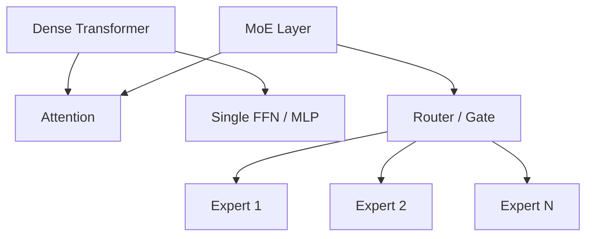
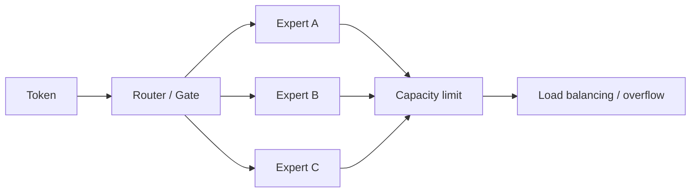

# 22. MoE Parameter and Compute | MoE 模型参数量计算

**难度：** Medium-Hard | **环境：** CPU-first | **标签：** `模型结构`, `MoE`, `参数与计算` | **目标人群：** 硬件约束学习者

> 🚀 **云端运行环境**
>
> 本章节的实战代码可以点击以下链接在免费 GPU 算力平台上直接运行：
>
> [](https://colab.research.google.com/github/datawhalechina/llm-algo-leetcode/blob/main/01_Hardware_Math_and_Systems/22_MoE_Parameter_and_Compute.ipynb)
> [](https://modelscope.cn/my/mynotebook) *(国内推荐：魔搭社区免费实例)*


---

## 本节导读

MoE 通过多个专家扩大模型容量，但每个 token 只激活部分专家。学习本节后，你应该能解释总参数、活跃计算、Router 负载和跨设备通信之间的关系，并据此判断 MoE 的系统代价。按“总参数与活跃计算 → Router 与负载均衡 → 专家并行通信 → 方案判断”的顺序完成后面的机制解释和小验证。

**关键词：** `experts`, `router`, `load balancing`


---
## 前置阅读

**导语：** 先复习参数量、显存和分布式通信，再观察为什么 MoE 能扩大总容量，却同时引入路由、负载均衡和专家并行通信问题。

- [01. Data Types and Precision | 大模型的数据格式与混合精度](./01_Data_Types_and_Precision.md)
- [02. LLM Params and FLOPs | 大模型参数量与算力推导](./02_LLM_Params_and_FLOPs.md)
- [05. Communication Topologies | 通信拓扑与分布式基石](./05_Communication_Topologies.md)
---
## Q1：MoE 和普通 dense Transformer 的参数量差别在哪里？

<details>
<summary>点击展开查看解析</summary>

普通 dense Transformer 的每层参数主要来自：
- Attention
- FFN / MLP

而 MoE 会把原本的 FFN / MLP 替换成多个专家（experts）。粗略地说：

- 一个 dense FFN 的参数量约为 `2 d d_ff`
- 如果有 `E` 个专家，那么专家总参数量约为 `E × 2 d d_ff`
- 但每个 token 通常只会激活 `k` 个专家，而不是全部 `E` 个

所以 MoE 的特点是：
- **总参数量**：很大
- **单 token 激活参数量**：相对没那么大
- **单 token 计算量**：通常按 `k` 而不是按 `E` 增长

这就是为什么 MoE 常被用来扩大模型容量，但不把每次计算都线性放大。这里的“活跃参数量”只描述 token 经过的专家规模；完整的推理 FLOPs 还包括 Attention、Router、数据搬运和其他算子，不能直接把活跃参数量当成完整 FLOPs。

一个最常见的直觉例子是 Mixtral 8x7B：

| 维度 | 量级直觉 |
| --- | --- |
| 隐藏维度 `d` | 4096 |
| 专家数 `E` | 8 |
| 激活专家数 `k` | 2 |
| `d_ff` | 约 `4d = 16384` |

如果只看专家 FFN，单个专家参数量大约是 `2 × d × d_ff ≈ 134M`，8 个专家加起来大约 `1.07B` 级别。加上 Attention、Embedding 和其他层之后，模型总参数可以到 `47B` 左右，但每个 token 实际只激活其中一小部分，常见说法是“活跃参数”大约在 `13B` 量级。


</details>
### Q1小验证：计算专家参数量与活跃 FFN FLOPs

写出参数量公式，再对比 dense 和 MoE 的总参数、活跃参数与专家 FFN FLOPs。

```python
import math
import torch
from typing import Dict, List


def dense_ffn_params(d: int, d_ff: int) -> int:
    """Dense FFN/MLP 的参数量，按 2 * d * d_ff 估算。"""
    return 2 * d * d_ff


def moe_expert_params(d: int, d_ff: int, num_experts: int) -> int:
    """MoE 所有专家的总参数量。"""
    return num_experts * dense_ffn_params(d, d_ff)


def active_expert_params(d: int, d_ff: int, active_experts: int) -> int:
    """单个 token 激活的专家参数量。"""
    return active_experts * dense_ffn_params(d, d_ff)


def active_expert_ffn_flops(d: int, d_ff: int, active_experts: int, flops_per_param: int = 2) -> int:
    """估算单 token 激活专家的 FFN 矩阵乘 FLOPs。

    这里只估算专家 FFN 的乘加，不包含 Attention、Router、路由搬运和通信。
    """
    if active_experts <= 0 or flops_per_param <= 0:
        raise ValueError('active_experts 和 flops_per_param 必须为正数')
    return active_expert_params(d, d_ff, active_experts) * flops_per_param


def moe_layer_params(d: int, d_ff: int, num_experts: int, include_router: bool = True) -> int:
    """MoE 单层粗略参数量：Attention + Experts + Router。"""
    attention_params = 4 * d * d
    router_params = d * num_experts if include_router else 0
    return attention_params + moe_expert_params(d, d_ff, num_experts) + router_params


def to_million(x: int) -> float:
    return x / 1e6


def to_billion(x: int) -> float:
    return x / 1e9

```


```python
def test_moe_parameter_formulas():
    d = 4096
    d_ff = 16384
    experts = 8
    active = 2

    dense = dense_ffn_params(d, d_ff)
    total_expert = moe_expert_params(d, d_ff, experts)
    active_params = active_expert_params(d, d_ff, active)
    active_flops = active_expert_ffn_flops(d, d_ff, active)
    layer_params = moe_layer_params(d, d_ff, experts)

    assert dense == 134_217_728, dense
    assert total_expert == 1_073_741_824, total_expert
    assert active_params == 268_435_456, active_params
    assert active_flops == 536_870_912, active_flops
    assert layer_params == 1_140_883_456, layer_params
    print('✅ MoE 参数量公式测试通过')


test_moe_parameter_formulas()

print('单个 dense FFN 参数量:', to_million(dense_ffn_params(4096, 16384)), 'M')
print('8 个专家的总参数量:', to_billion(moe_expert_params(4096, 16384, 8)), 'B')
print('top-2 激活参数量:', to_billion(active_expert_params(4096, 16384, 2)), 'B')
print('top-2 专家 FFN FLOPs / token:', active_expert_ffn_flops(4096, 16384, 2))
print('MoE 单层粗略参数量:', to_billion(moe_layer_params(4096, 16384, 8)), 'B')

```

## Q2：Router / Gate 为什么重要？

<details>
<summary>点击展开查看解析</summary>

Router / Gate 先根据每个 token 的分数选择 top-k 专家，再决定每个专家会不会过载，以及路由结果会不会引入额外通信和同步开销。

从原理上看，Router 至少同时承担三件事：

1. **选择专家**
   - 对每个 token 打分，决定 top-k 专家是谁。
   - 这一步决定了 token 的计算路径，不同 token 可能走完全不同的专家。

2. **控制容量**
   - 每个专家能接收的 token 数量是有限的。
   - 如果 token 分布不均衡，某些专家会过载，部分 token 可能被丢弃或被迫重分配。

3. **影响训练稳定性**
   - 如果路由长期偏向少数专家，MoE 可能退化成“少数专家在工作，其余专家闲置”。
   - 所以很多方案会引入 load balancing loss 或容量因子，强迫路由更均匀。

这也是为什么 MoE 不只是“参数变多了”，它的工程难点其实在路由质量和负载均衡，而不是单纯在 FFN 参数本身。当前小验证只观察 top-k 路由、容量和溢出；load balancing loss 作为训练机制在这里保留概念说明，不由这段代码直接计算。


</details>
### Q2小验证：观察 Router / Gate 的容量和负载均衡

先估算每个专家的容量，再看 token 分布不均时会发生什么。

```python
def expert_capacity(num_tokens: int, num_experts: int, capacity_factor: float = 1.0) -> int:
    """每个专家可接收的 token 数量上限。"""
    return math.ceil(num_tokens / num_experts * capacity_factor)


def overflow_tokens(token_counts: List[int], capacity: int) -> int:
    """给定每个专家接收的 token 数量，计算总溢出 token 数。"""
    return sum(max(0, c - capacity) for c in token_counts)


def load_balance_stats(token_counts: List[int], capacity: int) -> Dict[str, float]:
    """根据 Router 已产生的专家 token 数，统计容量和溢出。"""
    total = sum(token_counts)
    overflow = overflow_tokens(token_counts, capacity)
    return {
        'total_tokens': total,
        'capacity_per_expert': capacity,
        'max_tokens': max(token_counts),
        'min_tokens': min(token_counts),
        'overflow_tokens': overflow,
        'drop_rate': overflow / total if total else 0.0,
    }


def route_tokens(router_scores: torch.Tensor, top_k: int = 1) -> Dict[str, object]:
    """根据 token 对各专家的分数，选择 top-k 专家并统计分布。

    输入形状为 `[num_tokens, num_experts]`；这里只模拟离散路由，
    不实现专家网络、容量截断或跨设备通信。
    """
    if router_scores.ndim != 2:
        raise ValueError('router_scores 必须是 [num_tokens, num_experts]')
    num_tokens, num_experts = router_scores.shape
    if not 1 <= top_k <= num_experts:
        raise ValueError('top_k 必须在 1 和 num_experts 之间')
    selected = torch.topk(router_scores, k=top_k, dim=-1).indices
    token_counts = torch.bincount(selected.reshape(-1), minlength=num_experts).tolist()
    return {'selected_experts': selected, 'token_counts': token_counts, 'top_k': top_k}


torch.manual_seed(0)
router_scores = torch.randn(32, 4)
route = route_tokens(router_scores, top_k=2)
print('top-k 路由后的专家 token 数:', route['token_counts'])
assert route['selected_experts'].shape == (32, 2)
assert sum(route['token_counts']) == 32 * 2

```


```python
token_counts = [140, 40, 70, 90, 110, 80, 60, 110]
capacity = expert_capacity(sum(token_counts), len(token_counts), capacity_factor=1.0)
stats = load_balance_stats(token_counts, capacity)

print('专家 token 分布:', token_counts)
print('每个专家容量上限:', capacity)
print('-' * 60)
for k, v in stats.items():
    if k.endswith('rate'):
        print(f'{k:20s}: {v:.1%}')
    else:
        print(f'{k:20s}: {v}')

```

## Q3：为什么 MoE 的工程代价不只在计算，还在通信？

<details>
<summary>点击展开查看解析</summary>

MoE 的额外代价主要来自专家并行（Expert Parallelism）下的 token 调度和 All-to-All 通信。

可以把这一层理解成：
- token 先按 Router 的结果分发到不同专家所在的设备
- 专家计算完成后，再把结果聚合回原来的序列位置

这意味着 MoE 的通信不是“顺手搬一点数据”，而是会在每一层都出现比较明确的分发 / 聚合过程。

如果 token 数、hidden_dim 或 batch 变大，通信量就会明显增加；如果 token 分布不均衡，某些专家设备还会比别的设备更忙，进一步放大尾部等待时间。

所以 MoE 的核心权衡可以概括成：
- **容量**：更大
- **激活计算**：不一定同比增大
- **系统复杂度**：更高，尤其是路由、负载均衡和通信


</details>
### Q3小验证：粗估专家并行通信量

先把 top-k 视为每个 token 的路由副本数，估算每层的 dispatch / gather 数据量，再看它为什么会成为 MoE 的工程代价。这个结果是容量级估算，不是 NCCL All-to-All 实测。

```python
def estimate_expert_parallel_traffic(
    batch: int,
    seq_len: int,
    hidden_dim: int,
    num_experts: int,
    num_devices: int,
    top_k: int = 1,
    bytes_per_param: int = 2,
    dispatch_and_gather_factor: float = 2.0,
) -> int:
    """粗略估算专家并行的通信量（字节）。

    这里按 token 数、hidden size、top-k 和 dispatch/gather 次数
    做数量级估算；不代表 NCCL All-to-All 的真实 trace。
    """
    tokens = batch * seq_len
    traffic = tokens * hidden_dim * bytes_per_param
    if top_k <= 0 or num_devices <= 0:
        raise ValueError('top_k 和 num_devices 必须为正数')
    traffic *= top_k
    traffic *= (num_experts / num_devices)
    traffic *= dispatch_and_gather_factor
    return int(traffic)


def bytes_to_mb(x: int) -> float:
    return x / 1e6


def bytes_to_gb(x: int) -> float:
    return x / 1e9

```


```python
batch = 8
seq_len = 2048
hidden_dim = 4096
num_experts = 8
num_devices = 8
top_k = 2
traffic = estimate_expert_parallel_traffic(
    batch, seq_len, hidden_dim, num_experts, num_devices, top_k=top_k
)

print('专家并行通信量粗估：')
print('-' * 60)
print(f'batch={batch}, seq_len={seq_len}, hidden_dim={hidden_dim}, top_k={top_k}')
print(f'communication = {bytes_to_mb(traffic):.1f} MB / layer')
print(f'communication = {bytes_to_gb(traffic):.3f} GB / layer')

```


```python
def test_traffic_estimation():
    traffic_small = estimate_expert_parallel_traffic(4, 1024, 4096, 8, 8, top_k=1)
    traffic_large = estimate_expert_parallel_traffic(8, 2048, 4096, 8, 8, top_k=1)
    traffic_top2 = estimate_expert_parallel_traffic(4, 1024, 4096, 8, 8, top_k=2)
    assert traffic_small > 0
    assert traffic_large > traffic_small
    assert traffic_large == 4 * traffic_small
    assert traffic_top2 == 2 * traffic_small
    print('✅ 通信量测试通过')


test_traffic_estimation()

```

## Q4：MoE 什么时候适合，什么时候不适合？

<details>
<summary>点击展开查看解析</summary>

MoE 适合的场景通常有两个特征：

- 你想扩大模型容量，但不希望每次推理都把计算量一起放大
- 你能接受更复杂的路由、调度和通信实现

不太适合的场景通常是：
- 你更在意实现简单、稳定和可预测
- 你的系统带宽 / 通信条件并不理想
- 你很难接受路由不均衡带来的训练波动

可以先用下面的条件表形成初步判断，再用固定 workload 和多卡 benchmark 验证：

| 条件 | 初步倾向 |
| --- | --- |
| 总参数需求高、通信条件好、路由分布稳定 | 考虑 MoE |
| 需要单卡稳定推理、实现简单和延迟可预测 | 倾向 Dense |
| 通信带宽不足或专家负载明显不均 | 先优化 Router / 并行策略 |
| 只观察到容量收益，尚未测量真实吞吐和尾延迟 | 暂不下最终结论 |

这张表是决策入口，不是通用评分公式；最终选择仍需要记录质量、吞吐、通信时间和尾延迟。
</details>
### Q4小验证：MoE 什么时候更值得用？

把容量需求、通信条件、负载均衡和工程简洁度放到一起，形成可解释的初步判断。


```python
def moe_decision(capacity_need, communication_ready, load_balance_ok, simplicity_priority):
    """根据可解释条件给出 MoE 的初步决策，不生成伪精确评分。"""
    flags = [capacity_need, communication_ready, load_balance_ok, simplicity_priority]
    if not all(isinstance(value, bool) for value in flags):
        raise TypeError('四个条件必须是 bool')
    if simplicity_priority:
        recommendation = 'dense'
        reason = '优先保证实现简单和延迟可预测'
    elif not communication_ready:
        recommendation = 'tune'
        reason = '先确认通信条件，再评估专家并行'
    elif not load_balance_ok:
        recommendation = 'tune'
        reason = '先优化 Router 或容量策略'
    elif capacity_need:
        recommendation = 'moe'
        reason = '容量需求和系统条件都支持 MoE'
    else:
        recommendation = 'context-dependent'
        reason = '需要用固定 workload 比较质量、吞吐和尾延迟'
    return {'recommendation': recommendation, 'reason': reason}

cases = [
    (True, True, True, False),
    (True, False, True, False),
    (False, True, True, True),
]
for case in cases:
    print(case, '->', moe_decision(*case))
assert moe_decision(True, True, True, False)['recommendation'] == 'moe'
assert moe_decision(True, False, True, False)['recommendation'] == 'tune'
assert moe_decision(False, True, True, True)['recommendation'] == 'dense'
print('✅ MoE 条件决策测试通过')

```

---
## 相关阅读

**导语：** 把 MoE 的参数与计算账本继续接到显存、通信和并行策略，会更容易判断它什么时候值得放大。

- [06. VRAM Calculation and ZeRO | 显存计算与 ZeRO 优化](./06_VRAM_Calculation_and_ZeRO.md)
- [20. NCCL and AllReduce Basics | NCCL 与 AllReduce 基础](./20_NCCL_and_AllReduce_Basics.md)
- [26. Parallel Strategy Decision Framework | 并行策略决策框架](./26_Parallel_Strategy_Decision_Framework.md)

**经典论文：**
- [GShard: Scaling Giant Models with Conditional Computation and Automatic Sharding](https://arxiv.org/abs/2006.16668)
- [Switch Transformers: Scaling to Trillion Parameter Models with Simple and Efficient Sparsity](https://arxiv.org/abs/2101.03961)
- [Mixtral of Experts](https://arxiv.org/abs/2401.04088)：稀疏专家模型的代表性案例。

**开源实现：**
- [MegaBlocks](https://github.com/databricks/megablocks)：面向 MoE 的高效稀疏计算与专家并行实现。
- [Tutel](https://github.com/microsoft/Tutel)：MoE 训练和专家并行优化工具。
- [DeepSpeed-MoE](https://www.deepspeed.ai/tutorials/mixture-of-experts/)：MoE 与专家并行实践入口。
---