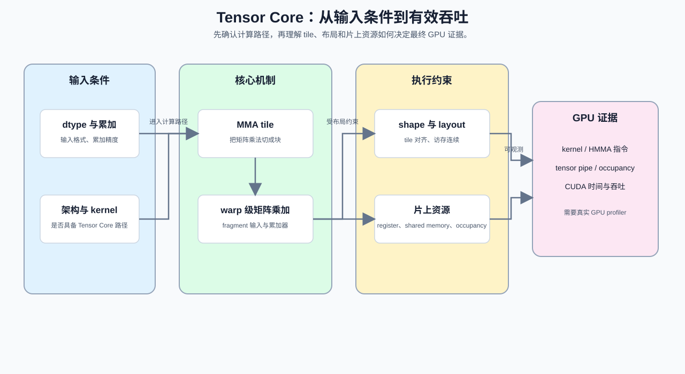
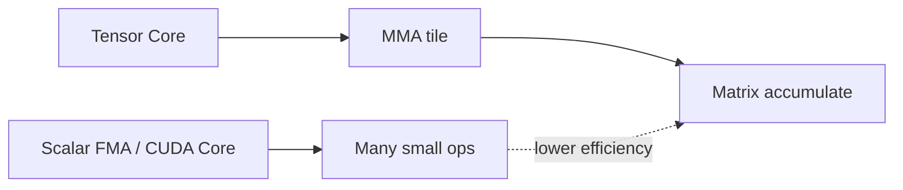
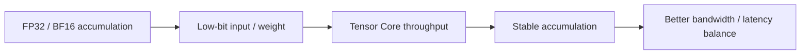
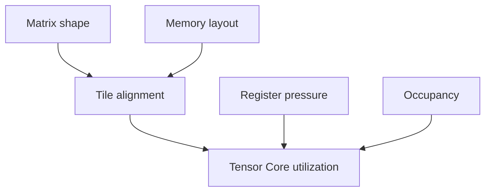

# 23. TensorCore Deep Dive | Tensor Core 深度剖析

**难度：** Hard | **环境：** CPU-first | **标签：** `硬件系统`, `Tensor Core`, `MMA` | **目标人群：** 需要理解矩阵计算硬件路径的学习者

> 🚀 **云端运行环境**
>
> 本章节的实战代码可以点击以下链接在免费 GPU 算力平台上直接运行：
>
> [](https://colab.research.google.com/github/datawhalechina/llm-algo-leetcode/blob/main/01_Hardware_Math_and_Systems/23_TensorCore_Deep_Dive.ipynb)
> [](https://modelscope.cn/my/mynotebook) *(国内推荐：魔搭社区免费实例)*


---

## 本节导读

本节从矩阵乘加出发，解释 Tensor Core 如何把 dtype、tile、布局和寄存器资源组织成可分析的矩阵计算路径。学习完成后，你应能根据输入形状和数据类型判断一次 MMA 计算需要哪些条件，并区分理论执行路径与真实吞吐。

**关键词：** `MMA`, `tile`, `throughput`




---
## 前置阅读

**导语：** 先回顾矩阵乘加、混合精度和 CUDA 执行粒度，再理解 Tensor Core 为什么要求输入数据按照特定 tile 组织。

- [15. CUDA Execution Model | CUDA 执行模型](./15_CUDA_Execution_Model.md)
- [16. Warp Block SharedMemory Basics | Warp、Block 与 Shared Memory 基础](./16_Warp_Block_SharedMemory_Basics.md)
- [12. TensorCore and Mixed Precision | Tensor Core 与混合精度](./12_TensorCore_and_Mixed_Precision.md)
---
## Q1：Tensor Core 本质上是什么？

<details><summary>点击展开查看解析</summary>

Tensor Core 不是普通 CUDA Core 的更快版本，而是一条专门面向矩阵乘加（MMA）的硬件路径。

它的关键变化有三点：
- 计算对象从标量 FMA 变成了小块矩阵乘加；
- 调度粒度从逐元素运算变成了可打包的 tile；
- 数据路径从“多次标量访存”转成“先聚成块，再一次性做矩阵累加”。



所以 Tensor Core 更像是矩阵计算的专用引擎：它不是把同样的工作做得更快一点，而是把工作重新组织成更适合硬件吞吐的形状。
</details>
### Q1小验证：比较矩阵乘加与标量 FMA

对照两种计算粒度，说明 tile 化矩阵乘加为何更适合 Tensor Core。

```python
def mma_flops(m, n, k):
    return 2 * m * n * k

print(mma_flops(16, 16, 16) / 1e3, 'KFLOPs for one 16x16x16 MMA')
```

## Q2：哪些 dtype 和累加方式具备进入 Tensor Core 的候选条件？

<details><summary>点击展开查看解析</summary>

混合精度之所以有效，是因为“输入 / 累加 / 输出”这三段不必使用同一种位宽。

常见做法是：
- 输入和权重用较低精度，减少搬运和打包成本；
- 累加保留更高精度，避免误差快速放大；
- 某些中间结果再按需要回到更低精度或保持高精度。

能否进入 Tensor Core 候选路径还取决于 GPU 架构、驱动和具体 kernel 的支持。代码中的 `supported_dtypes` 是待测硬件的配置输入，不应被理解为所有 GPU 都原生支持这些格式；可分配某种 dtype，也不等于它一定获得 Tensor Core 加速。



所以混合精度不是单纯“降精度”，而是在精度和吞吐之间拆分职责：把最贵的搬运和最需要吞吐的部分放到更合适的位宽和硬件路径上。
</details>
### Q2小验证：检查 dtype、累加类型与候选路径

对照输入和累加类型，区分理论存储量与进入候选路径的条件。

```python
def tensorcore_dtype_path(input_dtype, accumulation_dtype, numel, supported_dtypes=('FP16', 'BF16', 'FP8')):
    """检查 dtype 与累加类型是否具备进入候选路径的条件。

    supported_dtypes 应根据待测 GPU 和 kernel 能力配置；这里同时展示
    理论存储量和路径条件，不代表当前 GPU 已经执行 Tensor Core。
    """
    dtype_bytes = {'FP32': 4, 'FP16': 2, 'BF16': 2, 'FP8': 1}
    if numel <= 0:
        raise ValueError('numel 必须为正数')
    if input_dtype not in dtype_bytes:
        raise ValueError(f'未知 input_dtype: {input_dtype}')
    input_supported = input_dtype in supported_dtypes
    accumulation_supported = accumulation_dtype in {'FP32', 'BF16'}
    return {
        'input_dtype': input_dtype,
        'accumulation_dtype': accumulation_dtype,
        'storage_mb': round(numel * dtype_bytes[input_dtype] / 1024 / 1024, 2),
        'path_candidate': input_supported and accumulation_supported,
        'reasons': ([ ] if input_supported else ['input_dtype_not_supported']) + ([ ] if accumulation_supported else ['accumulation_dtype_not_supported']),
    }

numel = 4096 * 4096
for input_dtype in ['FP32', 'FP16', 'BF16', 'FP8']:
    print(input_dtype, '->', tensorcore_dtype_path(input_dtype, 'FP32', numel))
assert tensorcore_dtype_path('BF16', 'FP32', numel)['path_candidate']
assert not tensorcore_dtype_path('FP32', 'FP32', numel)['path_candidate']
try:
    tensorcore_dtype_path('BF16', 'FP32', 0)
except ValueError:
    print('✅ dtype 路径输入校验通过')
else:
    raise AssertionError('numel 为 0 时应报错')
```

## Q3：为什么满足候选条件后，Tensor Core 利用率仍不能跑满？

<details><summary>点击展开查看解析</summary>

Tensor Core 的利用率受三个层面约束：
- **tile 是否对齐**：shape 不合适时，硬件难以把工作完整打包；
- **layout 是否连续**：布局不连续会让打包前后的访存变碎；
- **register / occupancy 是否允许**：临时变量太多时，算力单元未必能持续喂满。



因此，Tensor Core 利用率不是“用了就有”，而是要看输入尺寸、布局、同步方式和临时变量是否都允许它进入高吞吐路径。
</details>
### Q3小验证：对齐和打包为什么重要

适合的 shape 更容易进入高吞吐路径。

```python
def tensorcore_utilization_factors(m, n, k, tile=16, layout_contiguous=True, occupancy=1.0, register_pressure=32, register_budget=64):
    """整理 shape、layout、occupancy 和寄存器压力的候选条件。

    occupancy 和 register_budget 是教学输入，不是某一 GPU 的通用阈值；
    实际利用率仍需由 profiler 或固定 workload benchmark 验证。
    """
    if min(m, n, k, tile, register_pressure, register_budget) <= 0:
        raise ValueError('矩阵维度、tile 和寄存器参数必须为正数')
    if not 0 <= occupancy <= 1:
        raise ValueError('occupancy 必须位于 [0, 1]')
    checks = {
        'shape_aligned': all(x % tile == 0 for x in (m, n, k)),
        'layout_contiguous': layout_contiguous,
        'occupancy_ok': occupancy >= 0.5,
        'register_budget_ok': register_pressure <= register_budget,
    }
    return {**checks, 'path_candidate': all(checks.values())}

for case in [(128, 128, 128, 16, True, 0.8, 32, 64), (130, 128, 128, 16, True, 0.8, 32, 64), (128, 128, 128, 16, False, 0.8, 32, 64)]:
    print(case, '->', tensorcore_utilization_factors(*case))
assert tensorcore_utilization_factors(128, 128, 128)['path_candidate']
assert not tensorcore_utilization_factors(128, 128, 128, occupancy=0.3)['path_candidate']
```

## Q4：如何用 profiler 或 benchmark 证明一次计算真的用上了 Tensor Core？

<details><summary>点击展开查看解析</summary>

Q2 和 Q3 给出的只是进入高吞吐路径的候选条件，不能替代实测证据。验证一次计算是否真的使用 Tensor Core，需要在固定 model、dtype、shape、warmup 和重复次数下观察 kernel 名称、CUDA 时间线和吞吐变化。

PyTorch 的 `matmul` 或 `linear` 通常会进入 cuBLAS 等 GEMM kernel，最终是否使用 Tensor Core，不能只看 Python 代码或 dtype。下面的代码先汇总 shape、dtype、layout 和复用条件；GPU 验证时还要观察 kernel 名称、Tensor Core / HMMA 指令计数、tensor pipe 利用率、achieved occupancy、memory throughput 和 baseline 吞吐。
</details>
### Q4小验证：候选条件如何交给 GPU 证据验证

先检查候选条件，再记录 profiler 或 benchmark 所需的固定条件；候选通过不等于已经获得真实加速。

```python
def tensorcore_path_candidate(m, n, k, tile=16, dtype_supported=True, layout_contiguous=True, reuse=1, workload='matmul', warmup=2, repeats=5):
    """检查 Tensor Core 候选路径的必要条件，不估算真实加速比。

    shape、dtype 和 layout 只是进入候选路径的必要条件；
    实际 kernel 是否使用 Tensor Core，还要通过 GPU profiler 或 benchmark 确认。
    """
    if min(m, n, k, tile, reuse) <= 0 or warmup < 0 or repeats <= 0:
        raise ValueError('矩阵维度、tile、reuse 和 repeats 必须为正数，warmup 不能为负数')
    if not workload:
        raise ValueError('workload 不能为空')
    reasons = []
    if not dtype_supported:
        reasons.append('dtype_not_supported')
    if not all(x % tile == 0 for x in (m, n, k)):
        reasons.append('shape_not_aligned')
    if not layout_contiguous:
        reasons.append('layout_not_contiguous')
    if reuse < 2:
        reasons.append('low_data_reuse')
    return {
        'path_candidate': not reasons,
        'reasons': reasons or ['necessary_conditions_passed'],
        'requires_gpu_validation': True,
        'benchmark_config': {'workload': workload, 'warmup': warmup, 'repeats': repeats},
        'measurement_fields': ['kernel_name', 'tensor_core_instruction_count', 'tensor_pipe_utilization', 'achieved_occupancy', 'memory_throughput', 'cuda_time_ms', 'throughput'],
    }

cases = [(128, 128, 128, 16, True, True, 1), (130, 128, 128, 16, True, True, 1), (128, 128, 128, 16, False, True, 1), (128, 128, 128, 16, True, True, 3)]
for case in cases:
    print(case, '->', tensorcore_path_candidate(*case))
assert tensorcore_path_candidate(128, 128, 128, 16, True, True, 2)['path_candidate']
assert not tensorcore_path_candidate(130, 128, 128, 16, True, True, 2)['path_candidate']
assert 'dtype_not_supported' in tensorcore_path_candidate(128, 128, 128, 16, False, True, 2)['reasons']
assert tensorcore_path_candidate(128, 128, 128, 16, True, True, 2)['benchmark_config']['repeats'] == 5
assert 'tensor_pipe_utilization' in tensorcore_path_candidate(128, 128, 128, 16, True, True, 2)['measurement_fields']
print('候选路径成立不等于真实 Tensor Core 加速，仍需 GPU 证据')

```

---
## 相关阅读

**导语：** 如果想继续把 TensorCore 和更高层的 kernel / 编译优化串起来，可以接着看这些页。

- [NVIDIA CUDA C Programming Guide](https://docs.nvidia.com/cuda/cuda-c-programming-guide/)：查阅线程层级、内存访问和执行模型。
- [CUTLASS](https://github.com/NVIDIA/cutlass)：观察 GEMM、tile 和 Tensor Core kernel 的工程实现。
- [08. Programming Models and CUDA/Triton | 编程模型演进](./08_Programming_Models_CUDA_Triton.md)
- [14. FlashAttention Memory Model | FlashAttention 显存模型](./14_FlashAttention_Memory_Model.md)
- [25. Sparse Computation and Sparse Attention | 稀疏计算与稀疏注意力](./25_Sparse_Computation_and_Sparse_Attention.md)
---