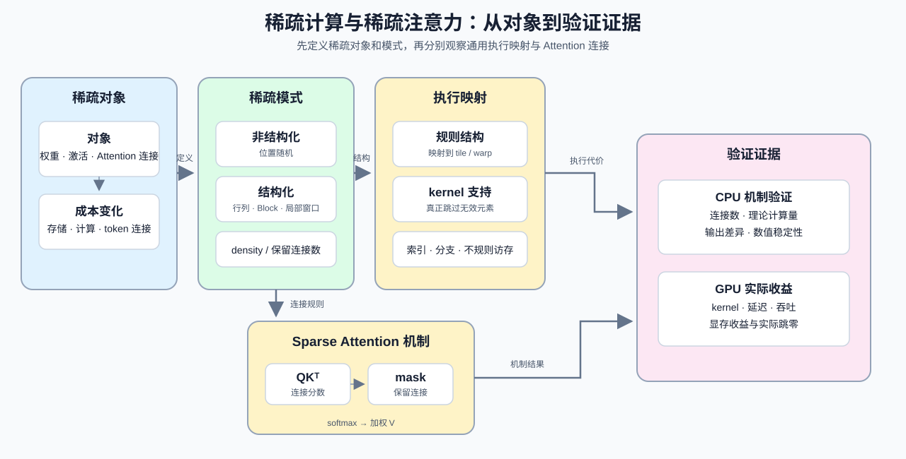

# 25. Sparse Computation and Sparse Attention | 稀疏计算与稀疏注意力

**难度：** Hard | **环境：** CPU-first | **标签：** `模型结构`, `Sparse`, `Sparse Attention` | **目标人群：** 需要判断稀疏结构能否转化为实际收益的学习者

> 🚀 **云端运行环境**
>
> 本章节的实战代码可以点击以下链接在免费 GPU 算力平台上直接运行：
>
> [](https://colab.research.google.com/github/datawhalechina/llm-algo-leetcode/blob/main/01_Hardware_Math_and_Systems/25_Sparse_Computation_and_Sparse_Attention.ipynb)
> [](https://modelscope.cn/my/mynotebook) *(国内推荐：魔搭社区免费实例)*


---

## 本节导读

本节从稀疏对象和稀疏模式出发，构造 Sparse Attention 的 mask，比较保留连接数、理论计算量和输出差异。学习完成后，你应能判断稀疏结构改变了什么成本，以及它是否保持了可解释的计算结果。

**关键词：** `sparsity`, `structure`, `density`




## 前置阅读

**导语：** 先用 Tensor Core 的 tile 计算和 SRAM 复用解释密集执行，再把同一组输入改成稀疏对象、稀疏模式和 Attention mask，比较保留连接数、理论计算量与输出变化。

- [09. AI Compilers and Graph Optimization | AI 编译器与计算图优化](./09_AI_Compilers_and_Graph_Optimization.md)
- [23. TensorCore Deep Dive | Tensor Core 深度剖析](./23_TensorCore_Deep_Dive.md)
- [24. SRAM Optimization Techniques | SRAM 优化技术](./24_SRAM_Optimization_Techniques.md)

## Q1：稀疏的对象、模式和密度分别是什么？

<details><summary>点击展开查看解析</summary>

稀疏的第一个任务是把对象、模式和密度说清楚：稀疏对象可以是权重、激活或 Attention 连接；稀疏模式描述保留元素如何分布；密度表示仍然保留的元素比例。

如果只是把矩阵里很多位置置零，但 kernel 仍然按 dense 的方式扫描、广播和累加，零值就只是换了个存法，计算和搬运未必真的少。

密度下降本身不等于计算和搬运已经减少；后面的结构判断会继续检查这些元素能否被执行路径跳过。
</details>
### Q1小验证：稀疏带来的不是自动加速

先判断稀疏是否能被执行路径真正利用。

```python
def sparsity_definition_report(target='weights', density=0.5, structure='block'):
    """整理稀疏对象、模式和密度，不判断执行候选路径。"""
    if target not in {'weights', 'activation', 'attention'}:
        raise ValueError(f'未知稀疏对象: {target}')
    if not 0 <= density <= 1:
        raise ValueError('density 必须位于 [0, 1]')
    if structure not in {'block', 'row', 'column', 'random'}:
        raise ValueError(f'未知稀疏结构: {structure}')
    return {
        'target': target,
        'density': density,
        'zero_ratio': round(1 - density, 2),
        'structure': structure,
    }

for case in [('weights', 0.1, 'block'), ('attention', 0.5, 'block'), ('activation', 0.5, 'random')]:
    print(case, '->', sparsity_definition_report(*case))
assert sparsity_definition_report('weights', 0.5, 'block')['zero_ratio'] == 0.5
assert sparsity_definition_report('attention', 0.5, 'random')['target'] == 'attention'
try:
    sparsity_definition_report('unknown', 0.5, 'block')
except ValueError:
    print('✅ 稀疏对象校验通过')
else:
    raise AssertionError('未知稀疏对象应报错')

```

## Q2：为什么结构化稀疏比非结构化稀疏更容易落地？

<details><summary>点击展开查看解析</summary>

结构化稀疏会把稀疏模式固定成硬件更容易识别和优化的形状，因此更容易映射到 tile、warp 或 sparse MMA。

非结构化稀疏虽然灵活，但通常需要额外索引、分支和不规则访存；如果 kernel 没有对应支持，数据变稀疏并不会自动减少执行工作。

可以用下面的对照表把模式、执行路径和代价放在同一口径下。

| 稀疏模式 | 结构特点 | 执行路径 | 主要代价 |
| --- | --- | --- | --- |
| 非结构化稀疏 | 零值位置随机 | 需要索引和不规则访存 | 分支、索引、访存碎片 |
| 行 / 列结构化稀疏 | 按行或列裁剪 | 较容易映射规则访问 | 结构约束较强 |
| Block 稀疏 | 按块保留或裁剪 | 容易映射 tile / warp | 粒度可能影响质量 |
| 硬件约束结构 | 满足特定 sparse MMA 形状 | 可使用专用路径 | 依赖硬件与 backend |
</details>
### Q2小验证：为什么规则形状更容易优化

规则越强，越容易映射到规则的 tile、warp 或 sparse MMA 计算路径；本节先用 CPU 代码检查这种结构关系。

```python
def structured_path_report(shape='block', hardware='mma'):
    """报告稀疏结构与硬件路径的匹配关系，不生成固定性能分数。"""
    if shape not in {'block', 'row', 'column', 'random'}:
        raise ValueError(f'未知稀疏形状: {shape}')
    if hardware not in {'mma', 'tensorcore', 'cpu'}:
        raise ValueError(f'未知硬件路径: {hardware}')
    regular = shape in {'block', 'row', 'column'}
    hardware_path = hardware in {'mma', 'tensorcore'}
    return {
        'regular_structure': regular,
        'hardware_path_available': hardware_path,
        'execution_candidate': bool(regular and hardware_path),
    }

cases = [('block', 'mma'), ('row', 'mma'), ('random', 'mma'), ('block', 'cpu')]
for shape, hw in cases:
    print((shape, hw), '->', structured_path_report(shape, hw))
assert structured_path_report('block', 'mma')['execution_candidate']
assert not structured_path_report('random', 'mma')['execution_candidate']

```

## Q3：权重、Attention 和 MLP 稀疏的收益有什么不同？

<details><summary>点击展开查看解析</summary>

三类稀疏首先改变的对象不同：

| 稀疏对象 | 主要改变 | 可能节省的成本 | 额外风险 |
| --- | --- | --- | --- |
| 权重稀疏 | 参数矩阵和权重加载 | 权重存储、矩阵乘法工作量 | 稀疏权重需要匹配的矩阵 kernel |
| Attention 稀疏 | token-token 连接或 score 计算 | 长序列计算量、部分中间结果 | 动态索引和不规则访存 |
| MLP 稀疏 | FFN 的激活或通道 | 激活路径、矩阵乘法工作量 | 路由和负载不均衡 |

下面的代码继续把对象、density、结构和理论执行条件整理成报告；它不生成真实加速比。
</details>
### Q3小验证：稀疏能不能落到执行上

先区分稀疏对象改变了哪类成本，再检查结构是否具备落到执行路径的条件。

```python
def sparsity_execution_ledger(target='attention', density=0.3, structure='block'):
    """整理稀疏对象、主要成本和执行候选条件。

    返回值是机制判断表，不是 speedup 预测；本节只验证对象、结构和理论成本。
    """
    profiles = {
        'weights': {
            'primary_cost': 'weight_storage_and_matmul',
            'possible_saving': 'storage_and_compute',
            'extra_risk': 'kernel_mapping',
        },
        'attention': {
            'primary_cost': 'token_token_score',
            'possible_saving': 'long_context_compute',
            'extra_risk': 'dynamic_indexing_and_irregular_access',
        },
        'mlp': {
            'primary_cost': 'ffn_activation_and_matmul',
            'possible_saving': 'activation_path_and_compute',
            'extra_risk': 'routing_and_load_imbalance',
        },
    }
    if target not in profiles:
        raise ValueError(f'未知稀疏对象: {target}')
    if not 0 <= density <= 1:
        raise ValueError('density 必须位于 [0, 1]')
    if structure not in {'block', 'row', 'column', 'random'}:
        raise ValueError(f'未知稀疏结构: {structure}')
    regular = structure in {'block', 'row', 'column'}
    return {
        'target': target,
        'zero_ratio': round(1 - density, 2),
        **profiles[target],
        'regular_structure': regular,
        'theoretical_path_condition': regular and density < 1,
    }

for case in [('weights', 0.25, 'block'), ('attention', 0.25, 'block'), ('mlp', 0.25, 'row')]:
    print(case, '->', sparsity_execution_ledger(*case))
assert sparsity_execution_ledger('weights', 0.25, 'block')['possible_saving'] == 'storage_and_compute'
assert sparsity_execution_ledger('attention', 0.25, 'random')['regular_structure'] is False
try:
    sparsity_execution_ledger('unknown', 0.25, 'block')
except ValueError:
    print('✅ 稀疏对象校验通过')
else:
    raise AssertionError('未知稀疏对象应报错')
```

## Q4：为什么理论稀疏度可能没有转化成较低计算量？

<details><summary>点击展开查看解析</summary>

Q4 要把“理论上更稀”转成可检查的对照：固定输入、density、稀疏模式和计算规则，分别记录 dense / sparse 的保留连接数、理论计算量和输出差异。

如果稀疏只改变了存储格式，却没有减少实际计算，理论计算量也不会自动转化为运行收益。下面的代码先整理 CPU 可验证的风险提示和对照指标。

可以按下面的对照表组织机制实验，先固定输入口径，再只改变稀疏 mask。

| 对照项 | 保持不变 | 只改变的条件 | 需要记录 |
| --- | --- | --- | --- |
| dense baseline | 输入、dtype、shape、softmax 规则 | 全连接 mask | 输出、理论计算量 |
| sparse candidate | 输入、dtype、shape、softmax 规则 | sparse mask / density | 输出、保留连接数 |
| quality check | 评测输入和误差口径 | 是否使用稀疏 mask | 输出差异、数值稳定性 |
</details>
### Q4小验证：如何设计 dense / sparse 对照

先列出固定输入、dense baseline、sparse mask 和需要记录的 CPU 指标。

```python
def sparse_failure_reason(density, structure='block'):
    """列出稀疏机制对照的风险提示，不输出硬件性能结论。"""
    if not 0 <= density <= 1:
        raise ValueError('density 必须位于 [0, 1]')
    if structure not in {'block', 'row', 'column', 'random'}:
        raise ValueError(f'未知稀疏结构: {structure}')
    reasons = []
    if density >= 0.7:
        reasons.append('density_high_risk_for_this_demo')
    if structure == 'random':
        reasons.append('irregular_pattern')
    if structure in ['row', 'column'] and density < 0.3:
        reasons.append('weak_structure_gain')
    return {
        'usable_for_demo': len(reasons) == 0,
        'reasons': reasons or ['path_ready'],
        'comparison_metrics': ['retained_connections', 'theoretical_ops', 'max_abs_diff'],
        'requires_dense_baseline': True,
    }

cases = [(0.1, 'block'), (0.5, 'random'), (0.8, 'block'), (0.3, 'row')]
for case in cases:
    print(case, '->', sparse_failure_reason(*case))
assert 'density_high_risk_for_this_demo' in sparse_failure_reason(0.8, 'block')['reasons']
assert sparse_failure_reason(0.3, 'block')['usable_for_demo']

```

## Q5：Sparse Attention 如何减少 token-token 连接？

<details><summary>点击展开查看解析</summary>

用一个布尔 mask 保留局部窗口中的连接，就可以在 CPU 上明确观察 dense attention 与 sparse attention 的差别：输入和 softmax 规则保持不变，只改变允许参与计算的连接。这里验证的是 mask、保留连接数、理论计算量和输出差异，不把理论减少量写成运行加速。
</details>

### Q5小验证：先验证连接，再观察输出

下面的实现使用局部窗口构造 sparse mask，并与 dense mask 对照。

```python
import math
import torch

def build_local_attention_mask(seq_len, window):
    """构造包含自身位置的局部窗口 mask，返回 [1, 1, L, L]。"""
    if seq_len <= 0 or window < 0:
        raise ValueError('seq_len 必须为正，window 不能为负')
    positions = torch.arange(seq_len)
    return (positions[:, None] - positions[None, :]).abs().le(window)[None, None]

def masked_attention_cpu(q, k, v, mask):
    """在 CPU 上按 mask 计算 scaled dot-product attention。"""
    scores = q @ k.transpose(-2, -1) / math.sqrt(q.shape[-1])
    scores = scores.masked_fill(~mask, torch.finfo(scores.dtype).min)
    weights = torch.softmax(scores, dim=-1)
    return weights @ v

torch.manual_seed(0)
batch, heads, seq_len, head_dim = 1, 2, 8, 4
q = torch.randn(batch, heads, seq_len, head_dim)
k = torch.randn_like(q)
v = torch.randn_like(q)
dense_mask = torch.ones(1, 1, seq_len, seq_len, dtype=torch.bool)
sparse_mask = build_local_attention_mask(seq_len, window=2)
dense_out = masked_attention_cpu(q, k, v, dense_mask)
sparse_out = masked_attention_cpu(q, k, v, sparse_mask)
retained = int(sparse_mask.sum().item())
dense_connections = seq_len * seq_len
report = {
    'dense_connections': dense_connections,
    'sparse_connections': retained,
    'theoretical_connection_ratio': round(retained / dense_connections, 4),
    'max_abs_diff': round((dense_out - sparse_out).abs().max().item(), 6),
}
print(report)
assert dense_out.shape == sparse_out.shape == (batch, heads, seq_len, head_dim)
assert torch.isfinite(sparse_out).all()
assert 0 < retained < dense_connections

```

## 相关阅读

**导语：** 如果要继续分析稀疏结构如何进入调度、编译和执行路径，可以接着看这些页。

- [09. AI Compilers and Graph Optimization | AI 编译器与计算图优化](./09_AI_Compilers_and_Graph_Optimization.md)
- [18. Triton Block Model | Triton Block 模型](./18_Triton_Block_Model.md)
- [19. Operator Fusion Introduction | 算子融合导论](./19_Operator_Fusion_Introduction.md)
- [xFormers | Meta 开源高效 Transformer 组件](https://github.com/facebookresearch/xformers)
- [SparseGPT | 稀疏化论文](https://arxiv.org/abs/2301.00774)
---