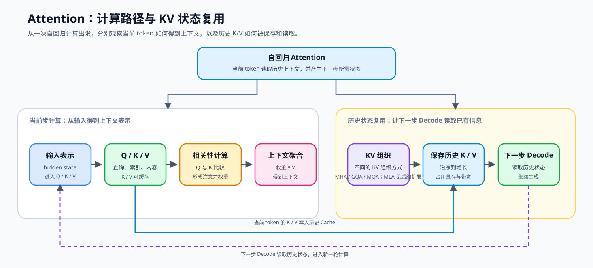
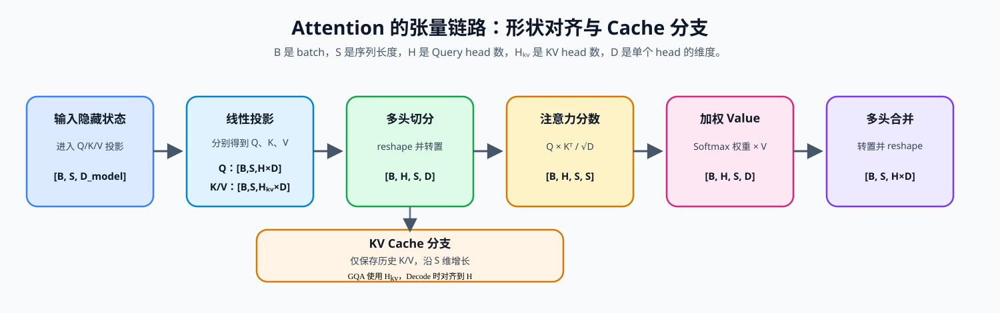

# 04. Attention MHA GQA | 多头注意力

**难度：** Medium | **环境：** CPU-first | **标签：** `基础实现`, `Attention`, `MHA/GQA` | **目标人群：** 基础实现学习者

> 🚀 **云端运行环境**
>
> 本章节的实战代码可以点击以下链接在免费 GPU 算力平台上直接运行：
>
> [](https://colab.research.google.com/github/datawhalechina/llm-algo-leetcode/blob/main/02_PyTorch_Algorithms/04_Attention_MHA_GQA.ipynb)
> [](https://modelscope.cn/my/mynotebook) *(国内推荐：魔搭社区免费实例)*


---

## 本节导读

生成式模型每次预测新 token，都要回看前面的上下文。序列越长，Attention 要读取和维护的历史信息越多；如果每一步都重复计算过去的 Key / Value，推理会非常浪费，而把它们全部缓存下来又会带来显存和带宽压力。

本节把 Attention 的工程主线串起来：先实现多头注意力，再加入 KV Cache 避免重复计算，最后用 GQA 在表达能力和 KV Cache 开销之间折中。完成后，你应该能看懂现代 LLM 为什么会从 MHA 演进到 GQA，也能为后面的解码策略、PagedAttention 和推理优化章节建立基础。

**关键词：** `Attention`, `GQA`, `KV Cache`

---
## 前置阅读

**导语：** 先能写出基础注意力并理解 RoPE 如何作用于 Query / Key，再比较 MHA、KV Cache 和 GQA 对历史状态与读取成本的影响。

- [P0: 05. PyTorch Tensor Fundamentals | PyTorch 张量基础操作](../00_Prerequisites/05_PyTorch_Tensor_Fundamentals.md)
- [P0: 16. Attention Mechanism Intro | 注意力机制导论](../00_Prerequisites/16_Attention_Mechanism_Intro.md)
- [03. RoPE Tutorial | 旋转位置编码教程](../02_PyTorch_Algorithms/03_RoPE_Tutorial.md)

---
### Step 1: Attention 与 KV Cache 的问题来源

生成新 token 时，模型需要用当前查询读取历史上下文：Q 表示当前要查询的内容，K 用于匹配历史位置，V 提供被聚合的信息；位置关系由前置的 [RoPE](../02_PyTorch_Algorithms/03_RoPE_Tutorial.md) 加入。历史 token 的 K/V 可以保存为 KV Cache，后续 Decode 直接复用，但缓存长度和请求数量增加后，显存占用与读取带宽也会随之增长。下面先看 MHA 的计算路径，再观察 GQA、MQA 如何改变 K/V 的组织和缓存规模，最后连接到 Cache 拼接与 Decode。



### Step 2: 核心公式与张量维度

本节追踪 Q/K/V 张量的形状变化，为后面的实现建立统一的维度口径。可以先把 `H` 理解为 Query head 的数量，把 `H_kv` 理解为保存 K/V 的 head 数，把 `D` 理解为每个 head 的特征宽度；GQA 的关键变化就是让多个 Query head 共享较少的 KV head。

**经过线性投影后，注意力计算公式：**
$$ \text{Attention}(Q, K, V) = \text{Softmax}\left(\frac{QK^T}{\sqrt{d_k}}\right)V $$

假设 `Batch=B`, `Seq_len=S`, `Num_Heads=H`, `KV_Heads=H_kv`, `Head_Dim=D`，先看一个小例子：当 `H=4`、`H_kv=2` 时，每组 K/V 被两个 Query head 共享；计算前需要对齐 KV head，但缓存仍只保存两组 KV。下面把头数关系和形状变化放在同一张表中：

| 观察阶段 | 关键关系 | 张量形状或配置 | 对计算与 Cache 的影响 |
| --- | --- | --- | --- |
| MHA / GQA / MQA | `H` 与 `H_kv` 的关系 | MHA：`H=H_kv`；GQA：`H>H_kv`；MQA：`H_kv=1` | 决定 K/V 是否共享，以及缓存中保存多少 KV head |
| 线性投影 | 分别生成 Q、K、V | `[B,S,H×D]` 或 `[B,S,H_kv×D]` | 序列维度仍为 `S` |
| 多头切分 | 拆分并转置 | `[B,H,S,D]` 或 `[B,H_kv,S,D]` | 进入逐 head 计算；GQA 需要在计算前对齐 KV head |
| 注意力分数 | `QKᵀ / √D` | `[B,H,S,S]` | 每个 Query 位置与历史 Key 位置比较 |
| 加权 Value | Softmax 权重聚合 V | `[B,H,S,D]` | 得到上下文表示 |
| Cache 保存 | 历史 K/V 沿 `S` 维增长 | Cache：`[B,H_kv,S,D]` | 上下文变长时显存和读取量增加 |
| 多头合并 | 将各 head 的输出重新拼接 | `[B,H,S,D]` → `[B,S,H×D]` | 恢复到输出投影需要的形状 |



### Step 3: Attention 机制如何改变推理资源

前两步已经说明了 Attention 的计算和张量形状。下面把不同机制放回推理过程，比较它们分别改变了缓存对象、显存容量、带宽和多请求的存储组织，并为后续阅读真实 backend 做准备。

| 机制 | 改变的对象 | 显存或带宽影响 | 下一步观察 |
| --- | --- | --- | --- |
| MHA | 每个 Query head 独立保存 K/V | Cache 较大，读取量较高 | 基础 Attention 实现 |
| GQA / MQA | 多个 Query head 共享 K/V | Cache 减少，但计算前需要对齐 head | 当前 GQA 实现 |
| KV Cache | 保存历史 K/V，避免重复计算 | 随上下文和并发增长 | Cache 生命周期与调度 |
| MLA | 用潜在表示组织缓存 | 表示、读取路径和模型配置变化 | 模型架构扩展 |
| PagedAttention | 按 block 管理多请求 Cache | 减少碎片并支持复用 | vLLM / 推理服务实现 |

### Step 4: 实现 MHA/GQA 与 KV Cache

现在进入代码实现。请补全下方 `GroupedQueryAttention` 的 `forward` 函数中的 `TODO`，把前面学到的形状关系、KV Cache 和 GQA 机制写成一条最小可运行的前向路径。完成后，测试会分别检查 MHA、GQA 和带 Cache 的 Decode。

实现时先保留较少的 `num_kv_heads`，在注意力计算前通过 `repeat_kv` 对齐到 Query head 数；这样代码中的 Cache 形状可以直接对应 Step2 的表格。

| TODO | 需要完成的机制 | 关键输入与形状 | 检查重点 |
| --- | --- | --- | --- |
| TODO 1 | 切分 Q/K/V 并转置多头维度 | `[B,S,H×D]` → `[B,H,S,D]`；K/V 使用 `H_kv` | Query head 与 KV head 数量正确 |
| TODO 2 | 在序列维拼接历史 Cache | `kv_cache` 与当前 K/V 在 `dim=2` 拼接 | Cache 长度增加，且仍保存 `H_kv` 个 KV head |
| TODO 3 | 计算缩放点积 Attention | `Q @ Kᵀ / √D` → Softmax → `P @ V` | 分数形状、mask 广播和输出数值有限 |
| TODO 4 | 合并多头并完成输出投影 | `[B,H,S,D]` → `[B,S,H×D]` → `o_proj` | 输出形状回到 `[B,S,D_model]` |


```python
import torch
import torch.nn as nn
import math
import torch.nn.functional as F
```


```python
def repeat_kv(hidden_states: torch.Tensor, n_rep: int) -> torch.Tensor:
    """
    将形状 [B, H_kv, S, D] 的 KV 头复制 n_rep 次，
    输出为 [B, H_kv * n_rep, S, D]，以匹配 Query 头的数量。
    当 n_rep == 1 时（即 MHA），直接返回原张量。
    """
    batch, num_kv_heads, slen, head_dim = hidden_states.shape
    if n_rep == 1:
        return hidden_states
    #hidden_states = hidden_states[:, :, None, :, :].expand(batch, num_kv_heads, n_rep, slen, head_dim)
    hidden_states = hidden_states.unsqueeze(2).expand(-1, -1, n_rep, -1, -1)
    return hidden_states.reshape(batch, num_kv_heads * n_rep, slen, head_dim)

class GroupedQueryAttention(nn.Module):
    def __init__(self, hidden_dim: int, num_heads: int, num_kv_heads: int = None):
        super().__init__()
        if hidden_dim <= 0 or num_heads <= 0:
            raise ValueError("hidden_dim 和 num_heads 必须为正整数")
        if hidden_dim % num_heads != 0:
            raise ValueError("hidden_dim 必须能被 num_heads 整除")
        self.hidden_dim = hidden_dim
        self.num_heads = num_heads
        self.num_kv_heads = num_kv_heads if num_kv_heads is not None else num_heads
        
        # GQA/MQA 要求 Query head 可以平均分配给 KV head。
        if self.num_kv_heads <= 0 or num_heads % self.num_kv_heads != 0:
            raise ValueError(
                f"num_heads ({num_heads}) 必须能被 num_kv_heads ({self.num_kv_heads}) 整除"
            )
        
        self.num_queries_per_kv = self.num_heads // self.num_kv_heads
        self.head_dim = hidden_dim // num_heads
        
        # 定义投影矩阵
        self.q_proj = nn.Linear(hidden_dim, num_heads * self.head_dim, bias=False)
        self.k_proj = nn.Linear(hidden_dim, self.num_kv_heads * self.head_dim, bias=False)
        self.v_proj = nn.Linear(hidden_dim, self.num_kv_heads * self.head_dim, bias=False)
        self.o_proj = nn.Linear(num_heads * self.head_dim, hidden_dim, bias=False)

    def forward(
        self, 
        x: torch.Tensor, 
        attention_mask: torch.Tensor = None, 
        kv_cache: tuple[torch.Tensor, torch.Tensor] = None
    ):
        """
        前向传播。

        Args:
            x: 输入张量，形状 [batch, seq_len, hidden_dim]
            attention_mask: 注意力掩码，形状应为 [batch, 1, 1, seq_len]（因果掩码）
                        或 [batch, 1, seq_len, seq_len]；可见位置通常为 0，
                        屏蔽位置为 -inf，并广播到 scores。
            kv_cache: 缓存的 (K, V) 张量，形状为
                      ([batch, num_kv_heads, cached_seq_len, head_dim], ...)。
    
        Returns:
            输出张量 [batch, seq_len, hidden_dim]，更新后的 KV Cache
        """
        batch_size, seq_len, _ = x.shape
        
        # 1. 线性投影
        xq, xk, xv = self.q_proj(x), self.k_proj(x), self.v_proj(x)
        
        # ==========================================
        # TODO 1: Reshape xq, xk, xv 以适配多头注意力计算
        # 提示: 先把最后一维拆成 [num_heads, head_dim] / [num_kv_heads, head_dim]（使用 reshape 或 view），
        # 再将seq_len和num_heads换位，得到 [B, num_heads, S, head_dim] / [B, num_kv_heads, S, head_dim]
        # ==========================================
        # xq = ???
        # xk = ???
        # xv = ???

        # ==========================================
        # TODO 2: 处理 KV Cache
        # 提示: 如果有 cache，将历史 KV 拼接在当前 KV 的 seq_len 维度前
        # 注意: 拼接维度是 dim=2 (seq_len)
        # ==========================================
        if kv_cache is not None:
            k_cache, v_cache = kv_cache
            # 只拼接未扩展的 KV，避免把 GQA 的缓存放大到 MHA 大小。
            # xk = ???
            # xv = ???
            
        new_kv_cache = (xk, xv)
        
        # 通过 repeat_kv 把 GQA 的 KV 头数扩充到和 Query 数量一致
        xk = repeat_kv(xk, self.num_queries_per_kv)
        xv = repeat_kv(xv, self.num_queries_per_kv)
        
        # ==========================================
        # TODO 3: 计算注意力分数 (Scaled Dot-Product)
        # 公式: scores = Q @ K^T / sqrt(head_dim)
        # 提示: 使用 torch.matmul，并对 K 转置最后两维
        # 注意: attention_mask 形状为 [batch, 1, 1, seq_len]（因果掩码），
        #       会广播到 scores 的 [batch, num_heads, seq_len, seq_len]
        # ==========================================
        # scores = ???
        
        if attention_mask is not None:
            scores = scores + attention_mask
            
        # probs = ???
        # output = ???
        
        
        # ==========================================
        # TODO 4: 恢复形状并输出
        # [B, H, S, D] -> [B, S, H*D]
        # 提示: transpose + contiguous + view
        # ==========================================
        # output = ???
        
        return self.o_proj(output), new_kv_cache

```


```python
# 运行此单元格以测试你的实现
def causal_mask(seq_len: int) -> torch.Tensor:
    """构造允许看见当前位置及历史位置的加性因果掩码。"""
    mask = torch.zeros(1, 1, seq_len, seq_len)
    return mask.masked_fill(torch.triu(torch.ones_like(mask, dtype=torch.bool), diagonal=1), float('-inf'))

def test_mha_mqa_gqa():
    try:
        batch_size, seq_len, hidden_dim, num_heads = 2, 16, 128, 4
        
        # 1. 测试 MHA
        print("Testing MHA (Multi-Head Attention)...")
        mha = GroupedQueryAttention(hidden_dim, num_heads, num_kv_heads=num_heads)
        x = torch.randn(batch_size, seq_len, hidden_dim)
        full_mask = causal_mask(seq_len)
        out, _ = mha(x, attention_mask=full_mask)
        assert out.shape == (batch_size, seq_len, hidden_dim), "MHA 输出形状错误!"
        assert torch.isfinite(out).all(), "因果 mask 后的 MHA 输出出现 NaN 或 Inf!"
        
        # 2. 测试 GQA
        print("Testing GQA (Grouped-Query Attention)...")
        gqa = GroupedQueryAttention(hidden_dim, num_heads, num_kv_heads=2)
        out, _ = gqa(x, attention_mask=full_mask)
        assert out.shape == (batch_size, seq_len, hidden_dim), "GQA 输出形状错误!"
        assert torch.isfinite(out).all(), "GQA 输出出现 NaN 或 Inf!"
        
        # 3. 测试 KV Cache
        print("Testing KV Cache Autoregressive Decoding...")
        prefill_len = 5
        x_prefill = torch.randn(batch_size, prefill_len, hidden_dim)
        prefill_mask = causal_mask(prefill_len)
        full_out, _ = mha(x_prefill, attention_mask=prefill_mask)
        _, kv_cache = mha(x_prefill[:, :-1], attention_mask=causal_mask(prefill_len - 1))
        
        x_decode = x_prefill[:, -1:]
        decode_mask = torch.zeros(1, 1, 1, prefill_len)
        out_decode, new_kv_cache = mha(x_decode, attention_mask=decode_mask, kv_cache=kv_cache)
        assert new_kv_cache[0].shape == (batch_size, num_heads, prefill_len, hidden_dim // num_heads), "KV Cache 更新错误!"
        assert torch.allclose(full_out[:, -1:], out_decode, atol=1e-5, rtol=1e-4), "Prefill 与 Cache Decode 的结果不一致!"
        _, gqa_cache = gqa(x_prefill)
        _, gqa_cache_next = gqa(x_decode, kv_cache=gqa_cache)
        assert gqa_cache_next[0].shape[1] == 2, "GQA Cache 的 KV head 数错误!"
        assert gqa_cache_next[0].shape[2] == prefill_len + 1, "GQA Cache 的序列长度错误!"
        
        # 4. 参数边界：避免静默截断或无法平均分配 KV head
        for bad_args in [(130, 4, 2), (128, 3, 1), (128, 4, 3)]:
            try:
                GroupedQueryAttention(*bad_args)
                raise AssertionError(f"非法配置未被拒绝: {bad_args}")
            except ValueError:
                pass

        print("\n✅ All Tests Passed! Attention 算子实现通过测试。")
    except NotImplementedError:
        print("请先完成 TODO 部分的代码！")
        raise
    except (AttributeError, NameError, TypeError, ValueError) as e:
        if isinstance(e, AttributeError):
            print("代码未完成，无法找到必要的属性")
        elif isinstance(e, NameError):
            print("代码可能未完成，导致了变量未定义")
        elif isinstance(e, TypeError):
            print("代码可能未完成，导致了类型错误")
        else:
            print("代码可能未完成，导致了张量维度错误")
        raise NotImplementedError("请先完成 TODO 部分的代码！") from e
    except Exception as e:
        print(f"\n❌ 测试失败，请检查张量维度: {e}")
        raise

test_mha_mqa_gqa()

```

---

🛑 **STOP HERE** 🛑
<br><br><br><br><br><br><br><br><br><br>
> 请先尝试自己完成代码并跑通测试。<br>
> 如果你正在 Colab 中运行，并且遇到困难没有思路，可以向下滚动查看参考答案。
<br><br><br><br><br><br><br><br><br><br>

---
## 参考代码与解析

### 代码

```python
def repeat_kv(hidden_states: torch.Tensor, n_rep: int) -> torch.Tensor:
    """
    将形状 [B, H_kv, S, D] 的 KV 头复制 n_rep 次，
    输出为 [B, H_kv * n_rep, S, D]，以匹配 Query 头的数量。
    当 n_rep == 1 时（即 MHA），直接返回原张量。
    """
    batch, num_kv_heads, slen, head_dim = hidden_states.shape
    if n_rep == 1:
        return hidden_states
    #hidden_states = hidden_states[:, :, None, :, :].expand(batch, num_kv_heads, n_rep, slen, head_dim)
    hidden_states = hidden_states.unsqueeze(2).expand(-1, -1, n_rep, -1, -1)
    return hidden_states.reshape(batch, num_kv_heads * n_rep, slen, head_dim)

class GroupedQueryAttention(nn.Module):
    def __init__(self, hidden_dim: int, num_heads: int, num_kv_heads: int = None):
        super().__init__()
        if hidden_dim <= 0 or num_heads <= 0:
            raise ValueError("hidden_dim 和 num_heads 必须为正整数")
        if hidden_dim % num_heads != 0:
            raise ValueError("hidden_dim 必须能被 num_heads 整除")
        self.hidden_dim = hidden_dim
        self.num_heads = num_heads
        self.num_kv_heads = num_kv_heads if num_kv_heads is not None else num_heads

        # GQA/MQA 要求 Query head 可以平均分配给 KV head。
        if self.num_kv_heads <= 0 or num_heads % self.num_kv_heads != 0:
            raise ValueError(
                f"num_heads ({num_heads}) 必须能被 num_kv_heads ({self.num_kv_heads}) 整除"
            )
        
        self.num_queries_per_kv = self.num_heads // self.num_kv_heads
        self.head_dim = hidden_dim // num_heads
        
        self.q_proj = nn.Linear(hidden_dim, num_heads * self.head_dim, bias=False)
        self.k_proj = nn.Linear(hidden_dim, self.num_kv_heads * self.head_dim, bias=False)
        self.v_proj = nn.Linear(hidden_dim, self.num_kv_heads * self.head_dim, bias=False)
        self.o_proj = nn.Linear(num_heads * self.head_dim, hidden_dim, bias=False)

    def forward(
        self, 
        x: torch.Tensor, 
        attention_mask: torch.Tensor = None, 
        kv_cache: tuple[torch.Tensor, torch.Tensor] = None
    ):
        """
        前向传播。

        Args:
            x: 输入张量，形状 [batch, seq_len, hidden_dim]
            attention_mask: 注意力掩码，形状应为 [batch, 1, 1, seq_len]（因果掩码）
                        或 [batch, 1, seq_len, seq_len]；可见位置通常为 0，
                        屏蔽位置为 -inf，并广播到 scores。
            kv_cache: 缓存的 (K, V) 张量，形状为
                      ([batch, num_kv_heads, cached_seq_len, head_dim], ...)。
    
        Returns:
            输出张量 [batch, seq_len, hidden_dim]，更新后的 KV Cache
        """
        batch_size, seq_len, _ = x.shape
        
        xq, xk, xv = self.q_proj(x), self.k_proj(x), self.v_proj(x)
        
        # 先把投影后的向量拆成多头格式，方便后续按 head 做注意力。
        # TODO 1: Reshape 为多头形式[B, H, S, D]
        xq = xq.reshape(batch_size, seq_len, self.num_heads, self.head_dim).transpose(1, 2)
        xk = xk.reshape(batch_size, seq_len, self.num_kv_heads, self.head_dim).transpose(1, 2)
        xv = xv.reshape(batch_size, seq_len, self.num_kv_heads, self.head_dim).transpose(1, 2)
        
        # 先把历史 cache 和当前步拼起来，再决定是否需要扩展 KV 头。
        # 只缓存未扩展的 KV，保留 GQA 的显存优势。
        # TODO 2: 处理 KV Cache（在 seq_len 维度拼接）
        if kv_cache is not None:
            k_cache, v_cache = kv_cache
            xk = torch.cat([k_cache, xk], dim=2)
            xv = torch.cat([v_cache, xv], dim=2)
            
        new_kv_cache = (xk, xv)
        
        xk = repeat_kv(xk, self.num_queries_per_kv)
        xv = repeat_kv(xv, self.num_queries_per_kv)
        
        # TODO 3: 计算 Scaled Dot-Product Attention
        scores = torch.matmul(xq, xk.transpose(2, 3)) / math.sqrt(self.head_dim)
        
        if attention_mask is not None:
            scores = scores + attention_mask
            
        probs = F.softmax(scores, dim=-1)
        output = torch.matmul(probs, xv)
        
        # TODO 4: 恢复形状[B, S, H*D]
        #output = output.transpose(1, 2).contiguous().view(batch_size, seq_len, -1)
        output = output.transpose(1, 2).reshape(batch_size, seq_len, -1)
        
        return self.o_proj(output), new_kv_cache

```

### 答案解析

- **实现目标：** 把多头注意力、KV Cache 和 GQA 的前向链路写成可运行代码。
- **实现顺序：** 先切分 Q/K/V，再拼接未扩展的 Cache，随后完成 KV head 对齐、Attention 计算和输出恢复。
- **机制关系：** Attention 的结果同时依赖形状变换、历史状态复用和权重归一化，四个 TODO 分别对应这条计算链路。

**1. TODO 1 (多头切分与维度转置)**

- **切分多头：** 使用 `reshape(batch_size, seq_len, num_heads, head_dim)` 将线性投影后的张量从 `[B, S, H*D]` 重塑为 `[B, S, H, D]`，其中 `H` 是头数，`D` 是每个头的维度。相比 `view`，`reshape` 更安全，不需要额外调用`contiguous()` 来确保内存连续性。
- **维度转置：** 通过 `.transpose(1, 2)` 将形状从 `[B, S, H, D]` 转为 `[B, H, S, D]`，这是注意力计算的标准格式，方便后续的矩阵乘法。
- **GQA 的 KV 头数：** 注意 `xk` 和 `xv` 使用 `num_kv_heads` 而不是 `num_heads`，这是 GQA 的核心区别。例如 LLaMA-2 70B 使用 64 个 Query 头但只有 8 个 KV 头。
- **工程细节：** 为什么要 transpose？因为注意力分数计算 `Q @ K^T` 需要在 `[S, D]` 和 `[D, S]` 维度上进行矩阵乘法，将 heads 维度放在第二个位置可以让 batch 和 heads 维度自动广播。

**2. TODO 2 (KV Cache 拼接)**

- **自回归生成场景：** 在推理时，每次只生成一个新 token，但需要用到之前所有 token 的 Key 和 Value。如果每次都重新计算，时间复杂度是 $O(N^2)$。
- **Cache 机制：** 将历史的 `k_cache` 和 `v_cache` 与当前步的 `xk`、`xv` 在 `seq_len` 维度（`dim=2`）拼接，GQA 的形状从 `[B, H_kv, old_len, D]` 变为 `[B, H_kv, old_len+1, D]`。
- **显存优化：** GQA 的 KV Cache 只需存储 `num_kv_heads` 个头，而不是 `num_heads` 个；当 `H_kv` 明显小于 `H` 时，缓存容量也会相应减少。具体收益还要结合模型配置和 workload 测量。
- **工程陷阱：** 必须在 `repeat_kv` 之前进行拼接，否则会重复缓存已扩展的 KV，导致显存浪费。

**3. TODO 3 (Scaled Dot-Product Attention)**

- **注意力分数计算：** `scores = Q @ K^T / sqrt(d_k)`，其中 `xk.transpose(2, 3)` 将 `[B, H, S, D]` 转为 `[B, H, D, S]`，与 `xq` 的 `[B, H, S, D]` 相乘得到 `[B, H, S, S]` 的注意力矩阵。
- **缩放因子：** 除以 `sqrt(head_dim)` 是为了防止点积结果过大导致 softmax 梯度消失。这是 Transformer 原论文的核心设计。
- **Mask 机制：** 完整序列通常使用形状为 `[B, 1, S, S]` 的下三角 Causal Mask；单步 Decode 也可以使用 `[B, 1, 1, S]` 的广播形式。可见位置为 `0`，屏蔽位置用 `-inf`，加到 `scores` 后确保当前 token 只能看到允许访问的位置。
- **Softmax 归一化：** 在最后一个维度（`dim=-1`）上进行 softmax，将注意力分数转为概率分布。
- **加权求和：** `output = probs @ V` 将注意力权重与 Value 相乘，得到加权后的特征表示。

**4. TODO 4 (多头合并与输出投影)**

- **维度转置：** `.transpose(1, 2)` 将 `[B, H, S, D]` 转回 `[B, S, H, D]`。
- **合并多头：** `.reshape(batch_size, seq_len, -1)` 将 `[B, S, H, D]` 展平为 `[B, S, H*D]`，其中 `-1` 自动推断为 `num_heads * head_dim`。`reshape` 比 `view `更安全，不需要额外调用 `.contiguous()` 来确保内存连续性。
- **输出投影：** 通过 `o_proj` 线性层将多头特征映射回 `hidden_dim`，这是标准 Transformer 的最后一步。

**测试验证：** 测试还会检查三类边界：非法 head 配置会抛出 `ValueError`；Causal Mask 后的输出保持有限；完整序列最后一个 token 的输出与“前缀 Cache + 单步 Decode”的输出在容差内一致。第三项验证的是 Cache 保持计算语义，而不只是让序列长度增加。

**进阶思考：GQA 的延迟扩充 (Lazy Expansion)**

- **为什么不直接缓存扩充后的 KV？** 如果在缓存时就用 `repeat_kv` 扩充，显存占用会和 MHA 一样大，失去了 GQA 的优势。
- **正确做法：** 只缓存原始的 `num_kv_heads` 个头，在每次前向传播时临时扩充。这样可能增加部分计算或搬运代价，但在某些长上下文 workload 中，代价可能小于保存完整 KV head 带来的显存和带宽压力，实际取舍需要测量。
- **工程观察：** 真实推理 backend 往往会围绕 KV head 数、缓存布局和读取路径做进一步优化；具体收益应结合模型配置和 benchmark 判断。

---
## 相关阅读

本节可以从注意力原论文回到真实模型实现，再继续进入解码、KV Cache 管理和推理性能分析。

- [Attention Is All You Need 原论文](https://arxiv.org/abs/1706.03762)
- [Transformers 中的 LLaMA 模型实现](https://github.com/huggingface/transformers/blob/main/src/transformers/models/llama/modeling_llama.py)
- [21. 解码策略](../02_PyTorch_Algorithms/21_Decoding_Strategies.md)
- [22. vLLM 与 PagedAttention](../02_PyTorch_Algorithms/22_vLLM_PagedAttention.md)
- [P1: 性能分析与瓶颈定位](../01_Hardware_Math_and_Systems/13_Profiling_and_Bottleneck_Analysis.md)
---