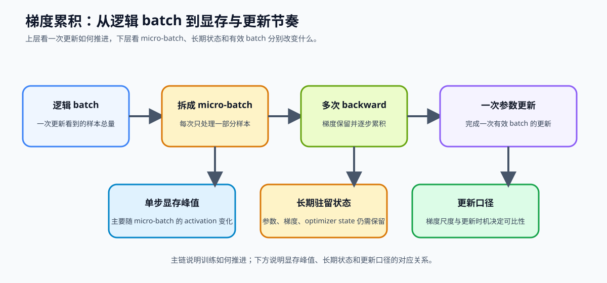
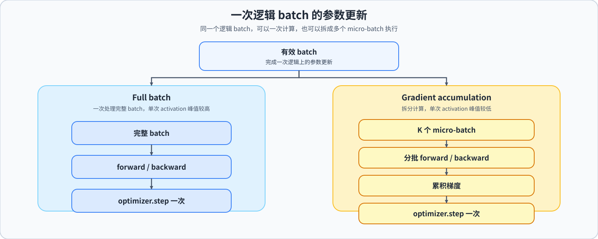

# 12. Gradient Accumulation | 梯度累积

**难度：** Medium | **环境：** CPU-first | **标签：** `训练微调`, `梯度累积`, `显存优化` | **目标人群：** 训练机制学习者

> 🚀 **云端运行环境**
>
> 本章节的实战代码可以点击以下链接在免费 GPU 算力平台上直接运行：
>
> [](https://colab.research.google.com/github/datawhalechina/llm-algo-leetcode/blob/main/02_PyTorch_Algorithms/12_Gradient_Accumulation.ipynb)
> [](https://modelscope.cn/my/mynotebook) *(国内推荐：魔搭社区免费实例)*


---

## 本节导读

训练规模、更新节奏和显存预算往往需要同时考虑：扩大训练规模可能改善统计稳定性，却也会提高单次计算的资源压力。本节帮助你建立这三者之间的判断口径，理解如何在资源受限时保持可比较的训练目标。

学习过程中，你会逐步区分一次更新看到了多少数据、单次计算承担了多少数据，以及资源代价应该如何记录。完成后，再把这套口径放回微调和训练性能实验中观察。

**关键词：** `gradient accumulation`, `micro-batch`, `effective batch`

---
## 前置阅读

**导语：** 先把模型封装、优化器和训练循环补齐，再看多个 micro-batch 如何合成一次有效更新。
- [P0: 09. PyTorch nn.Module Basics | nn.Module 基础](../00_Prerequisites/09_PyTorch_nn_Module_Basics.md)
- [P0: 11. PyTorch Optimizers and Loss | 优化器与损失](../00_Prerequisites/11_PyTorch_Optimizers_and_Loss.md)
- [P0: 13. Simple Neural Network Training | 简单神经网络训练](../00_Prerequisites/13_Simple_Neural_Network_Training.md)

---
### Step 1: 从显存约束到有效 batch
完整 batch 不能一次放入显存时，可以把一次参数更新拆成多个较小的计算批次：每个批次完成前向和反向，梯度暂时汇总，达到设定次数后再完成一次更新。学习这条机制时，要同时看单次计算的 activation 峰值，以及一次更新实际看到了多少样本。
比较两种设置时，应尽量保持有效 batch、数据顺序和优化器条件一致，再观察单步峰值、吞吐与更新口径。下面的表格先把一次更新涉及的对象和变化对齐，主图再展示训练推进的整体关系。

| 观察对象 | 它回答的问题 | 梯度累积带来的变化 |
| --- | --- | --- |
| 单次计算批次 | 一次前向 / 反向处理多少样本？ | 控制单次 activation 峰值 |
| 累积次数 | 多少次小批次合成一次更新？ | 改变更新频率和等待时间 |
| 有效 batch | 一次参数更新看到了多少样本？ | 通常为单次计算批次 × 累积次数 |
| 参数、梯度、optimizer state | 哪些状态仍需长期驻留？ | 不会因累积自动消失 |



### Step 2: Micro-batch 如何改变显存峰值
Step 1 的有效 batch 是训练口径；本步关注它如何被拆成一次次计算。单次计算批次决定一次前向 / 反向需要保留多少 activation，累积次数决定多少次小批次共享一次参数更新。因此，梯度累积适合在不能直接扩大单次计算、但仍希望保持较大有效 batch 时使用；它与参数高效微调、checkpointing 或量化组合时，各自改变的是不同显存对象。下面的表格把这些变化和需要观察的结果放在一起。

| 对象或设置 | 梯度累积改变什么 | 梯度累积不改变什么 | 需要观察的结果 |
| --- | --- | --- | --- |
| 单次计算批次 | 单次输入规模和 activation 峰值 | 参数、梯度和 optimizer state 的规模 | 单步 peak memory、单步时间 |
| 累积次数 | 一次更新前经历的小批次数量 | 单个小批次的 activation 上限 | 更新次数、吞吐和训练节奏 |
| 有效 batch | 一次更新使用的样本总量 | 不代表一次前向的 batch 大小 | loss 归一化和更新口径 |

### Step 3: 梯度等价与更新口径
显存峰值下降并不自动意味着参数更新等价。设一个完整 batch 被切成 `K` 个 micro-batch，且每个 micro-batch 使用相同的 `mean` reduction，则需要把每次 loss 缩放后再反向：

$$\nabla L = \frac{1}{K} \sum_{i=1}^{K} \nabla L_i$$

要获得可比较的更新，至少要对齐四件事：同一批样本及顺序、loss reduction、每次 loss 除以 `K`、累积完成后再执行一次参数更新。输入、目标和掩码等 batch 字段也必须同步切分。

如果忘记缩放 loss，累计梯度会放大约 `K` 倍；如果 batch size 不能被 `K` 整除，则需要显式处理尾部样本或直接报错。本节先选择可整除并报错的口径，便于把差异归因到梯度累积本身。

这是一种有条件的近似等价，不是对 dropout、BatchNorm、动态 loss 或不同 scheduler 节奏下所有训练配置的普遍保证。下面的图把这些对齐条件集中展示。


### Step 4: 实现并验证两条更新路径
代码区将完整 batch 和累积 batch 并排实现：`train_step_full_batch` 一次更新，`train_step_with_accumulation` 先切分 micro-batch、缩放 loss、累积梯度，再统一更新。`slice_micro_batch` 用来保证输入、目标和 SFT batch 字典同步切分。测试区再比较两条路径的输出、参数更新和异常输入；下面的表格把题目区函数与验证重点对应起来。

| 实现对象 | 输入 | 输出 | 验证重点 |
| --- | --- | --- | --- |
| `slice_micro_batch` | batch 字典、索引、累积步数 | 对齐后的 micro-batch | 第一维一致、切分范围正确 |
| `train_step_full_batch` | 模型、优化器、完整 batch | 一次参数更新和 loss | baseline 更新口径 |
| `train_step_with_accumulation` | 模型、优化器、完整 batch、`accum_steps` | 一次参数更新和累计 loss | loss 缩放、step 时机、参数更新 |


```python
import copy
import torch
import torch.nn as nn

```


```python
class TinyRegressor(nn.Module):
    def __init__(self, in_dim=4, out_dim=2):
        super().__init__()
        self.net = nn.Sequential(
            nn.Linear(in_dim, 16),
            nn.ReLU(),
            nn.Linear(16, out_dim),
        )

    def forward(self, x):
        return self.net(x)


def slice_micro_batch(batch: dict[str, torch.Tensor], idx: int, accum_steps: int):
    """按 micro-batch 同步切分 SFT batch 字典。"""
    if accum_steps <= 0:
        raise ValueError("accum_steps 必须为正数")
    if idx < 0 or idx >= accum_steps:
        raise IndexError("micro-batch idx 超出范围")
    batch_size = next(iter(batch.values())).size(0)
    if any(value.size(0) != batch_size for value in batch.values()):
        raise ValueError("batch 字典中的 tensor 第一维必须一致")
    if batch_size % accum_steps != 0:
        raise ValueError("batch size 必须能被 accum_steps 整除")
    micro_size = batch_size // accum_steps
    start = idx * micro_size
    end = (idx + 1) * micro_size
    return {key: value[start:end] for key, value in batch.items()}


def train_step_full_batch(model, optimizer, x, y):
    """使用完整 batch 完成一次参数更新。

    Args:
        model: 待训练模型。
        optimizer: 与 model 参数绑定的优化器。
        x, y: 第一维为 batch 的输入和目标张量。

    Returns:
        未缩放的当前 batch loss。
    """
    model.train()
    criterion = nn.MSELoss(reduction='mean')
    optimizer.zero_grad()
    pred = model(x)
    loss = criterion(pred, y)
    loss.backward()
    optimizer.step()
    return loss.detach().item()


def train_step_with_accumulation(model, optimizer, x, y, accum_steps=4):
    """使用多个 micro-batch 完成一次参数更新。

    Args:
        model: 待训练模型。
        optimizer: 与 model 参数绑定的优化器。
        x, y: 第一维为 batch 的输入和目标张量。
        accum_steps: micro-batch 数量，要求 batch size 可整除。

    Returns:
        未缩放的累计 loss，用于日志记录。

    Note:
        每个 micro-batch 的 loss 除以 accum_steps 后再 backward；
        整个逻辑 batch 只执行一次 optimizer.step()。
    """
    if accum_steps <= 0:
        raise ValueError("accum_steps 必须为正数")
    if x.size(0) % accum_steps != 0:
        raise ValueError("batch size 必须能被 accum_steps 整除")

    model.train()
    criterion = nn.MSELoss(reduction='mean')
    optimizer.zero_grad()

    micro_size = x.size(0) // accum_steps
    total_loss = 0.0
    for idx in range(accum_steps):
        # ==========================================
        # 先切出当前 micro-batch，逐个处理而不是一次性喂完整 batch。
        # TODO 1: 切分当前 micro-batch
        # 提示：按 idx 和 micro_size 同步切分 x / y，保持样本对应。
        # ==========================================
        # xb = ???
        # yb = ???

        pred = model(xb)

        # ==========================================
        # TODO 2: 处理当前 micro-batch 的 loss
        # 提示: 先计算 micro_loss，再除以 accum_steps 后调用 backward()，
        #       保证累积后的梯度仍然对应完整 batch 的平均梯度。
        #       当前使用 MSELoss(reduction='mean')，不要把返回日志 loss 一起缩放。
        # ==========================================
        # loss = ???
        loss.backward()
        # total_loss = ???

    # ==========================================
    # TODO 3: 完成一次参数更新并返回结果
    # 提示: 所有 micro-batch 都 backward 后，只调用一次 optimizer.step()，
    #       返回未缩放 loss 的累计值。
    # ==========================================
    # 优化器操作
    return total_loss

```


```python
# 运行此单元格以测试你的实现
def test_gradient_accumulation():
    try:
        torch.manual_seed(42)
        x = torch.randn(8, 4)
        y = torch.randn(8, 2)

        base_model = TinyRegressor()
        model_full = copy.deepcopy(base_model)
        model_accum = copy.deepcopy(base_model)

        opt_full = torch.optim.SGD(model_full.parameters(), lr=0.1)
        opt_accum = torch.optim.SGD(model_accum.parameters(), lr=0.1)

        loss_full = train_step_full_batch(model_full, opt_full, x, y)
        loss_accum = train_step_with_accumulation(model_accum, opt_accum, x, y, accum_steps=4)

        print(f"Full batch loss: {loss_full:.6f}")
        print(f"Accumulated loss: {loss_accum:.6f}")
        assert abs(loss_full - loss_accum) < 1e-6, "梯度累积的 loss 口径不一致"


        sft_batch = {
            "input_ids": torch.arange(24).view(8, 3),
            "attention_mask": torch.ones(8, 3, dtype=torch.long),
            "labels": torch.arange(24).view(8, 3),
        }
        mb = slice_micro_batch(sft_batch, idx=1, accum_steps=4)
        assert mb["input_ids"].shape == (2, 3), "SFT micro-batch 切分 shape 错误"
        assert torch.equal(mb["input_ids"], sft_batch["input_ids"][2:4]), "SFT micro-batch 切分范围错误"

        for p_full, p_accum in zip(model_full.parameters(), model_accum.parameters()):
            assert torch.allclose(p_full, p_accum, atol=1e-6), "梯度累积与 full batch 更新不一致！"

        print("✅ CPU 机制验证通过：当前 toy 设置下，梯度累积与完整 batch 的 loss 和参数更新口径一致。")
    except NotImplementedError:
        print("请先完成 TODO 部分。")
        raise
    except (AttributeError, NameError, TypeError, ValueError) as e:
        print("代码可能未完成，导致变量未定义" if isinstance(e, NameError) else "代码可能未完成，导致了类型错误")
        raise NotImplementedError("请先完成 TODO 部分。") from e
    except AssertionError as e:
        print(f"❌ 测试失败: {e}")
        raise NotImplementedError("请先完成 TODO 部分。") from e
    except Exception as e:
        print(f"❌ 测试失败: {e}")
        raise

test_gradient_accumulation()
```

---

🛑 **STOP HERE** 🛑
<br><br><br><br><br><br><br><br><br><br>
> 请先尝试自己完成代码并跑通测试。<br>
> 如果你正在 Colab 中运行，并且遇到困难没有思路，可以向下滚动查看参考答案。
<br><br><br><br><br><br><br><br><br><br>

---
## 参考代码与解析

### 代码


```python
import copy
import torch
import torch.nn as nn

class TinyRegressor(nn.Module):
    def __init__(self, in_dim=4, out_dim=2):
        super().__init__()
        self.net = nn.Sequential(
            nn.Linear(in_dim, 16),
            nn.ReLU(),
            nn.Linear(16, out_dim),
        )

    def forward(self, x):
        return self.net(x)


def slice_micro_batch(batch: dict[str, torch.Tensor], idx: int, accum_steps: int):
    """按 micro-batch 同步切分 SFT batch 字典。"""
    if accum_steps <= 0:
        raise ValueError("accum_steps 必须为正数")
    if idx < 0 or idx >= accum_steps:
        raise IndexError("micro-batch idx 超出范围")
    batch_size = next(iter(batch.values())).size(0)
    if any(value.size(0) != batch_size for value in batch.values()):
        raise ValueError("batch 字典中的 tensor 第一维必须一致")
    if batch_size % accum_steps != 0:
        raise ValueError("batch size 必须能被 accum_steps 整除")
    micro_size = batch_size // accum_steps
    start = idx * micro_size
    end = (idx + 1) * micro_size
    return {key: value[start:end] for key, value in batch.items()}


def train_step_full_batch(model, optimizer, x, y):
    """使用完整 batch 完成一次参数更新。

    Args:
        model: 待训练模型。
        optimizer: 与 model 参数绑定的优化器。
        x, y: 第一维为 batch 的输入和目标张量。

    Returns:
        未缩放的当前 batch loss。
    """
    model.train()
    criterion = nn.MSELoss(reduction='mean')
    optimizer.zero_grad()
    pred = model(x)
    loss = criterion(pred, y)
    loss.backward()
    optimizer.step()
    return loss.detach().item()


def train_step_with_accumulation(model, optimizer, x, y, accum_steps=4):
    """使用多个 micro-batch 完成一次参数更新。

    Args:
        model: 待训练模型。
        optimizer: 与 model 参数绑定的优化器。
        x, y: 第一维为 batch 的输入和目标张量。
        accum_steps: micro-batch 数量，要求 batch size 可整除。

    Returns:
        未缩放的累计 loss，用于日志记录。

    Note:
        每个 micro-batch 的 loss 除以 accum_steps 后再 backward；
        整个逻辑 batch 只执行一次 optimizer.step()。
    """
    if accum_steps <= 0:
        raise ValueError("accum_steps 必须为正数")
    if x.size(0) % accum_steps != 0:
        raise ValueError("batch size 必须能被 accum_steps 整除")

    model.train()
    criterion = nn.MSELoss(reduction='mean')
    optimizer.zero_grad()

    micro_size = x.size(0) // accum_steps
    total_loss = 0.0
    for idx in range(accum_steps):
        # 先切出当前 micro-batch，逐个处理而不是一次性喂完整 batch。
        # TODO 1: 切分当前 micro-batch
        xb = x[idx * micro_size:(idx + 1) * micro_size]
        yb = y[idx * micro_size:(idx + 1) * micro_size]

        pred = model(xb)

        # 先缩放 loss，确保累积后的总梯度尺度和完整 batch 一致。
        # TODO 2: 缩放 loss 并反传
        # 提示：当前使用 MSELoss(reduction='mean')，先除以 accum_steps 再 backward。
        loss = criterion(pred, yb) / accum_steps
        loss.backward()
        total_loss += loss.detach().item()

    # 所有 micro-batch 反传完后再统一更新参数。
    # TODO 3: 统一更新参数并返回累计 loss
    # 提示：只调用一次 optimizer.step()，返回未缩放口径的日志 loss。
    optimizer.step()
    optimizer.zero_grad()
    return total_loss
```

### 答案与直觉

- **这一题要解决什么**：把大 batch 的更新效果用 micro-batch 累积模拟出来。
- **为什么这样做**：显存不够时靠多次 backward、一次 step，在条件对齐时近似保持完整 batch 的更新口径。
- **带走的直觉**：梯度累积的关键不是拆 batch，而是保持梯度尺度不变并延后参数更新。

**1. TODO 1 (切分当前 micro-batch)**

- **切分逻辑：** 梯度累积不是一次喂完整 batch，而是先把 `x / y` 按 `accum_steps` 拆成多个 micro-batch。
- **训练目标：** 每一轮循环都只处理当前片段，这样才能模拟大 batch 的效果，同时把峰值显存压低。
- **实现重点：** 先确定当前 micro-batch 的切片范围，再把输入和标签切出来。

**2. TODO 2 (缩放 loss 并反传)**

- **梯度对齐：** 每个 micro-batch 的 loss 必须先除以 `accum_steps`，再执行 `backward()`。
- **等价性：** 在相同 reduction、数据顺序和随机状态等条件下，这样累积出来的平均梯度才与完整 batch 接近，不会悄悄把更新幅度放大 `accum_steps` 倍。
- **实现重点：** 这一层的核心是“先缩放，再反传，再累加”。

**3. TODO 3 (统一更新参数并返回累计 loss)**

- **先攒后更：** 所有 micro-batch 都完成 backward 之后，再统一执行一次 `optimizer.step()` 和 `optimizer.zero_grad()`。
- **闭环意义：** 这样一次参数更新才与完整 batch 的更新口径接近；遇到 dropout、BatchNorm 或不同 scheduler 节奏时，需要重新验证。
- **结果记录：** 最后返回累计 `history` 或 `total_loss`，方便观察训练过程中 loss 是否下降。

**4. 进阶思考：为什么要做重复样本验证？**

- **一致性检查：** 通过 full batch 对照可以验证当前 toy 设置下的近似等价，不能直接推广到所有模型和训练配置。
- **工程价值：** 只要这套链路对齐，后续再切换更复杂的数据和更大的 batch 也更稳。
- **实践意义：** 这条链路把 `SFT Loss`、`梯度累积`、`参数更新` 连接成一个可运行的小闭环。

**5. SFT batch 字典怎么切**

- **同步切分**：`input_ids`、`attention_mask`、`labels` 必须按同一个 `[start:end]` 范围切分。
- **有效 batch**：`effective_batch_size = micro_batch_size * accum_steps`，scheduler 和日志通常按 `optimizer.step()` 后的一次有效更新计数。
- **显存边界**：梯度累积减少的是每个 micro-batch 的 activation 峰值，不会减少参数、梯度和优化器状态的长期占用。

## 相关阅读

理解梯度累积后，可以把它放进端到端微调、LoRA 项目和训练性能分析中，继续观察显存、吞吐与更新口径之间的关系。

- [Hugging Face Accelerate：梯度累积指南](https://huggingface.co/docs/accelerate/usage_guides/gradient_accumulation)
- [13. End-to-End Fine-Tuning Experiment | 端到端微调实验](../02_PyTorch_Algorithms/13_End_to_End_Fine_Tuning_Experiment.md)
- [60. LoRA Fine-Tuning Project | LoRA 微调项目](../02_PyTorch_Algorithms/60_LoRA_Fine_Tuning_Project.md)
- [73. Training Performance Analysis | 训练性能分析](../02_PyTorch_Algorithms/73_Training_Performance_Analysis.md)
- [76. Activation Checkpoint Offload Benchmark | Checkpoint 与 Offload 对比项目](../02_PyTorch_Algorithms/76_Activation_Checkpoint_Offload_Benchmark.md)
