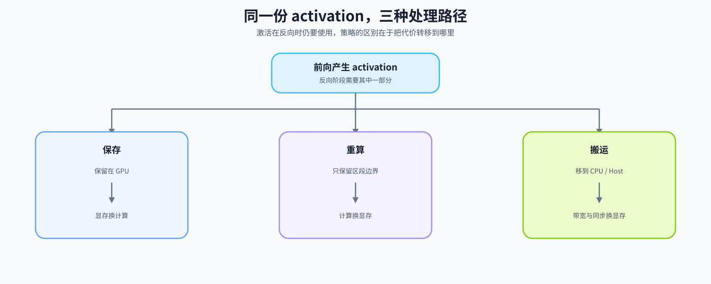
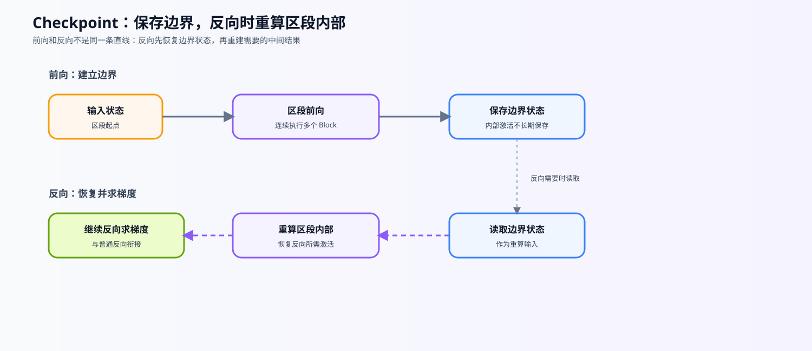

# 19. Activation Checkpointing and Activation Offload | 激活检查点

**难度：** Hard | **环境：** CPU-first（机制验证）

> 🚀 **云端运行环境**
>
> 本章节的实战代码可以点击以下链接在免费 GPU 算力平台上直接运行：
>
> [](https://colab.research.google.com/github/datawhalechina/llm-algo-leetcode/blob/main/02_PyTorch_Algorithms/19_Activation_Checkpointing_and_Activation_Offload.ipynb)
> [](https://modelscope.cn/my/mynotebook) *(国内推荐：魔搭社区免费实例)*

**标签：** `显存优化`, `激活值`, `Checkpointing` | **目标人群：** 显存优化学习者

---

## 本节导读

训练大模型时，参数只是显存账本的一部分；随着训练规模和上下文长度变化，计算过程中产生的中间状态也会形成资源压力。本节从“反向传播需要哪些中间状态”这个问题出发，带你观察保存、重算和搬运分别改变了什么代价。

学习完成后，你应该能够定位训练显存压力出现的阶段，解释资源代价如何在显存、计算时间和传输之间转移，并提出可以复查的观察指标。

**关键词：** `checkpointing`, `recompute`

## 前置阅读

**导语：** 先从训练闭环、反向传播和显存账本理解“为什么要保留激活”，再观察 checkpointing 如何在反向阶段重算部分前向结果，以换取显存空间。

- [P0: 13. Simple Neural Network Training | 简单神经网络训练循环](../00_Prerequisites/13_Simple_Neural_Network_Training.md)
- [18. Activation and Loss Backward | 激活与损失反向](../02_PyTorch_Algorithms/18_Activation_and_Loss_Backward.md)
- [P0: 20. Profiling and Memory Ledger | 性能分析与显存账本](../00_Prerequisites/20_Profiling_and_Memory_Ledger.md)
---

### Step 1: 核心思想与痛点

训练时，前向产生的部分 activation 要留到反向使用；序列长度、batch 或层数增加后，这些驻留状态可能成为显存压力。面对同一个压力，系统可以继续保存、在反向时重算，或先把暂时不用的状态搬到其他存储层。
本节重点是 checkpoint 的“重算换空间”机制；下面的表格先比较三条路径的代价转移，主图再给出整体关系，后续 Step 深入重算边界、生命周期和粒度。

| 处理方式 | 反向阶段发生什么 | 代价转移到哪里 | 首先观察什么 |
| --- | --- | --- | --- |
| 直接保存 | 直接读取前向留下的 activation | GPU 显存 | 峰值是否超过预算 |
| Checkpoint | 重新执行选定区段的前向 | 计算时间 | 重算是否拖慢 step |
| Offload | 把状态取回后继续反向 | CPU-GPU 带宽与同步 | 搬运是否抵消收益 |



### Step 2: 激活值重计算原理
Checkpoint 为选定区段减少中间结果的长期保存，在反向需要时重新执行对应的前向计算。它把部分显存压力转成计算时间，但不会删除参数、梯度或 optimizer state。

判断一次重算是否正确，要同时看三件事：重算得到的输出是否与普通前向一致，输入梯度是否一致，以及随机状态或外部副作用是否会改变重算结果。实际收益还取决于激活在总显存账本中的占比和区段粒度。

| 机制环节 | 发生的事情 | 需要保持的条件 | 观察指标 |
| --- | --- | --- | --- |
| 前向保存 | 保留区段边界和反向所需的少量状态 | 输入关系和随机状态可恢复 | 保存对象与 activation 账本 |
| 反向重算 | 重新执行区段内部前向，再继续求梯度 | 重算输出与原前向一致 | 输入梯度、输出误差 |
| 代价转移 | 减少部分显存驻留，增加计算 | 参数、梯度和 optimizer state 不被误计入收益 | step time、吞吐和 peak memory |

### Step 3: 检查点生命周期与粒度

checkpoint 为一段前向计算建立重算边界：前向阶段保留边界输入和必要状态，反向阶段重新执行区段内部的前向，再继续计算梯度。它不是“完全不保存激活”，而是改变哪些状态长期驻留。

实现单位可以是一个 Transformer Block，也可以是连续 Block 组成的 segment。粒度越细，保存点和调度开销可能增加；粒度越粗，单次重算范围可能增加。被包裹的区段应尽量没有外部副作用；如果包含 dropout 或其他随机操作，还要确认随机状态在重算前后保持一致。下面的表格把生命周期和粒度选择对应到可观察的代价。



| 观察对象 | checkpoint 改变什么 | checkpoint 不改变什么 | 需要验证的代价 |
| --- | --- | --- | --- |
| 区段内部 activation | 减少反向前长期驻留的中间结果 | 参数、梯度和 optimizer state | 重算次数、step time |
| 区段边界状态 | 仍可能需要保留或重新提供 | 反向所需的输入关系 | 输出与输入梯度是否一致 |
| checkpoint 粒度 | 决定保存点数量和单次重算范围 | 不提供固定显存节省比例 | peak memory、吞吐和 OOM 边界 |


### Step 4: 实现并验证 checkpoint 路径

题目区只实现三个相互关联的函数；每个 TODO 都对应前面一个机制环节。输入假定为不原地修改隐藏状态的 Block 序列，测试区负责比较普通前向、逐 Block checkpoint 和分段 checkpoint 的输出与输入梯度。

| 题目区函数 | 对应机制 | TODO 重点 | 验证方式 |
| --- | --- | --- | --- |
| `run_with_checkpointing` | 逐 Block 重算 | TODO 1：用 checkpoint 包裹当前 Block | 输出和输入梯度与普通前向一致 |
| `build_checkpoint_segments` | segment 边界 | TODO 2：生成不重叠、覆盖完整 Block 序列的半开区间 | 检查空段、尾段和非法粒度 |
| `run_with_segment_checkpointing` | 分段重算 | TODO 3：绑定当前 segment 并按顺序执行 | `segment_size=1` 与逐 Block 路径一致 |

实现时重点观察：checkpoint 减少的是区段内部激活驻留；参数、梯度和 optimizer state 仍然存在；粒度变化会同时影响保存点数量和重算范围。

### 实现提示

- 逐 Block 版本直接包裹每个 block；分段版本先确定 `[start:end]`，再执行当前连续片段。
- 每轮循环都要绑定当前 `segment`，避免闭包在反向重算时引用最后一段。
- `segment_size=1` 应与逐 Block 路径对齐；更大的 segment 通常减少保存点，但扩大单次重算范围。
- 先通过 CPU correctness，再在相同 workload 下比较峰值显存和 step time；`use_reentrant=False` 需按当前 PyTorch 版本确认。

### 工程要点

- Checkpointing 是用重算换显存，Offload 是用搬运换显存；二者作用对象和代价路径不同。
- 收益取决于激活占比、序列长度、模型深度、dtype 和 checkpoint 粒度，不能预设固定节省比例。
- 本节验证机制和 CPU correctness；真实 GPU 峰值、吞吐和 step time 由 `73 / 76` 的固定 workload 实验测量。
- 与混合精度、ZeRO 或模型并行组合时，应分别记录作用对象和新增代价。


```python
import torch
import torch.nn as nn
from torch.utils.checkpoint import checkpoint


```


```python
class SimpleTransformerBlock(nn.Module):
    def __init__(self, dim):
        super().__init__()
        self.ffn = nn.Sequential(
            nn.Linear(dim, dim * 4),
            nn.ReLU(),
            nn.Linear(dim * 4, dim)
        )
        self.norm = nn.LayerNorm(dim)
        
    def forward(self, x):
        # 制造一个比较大的激活值内存开销
        out = self.ffn(self.norm(x))
        return x + out

def run_without_checkpointing(blocks: nn.ModuleList, x: torch.Tensor):
    """不使用 checkpoint 执行所有 Block。

    Args:
        blocks: 按顺序排列的 Transformer Block 列表。
        x: 输入隐藏状态，形状通常为 [batch, seq, dim]。

    Returns:
        所有 Block 执行后的隐藏状态。
    """
    for block in blocks:
        x = block(x)
    return x

def run_with_checkpointing(blocks: nn.ModuleList, x: torch.Tensor):
    """对每个 Block 单独启用梯度 checkpoint。

    Args:
        blocks: 按顺序排列的 Transformer Block 列表。
        x: 输入隐藏状态，必须参与梯度计算才能观察反向传播。

    Returns:
        经过逐 Block checkpoint 的输出隐藏状态。

    Note:
        前向阶段少保存中间激活，反向阶段重新执行 Block；
        这里使用 use_reentrant=False。
    """
    for block in blocks:
        # ==========================================
        # TODO 1: 使用 checkpoint 包裹当前 block
        # 提示：使用 use_reentrant=False，并返回新的 x
        # ==========================================
        # x = ???
        pass
    return x

def build_checkpoint_segments(num_blocks: int, segment_size: int):
    """生成覆盖全部 Block 的半开区间 `(start, end)`。"""
    if num_blocks < 0:
        raise ValueError("num_blocks must be non-negative")
    if segment_size <= 0:
        raise ValueError("segment_size must be positive")

    # ==========================================
    # TODO 2: 生成 segment 边界
    # 提示：从 0 开始按 segment_size 向前推进；最后一个区间可以不足 segment_size。
    # ranges = ???
    # ==========================================
    pass

def run_with_segment_checkpointing(blocks: nn.ModuleList, x: torch.Tensor, segment_size: int = 2):
    """将连续 Block 分成固定大小的 segment 后启用 checkpoint。

    Args:
        blocks: 按顺序排列的 Transformer Block 列表。
        x: 输入隐藏状态，形状通常为 [batch, seq, dim]。
        segment_size: 每个 checkpoint 包含的 Block 数量，必须为正数；
            最后一个 segment 可以不足该大小。

    Returns:
        经过分段 checkpoint 的输出隐藏状态。

    Note:
        segment_size=1 接近逐 Block checkpoint；更大的 segment
        通常减少保存点，但可能扩大单次重算范围。
    """
    if segment_size <= 0:
        raise ValueError("segment_size must be positive")

    for start, end in build_checkpoint_segments(len(blocks), segment_size):
        segment = blocks[start:end]

        # ==========================================
        # TODO 3: 完成当前 segment 的前向函数并调用 checkpoint
        # 注意：闭包需要绑定本轮的 segment，不能在循环结束后才读取变量
        # ==========================================
        # def segment_forward(hidden, segment=segment): ...
        # x = checkpoint(segment_forward, x, use_reentrant=False)
        pass
    return x

```

### 测试

运行下面的测试单元：先验证开启 checkpointing 后的输出与反向传播 correctness。显存峰值、吞吐和 step time 不在本节自动启动；需要真实模型和统一 workload 时，再到 `73` 建立 baseline，并在 `76` 比较 checkpoint / offload / hybrid。

```python
# 运行此单元格以测试你的实现
def _run_cpu_correctness_check():
    torch.manual_seed(42)
    dim = 128
    num_layers = 5  # 特意让最后一个 segment 不完整
    blocks = nn.ModuleList([SimpleTransformerBlock(dim) for _ in range(num_layers)])
    segments = build_checkpoint_segments(num_layers, segment_size=2)
    assert segments == [(0, 2), (2, 4), (4, 5)], "segment 边界应覆盖尾段且不重叠"
    assert build_checkpoint_segments(num_layers, segment_size=1) == [(i, i + 1) for i in range(num_layers)]
    try:
        build_checkpoint_segments(num_layers, segment_size=0)
    except ValueError:
        pass
    else:
        raise AssertionError("segment_size=0 应被拒绝")
    x_normal = torch.randn(2, 32, dim, requires_grad=True)
    x_ckpt = x_normal.detach().clone().requires_grad_(True)

    out_normal = run_without_checkpointing(blocks, x_normal)
    loss_normal = out_normal.sum()
    loss_normal.backward()
    grad_normal = x_normal.grad.detach().clone()

    out_ckpt = run_with_checkpointing(blocks, x_ckpt)
    loss_ckpt = out_ckpt.sum()
    loss_ckpt.backward()
    grad_ckpt = x_ckpt.grad.detach().clone()

    assert torch.allclose(out_normal, out_ckpt, atol=1e-5, rtol=1e-4), "checkpoint 前后输出不一致"
    assert torch.allclose(grad_normal, grad_ckpt, atol=1e-5, rtol=1e-4), "checkpoint 前后输入梯度不一致"

    x_segment = x_normal.detach().clone().requires_grad_(True)
    out_segment = run_with_segment_checkpointing(blocks, x_segment, segment_size=2)
    out_segment.sum().backward()
    assert torch.allclose(out_normal, out_segment, atol=1e-5, rtol=1e-4), "分段 checkpoint 前后输出不一致"
    assert torch.allclose(grad_normal, x_segment.grad, atol=1e-5, rtol=1e-4), "分段 checkpoint 前后输入梯度不一致"

    x_one = x_normal.detach().clone().requires_grad_(True)
    out_one = run_with_segment_checkpointing(blocks, x_one, segment_size=1)
    assert torch.allclose(out_ckpt, out_one, atol=1e-5, rtol=1e-4), "segment_size=1 应与逐层 checkpoint 一致"
    print("✅ CPU correctness 测试通过：逐层与分段 checkpoint 的输出和梯度保持一致。")
def test_gradient_checkpointing():
    try:
        _run_cpu_correctness_check()

    except NotImplementedError:
        print("请先完成 TODO 部分的代码！")
        raise
    except (AttributeError, NameError, TypeError, ValueError, AssertionError, RuntimeError) as e:
        if isinstance(e, AttributeError):
            print("代码未完成，无法找到必要的属性")
        elif isinstance(e, NameError):
            print("代码可能未完成，导致了变量未定义")
        elif isinstance(e, TypeError):
            print("代码可能未完成，导致了类型错误")
        elif isinstance(e, ValueError):
            print("代码可能未完成，导致了张量维度错误")
        elif isinstance(e, AssertionError):
            print(f"代码可能未完成，导致了断言失败: {e}")
        else:
            print("代码可能未完成，导致了运行时错误")
        raise NotImplementedError("请先完成 TODO 部分的代码！") from e
    except Exception as e:
        print(f"❌ 测试失败: {e}")
        raise


test_gradient_checkpointing()

```

---

🛑 **STOP HERE** 🛑
<br><br><br><br><br><br><br><br><br><br>
> 请先尝试自己完成代码并跑通测试。<br>
> 如果你正在 Colab 中运行，并且遇到困难没有思路，可以向下滚动查看参考答案。
<br><br><br><br><br><br><br><br><br><br>

---
## 参考代码与解析

### 代码

```python
import torch
import torch.nn as nn
from torch.utils.checkpoint import checkpoint

class SimpleTransformerBlock(nn.Module):
    def __init__(self, dim):
        super().__init__()
        self.ffn = nn.Sequential(
            nn.Linear(dim, dim * 4),
            nn.ReLU(),
            nn.Linear(dim * 4, dim)
        )
        self.norm = nn.LayerNorm(dim)
        
    def forward(self, x):
        out = self.ffn(self.norm(x))
        return x + out

def run_without_checkpointing(blocks: nn.ModuleList, x: torch.Tensor):
    """
    不使用 checkpoint 执行所有 Block。

    Args:
        blocks: 按顺序排列的 Transformer Block 列表。
        x: 输入隐藏状态，形状通常为 [batch, seq, dim]。

    Returns:
        所有 Block 执行后的隐藏状态。
    """
    for block in blocks:
        x = block(x)
    return x

def run_with_checkpointing(blocks: nn.ModuleList, x: torch.Tensor):
    """
    对每个 Block 单独启用梯度 checkpoint。

    Args:
        blocks: 按顺序排列的 Transformer Block 列表。
        x: 输入隐藏状态，必须参与梯度计算才能观察反向传播。

    Returns:
        经过逐 Block checkpoint 的输出隐藏状态。

    Note:
        前向阶段少保存中间激活，反向阶段重新执行 Block；
        这里使用 use_reentrant=False。
    """
    for block in blocks:
        # ==========================================
        # TODO 1: 使用 checkpoint 包裹当前 block
        # ==========================================
        x = checkpoint(block, x, use_reentrant=False)
    return x

def build_checkpoint_segments(num_blocks: int, segment_size: int):
    """生成覆盖全部 Block 的半开区间 `(start, end)`。"""
    if num_blocks < 0:
        raise ValueError("num_blocks must be non-negative")
    if segment_size <= 0:
        raise ValueError("segment_size must be positive")

    # TODO 2: 生成不重叠且覆盖完整的 segment 边界
    ranges = [(start, min(start + segment_size, num_blocks)) for start in range(0, num_blocks, segment_size)]
    return ranges

def run_with_segment_checkpointing(blocks: nn.ModuleList, x: torch.Tensor, segment_size: int = 2):
    """将连续 Block 分成固定大小的 segment 后启用 checkpoint。

    Args:
        blocks: 按顺序排列的 Transformer Block 列表。
        x: 输入隐藏状态，形状通常为 [batch, seq, dim]。
        segment_size: 每个 checkpoint 包含的 Block 数量，必须为正数；
            最后一个 segment 可以不足该大小。

    Returns:
        经过分段 checkpoint 的输出隐藏状态。

    Note:
        segment_size=1 接近逐 Block checkpoint；更大的 segment
        通常减少保存点，但可能扩大单次重算范围。
    """
    if segment_size <= 0:
        raise ValueError("segment_size must be positive")

    for start, end in build_checkpoint_segments(len(blocks), segment_size):
        segment = blocks[start:end]

        # ==========================================
        # TODO 3: 完成当前 segment 的前向函数并调用 checkpoint
        # 注意：每轮创建一个新的局部函数，使它绑定当前 segment
        # ==========================================
        def segment_forward(hidden, segment=segment):
            for block in segment:
                hidden = block(hidden)
            return hidden

        x = checkpoint(segment_forward, x, use_reentrant=False)
    return x

```

### 解析

**1. TODO 1：逐 Block checkpoint**
- **实现方式**：`x = checkpoint(block, x, use_reentrant=False)`
- **关键点**：将每个 block 的前向传播包裹在 checkpoint 中，避免保存中间激活值
- **技术细节**：
  - `checkpoint` 函数接收模块和输入参数
  - `use_reentrant=False` 是当前 PyTorch 文档中常用的非重入实现；实际项目仍应按版本文档确认选项
  - checkpoint 减少区段内部部分中间激活的保存；边界输入、输出和其他 Autograd 所需状态仍可能保留
  - 反向传播时从最近的 checkpoint 重新计算前向传播，恢复所需的激活值
  - 每个 block 独立设置 checkpoint，实现细粒度的显存控制

**2. TODO 2：生成 segment 边界**
- **边界定义**：用半开区间 `(start, end)` 表示一段连续 Block，避免重复计算或漏掉尾段。
- **粒度含义**：`segment_size=1` 对应细粒度 checkpoint；不能整除时，最后一个区间保留剩余 Block。
- **工程意义**：边界计划决定保存点和单次重算范围，是连接机制图与 checkpoint API 的中间层。

**3. TODO 3：分段 checkpoint**
- **分段方式**：使用 `build_checkpoint_segments` 给出的边界取出当前连续片段。
- **前向函数**：`segment_forward` 只接收一个隐藏状态，并按顺序执行当前片段中的 Block。
- **闭包绑定**：使用 `segment=segment` 绑定当前循环变量，避免反向重算时所有函数都引用最后一个 segment。
- **尾段处理**：边界函数会自然处理不足一个完整 segment 的尾部。
- **粒度含义**：`segment_size=1` 接近逐 Block checkpoint；更大的 segment 通常减少保存点，但单次重算范围更长。

**实现结果与验证口径**
1. **前向传播阶段**：正常执行前向计算，并减少 checkpoint 区段内部为反向保存的中间激活；具体保留项由实现决定
2. **反向传播阶段**：遇到需要梯度的地方，从最近的 checkpoint 点重新执行前向传播，恢复激活值后立即计算梯度
3. **时间换空间权衡**：重计算会增加 step time，但没有通用的固定百分比；需要在相同 workload 下同时比较峰值显存、吞吐和质量。

**指标与代价解释**
- **未启用 checkpoint 的简化上界**：若实现为反向保留每层主要激活，其激活账本可近似随 O(L × B × S × D) 增长，其中 L 是层数，B 是 batch size，S 是序列长度，D 是隐藏维度；这不是完整显存公式。
- **Gradient Checkpointing**：减少部分区段的中间状态驻留；具体峰值取决于 checkpoint 粒度、算子实现和其他显存对象，不能简单写成固定复杂度公式。
- **理论趋势**：segment 越大，保存点越少，但单次重算的片段更长；不能从层数直接推出固定节省比例。
- **实际效果**：取决于模型结构、序列长度、dtype、参数/梯度/优化器状态占比和实现方式；简单模型中总显存变化可能很小。

**后续实验记录项**
- **粒度选择**：通常在每个 Transformer Block 级别设置 checkpoint，而非每个子层。过细的粒度会增加重计算开销，过粗的粒度显存节省有限
- **计算开销**：重计算会增加 step time，具体比例需要在相同 workload 下测量，不能预设固定百分比
- **混合策略**：可以只对部分层使用 checkpoint，以平衡显存和速度；“前半段”或“后半段”并不存在对所有模型都成立的固定选择，应由账本和测量决定。
- **长序列训练**：长序列可能放大激活压力，checkpoint 有机会帮助训练越过显存边界，但仍需和减小 micro-batch、offload 或其他显存策略比较。
- **选择性 checkpoint**：可以根据层的类型和账本选择性使用 checkpoint。例如，在 Attention 已由 FlashAttention 等机制降低临时空间后，进一步测量是否只对 FFN 区段 checkpoint 更划算；这不是普遍适用的默认方案。
- **工程实践**：DeepSpeed、Megatron-LM、HuggingFace Transformers 等生态都提供 checkpoint 相关能力，但是否启用、按什么粒度启用，要结合模型、版本和 workload 配置，不能直接视为默认行为或固定标配。
- **与其他优化结合**：checkpoint 可以与混合精度训练、ZeRO优化器、模型并行等技术结合使用，进一步降低显存占用
### 思考与讨论

下面三个问题用于检查机制理解，不替代 76 节的策略对比实验。

**1. 为什么模型总显存的下降幅度可能小于激活显存的下降幅度？**

请先按参数、梯度、优化器状态和激活拆分账本，再判断 checkpoint 实际影响的是哪一项。权重、梯度或优化器状态占比高时，激活减少不会等比例反映到总峰值。

**2. checkpoint 粒度改变了什么？**

比较逐 Block、多个 Block 分段和选择性 checkpoint：分别观察边界数量、重算区段长度、峰值显存和 step time。不要从层数直接推导固定节省比例。

**3. 什么时候值得把 checkpoint 与其他策略一起测量？**

当激活是主要压力且单独 checkpoint 仍无法满足预算时，再把混合精度、offload 或 ZeRO 作为候选组合；分别记录它们作用的账本对象和新增代价。
### 后续项目入口

选择性 checkpoint、分段粒度、混合策略和显存—时间权衡不在本节展开；这些变量将在 76 项目中与 baseline、offload 和 hybrid 统一比较。

- [76. Checkpoint 与 Offload 对比项目](../02_PyTorch_Algorithms/76_Activation_Checkpoint_Offload_Benchmark.md)
- [42. 激活卸载](../02_PyTorch_Algorithms/42_Activation_Offload.md)
- [74. Profiling 与证据收口](../02_PyTorch_Algorithms/74_Profiling_Driven_End_to_End_Optimization.md)
## 相关阅读

Checkpoint 的核心思想来自“用重算换显存”。读完机制后，再用 Offload 和 benchmark 项目比较不同代价。

- [Training Deep Nets with Sublinear Memory Cost 原论文](https://arxiv.org/abs/1604.06174)
- [PyTorch `torch.utils.checkpoint` 官方文档](https://pytorch.org/docs/stable/checkpoint.html)
- [42. 激活卸载](../02_PyTorch_Algorithms/42_Activation_Offload.md)
- [73. 训练性能分析](../02_PyTorch_Algorithms/73_Training_Performance_Analysis.md)
- [76. Checkpoint 与 Offload 对比项目](../02_PyTorch_Algorithms/76_Activation_Checkpoint_Offload_Benchmark.md)
