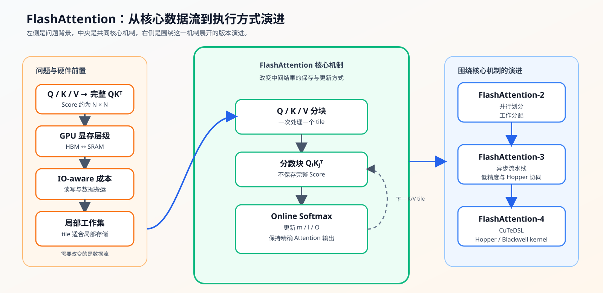
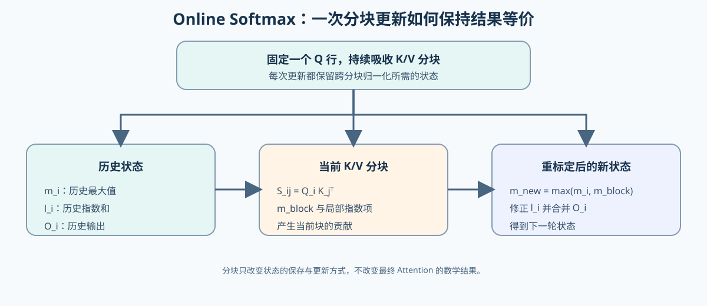
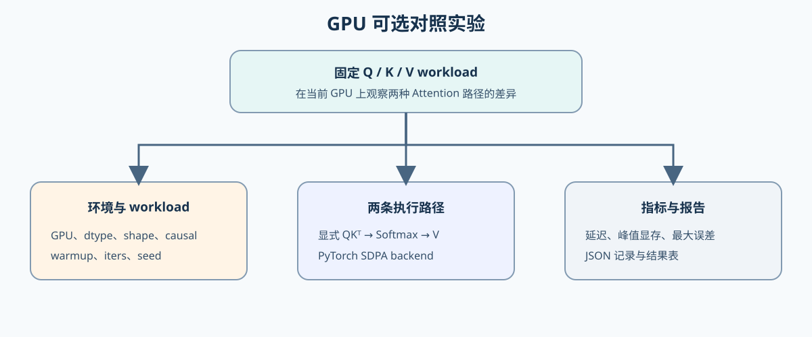

# 20. FlashAttention Sim | FlashAttention 模拟
**难度：** Hard | **环境：** CPU-first | **标签：** `推理优化`, `Attention`, `FlashAttention` | **目标人群：** 推理优化学习者

> 🚀 **云端运行环境**
>
> 本章节的实战代码可以点击以下链接在免费 GPU 算力平台上直接运行：
>
> [](https://colab.research.google.com/github/datawhalechina/llm-algo-leetcode/blob/main/02_PyTorch_Algorithms/20_FlashAttention_Sim.ipynb)
> [](https://modelscope.cn/my/mynotebook) *(国内推荐：魔搭社区免费实例)*


---

## 本节导读

本节关注 Attention 计算中的中间状态、存储访问和资源代价，帮助你建立“结果保持一致时，计算过程可以如何组织”的观察口径。

学习过程中，你会逐步区分算法等价、工作集大小、数值状态和硬件执行代价；完成后能够判断哪些结论来自机制推导，哪些结论必须交给具体设备和 workload 验证。
本节使用 FlashAttention-1/2 共有的核心思想作为学习对象；更近期的硬件特化实现作为扩展阅读，不作为本节的实现要求。

**关键词：** `FlashAttention`, `online softmax`, `tiling`

---

## 前置阅读

**导语：** 先能解释 Attention 的工作集和 GPU 内存层级，再观察分块计算如何减少中间 Score 的存储。
- [P1: 03. GPU Architecture and Memory | GPU 物理架构与内存层级](../01_Hardware_Math_and_Systems/03_GPU_Architecture_and_Memory.md)
- [P1: 14. FlashAttention Memory Model | FlashAttention 显存模型](../01_Hardware_Math_and_Systems/14_FlashAttention_Memory_Model.md)
- [P1: 24. SRAM Optimization Techniques | SRAM 优化技术](../01_Hardware_Math_and_Systems/24_SRAM_Optimization_Techniques.md)

---

### Step 1: Attention 中间工作集与分块动机

给定 $Q、K、V$ 后，标准实现先计算完整的 $S=QK^T$，再对每一行做 softmax，最后与 $V$ 相乘。序列长度为 $N$ 时，$S$ 包含 $N^2$ 个元素；它不是最终输出，却可能成为主要的中间工作集。

先观察完整 Score 与单个 tile 的区别；图中左侧先交代完整 Score 和 GPU 存储访问，中间聚焦本节要实现的分块与 Online Softmax，右侧的版本演进只作为扩展阅读。下一步再解释分块后的状态如何保持结果一致。

| 阶段 | 标准 Attention | 分块路径 |
|---|---|---|
| Score | 先得到完整 `QKᵀ` | 只计算当前 `Q block × K block` |
| Softmax | 对完整行统一计算 | 用 `m / l` 逐块更新 |
| 输出 | 最后与完整概率矩阵相乘 | 逐块累加 `V block` 的贡献 |
| 工作集 | 完整 Score 需要长期处理较大的中间区域 | 单个 tile 限制当前暂存区域 |


### Step 2: Online Softmax 如何保持数值等价
分块以后不能简单地对每个 tile 单独 Softmax，再把结果相加，因为每个 Q 行的归一化分母跨越所有 K block。算法为每个 Q 行保留三项状态：当前最大值 `m`、以该最大值为基准的指数和 `l`、以及已经累积的部分输出 `O`。每轮更新后，这三项状态都代表已经处理过的全部 K block。
当新的 block 有更大的 Score 时，旧状态必须先换到同一个 `m_new` 基准下，再与当前块相加；表格中的三项状态分别对应最大值、归一化分母和加权输出的重新标定。这样最后的输出才有机会与标准 Attention 对齐。

| 状态 | 作用 | 新 K/V block 到来时发生什么 |
|---|---|---|
| `m_i` | 已处理 score 的最大值 | 与 `m_block` 比较，得到 `m_new` |
| `l_i` | 旧状态的归一化分母 | 按 `exp(m_i - m_new)` 修正后再加当前块 |
| `O_i` | 旧块贡献的加权输出 | 按旧分母占比缩放，再加入当前块贡献 |


### Step 3: 一个 Q 分块如何吸收全部 K/V 分块
Step 2 的状态更新需要按固定的计算顺序推进：先固定一个 Q 分块，再让它依次接收所有 K/V 分块的信息。每接收一个 K/V 分块，就把局部结果并入同一组 `m / l / O`；直到所有 K/V 分块处理完，这个 Q 分块才得到最终输出。这里关注状态的生命周期，不展开实现所用的循环变量。

| 计算阶段 | 保持不变的对象 | 状态变化 |
|---|---|---|
| 开始处理一个 Q 分块 | 当前 Q 分块 | 建立对应的 `m / l / O` 初始状态 |
| 接收一个 K/V 分块 | 当前 Q 分块与历史状态 | 产生当前分数块，并按 Step 2 合并状态 |
| 接收完全部 K/V 分块 | 当前 Q 分块 | 得到包含完整上下文信息的 Attention 输出 |


### Step 4: CPU 实现任务与验证标准
本步把前面的数据流转成可执行任务：输入是形状为 `[seq_len, dim]` 的 Q、K、V，输出是形状相同的 Attention 结果。先完成 CPU 分块函数，再用标准 Attention、causal、dtype 和数值稳定性测试检查实现。完成 CPU 测试后，再由 Step 5 观察固定 workload 下的 GPU backend 延迟、显存和误差。下面的表格先对齐 CPU 实验对象和判断方式。

| 实验对象 | 输入与输出 | 判断方式 | 结果用途 |
|---|---|---|---|
| CPU 分块模拟 | 二维 Q/K/V → 同形状输出 | 与标准 Attention 的最大误差 | 检查 `m / l / O` 状态更新 |
| causal 扩展 | `causal=True` 的二维 Q/K/V | 与带上三角 mask 的标准结果对齐 | 检查未来位置是否被屏蔽 |
| dtype 与稳定性 | `float64` 和较大 Score 输入 | 输出 dtype 正确且无 NaN/Inf | 检查数值实现边界 |


```python
import torch
import math
```


```python
def flash_attention_forward_sim(q, k, v, block_size=2, causal=False):
    """计算二维输入上的 FlashAttention 前向模拟。

    Args:
        q, k, v: [seq_len, dim] 张量，device 和 dtype 应保持一致。
        block_size: Q/K/V 的分块大小，必须为正数。
        causal: 是否只允许关注当前位置及之前的 K token。

    Returns:
        [seq_len, dim] 的 attention 输出。

    Note:
        只模拟 online softmax 和分块数据流，不实现真实 CUDA/Triton kernel、
        batch/head、dropout 或 backward；causal mask 是基础路径后的扩展目标。out、m、l 显式使用输入 dtype；
        真实 kernel 常会使用更高精度累加器，不能由本模拟推断具体实现。
    """
    if q.ndim != 2 or k.ndim != 2 or v.ndim != 2:
        raise ValueError('q、k、v 必须是 [seq_len, dim] 二维张量')
    if q.shape != k.shape or k.shape != v.shape:
        raise ValueError('q、k、v 的形状必须一致')
    if q.device != k.device or k.device != v.device:
        raise ValueError('q、k、v 必须位于同一 device')
    if q.dtype != k.dtype or k.dtype != v.dtype:
        raise TypeError('q、k、v 必须使用相同 dtype')
    if block_size <= 0:
        raise ValueError('block_size 必须为正数')

    seq_len, dim = q.shape
    
    # TODO 1: 初始化输出 O，全局最大值 m，全局指数和 l
    # 提示: out 与 q 同 device、同 dtype，形状为 [seq_len, dim]；m/l 形状为 [seq_len, 1]
    # out = ???；m = ???；l = ???；m 初始为 -inf，l 初始为 0。
    # out = ???
    # m = ???
    # l = ???
    
    scale = 1.0 / math.sqrt(dim)
    
    # 外层循环：遍历 Q 的分块
    for i in range(0, seq_len, block_size):
        q_block = q[i:i+block_size] * scale
        m_i = m[i:i+block_size]
        l_i = l[i:i+block_size]
        out_i = out[i:i+block_size]
        
        # 内层循环：遍历 K, V 的分块
        for j in range(0, seq_len, block_size):
            k_block = k[j:j+block_size]
            v_block = v[j:j+block_size]
            
            # TODO 2: 计算当前 Q/K block 的缩放 score S_ij
            # S_ij = (Q_i / sqrt(d)) @ K_j.T
            # TODO 2a（可选 causal mask）：若 causal=True，屏蔽 key_pos > query_pos 的 score。
            # 提示：query_pos = arange(i, ...)，key_pos = arange(j, ...)。
            
            # TODO 3: 计算当前块的局部最大值 m_block，并求出新的全局最大值 m_new
            # m_block = ???；m_new = ???
            # m_new 是新的数值稳定基准；若 m_new 变化，旧 l_i 和 out_i 都必须重标定。
            
            # TODO 4: 计算尚未归一化的指数权重 exp_scores
            # exp_scores = exp(S_ij - m_new)
            
            # TODO 5: 计算当前块的局部指数和 l_block，并更新全局指数和 l_new
            # l_block = ???
            # l_new = ???
            
            # TODO 6: 更新输出 O_i（修正旧状态并累加当前 V block）
            # out_i = ???
            
            # 更新全局状态
            # m_i = ???
            # l_i = ???
            pass
        
        # 写回全局变量
        # out[i:i+block_size] = ???
        # m[i:i+block_size] = ???
        # l[i:i+block_size] = ???
            
    return out

```


```python
# 测试你的实现
# 测试顺序对应 Step 5 的验证目标：数值等价 → causal 扩展 → dtype / 稳定性 → 工作集 → 输入校验。
def test_flash_attention_sim():
    try:
        import math

        def run_case(seq_len, dim, block_size, seed):
            torch.manual_seed(seed)
            q = torch.randn(seq_len, dim)
            k = torch.randn(seq_len, dim)
            v = torch.randn(seq_len, dim)

            scale = 1.0 / math.sqrt(dim)
            scores = (q @ k.transpose(-2, -1)) * scale
            attn = torch.nn.functional.softmax(scores, dim=-1)
            out_ref = attn @ v

            out_sim = flash_attention_forward_sim(q, k, v, block_size=block_size)
            diff = torch.max(torch.abs(out_ref - out_sim))
            print(f"[seq={seq_len}, dim={dim}, block={block_size}] 最大误差: {diff.item():.6e}")
            assert diff < 1e-5, f"计算结果与标准 Attention 不一致！(seq={seq_len}, dim={dim}, block={block_size})"

        run_case(seq_len=8, dim=4, block_size=2, seed=42)
        run_case(seq_len=5, dim=3, block_size=3, seed=7)
        run_case(seq_len=3, dim=2, block_size=1, seed=123)

        # causal 扩展测试：位置 i 只能读取位置 <= i 的 K/V
        torch.manual_seed(11)
        q = torch.randn(6, 4)
        k = torch.randn(6, 4)
        v = torch.randn(6, 4)
        causal_scores = (q @ k.transpose(-2, -1)) / math.sqrt(4)
        causal_scores = causal_scores.masked_fill(torch.triu(torch.ones(6, 6, dtype=torch.bool), diagonal=1), -float('inf'))
        causal_ref = torch.softmax(causal_scores, dim=-1) @ v
        causal_out = flash_attention_forward_sim(q, k, v, block_size=2, causal=True)
        assert torch.allclose(causal_ref, causal_out, atol=1e-5, rtol=1e-5)

        # dtype 边界：模拟应保留输入 dtype；这里只在 CPU 上检查 float64 数值一致性
        torch.manual_seed(9)
        q64 = torch.randn(4, 3, dtype=torch.float64)
        k64 = torch.randn(4, 3, dtype=torch.float64)
        v64 = torch.randn(4, 3, dtype=torch.float64)
        ref64 = torch.softmax((q64 @ k64.transpose(-2, -1)) / math.sqrt(3), dim=-1) @ v64
        out64 = flash_attention_forward_sim(q64, k64, v64, block_size=2)
        assert out64.dtype == q64.dtype
        assert torch.allclose(ref64, out64, atol=1e-10, rtol=1e-10)

        # 理论工作集观察：这里只比较 score 元素数量，不冒充真实显存测量
        seq_len = 128
        full_score_elements = seq_len * seq_len
        for block_size in [1, 4, 16, 32]:
            tile_score_elements = block_size * block_size
            print(f"block={block_size}: 完整 score={full_score_elements}; 单 tile={tile_score_elements}")
            assert tile_score_elements < full_score_elements
        # 数值稳定性：较大的 score 不应导致 NaN/Inf
        q_large = torch.full((3, 2), 100.0)
        k_large = torch.full((3, 2), 100.0)
        v_large = torch.randn(3, 2)
        stable_out = flash_attention_forward_sim(q_large, k_large, v_large, block_size=2)
        assert torch.isfinite(stable_out).all(), 'online softmax 应保持有限输出'

        try:
            flash_attention_forward_sim(torch.randn(2, 2), torch.randn(2, 2), torch.randn(2, 2), block_size=0)
        except ValueError:
            pass
        else:
            raise AssertionError('block_size <= 0 应该被拒绝')

        print("✅ Online Softmax 与分块计算逻辑正确！")
        print("\n FlashAttention 分块计算逻辑验证通过。")

    except NotImplementedError:
        print("请先完成 TODO 部分的代码！")
        raise
    except NameError as exc:
        # 题目区未完成 TODO 时通常会出现变量未定义；仅这一类错误转为预期失败。
        print("题目区仍有变量未完成，请根据 TODO 补全实现。")
        raise NotImplementedError("请先完成 TODO 部分的代码！") from exc
    except (AttributeError, TypeError, ValueError, AssertionError, RuntimeError):
        # 形状、dtype、断言和运行时错误保留原始信息，避免掩盖真实问题。
        raise
    except Exception as e:
        print(f"❌ 测试失败: {e}")
        raise


test_flash_attention_sim()

```

---

🛑 **STOP HERE** 🛑
<br><br><br><br><br><br><br><br><br><br>
> 请先尝试自己完成代码并跑通测试。<br>
> 如果你正在 Colab 中运行，并且遇到困难没有思路，可以向下滚动查看参考答案。
<br><br><br><br><br><br><br><br><br><br>

---
## 参考代码与解析

### 代码

```python
def flash_attention_forward_sim(q, k, v, block_size=2, causal=False):
    """计算二维输入上的 FlashAttention 前向模拟。

    Args:
        q, k, v: [seq_len, dim] 张量，device 和 dtype 应保持一致。
        block_size: Q/K/V 的分块大小，必须为正数。
        causal: 是否只允许关注当前位置及之前的 K token。

    Returns:
        [seq_len, dim] 的 attention 输出。

    Note:
        只模拟 online softmax 和分块数据流，不实现真实 CUDA/Triton kernel、
        batch/head、dropout 或 backward；causal mask 是基础路径后的扩展目标。out、m、l 显式使用输入 dtype；
        真实 kernel 常会使用更高精度累加器，不能由本模拟推断具体实现。
    """
    if q.ndim != 2 or k.ndim != 2 or v.ndim != 2:
        raise ValueError('q、k、v 必须是 [seq_len, dim] 二维张量')
    if q.shape != k.shape or k.shape != v.shape:
        raise ValueError('q、k、v 的形状必须一致')
    if q.device != k.device or k.device != v.device:
        raise ValueError('q、k、v 必须位于同一 device')
    if q.dtype != k.dtype or k.dtype != v.dtype:
        raise TypeError('q、k、v 必须使用相同 dtype')
    if block_size <= 0:
        raise ValueError('block_size 必须为正数')

    seq_len, dim = q.shape
    
    # TODO 1: 初始化输出 O，全局最大值 m，全局指数和 l
    out = torch.zeros((seq_len, dim), device=q.device, dtype=q.dtype)
    m = torch.full((seq_len, 1), -float('inf'), device=q.device, dtype=q.dtype)
    l = torch.zeros((seq_len, 1), device=q.device, dtype=q.dtype)
    
    scale = 1.0 / math.sqrt(dim)
    
    # 外层循环：遍历 Q 的分块
    for i in range(0, seq_len, block_size):
        q_block = q[i:i+block_size] * scale
        m_i = m[i:i+block_size]
        l_i = l[i:i+block_size]
        out_i = out[i:i+block_size]
        
        # 内层循环：遍历 K, V 的分块
        for j in range(0, seq_len, block_size):
            k_block = k[j:j+block_size]
            v_block = v[j:j+block_size]
            
            # TODO 2: 计算当前 Q/K block 的缩放 score S_ij
            S_ij = q_block @ k_block.transpose(-2, -1)
            # TODO 2a（可选扩展）：只保留当前位置及之前的 K/V。
            if causal:
                query_pos = torch.arange(i, i + q_block.shape[0], device=q.device)[:, None]
                key_pos = torch.arange(j, j + k_block.shape[0], device=q.device)[None, :]
                S_ij = S_ij.masked_fill(key_pos > query_pos, -float('inf'))
            
            # TODO 3: 计算当前块的局部最大值 m_block，并求出新的全局最大值 m_new
            m_block = torch.max(S_ij, dim=-1, keepdim=True)[0]
            m_new = torch.maximum(m_i, m_block)
            
            # TODO 4: 计算尚未归一化的指数权重 exp_scores
            exp_scores = torch.exp(S_ij - m_new)
            
            # TODO 5: 计算当前块的局部指数和 l_block，并更新全局指数和 l_new
            l_block = torch.sum(exp_scores, dim=-1, keepdim=True)
            l_new = l_i * torch.exp(m_i - m_new) + l_block
            
            # TODO 6: 更新输出 O_i（使用 Online Softmax 的修正公式）
            out_i = out_i * (l_i * torch.exp(m_i - m_new) / l_new) + (exp_scores @ v_block) / l_new
            
            # 更新全局状态
            m_i = m_new
            l_i = l_new
        
        # 写回全局变量
        out[i:i+block_size] = out_i
        m[i:i+block_size] = m_i
        l[i:i+block_size] = l_i
            
    return out
```

### 解析

**1. TODO 1: 初始化全局状态**
- **实现方式**：`out = torch.zeros((seq_len, dim), device=q.device, dtype=q.dtype)`，`m = torch.full((seq_len, 1), -float('inf'), device=q.device, dtype=q.dtype)`，`l = torch.zeros((seq_len, 1), device=q.device, dtype=q.dtype)`
- **关键点**：m 初始化为负无穷，确保第一个块的最大值能正确更新；l 初始化为 0，用于累加指数和
- **技术细节**：使用 `keepdim=True` 保持二维列向量形状，便于后续广播运算；这里显式沿用输入 dtype，真实 kernel 可能采用 FP32 累加器。

**2. TODO 2: 计算当前块的缩放 score S_ij**
- **实现方式**：`S_ij = q_block @ k_block.transpose(-2, -1)`
- **关键点**：这是标准的 Attention Score 计算，但只针对当前的 Q 块和 K 块
- **技术细节**：q_block 已经在外层循环中乘以了 scale，避免重复缩放

**2a. 可选 causal mask 扩展**
- 对每个 Q/K block 使用全局 token 位置构造 `key_pos > query_pos` 的屏蔽条件。
- 被屏蔽的 score 设为负无穷，使其指数权重为 0；这不会改变 Online Softmax 的状态更新方式。
- 该扩展只验证因果约束下的数值一致性，不涉及真实 decoder kernel 的 mask 融合性能。

**3. TODO 3: 计算局部最大值并更新全局最大值**
- **实现方式**：`m_block = torch.max(S_ij, dim=-1, keepdim=True)[0]`，`m_new = torch.maximum(m_i, m_block)`
- **关键点**：Online Softmax 的核心——动态更新最大值，用于数值稳定性
- **技术细节**：使用 `torch.maximum` 而非 `torch.max`，因为需要逐元素比较两个张量

**4. TODO 4: 计算尚未归一化的指数权重**
- **实现方式**：`exp_scores = torch.exp(S_ij - m_new)`
- **关键点**：这里还不是最终概率，后续需要除以 `l_new`；减去 `m_new` 用于数值稳定。

**5. TODO 5: 计算局部指数和并更新全局指数和**
- **实现方式**：`l_block = torch.sum(exp_scores, dim=-1, keepdim=True)`，由于 `exp_scores` 已按 `m_new` 为基准，`l_new = l_i * torch.exp(m_i - m_new) + l_block`
- **关键点**：Online Softmax 的修正公式——当最大值变化时，需要用指数因子修正旧的指数和
- **技术细节**：`l_i * torch.exp(m_i - m_new)` 是修正项，将旧的指数和调整到新的基准 `m_new`；若 `l_block` 以 `m_block` 为基准，则还需乘 `exp(m_block - m_new)`。

**6. TODO 6: 更新输出 O_i**
- **实现方式**：`out_i = out_i * (l_i * torch.exp(m_i - m_new) / l_new) + (exp_scores @ v_block) / l_new`
- **关键点**：同时修正旧输出和累加新输出，确保最终结果等价于标准 Attention
- **技术细节**：第一项是修正后的旧输出，第二项是当前块的贡献

**工程优化要点**
- **中间工作集**：不再物化完整的 O(N²) Attention Score 矩阵；单个 tile 的临时 score 约为 O(Bq × Bk)，Q/K/V、输出和状态仍需占用存储。
- **数值稳定性**：通过动态更新最大值 m，确保指数运算不会溢出
- **分块策略**：block_size 是关键超参数，需要根据硬件的 SRAM 大小调优
- **在线更新**：无需等待所有块计算完成，每个块处理后立即更新全局状态
- **工业实现**：真实的 FlashAttention 使用 CUDA/Triton 实现，利用共享内存和寄存器优化访存

**进阶思考**
- 如果把未归一化的加权和统一保存到循环结束，再一次性除以最终 `l`，会如何影响实现复杂度和数值稳定性？

### Step 5: GPU 可选对照实验

完成 Step 4 的 CPU 函数和测试后，再运行本步 GPU 对照。本步只回答一个问题：在相同 Q/K/V workload 下，显式 Attention 与 PyTorch SDPA 的延迟、峰值显存和数值误差有什么差异？

| 实验部分 | 学习者需要做什么 | 输出与证据 |
|---|---|---|
| 环境与 workload | 设置 GPU、dtype、batch、head、seq_len、causal、warmup 和 iters | 自动记录 GPU、PyTorch、CUDA 与 workload |
| 两条执行路径 | 在同一组 Q/K/V 上运行显式 Attention 和 SDPA | 比较两种实现的延迟、峰值显存和最大误差 |
| 结果与解释 | 将 JSON 结果登记到最后的表格 | 形成当前 GPU 与固定 workload 下的对照结论 |

当前环境是消费级 GPU（例如 RTX 4090 D 或 RTX 5070 Ti）。本单元运行的是显式 Attention 与 SDPA，不把 SDPA 结果直接命名为 FlashAttention-2/3/4；如果要验证真实 FlashAttention-2，应另行安装并运行 `flash-attn` backend。FA3/FA4 的专用 kernel 需要对应的数据中心 GPU 与软件环境，本节不据当前实验推断其性能。

环境与配置由后面的代码自动记录，结果表放在 GPU 执行单元之后。


#### GPU 对照实验：配置与执行

先运行配置单元确认 workload，再运行执行单元。默认 `RUN_GPU_EXPERIMENT = False`，因此答案区测试不会启动 GPU；采集数据时只修改配置单元，不直接改执行逻辑。

```python
# 本单元只配置实验条件；执行单元负责环境检查、测量和 JSON 输出。
RUN_GPU_EXPERIMENT = False  # 改为 True 才会启动真实 GPU；False 只做跳过提示。

# 数值与输入规模：auto 只选择原生 BF16，否则回退到 FP16。
GPU_DTYPE = 'auto'          # 可选：auto / float16 / bfloat16
GPU_BATCH_SIZE = 1
GPU_NUM_HEADS = 8
GPU_SEQ_LEN = 512
GPU_HEAD_DIM = 64
GPU_CAUSAL = False         # 是否启用因果 mask

# 测量设置：warmup 不计入结果，iters 用于计算平均单次延迟。
GPU_WARMUP = 5
GPU_ITERS = 20
GPU_SEED = 42
GPU_OUTPUT_RELATIVE_PATH = 'benchmarks/results/20_flashattention_gpu.json'
```


```python
"""运行显式 Attention 与 PyTorch SDPA 的固定 workload GPU 对照。"""

import json
import os
import platform
import time
from pathlib import Path

def _find_project_root():
    """从当前目录向上寻找项目根目录，保证结果写入仓库内。"""
    current = Path.cwd().resolve()
    for candidate in (current, *current.parents):
        if (candidate / 'benchmarks').is_dir() and (candidate / '02_PyTorch_Algorithms').is_dir():
            return candidate
    return current

def _select_gpu_dtype():
    """根据配置选择 dtype，并区分原生 BF16 与模拟支持。"""
    if GPU_DTYPE == 'float16':
        return torch.float16
    if GPU_DTYPE == 'bfloat16':
        return torch.bfloat16
    if GPU_DTYPE != 'auto':
        raise ValueError('GPU_DTYPE 只能是 auto / float16 / bfloat16')
    # including_emulation=False 避免把软件模拟误当成硬件 BF16 支持。
    try:
        native_bf16 = torch.cuda.is_bf16_supported(including_emulation=False)
    except TypeError:
        major, _ = torch.cuda.get_device_capability()
        native_bf16 = major >= 8
    return torch.bfloat16 if native_bf16 else torch.float16

def _naive_attention(q, k, v, causal=False):
    """显式物化 score 的 Attention baseline，用于同 workload 对照。"""
    scale = 1.0 / math.sqrt(q.shape[-1])
    scores = (q @ k.transpose(-2, -1)) * scale
    if causal:
        mask = torch.triu(torch.ones(scores.shape[-2:], device=q.device, dtype=torch.bool), diagonal=1)
        scores = scores.masked_fill(mask, -float('inf'))
    return torch.softmax(scores, dim=-1) @ v

def _measure_attention(fn, q, k, v, causal):
    """预热后同步计时，并记录 allocated / reserved 峰值。"""
    # 预热用于排除首次调用开销；正式计时前清零 CUDA 峰值统计。
    for _ in range(GPU_WARMUP):
        fn(q, k, v, causal)
    torch.cuda.synchronize()
    torch.cuda.reset_peak_memory_stats()
    start = time.perf_counter()
    output = None
    for _ in range(GPU_ITERS):
        output = fn(q, k, v, causal)
    torch.cuda.synchronize()
    elapsed = time.perf_counter() - start
    return output, {
        'latency_ms': round(elapsed * 1000 / GPU_ITERS, 3),
        'peak_allocated_mb': round(torch.cuda.max_memory_allocated() / 2**20, 2),
        'peak_reserved_mb': round(torch.cuda.max_memory_reserved() / 2**20, 2),
    }

def _run_gpu_attention_experiment():
    """执行两条 Attention 路径，并保存可复查的环境与结果记录。"""
    if not RUN_GPU_EXPERIMENT:
        print('已跳过 GPU 对照实验：将 RUN_GPU_EXPERIMENT 改为 True 后重新运行本单元。')
        return None
    # 先做环境和 workload 校验，避免在 CPU 环境中静默产生伪 GPU 结果。
    if not torch.cuda.is_available():
        raise RuntimeError('RUN_GPU_EXPERIMENT=True，但当前环境没有可用 CUDA。')
    if min(GPU_BATCH_SIZE, GPU_NUM_HEADS, GPU_SEQ_LEN, GPU_HEAD_DIM, GPU_WARMUP, GPU_ITERS) <= 0:
        raise ValueError('batch、heads、seq_len、head_dim、warmup 和 iters 必须为正数。')
    torch.manual_seed(GPU_SEED)
    device = torch.device('cuda')
    dtype = _select_gpu_dtype()
    shape = (GPU_BATCH_SIZE, GPU_NUM_HEADS, GPU_SEQ_LEN, GPU_HEAD_DIM)
    q = torch.randn(shape, device=device, dtype=dtype)
    k = torch.randn(shape, device=device, dtype=dtype)
    v = torch.randn(shape, device=device, dtype=dtype)
    # 两条路径共享同一批输入；因此误差和性能比较具有相同输入口径。
    methods = {
        'naive': _naive_attention,
        'SDPA': lambda a, b, c, causal: torch.nn.functional.scaled_dot_product_attention(
            a, b, c, is_causal=causal
        ),
    }
    rows = []
    outputs = {}
    # 分别测量并保留 OOM 状态；非 OOM 异常继续抛出，避免掩盖代码错误。
    for name, fn in methods.items():
        try:
            output, metrics = _measure_attention(fn, q, k, v, GPU_CAUSAL)
            outputs[name] = output
            rows.append({'implementation': name, **metrics, 'status': 'ok'})
        except RuntimeError as exc:
            if 'out of memory' not in str(exc).lower():
                raise
            torch.cuda.empty_cache()
            rows.append({'implementation': name, 'latency_ms': None, 'peak_allocated_mb': None, 'peak_reserved_mb': None, 'status': 'OOM'})
    # 只有两条路径都成功时才计算输出误差。
    max_error = None
    if len(outputs) == 2:
        max_error = float(torch.max(torch.abs(outputs['naive'] - outputs['SDPA'])).item())
    for row in rows:
        row['max_error'] = max_error
    # evidence_level 说明这是单 GPU、固定 workload 的对照，不是稳定 benchmark。
    result = {
        'schema_version': 'attention-gpu-experiment/v1',
        'experiment': '20_flashattention_sim',
        'config': {
            'dtype': str(dtype), 'batch_size': GPU_BATCH_SIZE, 'num_heads': GPU_NUM_HEADS,
            'seq_len': GPU_SEQ_LEN, 'head_dim': GPU_HEAD_DIM, 'causal': GPU_CAUSAL,
            'warmup': GPU_WARMUP, 'iters': GPU_ITERS, 'seed': GPU_SEED,
        },
        'environment': {
            'device': torch.cuda.get_device_name(0), 'torch': torch.__version__,
            'cuda': torch.version.cuda, 'python': platform.python_version(),
        },
        'results': rows,
        'evidence_level': 'single_gpu_fixed_workload_comparison',
        'note': 'naive 与 SDPA 的对照不能直接命名为 FlashAttention-3/4；稳定结论需要重复运行。',
    }
    output_path = _find_project_root() / GPU_OUTPUT_RELATIVE_PATH
    output_path.parent.mkdir(parents=True, exist_ok=True)
    output_path.write_text(json.dumps(result, ensure_ascii=False, indent=2), encoding='utf-8')
    print(json.dumps(result, ensure_ascii=False, indent=2))
    return result

gpu_result = _run_gpu_attention_experiment()
```

#### GPU backend 对照实验结果记录

将执行单元输出的 JSON 与配置一起抄录到下表。每次改变序列长度、dtype、causal 或实现后新增一组行，不覆盖已有结果；没有运行或发生 OOM 时保留空值并填写状态。同一组 naive / SDPA 必须使用相同 Q/K/V 形状、dtype、causal、warmup 和迭代次数，`status` 使用 `ok` 或 `OOM`。该表记录固定 workload 的一次对照，不替代重复 benchmark。

| GPU / PyTorch / CUDA | dtype | batch × heads × seq × dim | causal | 实现 | latency (ms) | peak allocated (MB) | peak reserved (MB) | max error | status |
|---|---|---|---|---|---:|---:|---:|---:|---|
|  |  |  |  | naive |  |  |  |  |  |
|  |  |  |  | SDPA |  |  |  |  |  |
|  |  |  |  | naive |  |  |  |  |  |
|  |  |  |  | SDPA |  |  |  |  |  |

## 相关阅读

以下资料按“核心论文与实现 → 推理系统延伸”排列，用于把本节的分块计算和 Online Softmax 连接到后续工程主题。

- [FlashAttention 论文：Fast and Memory-Efficient Exact Attention with IO-Awareness](https://arxiv.org/abs/2205.14135)
- [FlashAttention-2 论文：Faster Attention with Better Parallelism and Work Partitioning](https://arxiv.org/abs/2307.08691)
- [FlashAttention 官方实现（FlashAttention / FlashAttention-2）](https://github.com/Dao-AILab/flash-attention)
- [PyTorch `scaled_dot_product_attention` 文档](https://docs.pytorch.org/docs/stable/generated/torch.nn.functional.scaled_dot_product_attention)
- [Part 02 · 22 vLLM 分页注意力](./22_vLLM_PagedAttention.md)
- [Part 02 · 34 前缀缓存与分块预填充](./34_Prefix_Caching_and_Chunked_Prefill.md)
- [Part 02 · 66 推理性能对比项目](./66_Inference_Performance_Comparison.md)