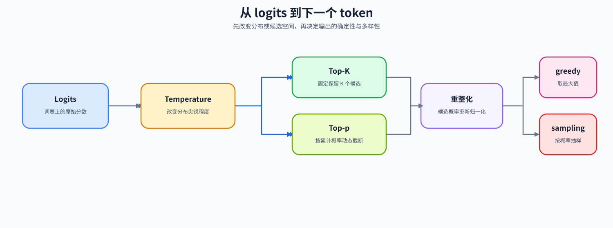
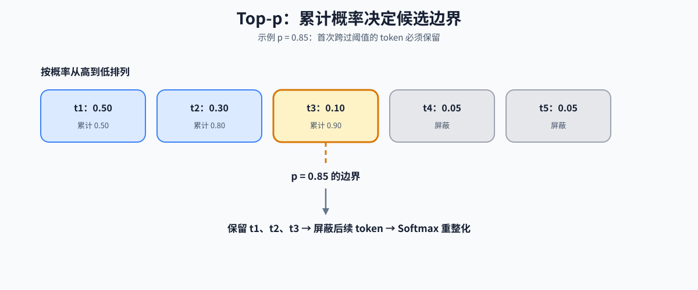

# 21. Decoding Strategies | 解码策略
**难度：** Medium | **环境：** CPU-first | **标签：** `推理优化`, `解码`, `Sampling` | **目标人群：** 推理优化学习者

> 🚀 **云端运行环境**
>
> 本章节的实战代码可以点击以下链接在免费 GPU 算力平台上直接运行：
>
> [](https://colab.research.google.com/github/datawhalechina/llm-algo-leetcode/blob/main/02_PyTorch_Algorithms/21_Decoding_Strategies.ipynb)
> [](https://modelscope.cn/my/mynotebook) *(国内推荐：魔搭社区免费实例)*


---

## 本节导读

模型生成下一个 token 时，会先为整张词表打分，再从候选中选择一个结果。永远选择最高分比较稳定，但可能缺少变化；完全随机又难以控制。解码策略要解决的，就是如何在确定性和多样性之间建立可调节的选择规则。

阅读时先把 greedy 作为确定性基线，再观察 temperature 如何改变分布形状、top-k / top-p 如何改变候选集合，最后比较这些变化对候选数量、熵和随机性的影响。CPU-first 路径帮助建立选择规则的直觉；真实模型质量和服务性能进入后续项目 benchmark。

**关键词：** `top-k`, `top-p`, `temperature`

---

## 前置阅读

**导语：** 先理解模型如何输出词表 logits，再比较不同解码规则怎样改变候选集合和采样结果。
- [04. Attention MHA GQA | 注意力机制：MHA、MQA、GQA](./04_Attention_MHA_GQA.md)
- [05. LLaMA3 Block Tutorial | LLaMA3 Block 实现](./05_LLaMA3_Block_Tutorial.md)

---

### Step 1: 解码问题与候选空间

> **大模型的最后一步输出什么？**
> 模型对下一个词的预测是一串未经归一化的得分，称为 `Logits`（形状为 `[vocab_size]`，比如 32000 个数字）。
> 
> **三种常用的截断与平滑策略：**
> 1. **Temperature ($T$)**：在 Softmax 之前，将 logits 除以 $T$。$T<1$ 通常使分布更尖锐，$T>1$ 通常使分布更平缓；它不改变 logits 的排序。
> 2. **Top-K 截断**：保留得分排名靠前的候选，其余位置置为 $-\infty$；本节会额外观察相同分数（ties）时的阈值语义。
> 3. **Top-p (Nucleus) 核采样**：按概率从大到小排序，保留累计概率首次达到 $p$ 的最小候选集合，后续候选被屏蔽。


这三种策略本质上都是在修改 logits 的分布形状，下一步看它们如何串成完整的解码流水线。

先保留一个最小基线：`greedy` 直接选择最大 logits，对同一组 logits 不引入随机性；`sampling` 才会在截断和重整化后按概率抽样。后面比较 temperature、Top-K 和 Top-p 时，都可以先和 greedy 对照候选数量、熵以及输出稳定性。

| 路径 | 选择规则 | 适合观察的现象 |
|---|---|---|
| greedy | 取最大 logits | 确定性和重复倾向 |
| sampling | 从重整化概率中抽样 | 多样性和随机性 |
| Top-K / Top-p sampling | 先缩小候选集合，再抽样 | 截断规则如何改变候选空间 |



### Step 2: 候选处理顺序与观察量
把最后一个位置的 logits 依次处理，再进入确定性选择或概率采样。本节先固定每个阶段的输入、输出和观察重点；实际实现时，选择阶段可以使用确定性取最大值或按概率采样。本节采用 Temperature → Top-K → Top-p → Softmax → 选择的顺序；顺序会影响候选集合，实际 backend 可能有不同约定。`temperature` 很小时仍然可能采样到其他 token，不能把它当作 greedy。

| 阶段 | 输入 | 输出 / 作用 | 观察重点 |
|---|---|---|---|
| Temperature | 原始 logits、温度 $T$ | 缩放后的 logits | 排序不变，分布尖锐程度改变 |
| Top-K | 缩放后的 logits、$K$ | 只保留前 K 个候选 | 固定数量；相同分数可能保留超过 K 个 |
| Top-p | 候选 logits、$p$ | 保留累计概率达到阈值的最小集合 | 必须保留首次达到阈值的边界 token |
| 选择 | 重整化后的概率或 logits | 一个下一个 token | greedy 取最大值，sampling 按概率选择 |

### Step 3: Top-p 边界与概率重整化

关键判断是：Top-p 如何保留达到阈值的边界 token？
假设词表只有 5 个词，排序后的概率分别是：`[0.5, 0.3, 0.1, 0.05, 0.05]`。阈值 $p = 0.85$。
1. 计算累加和 (Cumulative Sum, `cumsum`)：`[0.5, 0.8, 0.9, 0.95, 1.0]`
2. 找到累计概率**首次达到或超过 0.85** 的位置（这里是第三个 token）
3. 保留这个边界 token，把它后面的 token 对应 logits 设为 `-inf`
4. 对剩下的有效 Logits 重新执行一次 `Softmax` 进行概率归一化。

前面的步骤修改候选范围，Softmax 和最终选择才决定输出 token。


### Step 4: 实现解码策略与最小生成循环

**要求**：请依次补全 `apply_temperature`、`apply_top_k` 和 `apply_top_p`，组合采样函数，并补充一个最小自回归循环。题目区需要处理非法参数、batch 维度和随机种子；不要把 CPU 合成 logits 的结果写成真实模型质量或吞吐结论。


```python
import torch
import torch.nn.functional as F
```


```python
def apply_temperature(logits: torch.Tensor, temperature: float) -> torch.Tensor:
    """在 Softmax 前缩放 logits。

    参数：
        logits: 最后一维为词表维度的分数张量，支持单样本或 batch。
        temperature: 有限正数；越小通常使分布更尖锐。
    """
    # ==========================================
    # TODO 1: 检查 temperature 并完成缩放
    # 输入 logits 形状为 [..., vocab]；输出保持相同形状，只改变分数尺度。
    # ==========================================
    # if temperature <= 0 or not torch.isfinite(torch.tensor(temperature)):
    #     raise ValueError('temperature 必须是有限正数')
    # temp = ???
    return logits / temp

def apply_top_k(logits: torch.Tensor, top_k: int) -> torch.Tensor:
    """按第 K 大值筛选 logits，保留 ties 是本实现的明确语义。

    `top_k=0` 或不小于词表大小时保持输入不变。
    """
    if top_k is None:
        return logits
    if not isinstance(top_k, int) or isinstance(top_k, bool) or top_k < 0:
        raise ValueError('top_k 必须为非负整数')
    if top_k == 0 or top_k >= logits.size(-1):
        return logits
        
    # ==========================================
    # TODO 2: Top-K 截断
    # 输出仍为 [..., vocab]；只把低于第 K 大分数的位置改为 -inf，ties 按阈值语义保留。
    # ==========================================
    # filter_value = ???
    # kth_values = ???  # 形状保留最后一维，便于 batch 广播
    # logits = ???      # 小于阈值的位置置为 filter_value
    return logits

def apply_top_p(logits: torch.Tensor, top_p: float) -> torch.Tensor:
    """按累计概率保留最小候选集合，并恢复原始词表顺序。

    边界 token 会被保留；因此这里的 top-p 是“首次达到阈值”的语义。
    """
    if top_p is None or top_p == 1.0:
        return logits
    if not 0.0 < top_p < 1.0:
        raise ValueError('top_p 必须满足 0 < top_p <= 1')
        
    # 1. 首先需要将 logits 从大到小排序
    # 注意我们需要记住原始的索引 (indices)，因为截断完了还要把它复原回原来的位置！
    sorted_logits, sorted_indices = torch.sort(logits, descending=True)
    
    # 2. 对排序后的 logits 做 Softmax，再计算累加概率
    cumulative_probs = torch.cumsum(F.softmax(sorted_logits, dim=-1), dim=-1)
    
    # ==========================================
    # TODO 3: Top-p 核心逻辑
    # 先在排序空间确定边界，再恢复原词表顺序；输出形状必须与 logits 一致。
    # ==========================================
    # sorted_indices_to_remove = ???  # 超过边界的后续 token
    # sorted_indices_to_remove[..., 1:] = ???
    # sorted_indices_to_remove[..., 0] = ???
    # sorted_logits[sorted_indices_to_remove] = ???
    # restored_logits = ???
    return restored_logits

def decode_next_token(logits: torch.Tensor, temperature=0.7, top_k=50, top_p=0.9, do_sample=True, generator=None):
    """完成一次候选过滤和 token 选择，支持 greedy 与可复现 sampling。

    输入可以是 `[vocab]` 或 `[batch, vocab]`；输出保留最后一维并返回 `[batch, 1]`。
    """
    # 1. 调温
    logits = apply_temperature(logits, temperature)
    
    # 2. Top-K 截断 (通常先 K 后 p)
    logits = apply_top_k(logits, top_k)
    
    # 3. Top-p 截断
    logits = apply_top_p(logits, top_p)
    
    # 4. 概率重归一化
    probs = F.softmax(logits, dim=-1)
    
    # 5. greedy 直接取最大值；sampling 才使用 multinomial
    if not do_sample:
        return torch.argmax(logits, dim=-1, keepdim=True)
    next_token = torch.multinomial(probs, num_samples=1, generator=generator)
    
    return next_token

def autoregressive_decode(prompt_ids, logits_fn, max_new_tokens, **decode_kwargs):
    """用 logits_fn 演示逐 token 解码；不代表真实模型性能。"""
    tokens = prompt_ids.clone()
    for _ in range(max_new_tokens):
        step_logits = logits_fn(tokens)
        if step_logits.dim() == 3:
            step_logits = step_logits[:, -1, :]
        next_token = decode_next_token(step_logits, **decode_kwargs)
        tokens = torch.cat([tokens, next_token], dim=-1)
    return tokens

```


```python
# 运行此单元格以测试你的实现
def test_decoding():
    try:
        # 为了保证可重复性
        torch.manual_seed(42)
        vocab_size = 10
        # 伪造一组 Logits: [0.1, 2.3, 0.4, 1.2, -0.5, 4.0, 3.1, 0.0, 1.1, -1.0]
        # 最大的两个: index 5 (4.0), index 6 (3.1)
        logits = torch.tensor([[0.1, 2.3, 0.4, 1.2, -0.5, 4.0, 3.1, 0.0, 1.1, -1.0]])
        
        print("原始 Logits (前10个单词):", logits.squeeze().tolist())
        
        # 1. 测试 Temperature
        t_logits = apply_temperature(logits.clone(), 0.5)
        # 温度 0.5 应该会让差异翻倍
        assert torch.allclose(t_logits[0, 5] - t_logits[0, 6], (logits[0, 5] - logits[0, 6]) * 2), "温度调节错误！"
        print("✅ Temperature 温度调节通过！")
        
        # 2. 测试 Top-K
        k_logits = apply_top_k(logits.clone(), 3)
        # 只保留最大的三个：5, 6, 1
        valid_count = (k_logits != float('-inf')).sum().item()
        assert valid_count == 3, f"Top-K 截断没有正确执行，保留了 {valid_count} 个值"
        print("✅ Top-K 暴力截断通过！")
        
        # 3. 测试 Top-p
        # 原始概率: [0.01, 0.10, 0.01, 0.03, 0.00, 0.54, 0.22, 0.01, 0.03, 0.00]
        # 降序: 0.54 (idx 5), 0.22 (idx 6), 0.10 (idx 1) ...
        # 累加和: 0.54, 0.76, 0.86
        # 所以只有 idx 5, 6, 1 会被保留
        p_logits = apply_top_p(logits.clone(), 0.8)
        valid_count = (p_logits != float('-inf')).sum().item()
        assert valid_count == 3, f"Top-p 核采样截断没算准，保留了 {valid_count} 个值"
        print("✅ Top-p (Nucleus) 核采样动态截断通过！")

        # 边界：Top-k 采用阈值语义，因此 ties 可能保留超过 k 个候选
        tied = torch.tensor([[2.0, 2.0, 2.0, 1.0]])
        tied_result = apply_top_k(tied, 2)
        assert torch.isfinite(tied_result).sum().item() == 3, "Top-k ties 的阈值语义不一致"
        for invalid_p in (0.0, 1.1):
            try:
                apply_top_p(logits, invalid_p)
                raise AssertionError('非法 top_p 未被拒绝')
            except ValueError:
                pass
        
        # 4. 测试完整管线
        next_token = decode_next_token(logits.clone(), temperature=0.7, top_k=50, top_p=0.9)
        assert next_token.shape == (1, 1), "解码的词张量维度不对"

        # 5. greedy、参数边界与最小自回归循环
        greedy = decode_next_token(logits, temperature=1.0, top_k=0, top_p=1.0, do_sample=False)
        assert greedy.item() == 5, "greedy 应选择最大 logits 的索引"
        assert torch.equal(torch.argsort(logits, dim=-1), torch.argsort(t_logits, dim=-1)), "temperature 不应改变排序"
        try:
            apply_temperature(logits, 0.0)
            raise AssertionError('非法 temperature 未被拒绝')
        except ValueError:
            pass

        prompt = torch.tensor([[1, 2]])
        def fake_logits(tokens):
            output = torch.zeros(tokens.size(0), tokens.size(1), vocab_size)
            output[..., 3] = 2.0
            return output
        generated = autoregressive_decode(prompt, fake_logits, max_new_tokens=3, temperature=1.0, top_k=0, top_p=1.0, do_sample=False)
        assert generated.shape == (1, 5) and torch.equal(generated[0, -3:], torch.tensor([3, 3, 3])), "自回归循环结果错误"

        # 6. batch 输入和随机种子：检查张量接口与 sampling 可复现性
        batch_logits = logits.repeat(2, 1)
        assert apply_top_k(batch_logits, 3).shape == batch_logits.shape
        assert apply_top_p(batch_logits, 0.8).shape == batch_logits.shape
        g1 = torch.Generator().manual_seed(7)
        g2 = torch.Generator().manual_seed(7)
        sample_1 = decode_next_token(logits, generator=g1)
        sample_2 = decode_next_token(logits, generator=g2)
        assert torch.equal(sample_1, sample_2), "相同随机种子应得到相同采样结果"

        # 7. 用候选数和熵观察策略差异；这不是质量或吞吐结论
        for name, kwargs in {
            'greedy': {'temperature': 1.0, 'top_k': 0, 'top_p': 1.0},
            'top_k': {'temperature': 1.0, 'top_k': 3, 'top_p': 1.0},
            'top_p': {'temperature': 1.0, 'top_k': 0, 'top_p': 0.8},
        }.items():
            filtered = apply_temperature(logits.clone(), kwargs['temperature'])
            filtered = apply_top_k(filtered, kwargs['top_k'])
            filtered = apply_top_p(filtered, kwargs['top_p'])
            probs = F.softmax(filtered, dim=-1)
            entropy = -(probs * probs.clamp_min(1e-12).log()).sum(dim=-1)
            print(f'{name}: candidates={(torch.isfinite(filtered)).sum().item()}, entropy={entropy.item():.4f}')
        print(f"\n✅ All Tests Passed! 解码策略实现通过测试。本次采样的下一个 token ID 是: {next_token.item()}")
        
    except NotImplementedError:
        print("请先完成 TODO 部分的代码！")
        raise
    except (AttributeError, NameError, TypeError, ValueError, AssertionError, RuntimeError) as e:
        if isinstance(e, AttributeError):
            print("代码未完成，无法找到必要的属性")
        elif isinstance(e, NameError):
            print("代码可能未完成，导致了变量未定义")
        elif isinstance(e, TypeError):
            print("代码可能未完成，导致了操作错误")
        elif isinstance(e, ValueError):
            print("代码可能未完成，导致了张量维度错误")
        elif isinstance(e, RuntimeError):
            print("代码可能未完成，导致了运行时错误")
        else:
            print("代码可能未完成，导致了断言失败")
        raise NotImplementedError("请先完成 TODO 部分的代码！") from e
    except Exception as e:
        print(f"❌ 测试失败: {e}")
        raise

test_decoding()

```

---

🛑 **STOP HERE** 🛑
<br><br><br><br><br><br><br><br><br><br>
> 请先尝试自己完成代码并跑通测试。<br>
> 如果你正在 Colab 中运行，并且遇到困难没有思路，可以向下滚动查看参考答案。
<br><br><br><br><br><br><br><br><br><br>

---
## 参考代码与解析

### 代码

```python
def apply_temperature(logits: torch.Tensor, temperature: float) -> torch.Tensor:
    """在 Softmax 前缩放 logits；temperature 必须是有限正数。"""
    # TODO 1: 校验 temperature，不要用静默截断替代非法参数处理
    if not torch.isfinite(torch.tensor(temperature)) or temperature <= 0:
        raise ValueError('temperature 必须是有限正数')
    temp = temperature
    return logits / temp

def apply_top_k(logits: torch.Tensor, top_k: int) -> torch.Tensor:
    """
    Top-K 截断；按第 K 大值筛选，分数相同时可能保留多个 token。
    """
    if top_k is None:
        return logits
    if not isinstance(top_k, int) or isinstance(top_k, bool) or top_k < 0:
        raise ValueError('top_k 必须为非负整数')
    if top_k == 0 or top_k >= logits.size(-1):
        return logits
        
    # TODO 2: 实现 Top-K 截断
    filter_value = float('-inf')
    
    # 找到第 K 大的值
    kth_values, _ = torch.topk(logits, top_k, dim=-1, largest=True, sorted=True)
    kth_values = kth_values[..., -1:] # 取最后一个（第 K 大的值）
    
    # 将小于第 K 大值的位置设为 -inf
    logits = torch.where(logits < kth_values, torch.tensor(filter_value, device=logits.device), logits)
    return logits

def apply_top_p(logits: torch.Tensor, top_p: float) -> torch.Tensor:
    """
    Top-p 截断，保留累计概率首次达到阈值的最小候选集合。
    """
    if top_p is None or top_p == 1.0:
        return logits
    if not 0.0 < top_p < 1.0:
        raise ValueError('top_p 必须满足 0 < top_p <= 1')
        
    # 1. 首先需要将 logits 从大到小排序
    sorted_logits, sorted_indices = torch.sort(logits, descending=True)
    
    # 2. 对排序后的概率计算累加和
    cumulative_probs = torch.cumsum(F.softmax(sorted_logits, dim=-1), dim=-1)
    
    # TODO 3: 实现 Top-P 核心逻辑
    # 找到需要丢弃的掩码，并向右平移以保留边界 token
    sorted_indices_to_remove = cumulative_probs > top_p
    
    # 向右平移掩码以保留第一个达到阈值的 token
    sorted_indices_to_remove[..., 1:] = sorted_indices_to_remove[..., :-1].clone()
    sorted_indices_to_remove[..., 0] = 0  # 确保无论如何最高概率的 token 不被丢弃
    
    # 将需要剔除的 sorted_logits 设为极小值
    sorted_logits[sorted_indices_to_remove] = float('-inf')
    
    # 将排序后的 logits 恢复到原始顺序
    restored_logits = torch.zeros_like(logits).scatter_(
        dim=-1, index=sorted_indices, src=sorted_logits
    )
    
    return restored_logits

def decode_next_token(logits: torch.Tensor, temperature=0.7, top_k=50, top_p=0.9, do_sample=True, generator=None):
    """应用策略并选择一个 token；do_sample=False 时使用 greedy。"""
    # 1. 调温
    logits = apply_temperature(logits, temperature)
    
    # 2. Top-K 截断 (通常先 K 后 p)
    logits = apply_top_k(logits, top_k)
    
    # 3. Top-p 截断
    logits = apply_top_p(logits, top_p)
    
    # 4. 概率重归一化
    probs = F.softmax(logits, dim=-1)
    
    # 5. greedy 与 sampling 是两条不同路径
    if not do_sample:
        return torch.argmax(logits, dim=-1, keepdim=True)
    next_token = torch.multinomial(probs, num_samples=1, generator=generator)
    
    return next_token

def autoregressive_decode(prompt_ids, logits_fn, max_new_tokens, **decode_kwargs):
    """用一个 logits_fn 演示逐 token 解码；不代表真实模型性能。"""
    tokens = prompt_ids.clone()
    for _ in range(max_new_tokens):
        step_logits = logits_fn(tokens)
        if step_logits.dim() == 3:
            step_logits = step_logits[:, -1, :]
        next_token = decode_next_token(step_logits, **decode_kwargs)
        tokens = torch.cat([tokens, next_token], dim=-1)
    return tokens
```

### 解析

**1. TODO 1: Temperature 温度调节**
- **实现方式**：先验证 `temperature` 是有限正数，再执行 `logits / temperature`。
- **关键点**：温度改变概率分布的尖锐程度，但不改变 logits 的排序；它很小时仍不是严格 greedy。
- **边界**：非法温度应报错，greedy 由 `do_sample=False` 单独表达。

**2. TODO 2: Top-K 截断**
- **实现方式**：`kth_values = torch.topk(logits, top_k)[0][..., -1:]`，`logits = torch.where(logits < kth_values, -inf, logits)`
- **关键点**：只保留分数不低于第 K 大值的候选，其余 logits 设为负无穷。
- **技术细节**：使用 `torch.topk` 找到阈值，再用 `torch.where` 广播到 batch 维；分数相同时可能保留超过 K 个候选。

**3. TODO 3: Top-p (Nucleus) 核采样**
- **实现方式**：对 logits 降序排序，计算累积概率，屏蔽首次达到阈值之后的候选，最后用 `scatter_` 恢复原始顺序。
- **关键点**：动态截断——根据概率分布的形状自动决定保留多少个词
- **技术细节**：
  - Top-p 会先用 Softmax 计算累计概率，但函数最终返回的是过滤后的 logits；最终采样前还会重新 Softmax。
  - 向右平移掩码（`sorted_indices_to_remove[..., 1:] = sorted_indices_to_remove[..., :-1].clone()`）确保保留边界 token
  - 使用 `scatter_` 将排序后的 logits 恢复到原始索引顺序

**工程边界与延伸**
- 本实现采用 Temperature → Top-K → Top-p；换序会改变候选集合，生产 backend 需以实际实现为准。
- 使用 `-float('inf')` 保持张量形状不变；Softmax 后候选概率会重新归一化。
- `autoregressive_decode` 只验证逐 token 控制流和形状，不包含真实模型、KV Cache 或 backend 优化。
- 候选数、熵、重复率和采样耗时可以作为 CPU 对比指标；真实生成质量、TTFT、TPOT 和吞吐需要后续模型/服务 benchmark。
## 相关阅读

完成本节的候选过滤和采样实现后，可以沿着“采样方法 → 真实生成接口 → 解码服务策略”继续阅读。

- [The Curious Case of Neural Text Degeneration：Nucleus Sampling 原论文](https://arxiv.org/abs/1904.09751)
- [Attention Is All You Need 原论文](https://arxiv.org/abs/1706.03762)
- [Transformers 文本生成策略文档](https://huggingface.co/docs/transformers/main/en/main_classes/text_generation)
- [vLLM SamplingParams 文档](https://docs.vllm.ai/en/latest/api/vllm/sampling_params.html)
- [Part 02 · 23 投机解码](./23_Speculative_Decoding.md)
- [Part 02 · 35 多 Token 解码](./35_Multi_Token_Decoding.md)
- [Part 02 · 36 解码调度](./36_Decode_Scheduling.md)
