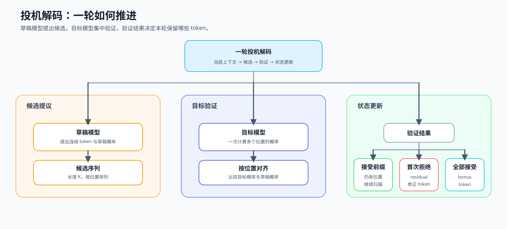
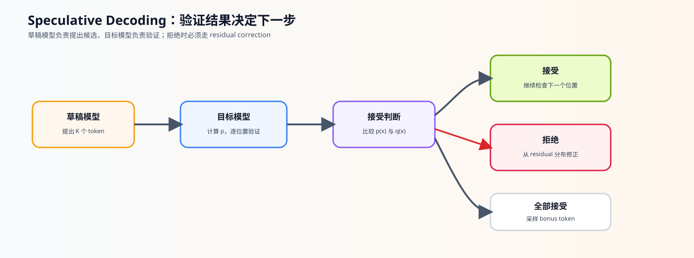

# 23. Speculative Decoding | 投机解码
**难度：** Hard | **环境：** CPU-first | **标签：** `推理优化`, `解码`, `Speculative Decoding` | **目标人群：** 推理优化学习者

> 🚀 **云端运行环境**
>
> 本章节的实战代码可以点击以下链接在免费 GPU 算力平台上直接运行：
>
> [](https://colab.research.google.com/github/datawhalechina/llm-algo-leetcode/blob/main/02_PyTorch_Algorithms/23_Speculative_Decoding.ipynb)
> [](https://modelscope.cn/my/mynotebook) *(国内推荐：魔搭社区免费实例)*


---

## 本节导读

自回归生成的时间压力，常常来自目标模型必须一个 token 一个 token 地推进。前面先用 KV Cache 建立了单步生成的状态视角，本节进一步观察另一种思路：让草稿模型先提出多个候选，再由目标模型集中验证。

本节沿着“提议 → 验证 → 接受或修正”的顺序学习投机解码：先理解接受概率为什么需要 residual correction，再看全部接受时为什么还要追加 bonus token。核心判断是，在保持目标模型分布的前提下，是否能够减少目标模型的逐 token 推进。

**关键词：** `speculative decoding`, `draft model`, `verification`

---
## 前置阅读

**导语：** 先掌握单步解码和 KV Cache 的状态变化，再理解草稿模型如何提出候选、目标模型如何批量验证。
- [21. Decoding Strategies | 解码策略](./21_Decoding_Strategies.md)
- [P1: 11. KV Cache and Memory Growth | KV Cache 与显存增长](../01_Hardware_Math_and_Systems/11_KV_Cache_and_Memory_Growth.md)

---

### Step 1: 草稿提议与目标验证

投机解码让草稿模型（draft model）先提出一段 token，再由目标模型（target model）集中验证。草稿模型负责快速提议，目标模型负责最终确认；学习重点是理解两者如何协作，减少目标模型逐 token 推进的次数，同时保持目标分布的生成语义。

| 参与者 | 负责什么 | 产生什么 |
|---|---|---|
| 草稿模型 | 快速提出连续候选 | `draft_tokens` 与 `draft_probs` |
| 目标模型 | 在对应位置验证候选 | `target_probs`，包含验证位置和 bonus 位置 |
| 单轮流程 | 根据验证结果决定推进长度 | 接受的 token、修正 token 或 bonus token |



### Step 2: 验证位置与概率输入

一轮验证需要把草稿 token、草稿概率和目标概率按位置对齐。`K` 表示草稿 token 数，目标模型需要提供前 `K` 行验证概率，并额外提供一行用于全部接受时的 bonus token。

| 输入 / 状态 | 形状或内容 | 用途 |
|---|---|---|
| `draft_probs` | `[K, vocab]` | 草稿模型在 K 个位置上的概率分布 |
| `target_probs` | `[K+1, vocab]` | 前 K 行验证草稿，最后一行提供 bonus token |
| `draft_tokens` | 长度为 K 的 token 序列 | 指出每个位置实际提出的候选 |
| 输入检查 | 非负、行归一化、长度和词表维度 | 防止概率与位置错位后继续计算 |

### Step 3: 接受、修正与生成推进
按草稿位置从前到后处理：接受就继续验证，拒绝就从 residual distribution 采样修正 token 并结束本轮；全部 `K` 个草稿都接受时，再从目标模型的 bonus 位置采样一个 token。接受概率为：

$$\alpha(x) = \min\left(1, \frac{p(x)}{q(x)}\right)$$

CPU 题目区验证概率归一化、接受/拒绝、residual correction、bonus token 和控制流；真实 acceptance rate、目标模型 forward 次数、TTFT、TPOT 和吞吐由 68 的匹配 backend 实验验证。

| 结果 | 接受规则或使用的分布 | 本轮推进 |
|---|---|---|
| 接受 | `p(x) >= q(x)` 时必然接受；否则按 `p(x) / q(x)` 接受 | 进入下一个验证位置 |
| 拒绝 | 对 `max(target - draft, 0)` 归一化后采样 residual correction | 输出修正 token，结束本轮 |
| 全部接受 | 所有草稿 token 通过验证，使用最后一行 `target_probs` | 追加 bonus token |



### Step 4: 实现并验证单轮投机解码
本 Step 将前面的流程实现为 `speculative_decode_step`。题目区按输入检查、逐位置接受、拒绝修正和全接受 bonus 四个阶段返回结果；返回值至少包含最终 token、接受数量、是否拒绝和检查到的 target 位置。

| 实现阶段 | 主要任务 | 验证重点 |
|---|---|---|
| 输入检查 | 检查概率形状、归一化和 token 位置 | 非法输入明确报错 |
| 接受判断 | 按位置计算接受概率并采样 | 接受数量和停止位置正确 |
| 修正与 bonus | 分别处理拒绝和全接受 | residual 与 bonus 分支不混淆 |


```python
import torch
```


```python
def speculative_decode_step(draft_probs, target_probs, draft_tokens, generator=None):
    """
    验证 K 个草稿，并在拒绝或全接受时生成修正 token。
    
    Args:
        draft_probs: 草稿模型在 K 个位置上的概率分布, shape [K, vocab_size]
        target_probs: 目标模型在 K 个验证位置及 1 个 bonus 位置的概率分布, shape [K+1, vocab_size]
        draft_tokens: 草稿模型实际提出的 K 个 token_id, shape [K]
        
    Returns:
        dict: 包含最终 token 序列、接受数量、拒绝状态和检查位置。
    """
    if draft_probs.dim() != 2 or target_probs.dim() != 2:
        raise ValueError('概率张量必须是二维 [K, vocab]')
    K, vocab_size = draft_probs.shape
    if target_probs.shape != (K + 1, vocab_size) or len(draft_tokens) != K:
        raise ValueError('draft/target/token 的长度或词表维度不匹配')
    if not (torch.isfinite(draft_probs).all() and torch.isfinite(target_probs).all()):
        raise ValueError('概率分布不能包含 NaN 或 Inf')
    # TODO 1: 检查概率非负，并验证每一行和约等于 1
    # 提示：归一化检查使用与输入相同 device / dtype 的全 1 张量。
    # if ...:
    #     raise ValueError('输入必须是归一化概率分布')
    accepted_tokens = []
    
    for i in range(K):
        token_id = draft_tokens[i]
        
        if not 0 <= int(token_id) < vocab_size:
            raise ValueError('draft token id 超出词表范围')
        p = target_probs[i, token_id]
        q = draft_probs[i, token_id]
        
        # ==========================================
        # TODO 2: 计算 alpha，并据此决定当前候选是否接受
        # 提示：alpha = min(1, p / q)；q=0 时先处理除零边界。
        # 接受后追加当前 token 并继续；拒绝后进入 TODO 3。
        # r = torch.rand((), generator=generator).item()
        # if ...:
        #     accepted_tokens.append(int(token_id))
        #     continue
        # ==========================================
        # TODO 3: 拒绝时从 residual=max(p-q, 0) 归一化后采样
        # residual = ???
        # residual_mass = ???  # 先确认存在可采样的剩余概率质量
        # if residual_mass <= 0:
        #     raise ValueError('residual 概率质量必须大于 0')
        # correction = torch.multinomial(???, 1, generator=generator).item()
        # return {'tokens': accepted_tokens + [correction], 'accepted_count': len(accepted_tokens), 'rejected': True, 'target_positions_checked': i + 1}
        pass
    
    # TODO 4: 全部接受后，从 target_probs[K] 采样 bonus token
    # bonus = torch.multinomial(???, 1, generator=generator).item()
    # return {'tokens': accepted_tokens + [bonus], 'accepted_count': K, 'rejected': False, 'target_positions_checked': K}


```


```python
def test_speculative_decoding():
    try:
        torch.manual_seed(42)
        vocab_size = 5
        K = 3
        
        # 模拟生成
        draft_tokens = [0, 1, 2]
        draft_probs = torch.zeros(K, vocab_size)
        target_probs = torch.zeros(K + 1, vocab_size)
        draft_probs[0, 0] = 1.0; target_probs[0, 0] = 1.0  # 必接受
        draft_probs[1, 1] = 1.0; target_probs[1, 3] = 1.0  # 必拒绝，residual 采样 3
        draft_probs[2, 2] = 1.0; target_probs[2, 2] = 1.0
        target_probs[3, 4] = 1.0  # 全部接受时的 bonus token
        
        result = speculative_decode_step(draft_probs, target_probs, draft_tokens)
        assert result['tokens'] == [0, 3] and result['accepted_count'] == 1 and result['rejected']
        all_accepted = speculative_decode_step(target_probs[:K], target_probs, [0, 3, 2])
        assert all_accepted['tokens'] == [0, 3, 2, 4] and not all_accepted['rejected']

        # q=0 且 p>0：候选仍可直接接受，避免除零后错误拒绝
        zero_q_draft = torch.tensor([[0.0, 1.0, 0.0]])
        zero_q_target = torch.tensor([[0.5, 0.5, 0.0], [0.0, 1.0, 0.0]])
        zero_q = speculative_decode_step(zero_q_draft, zero_q_target, [0])
        assert zero_q['accepted_count'] == 1 and not zero_q['rejected']

        # 非法概率必须在进入接受逻辑前被拒绝
        invalid = zero_q_draft.clone()
        invalid[0, 0] = -0.1
        try:
            speculative_decode_step(invalid, zero_q_target, [0])
        except ValueError:
            pass
        else:
            raise AssertionError('负概率应明确被拒绝')

        # 草稿提出了 q=0 且目标也为 0 的不可能 token，residual 没有可采样质量
        zero_residual_draft = torch.tensor([[1.0, 0.0]])
        zero_residual_target = torch.tensor([[1.0, 0.0], [1.0, 0.0]])
        try:
            speculative_decode_step(zero_residual_draft, zero_residual_target, [1])
        except ValueError:
            pass
        else:
            raise AssertionError('residual 概率质量为 0 时应明确报错')
        print("✅ 测试通过！接受、residual correction 和 bonus token 均通过。")
        
    except NotImplementedError:
        print("请先完成 TODO 代码。")
        raise
    except (AttributeError, NameError, TypeError, ValueError, AssertionError, RuntimeError) as e:
        if isinstance(e, AttributeError):
            print("代码未完成，无法找到必要的属性")
        elif isinstance(e, NameError):
            print("代码可能未完成，导致了变量未定义")
        elif isinstance(e, TypeError):
            print("代码可能未完成，导致了操作错误")
        elif isinstance(e, ValueError):
            print("代码可能未完成，导致了张量维度错误")
        elif isinstance(e, AssertionError):
            print("代码可能未完成，导致了断言失败")
        elif isinstance(e, RuntimeError):
            print("代码可能未完成，导致了运行时错误")
        else:
            print("代码可能未完成，导致了断言失败")
        raise NotImplementedError("请先完成 TODO 代码！") from e
    except Exception as e:
        print(f"❌ 测试失败: {e}")
        raise

test_speculative_decoding()

```

---

🛑 **STOP HERE** 🛑
<br><br><br><br><br><br><br><br><br><br>
> 请先尝试自己完成代码并跑通测试。<br>
> 如果你正在 Colab 中运行，并且遇到困难没有思路，可以向下滚动查看参考答案。
<br><br><br><br><br><br><br><br><br><br>

---

## 参考代码与解析

### 代码

```python
def speculative_decode_step(draft_probs, target_probs, draft_tokens, generator=None):
    """完成一次 speculative decoding step。

    `target_probs[:K]` 验证草稿，`target_probs[K]` 生成 bonus token。
    """
    if draft_probs.dim() != 2 or target_probs.dim() != 2:
        raise ValueError('概率张量必须是二维 [K, vocab]')
    K, vocab_size = draft_probs.shape
    if target_probs.shape != (K + 1, vocab_size) or len(draft_tokens) != K:
        raise ValueError('draft/target/token 的长度或词表维度不匹配')
    if not (torch.isfinite(draft_probs).all() and torch.isfinite(target_probs).all()):
        raise ValueError('概率分布不能包含 NaN 或 Inf')
    # TODO 1：检查概率非负，并验证每一行和约等于 1（参考实现）
    if (draft_probs < 0).any() or (target_probs < 0).any():
        raise ValueError('概率分布不能包含负数')
    ones_draft = torch.ones(K, device=draft_probs.device, dtype=draft_probs.dtype)
    ones_target = torch.ones(K + 1, device=target_probs.device, dtype=target_probs.dtype)
    if not (torch.allclose(draft_probs.sum(-1), ones_draft, atol=1e-5) and torch.allclose(target_probs.sum(-1), ones_target, atol=1e-5)):
        raise ValueError('输入必须是归一化概率分布')
    accepted_tokens = []
    
    for i in range(K):
        token_id = draft_tokens[i]
        if not 0 <= int(token_id) < vocab_size:
            raise ValueError('draft token id 超出词表范围')
        p = target_probs[i, token_id].item()
        q = draft_probs[i, token_id].item()
        # TODO 2: 处理 q=0，并按 alpha 决定接受或拒绝
        # 提示：alpha = min(1, p / q)；接受时追加 token，拒绝时保留
        # accepted_tokens 作为前缀并进入 TODO 3。
        alpha = 1.0 if q == 0.0 and p > 0.0 else (min(1.0, p / q) if q > 0.0 else 0.0)
        r = torch.rand((), generator=generator).item()
        if r < alpha:
            accepted_tokens.append(int(token_id))
            continue
        # TODO 3: 拒绝时从 residual=max(p-q, 0) 归一化后采样
        residual = torch.clamp(target_probs[i] - draft_probs[i], min=0)
        residual_mass = residual.sum()
        if residual_mass <= 0:
            raise ValueError('residual 概率质量必须大于 0')
        residual = residual / residual_mass
        correction = torch.multinomial(residual, 1, generator=generator).item()
        return {'tokens': accepted_tokens + [correction], 'accepted_count': len(accepted_tokens), 'rejected': True, 'target_positions_checked': i + 1}
                
    # TODO 4: 全部接受后追加 target 的 bonus token
    bonus = torch.multinomial(target_probs[K], 1, generator=generator).item()
    return {'tokens': accepted_tokens + [bonus], 'accepted_count': K, 'rejected': False, 'target_positions_checked': K}


```

### 解析

**1. TODO 1：概率输入检查**
- 检查概率非负、有限，并确认每行近似归一化；这一步先保证后面的接受概率有合法输入。

**2. TODO 2：接受概率**
- 对第 $i$ 个草拟 token，读取目标分布 $p_i$ 与草稿分布 $q_i$ 在该 token 上的概率。
- $p_i \ge q_i$ 时接受概率为 1；否则为 $\min(1,p_i/q_i)$。
- 概率必须来自归一化分布，且需要显式处理 $q_i=0$。

**3. TODO 3：Residual correction**
- 第一个拒绝位置不能简单丢弃，而要计算 `clamp(target_probs[i] - draft_probs[i], min=0)`。
- 将 residual 重新归一化后采样 correction token，才能补回目标分布中未被草稿覆盖的概率质量。

**4. TODO 4：Bonus token 与一次验证**
- 如果 K 个草稿全部接受，还要从 `target_probs[K]` 采样一个 bonus token。
- 真实实现应由目标模型一次 forward 产生 K 个验证位置和一个 bonus 位置；CPU 代码中的 `[K+1, vocab]` 只是这个接口的抽象。

**4. 证据边界**
- 本节能验证接受/拒绝控制流和分布修正逻辑。
- 本节不能证明 GPU 加速、目标模型调用减少或输出质量无损；这些结论需要 68 节用真实模型和 backend 采集 acceptance rate、forward 次数、TTFT、TPOT 和吞吐。

## 相关阅读

投机解码可以继续从接受采样的论文、Transformers 接口和真实推理 backend 三个角度阅读。
- [Speculative Sampling 原论文](https://arxiv.org/abs/2302.01318)
- [Transformers Assisted Generation 文档](https://huggingface.co/docs/transformers/main/en/generation_strategies)
- [vLLM Speculative Decoding 文档](https://docs.vllm.ai/en/latest/features/spec_decode.html)
- [Part 02 · 22 vLLM 分页注意力](./22_vLLM_PagedAttention.md)
- [Part 02 · 35 多 Token 解码](./35_Multi_Token_Decoding.md)
- [Part 02 · 36 解码调度](./36_Decode_Scheduling.md)
- [Part 02 · 68 投机解码基准项目](./68_Speculative_Decoding_Benchmark.md)
