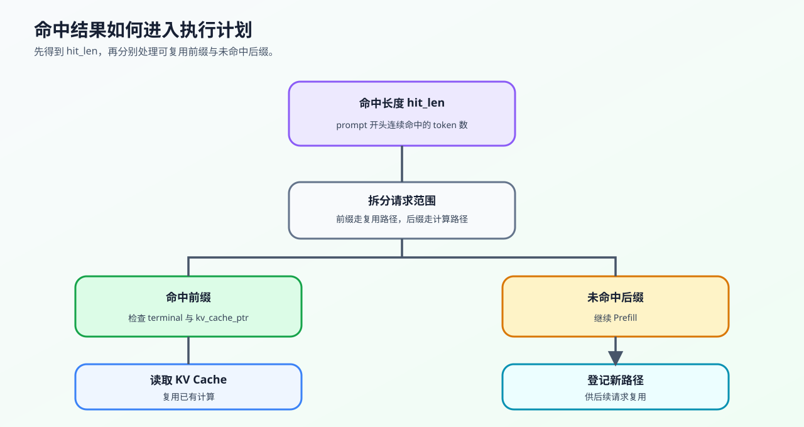

# 24. SGLang RadixAttention | SGLang 基数注意力
**难度：** Hard | **环境：** CPU-first | **标签：** `推理优化`, `KV Cache`, `RadixAttention` | **目标人群：** 推理优化学习者

> 🚀 **云端运行环境**
>
> 本章节的实战代码可以点击以下链接在免费 GPU 算力平台上直接运行：
>
> [](https://colab.research.google.com/github/datawhalechina/llm-algo-leetcode/blob/main/02_PyTorch_Algorithms/24_SGLang_RadixAttention.ipynb)
> [](https://modelscope.cn/my/mynotebook) *(国内推荐：魔搭社区免费实例)*


---

## 本节导读

真实推理服务里，请求往往不是彼此独立的：多轮对话会反复带上历史上下文，Agent 和工具调用也会共享很长的 system prompt。问题在于，如果每个请求都重新计算这些公共前缀，KV Cache 会被重复占用，首 token 延迟也会被拖高。

RadixAttention 要解决的就是前缀复用问题：把已经算过的 prompt 组织成一棵可检索的前缀树，新请求到来时先找最长公共前缀，命中的部分直接复用，没命中的后缀再交给模型计算。本节用带边压缩和分裂的简化 Python 结构模拟这件事，重点看清“共享节点”和“缓存命中长度”如何转化为少算多少 token。

**关键词：** `RadixAttention`, `prefix tree`, `multi-turn`

---
## 前置阅读

**导语：** 先理解 KV Cache 的存储和请求间的公共前缀，再观察 RadixAttention 如何组织、命中和复用这些前缀。
- [22. vLLM PagedAttention | vLLM 分页注意力](./22_vLLM_PagedAttention.md)
- [21. Decoding Strategies | 解码策略](./21_Decoding_Strategies.md)
- [P1: 11. KV Cache and Memory Growth | KV Cache 与显存增长](../01_Hardware_Math_and_Systems/11_KV_Cache_and_Memory_Growth.md)

---

### Step 1: 核心机制对比

> **vLLM PagedAttention：重点是分页与 Block 管理**
> vLLM 的核心抽象是把 KV Cache 切成可调度的 block，并通过 block table 管理请求到物理块的映射；本节不把它简化成“不能共享前缀”。

> **SGLang RadixAttention：基于基数树的共享路由**
> 系统维护一棵可共享的前缀树。树的每一条边代表一段 Token 序列，节点可以记录这段序列对应的缓存引用；公共边只在索引结构中保存一份。
> 当新请求到来时，SGLang 会用它的 Prompt 去这棵树里做**最长前缀匹配 (Longest Prefix Match)**。
> 匹配到的部分直接拿来用，没匹配到的部分再去计算并作为新分支挂在树上。
> **这里的核心不是“树有多复杂”，而是“共享前缀只登记一条路径，后续请求沿着同一路径寻找可复用状态”。** 实际是否复用同一份 KV Tensor，还要看 backend 的存储、引用计数和生命周期管理。

> **最长前缀匹配公式**
> 对于一个新的请求前缀 `prompt_tokens`，在所有已缓存路径中找到共享前缀长度最大的那一条：
> $$H = \max_j \operatorname{lcp}(prompt\_tokens, cached\_path_j)$$
> 其中 `H` 就是可以直接复用的 Hit Length。
> `H` 越大，说明当前请求命中的公共前缀越长，可直接复用的 KV Cache 越多，后续重计算越少。
> 如果 `H > 0`，说明前 `H` 个 token 的 KV Cache 可以直接复用；如果 `H = 0`，说明没有命中任何缓存路径。

> **为什么它适合多轮对话？**
> 因为多轮对话里，不同请求往往共享很长的 System Prompt 或历史上下文。Radix Tree 可以把公共前缀组织成共享路径，后续请求沿着同一路径查找；实际是否共享 KV Tensor 还取决于 backend 的 block 和生命周期管理。


### Step 2: Radix Tree 的插入与匹配

这里用 Python 数据结构观察一条前缀路径如何插入、分裂和匹配。重点是沿共享边查找最长公共前缀，再把未命中的 token 留给后续 prefill。

| 操作 | 输入 | 树的变化 | 要观察的结果 |
|---|---|---|---|
| 插入 | 新 token 路径 | 新建边，或在首个不一致位置分裂已有边 | 公共前缀只保留一条共享路径 |
| 匹配 | 新请求 prompt | 沿边逐段比较 token | 返回最长命中长度 `hit_len` |
| 拆分 | `hit_len` 与 prompt | 切出命中前缀和未命中 suffix | suffix 进入后续 prefill |

题目区要求补全插入、边分裂、最长前缀匹配和 prompt 拆分，并用两条有公共前缀的请求检查这三种状态变化。
### Step 3: 命中范围如何进入执行计划

树匹配返回的是 token 范围，执行器还要把它转换成“复用多少、重新计算多少”的计划。
| 字段 | 含义 | 下一步 |
|---|---|---|
| `hit_len` | 从 prompt 开始连续命中的 token 数 | 读取对应前缀缓存 |
| `hit_prefix` | 可复用的 token 前缀 | 跳过重复 prefill |
| `miss_suffix` | 命中位置之后的 token | 执行剩余 prefill，并登记新路径 |
| `terminal` / `kv_cache_ptr` | 标记完整缓存路径，并关联缓存句柄 | 决定命中结果是否有可复用的缓存对象 |



因此，`hit_len` 是索引层的命中指标，不等于真实显存节省量；真实收益还要结合 backend 的 KV Cache 管理和 workload 测量。
### Step 4: 验证树操作

完成插入、`match_prefix`、`split_prompt` 后，确认四件事：公共边是否共享、最长命中长度是否正确、可复用前缀是否正确拆出、没有命中的 prompt 是否能回退到完整重算。
### 提示

- `insert` 遇到部分重叠边时需要分裂旧边，不能继续把整条路径挂在根节点下。
- `match_prefix` 只允许从 prompt 开头沿完整缓存边连续命中。
- `split_prompt` 要把命中部分和未命中部分明确拆开。
- Radix Tree 这里是教学简化版，重点看最长前缀匹配逻辑，不要被树结构本身带偏。
### 测试

运行下面的测试单元，确认最长前缀命中、拆分和回退逻辑都正确。

```python
import torch
```


```python
class TreeNode:
    def __init__(self, key_tokens, terminal=False):
        self.key_tokens = list(key_tokens)  # 这条边上的 Token 序列
        self.children = []            # 子节点列表
        self.kv_cache_ptr = None      # 模拟指向物理 KV Cache 的指针
        self.terminal = terminal      # 是否有完整请求在此结束

class SimpleRadixCache:
    def __init__(self):
        # 根节点是空的
        self.root = TreeNode([])
        
    def insert(self, tokens):
        """插入路径；遇到部分重叠边时分裂旧边。"""
        tokens = list(tokens)
        if not tokens:
            raise ValueError('tokens 不能为空')
        node = self.root
        offset = 0
        while offset < len(tokens):
            # TODO 1: 找到首 token 相同的 child，并计算公共边长度
            # child = ???
            # common = ???
            if child is None:
                node.children.append(TreeNode(tokens[offset:]))
                return
            if common == len(child.key_tokens):
                node, offset = child, offset + common
                continue
            # TODO 2: 用 shared 边替换 child，并挂接旧后缀和新后缀
            # shared = ???
            # old_suffix = ???
            # child.key_tokens = ???
            # shared.children = ???
            # node.children[...] = shared
            return
        
    def _lcp_len(self, cached_tokens, prompt_tokens):
        """计算两段 token 序列的最长公共前缀长度。"""
        match_len = 0
        # ==========================================
        # TODO 3: 逐个 token 计算最长公共前缀长度
        # 提示: 遇到不相等时立刻停止
        # ==========================================
        # i = ???
        # match_len = ???
        return match_len
        
    def match_prefix(self, prompt_tokens):
        """
        在现有树中，为新的 prompt_tokens 寻找最长的匹配前缀。
        如果前 N 个 token 完全一致，说明这 N 个 token 的 KV Cache 可以直接复用！
        """
        best_match_len = 0
        node = self.root
        offset = 0
        while offset < len(prompt_tokens):
            # TODO 4: 沿共享边查找并更新已完成缓存路径的长度
            # child = ???
            # common = ???
            if child is None or common < len(child.key_tokens):
                break
            offset += common
            node = child
            # TODO 5: 只有终止节点才算完整可复用前缀
            # best_match_len = ???
        return best_match_len

    def split_prompt(self, prompt_tokens):
        """把 prompt 拆成可复用前缀和需要重算的后缀。"""
        # ==========================================
        # TODO 6: 先找命中长度，再拆出前缀和后缀
        # 提示: hit_len 是可复用的前缀长度
        # ==========================================
        # hit_len = ???
        # hit_prefix = ???
        # miss_suffix = ???
        return hit_prefix, miss_suffix, hit_len
```


```python
# 测试你的实现
def test_radix_attention():
    try:
        cache = SimpleRadixCache()
        cache.insert([0, 1, 2, 3])
        cache.insert([0, 1, 2, 3, 4])
        cache.insert([9, 9, 9])

        # 1. 基础 LCP 检查
        assert cache._lcp_len([1, 2, 3], [1, 2, 4]) == 2, "LCP 计算失败！"
        assert cache._lcp_len([7, 8], [7, 8, 9, 10]) == 2, "完整前缀匹配失败！"
        print("✅ 最长公共前缀计算正确！")

        # 2. 多候选路径下，应该选择最长命中前缀
        match_len = cache.match_prefix([0, 1, 2, 3, 4, 5])
        assert match_len == 5, "匹配失败！应该命中最长的 5 个 token 前缀。"
        assert cache.match_prefix([7, 6, 5]) == 0, "错误匹配！不该匹配到任何东西。"
        assert len(cache.root.children) == 2, "公共前缀没有被合并为共享边"
        shared = next(child for child in cache.root.children if child.key_tokens[0] == 0)
        assert shared.key_tokens == [0, 1, 2, 3], "共享边的 token 序列不正确"
        assert shared.terminal is True, "已登记的完整路径应标记为 terminal"
        assert len(shared.children) == 1 and shared.children[0].key_tokens == [4], "新增后缀没有挂到共享边下"
        assert shared.children[0].terminal is True, "新增完整路径的后缀节点应标记为 terminal"
        print("✅ 多路径前缀命中选择正确！")

        # 3. 前缀拆分验证
        hit_prefix, miss_suffix, hit_len = cache.split_prompt([0, 1, 2, 3, 4, 5])
        assert hit_len == 5, "Hit Length 计算错误！"
        assert hit_prefix == [0, 1, 2, 3, 4], "可复用前缀拆分错误！"
        assert miss_suffix == [5], "待重算后缀拆分错误！"

        hit_prefix2, miss_suffix2, hit_len2 = cache.split_prompt([7, 6, 5])
        assert hit_len2 == 0, "无命中时 Hit Length 应为 0！"
        assert hit_prefix2 == [], "无命中时前缀应为空！"
        assert miss_suffix2 == [7, 6, 5], "无命中时后缀应保持原样！"
        assert cache.split_prompt([0, 1, 2, 3, 4]) == ([0, 1, 2, 3, 4], [], 5), "完整命中时 suffix 应为空"
        print("✅ 前缀拆分与回退逻辑正确！")

        print("\n 所有测试通过：共享边、最长命中和 prompt 拆分逻辑正确。")

    except NotImplementedError:
        print("请先完成 TODO 部分的代码！")
        raise
    except (AttributeError, NameError, TypeError, ValueError, AssertionError, RuntimeError) as e:
        if isinstance(e, AttributeError):
            print("代码未完成，无法找到必要的属性")
        elif isinstance(e, NameError):
            print("代码可能未完成，导致了变量未定义")
        elif isinstance(e, TypeError):
            print("代码可能未完成，导致了操作错误")
        elif isinstance(e, ValueError):
            print("代码可能未完成，导致了张量维度错误")
        elif isinstance(e, AssertionError):
            print("代码可能未完成，导致了断言失败")
        elif isinstance(e, RuntimeError):
            print("代码可能未完成，导致了运行时错误")
        else:
            print("代码可能未完成，导致了断言失败")
        raise NotImplementedError("请先完成 TODO 部分的代码！") from e
    except Exception as e:
        print(f"❌ 发生未知异常: {e}")
        raise


test_radix_attention()

```

---

🛑 **STOP HERE** 🛑
<br><br><br><br><br><br><br><br><br><br>
> 请先尝试自己完成代码并跑通测试。<br>
> 如果你正在 Colab 中运行，并且遇到困难没有思路，可以向下滚动查看参考答案。
<br><br><br><br><br><br><br><br><br><br>

---
## 参考代码与解析

### 代码

```python
class TreeNode:
    def __init__(self, key_tokens, terminal=False):
        self.key_tokens = list(key_tokens)
        self.children = []
        self.kv_cache_ptr = None
        self.terminal = terminal

class SimpleRadixCache:
    def __init__(self):
        self.root = TreeNode([])
        
    def _find_child(self, node, token):
        return next((child for child in node.children if child.key_tokens and child.key_tokens[0] == token), None)

    def insert(self, tokens):
        """插入路径；部分重叠时分裂边，公共边由多个请求共享。"""
        tokens = list(tokens)
        if not tokens:
            raise ValueError('tokens 不能为空')
        node, offset = self.root, 0
        while offset < len(tokens):
            child = self._find_child(node, tokens[offset])
            if child is None:
                node.children.append(TreeNode(tokens[offset:], terminal=True))
                return
            common = self._lcp_len(child.key_tokens, tokens[offset:])
            if common == len(child.key_tokens):
                node, offset = child, offset + common
                continue
            shared = TreeNode(child.key_tokens[:common])
            old_suffix = TreeNode(child.key_tokens[common:], terminal=child.terminal)
            old_suffix.children = child.children
            old_suffix.kv_cache_ptr = child.kv_cache_ptr
            shared.children.append(old_suffix)
            child_index = node.children.index(child)
            node.children[child_index] = shared
            if offset + common == len(tokens):
                shared.terminal = True
            else:
                shared.children.append(TreeNode(tokens[offset + common:], terminal=True))
            return
        
    def _lcp_len(self, cached_tokens, prompt_tokens):
        # TODO 3: 逐个 token 计算最长公共前缀长度
        match_len = 0
        while match_len < len(cached_tokens) and match_len < len(prompt_tokens):
            if cached_tokens[match_len] == prompt_tokens[match_len]:
                match_len += 1
            else:
                break
        return match_len
        
    def match_prefix(self, prompt_tokens):
        """
        在现有树中，为新的 prompt_tokens 寻找最长的匹配前缀。
        """
        prompt_tokens = list(prompt_tokens)
        node, offset, best_match_len = self.root, 0, 0
        while offset < len(prompt_tokens):
            child = self._find_child(node, prompt_tokens[offset])
            if child is None:
                break
            match_len = self._lcp_len(child.key_tokens, prompt_tokens[offset:])
            if match_len < len(child.key_tokens):
                break
            offset += match_len
            node = child
            if node.terminal:
                best_match_len = offset
        return best_match_len

    def split_prompt(self, prompt_tokens):
        """把 prompt 拆成可复用前缀和需要重算的后缀。"""
        # TODO 6: 先找命中长度，再拆出前缀和后缀
        hit_len = self.match_prefix(prompt_tokens)
        hit_prefix = prompt_tokens[:hit_len]
        miss_suffix = prompt_tokens[hit_len:]
        return hit_prefix, miss_suffix, hit_len
```

### 解析

**1. TODO 3（逐个 token 计算最长公共前缀长度）**
- `match_len` 的本质就是两个 token 序列的最长公共前缀长度。
- 用 `while` 逐位比较，遇到不相等就立即停止。
- 两个边界都要检查：缓存路径是否结束、当前 prompt 是否结束。

**2. 插入与边分裂**
- 每条边保存一段 token；新路径只要与旧边部分重叠，就把旧边拆成 shared、old suffix 和 new suffix。
- 这样 `[0, 1, 2, 3]` 与 `[0, 1, 2, 3, 4]` 会共享前一条边，而不是各自挂在根节点下。

**3. TODO 4/5（沿共享路径匹配）**
- `match_prefix` 沿首 token 对应的 child 向下查找，遇到不完整边或不存在的 child 就停止。
- 只有已经登记完成的 terminal 节点才计入可复用长度。

**4. TODO 6（拆出可复用前缀与待重算后缀）**
- 先调用 `match_prefix` 得到 `hit_len`。
- 再把 `prompt_tokens` 切成 `hit_prefix` 和 `miss_suffix`。
- 这一步把“命中长度”真正变成“复用前缀 + 新增后缀”的工程操作。

**5. 进阶思考**
- 多轮对话和系统提示词通常有很长的公共前缀。
- Radix Tree 可以把这些公共前缀组织成共享路径；真实 KV Tensor 是否共享还取决于 backend 的 block 和生命周期管理。
- 本节不实现 LRU、引用计数、物理 block 分配和跨 worker KV 传输。
- CPU 测试只证明结构和 token 命中逻辑，不能推出首 token 延迟或吞吐提升。

### Step 5: 可选 GPU 边界探针

Radix Tree 的匹配本身是 CPU 侧索引操作。本实验只验证命中前缀和未命中 suffix 能否被整理成 GPU 输入张量，不测 SGLang 的树调度、KV Cache 复用或吞吐收益。

```python
# GPU 可选实验配置：该实验只验证数据边界，不启动 SGLang。
RUN_MODE = 'dry_run'  # dry_run / real_gpu
RADIX_GPU_PROMPTS = {
    'cached_prefix': [101, 102, 103, 104],
    'request': [101, 102, 103, 104, 201, 202],
}

def run_radix_gpu_boundary_probe(run_mode='dry_run', prompts=None):
    """把 Radix Tree 的 token 命中结果转换为 GPU 输入边界。"""
    import json
    import torch
    prompts = prompts or RADIX_GPU_PROMPTS
    cache = SimpleRadixCache()
    cache.insert(prompts['cached_prefix'])
    hit_prefix, miss_suffix, hit_len = cache.split_prompt(prompts['request'])
    plan = {
        'hit_len': hit_len,
        'hit_tokens': len(hit_prefix),
        'suffix_tokens': len(miss_suffix),
        'evidence_level': 'synthetic_gpu_input_boundary',
    }
    if run_mode == 'dry_run':
        print(json.dumps({'mode': run_mode, 'plan': plan}, ensure_ascii=False, indent=2))
        return plan
    if run_mode != 'real_gpu':
        raise ValueError("RUN_MODE 只能是 dry_run 或 real_gpu")
    if not torch.cuda.is_available():
        raise RuntimeError('real_gpu 模式需要 CUDA')
    device = torch.device('cuda')
    hit_tensor = torch.tensor(hit_prefix, dtype=torch.long, device=device)
    suffix_tensor = torch.tensor(miss_suffix, dtype=torch.long, device=device)
    torch.cuda.synchronize(device)
    result = {**plan, 'device': torch.cuda.get_device_name(0), 'hit_tensor_shape': list(hit_tensor.shape), 'suffix_tensor_shape': list(suffix_tensor.shape)}
    print(json.dumps(result, ensure_ascii=False, indent=2))
    return result

run_radix_gpu_boundary_probe(RUN_MODE, RADIX_GPU_PROMPTS)
```

## 相关阅读

RadixAttention 可以继续从 SGLang 实现、前缀缓存和调度策略三个方向阅读。

- [SGLang 原论文：Efficient Execution of Structured Language Model Programs](https://arxiv.org/abs/2312.07104)
- [SGLang 官方仓库](https://github.com/sgl-project/sglang)
- [SGLang 官方文档](https://docs.sglang.ai/)
- [22. vLLM PagedAttention | vLLM 分页注意力](./22_vLLM_PagedAttention.md)
- [34. Prefix Caching and Chunked Prefill | 前缀缓存与分块预填充](./34_Prefix_Caching_and_Chunked_Prefill.md)
- [37. KV Cache Scheduling | KV Cache 调度](./37_KV_Cache_Scheduling.md)
- [69. Prefix Caching Benchmark | 前缀缓存基准项目](./69_Prefix_Caching_Benchmark.md)
