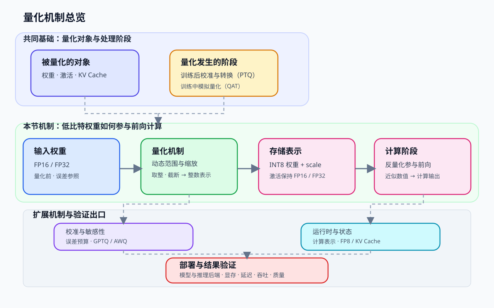
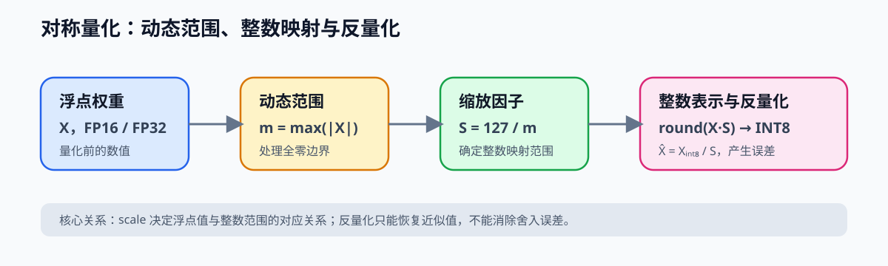
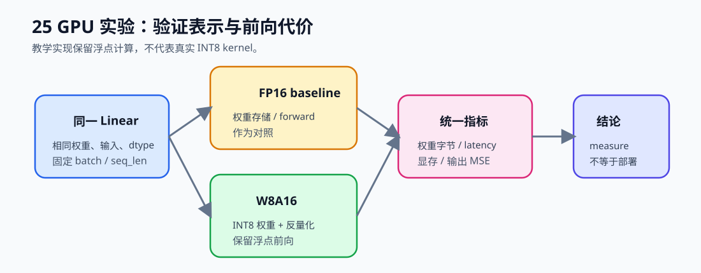

# 25. Quantization W8A16 | W8A16 量化
**难度：** Medium | **环境：** CPU-first | **标签：** `量化压缩`, `W8A16`, `Linear` | **目标人群：** 量化压缩学习者

> 🚀 **云端运行环境**
>
> 本章节的实战代码可以点击以下链接在免费 GPU 算力平台上直接运行：
>
> [](https://colab.research.google.com/github/datawhalechina/llm-algo-leetcode/blob/main/02_PyTorch_Algorithms/25_Quantization_W8A16.ipynb)
> [](https://modelscope.cn/my/mynotebook) *(国内推荐：魔搭社区免费实例)*


---

## 本节导读

模型变大以后，推理时最先遇到的问题往往不是“代码能不能跑”，而是权重太大、显存占用高、每一步都要从显存里读很多数据。前面的推理内容已经把这条压力线铺开了，本节开始进入量化：先不改完整推理框架，只尝试把最稳定的一部分——权重——压小。

这一节会把这个思路落到一个最小 `Linear` 层里：先把一块浮点权重压成 8-bit 存储，再在前向时把它接回普通矩阵乘法。学完后，你应该能看懂 Weight-only 量化为什么能省显存、它和真正低精度计算有什么区别，以及后面的 4-bit / QLoRA 为什么是在这个基础上继续往前走。

本节先建立通用的 W8A16 表示与前向路径，再把量化对象、校准算法和部署封装分别连接到后续的 GPTQ / AWQ 机制与真实 backend 验证。

**关键词：** `W8A16`, `INT8`, `quantization`

---

## 前置阅读

**导语：** 先熟悉 dtype、线性层和量化的基本对象，再观察权重存储精度变化如何影响前向计算。
- [P1: 01. Data Types and Precision | 大模型的数据格式与混合精度](../01_Hardware_Math_and_Systems/01_Data_Types_and_Precision.md)
- [P1: 12. TensorCore and Mixed Precision | Tensor Core 与混合精度](../01_Hardware_Math_and_Systems/12_TensorCore_and_Mixed_Precision.md)
- [P1: 21. Quantization Theory and INT4/INT8 | 量化理论与 INT4/INT8](../01_Hardware_Math_and_Systems/21_Quantization_Theory_and_INT4_INT8.md)

---

### Step 1: 核心思想与概念

量化首先改变的是模型状态的表示方式：本节把对象固定为权重，把激活保持在 FP16/FP32，并沿着“浮点权重 → INT8 与 scale → 反量化前向”的链路观察存储和误差。图中把通用权重量化、校准与敏感性分析、运行时与状态量化放在同一张关系图中，帮助你建立完整的量化视野。

| 本节对象 | 输入 | 机制 | 输出与观察指标 |
|---|---|---|---|
| 浮点权重 | FP32 / FP16 权重张量 | absmax 对称量化 | `torch.int8` 权重、scale、存储字节数 |
| W8A16 线性层 | INT8 权重 + FP16/FP32 激活 | 前向前反量化 | 输出形状、MSE / 余弦相似度 |
| 机制扩展与部署 | 校准权重、运行时状态和目标 backend | GPTQ/AWQ、FP8、KV Cache 量化各自改变不同成本 | 后续再验证完整模型显存、延迟、吞吐和质量 |



### Step 2: 量化流程与数据流

本步先把量化看成一条数据流：高精度权重根据动态范围映射到整数表示，同时保存缩放信息；前向计算时，再让低比特权重和高精度激活共同产生输出。这里先理解每一步保存什么、改变什么，具体函数实现放到 Step 4。

| 流程阶段 | 主要变化 | 保留的信息 | 观察重点 |
|---|---|---|---|
| 输入 | 高精度权重进入量化流程 | FP16 / FP32 权重 | 作为误差参照 |
| 映射 | 根据动态范围确定缩放关系，并映射到有限整数范围 | 缩放信息、整数权重 | 是否覆盖原始数值范围 |
| 存储 | 权重以低比特形式保存，激活仍保持较高精度 | INT8 权重、scale、FP16 / FP32 激活 | 权重存储与计算精度分开 |
| 前向 | 反量化参与矩阵计算并产生近似输出 | 输出张量 | 形状、误差与计算代价 |

### Step 3: Absmax、scale 与反量化



按照图片中的顺序，W8A16 只需要先确定一组 scale，再完成整数映射和恢复：

| 阶段 | 公式 / 操作 | 需要观察的结果 |
|---|---|---|
| 动态范围 | `absmax = max(abs(x))` | 找到当前权重范围 |
| 缩放 | `scale = 127 / absmax` | 全零输入需要防止除零 |
| 量化 | `round(x * scale)` 后截断到 INT8 范围 | 存储为 `torch.int8` |
| 反量化 | `x_dequant = x_int8 / scale` | 得到近似浮点权重 |

这里采用以 127 为正向上限的对称教学实现，代码中的 `clamp(-128, 127)` 与 INT8 存储范围保持一致。量化误差来自舍入和截断；它不等于完整模型质量损失。

### Step 4: 实现、测试与结果解读

题目区围绕两个实现对象展开：`absmax_quantize` 负责浮点权重到 INT8 的映射，`W8A16Linear` 负责在前向前恢复近似浮点权重。测试区检查全零输入、整数 dtype、输出形状和数值误差；完成后再用权重字节数解释“权重节省”与“完整模型显存”的区别。

| 实现对象 | 题目区关注点 | 测试观察 |
|---|---|---|
| `absmax_quantize` | absmax、scale、round、clamp | dtype、有限值、边界输入 |
| `W8A16Linear` | 反量化后参与普通矩阵乘法 | 输出形状与误差 |
| 存储账本 | INT8 权重的字节数 | 不外推完整模型收益 |


```python
import torch
import torch.nn as nn
import torch.nn.functional as F
```


```python
def absmax_quantize(x: torch.Tensor) -> tuple[torch.Tensor, torch.Tensor]:
    """
    将浮点张量 X 量化为 INT8，并返回缩放因子。
    
    Args:
        x: 浮点类型的张量
    Returns:
        x_quant: dtype 为 torch.int8 的量化张量
        scale: 标量张量形式的缩放因子
    """
    # ==========================================
    # TODO 1: 计算张量的绝对最大值 absmax
    # ==========================================
    # absmax = ???
    
    # 防除零保护：全零张量时 absmax 为 0，设为一个非零值避免除以 0
    if absmax == 0:
        absmax = torch.tensor(1.0, device=x.device)  # 保持设备一致性 
        
    # ==========================================
    # TODO 2: 计算缩放因子 scale (对称量化，基于 127 计算)
    # ==========================================
    # scale = ???
    
    # ==========================================
    # TODO 3: 量化过程
    # 1. 乘以 scale
    # 2. round 到最近整数
    # 3. clamp 到 INT8 可表示范围 [-128, 127]
    # ==========================================
    # x_scaled = ???
    # x_quant = ???
    return x_quant, scale

class W8A16Linear(nn.Module):
    """
    Weight-only INT8 量化线性层。
    在内存中，我们存储的是非常微小的 INT8 权重。
    在计算时，我们将权重反量化回与输入一致的浮点类型（如 FP16/FP32），再进行矩阵乘法。
    这种教学实现保留浮点前向，主要验证权重存储和反量化关系；它不等于纯 INT8 计算，也不保证真实带宽或延迟收益。
    """
    def __init__(self, in_features: int, out_features: int):
        super().__init__()
        self.register_buffer("weight_int8", torch.zeros((out_features, in_features), dtype=torch.int8))
        self.register_buffer("scale", torch.tensor(1.0))
        self.bias = nn.Parameter(torch.zeros(out_features))

    def from_float(self, linear_layer: nn.Linear):
        """
        从高精度的 Linear 层中吸收权重并进行 PTQ 量化
        """
        with torch.no_grad():
            w_quant, scale = absmax_quantize(linear_layer.weight)
            self.weight_int8.copy_(w_quant)
            self.scale.copy_(scale)
            if linear_layer.bias is not None:
                self.bias.copy_(linear_layer.bias)

    def forward(self, x: torch.Tensor) -> torch.Tensor:
        # ==========================================
        # TODO 4: 反量化与前向传播
        # 1. 将 weight_int8 转换回与输入 x 相同的类型 (如 float32/float16)
        # 2. 除以 self.scale 恢复其数值范围
        # 3. 将 bias 也对齐到输入 dtype，再使用 F.linear
        # ==========================================
        
        # w_fp = ???
        # w_dequant = ???
        
        # out = ???
        return out

```


```python
# 测试你的实现
def test_quantization():
    try:
        torch.manual_seed(42)

        # 1. 测试 absmax_quantize 的基础边界
        zero_q, zero_scale = absmax_quantize(torch.zeros(5))
        assert zero_q.dtype == torch.int8, "量化后的权重存储必须是 torch.int8！"
        assert torch.count_nonzero(zero_q) == 0, "全 0 张量量化后仍应保持全 0！"
        assert torch.isfinite(torch.as_tensor(zero_scale)).item(), "全零输入的 scale 不能是 NaN/Inf！"

        # 继续沿用带符号样本验证 scale 和 round 行为
        x_fp = torch.tensor([-0.8, 1.5, -3.0, 2.5, 0.0])
        # 绝对最大值是 3.0。Scale = 127 / 3.0 = 42.333
        # 2.5 * 42.333 = 105.8 -> 106
        x_q, scale = absmax_quantize(x_fp)
        assert x_q.dtype == torch.int8, "量化后的权重存储必须是 torch.int8！"
        assert torch.allclose(scale, torch.tensor(127.0 / 3.0)), "Scale 计算不正确！"
        assert x_q[3].item() == 106, "量化后的四舍五入数值计算不正确！"
        print("✅ absmax_quantize 核心算法测试通过！")

        # 2. 测试 W8A16 线性层
        in_dim, out_dim = 128, 64
        batch, seq = 2, 10

        fp_linear = nn.Linear(in_dim, out_dim)
        q_linear = W8A16Linear(in_dim, out_dim)
        q_linear.from_float(fp_linear)

        fp_bytes = fp_linear.weight.element_size() * fp_linear.weight.numel()
        q_bytes = q_linear.weight_int8.element_size() * q_linear.weight_int8.numel()
        #assert q_bytes == fp_bytes // 4, "INT8 权重的内存占用必须是 FP32 的四分之一！"
        expected_ratio = fp_linear.weight.element_size() // q_linear.weight_int8.element_size()
        assert q_bytes * expected_ratio == fp_bytes, \
            f"INT8 权重内存占用应为原大小的 1/{expected_ratio}，实际比例为 {fp_bytes / q_bytes:.1f}"

        x_input = torch.randn(batch, seq, in_dim)
        out_fp = fp_linear(x_input)
        out_q = q_linear(x_input)
        cos_sim = F.cosine_similarity(out_fp.flatten(), out_q.flatten(), dim=0)
        # 余弦相似度 > 0.99 只说明这个小样本的输出方向接近，不代表任务质量不变
        assert out_q.shape == out_fp.shape, "量化前后输出形状必须一致！"
        assert torch.isfinite(out_q).all(), "反量化输出不能包含 NaN/Inf！"
        assert torch.isfinite(out_fp - out_q).all(), "量化误差必须可以计算且为有限值！"
        assert cos_sim > 0.99, f"反量化计算出的张量差异过大，相似度仅为: {cos_sim.item():.4f}"

        # 3. 用一个确定性小矩阵，直接验证“量化权重 -> 反量化 -> 线性层”的公式链路
        fp_linear_small = nn.Linear(4, 3)
        with torch.no_grad():
            fp_linear_small.weight.copy_(torch.tensor([
                [1.0, -2.0, 3.0, -4.0],
                [0.5, 0.25, -0.75, 1.5],
                [-1.0, 0.0, 1.0, -2.0],
            ]))
            fp_linear_small.bias.copy_(torch.tensor([0.1, -0.2, 0.3]))

        q_linear_small = W8A16Linear(4, 3)
        q_linear_small.from_float(fp_linear_small)
        x_small = torch.tensor([[1.0, -1.0, 0.5, 2.0], [0.0, 1.0, -1.0, 3.0]])
        out_small = q_linear_small(x_small)
        w_dequant = q_linear_small.weight_int8.to(x_small.dtype) / q_linear_small.scale
        out_ref = F.linear(x_small, w_dequant, q_linear_small.bias)
        assert torch.allclose(out_small, out_ref, atol=1e-6), "小矩阵下的反量化前向公式不正确！"

        # 3. FP16 输入边界：检查权重和 bias 都能与输入 dtype 对齐
        x_half = x_input.to(torch.float16)
        fp_half = fp_linear.to(torch.float16)(x_half)
        q_half = q_linear(x_half)
        assert q_half.dtype == torch.float16, "FP16 输入时输出 dtype 应保持一致！"
        assert q_half.shape == fp_half.shape, "FP16 前向输出形状不一致！"

        print(f"✅ W8A16Linear 测试通过！输出相似度: {cos_sim.item():.4f}，INT8 权重存储检查通过。")

    except NotImplementedError:
        print("请先完成 TODO 代码！")
        raise
    except (AttributeError, NameError, TypeError, ValueError, AssertionError, RuntimeError) as e:
        if isinstance(e, AttributeError):
            print("代码未完成导致变量属性错误。")
        elif isinstance(e, NameError):
            print("代码可能未完成，导致了变量未定义。")
        elif isinstance(e, TypeError):
            print("代码可能未完成，导致了操作错误。")
        elif isinstance(e, ValueError):
            print("代码可能未完成，导致了张量维度错误。")
        elif isinstance(e, AssertionError):
            print(f"❌ 测试失败: {e}")
        elif isinstance(e, RuntimeError):
            print("代码可能未完成，导致了运行时错误。")
        else:
            print("代码可能未完成，导致了断言失败。")
        raise NotImplementedError("请先完成 TODO 代码！") from e
    except Exception as e:
        print(f"❌ 发生未知异常: {e}")
        raise


test_quantization()

```

---

🛑 **STOP HERE** 🛑
<br><br><br><br><br><br><br><br><br><br>
> 请先尝试自己完成代码并跑通测试。<br>
> 如果你正在 Colab 中运行，并且遇到困难没有思路，可以向下滚动查看参考答案。
<br><br><br><br><br><br><br><br><br><br>

---
## 参考代码与解析

### 代码

```python
def absmax_quantize(x: torch.Tensor) -> tuple[torch.Tensor, torch.Tensor]:
    """
    将浮点张量 X 量化为 INT8，并返回缩放因子。
    """
    # TODO 1: 计算张量的绝对最大值 absmax
    absmax = torch.max(torch.abs(x))
    
    # 防除零保护：全零张量时 absmax 为 0，设为一个非零值避免除以 0
    if absmax == 0:
        absmax = torch.tensor(1.0, device=x.device)  # 保持设备一致性  
        
    # TODO 2: 计算缩放因子 scale  (对称量化，基于 127 计算)
    scale = 127.0 / absmax
    
    # TODO 3: 量化过程
    x_scaled = x * scale
    x_quant = torch.clamp(torch.round(x_scaled), -128, 127).to(torch.int8)
    
    return x_quant, scale

class W8A16Linear(nn.Module):
    """
    Weight-only INT8 量化线性层。
    在内存中存储 INT8 权重，前向时反量化到与输入一致的浮点类型进行计算。
    这种方式主要缓解从内存读取权重的带宽压力，而非将计算链路改为纯 INT8。
    """
    def __init__(self, in_features: int, out_features: int):
        super().__init__()
        self.register_buffer("weight_int8", torch.zeros((out_features, in_features), dtype=torch.int8))
        self.register_buffer("scale", torch.tensor(1.0))
        self.bias = nn.Parameter(torch.zeros(out_features))

    def from_float(self, linear_layer: nn.Linear):
        """
        从高精度的 Linear 层中吸收权重并进行 PTQ 量化
        """
        with torch.no_grad():
            w_quant, scale = absmax_quantize(linear_layer.weight)
            self.weight_int8.copy_(w_quant)
            self.scale.copy_(scale)
            if linear_layer.bias is not None:
                self.bias.copy_(linear_layer.bias)

    def forward(self, x: torch.Tensor) -> torch.Tensor:
        # TODO 4: 反量化与前向传播
        # 1. 将 weight_int8 转换回与输入 x 相同的类型
        w_fp = self.weight_int8.to(x.dtype)
        
        # 2. 除以 self.scale 恢复其数值范围
        w_dequant = w_fp / self.scale
        
        # 3. 使用 F.linear 进行标准的矩阵乘法
        bias = self.bias.to(dtype=x.dtype)
        out = F.linear(x, w_dequant, bias)
        return out
```

### 解析

**1. TODO 1（计算绝对最大值）**
- `absmax = torch.max(torch.abs(x))` 找到张量中最“极端”的值，用它来确定量化动态范围。
- 如果 `absmax` 为 0，需要先做保护，避免除零。

**2. TODO 2（计算缩放因子）**
- `scale = 127.0 / absmax` 将浮点范围映射到 INT8 的对称区间。
- **关于 `-127` 和 `-128`**：数学上对称量化描述为 `[-127, 127]`，因为 0 点严格对齐。代码中 `clamp` 使用 `-128` 只是利用 INT8 数据类型的完整存储范围。由于 `scale` 基于 127 计算，`-128` 这个边界值在实际量化中极少被用到，两者精度差别极小。

**3. TODO 3（量化过程）**
- 先执行 `x_scaled = x * scale`，再 `torch.round`，最后 `torch.clamp` 到可用区间。
- 这一步的本质是把连续浮点数离散化成有限的 INT8 取值。
- `torch.int8` 是最终存储格式，能直接把权重显存压到更低。

**4. TODO 4（反量化与前向传播）**
- 反量化时先把 `weight_int8` 转回与输入一致的数据类型。
- 再除以 `scale` 恢复近似的浮点值范围。
- 最后用 `F.linear` 完成标准前向传播。

**5. `register_buffer` 的作用**
- `weight_int8` 和 `scale` 不是可训练参数，但它们需要和模型一起保存、加载和迁移设备，所以适合注册为 buffer。
- 它们会随 `state_dict()` 保存，并在 `model.to(device)` 时自动迁移，但不会被优化器更新。这正是量化权重所需要的——属于模型状态，但不参与训练。

**6. 进阶思考**
- 本页实现的是 `per-tensor` 量化，工业界常见更细粒度的 `per-channel` 量化。
- `W8A16` 主要压缩的是权重显存，激活仍保持高精度，以平衡收益与精度。
- 本节实现的 W8A16 方案，收益主要在于压缩权重显存和降低带宽压力，计算仍在浮点域完成。若进一步将激活也量化为 INT8（W8A8），则可以充分利用 INT8 Tensor Core 获得计算加速。

### Step 5：可选 GPU 实验——测量 W8A16 的存储与反量化代价



实验在 FP16 baseline 和 W8A16 线性层之间做对照。`real_gpu` 会从 `Qwen/Qwen2.5-0.5B-Instruct` 抽取一个真实 `q_proj`，但只测这一层的权重存储、前向耗时、峰值显存和输出误差；它不是完整模型部署，也不等价于真实 INT8 kernel。结果证据等级记为 `gpu_mechanism_on_real_layer`。

先运行 `dry_run` 检查环境，再切换到 `real_gpu`。如果修改层大小、batch 或序列长度，必须把配置和结果一起记录；完整模型、真实 backend 和端到端质量转到 67 节。


```python
import json
import platform
import time
from pathlib import Path

RUN_MODE = 'dry_run'  # cpu / dry_run / real_gpu；dry_run 只做环境检查
MODEL_ID = 'Qwen/Qwen2.5-0.5B-Instruct'  # real_gpu 使用真实模型权重和 token 输入
PROMPT = 'Explain why lower precision can reduce weight storage.'
SEED = 42
IN_FEATURES = 4096
OUT_FEATURES = 4096
BATCH_SIZE = 1
SEQ_LEN = 128
DTYPE = torch.float16
WARMUP = 5
ITERS = 20
OUTPUT_PATH = Path('benchmarks/results/25_w8a16_gpu.json')

torch.manual_seed(SEED)
cuda_available = torch.cuda.is_available()
if RUN_MODE == 'real_gpu' and not cuda_available:
    raise RuntimeError('RUN_MODE=real_gpu 但 CUDA 不可用，请先完成 GPU 环境预检。')
device = torch.device('cuda' if RUN_MODE == 'real_gpu' else 'cpu')
runtime = {
    'python': platform.python_version(), 'torch': torch.__version__,
    'cuda': torch.version.cuda, 'cuda_available': cuda_available,
    'device': torch.cuda.get_device_name(0) if cuda_available else 'cpu',
}

def _sync():
    """确保 CUDA 异步操作完成后再读取计时或显存。"""
    if device.type == 'cuda':
        torch.cuda.synchronize()

def _measure(fn):
    """在固定 warmup / iters 下测量一个前向函数。"""
    for _ in range(WARMUP): fn()
    _sync()
    if device.type == 'cuda': torch.cuda.reset_peak_memory_stats()
    start = time.perf_counter()
    for _ in range(ITERS): fn()
    _sync()
    elapsed = (time.perf_counter() - start) * 1000 / ITERS
    peak = torch.cuda.max_memory_allocated() / 2**20 if device.type == 'cuda' else None
    return {'latency_ms': round(elapsed, 4), 'peak_memory_mb': None if peak is None else round(peak, 2)}

evidence_level = 'environment_preflight' if RUN_MODE == 'dry_run' else 'gpu_real_model_state_measurement'
result = {'stage': evidence_level, 'run_mode': RUN_MODE, 'runtime': runtime, 'config': {
    'in_features': IN_FEATURES, 'out_features': OUT_FEATURES, 'batch_size': BATCH_SIZE,
    'seq_len': SEQ_LEN, 'dtype': str(DTYPE), 'model_id': MODEL_ID, 'warmup': WARMUP, 'iters': ITERS, 'seed': SEED,
}, 'evidence_level': evidence_level}
if RUN_MODE == 'dry_run':
    result['decision'] = {'decision': 'ready_to_measure', 'reason': '仅完成环境与配置检查，尚未运行 GPU 机制测量。'}
else:
    # real_gpu 分支加载真实模型；CPU / dry_run 不下载模型，避免把预检变成训练任务。
    if RUN_MODE == 'real_gpu':
        from transformers import AutoModelForCausalLM, AutoTokenizer
        tokenizer = AutoTokenizer.from_pretrained(MODEL_ID, use_fast=True)
        model = AutoModelForCausalLM.from_pretrained(MODEL_ID, dtype=DTYPE).to(device).eval()
        input_ids = tokenizer(PROMPT, return_tensors='pt').input_ids.to(device)
        with torch.no_grad(): x = model.model.embed_tokens(input_ids).to(DTYPE)
        source = model.model.layers[0].self_attn.q_proj
        IN_FEATURES, OUT_FEATURES = source.in_features, source.out_features
        fp = nn.Linear(IN_FEATURES, OUT_FEATURES, bias=source.bias is not None, device=device, dtype=DTYPE)
        with torch.no_grad():
            fp.weight.copy_(source.weight.to(DTYPE))
            if source.bias is not None: fp.bias.copy_(source.bias.to(DTYPE))
        del model, source
        if device.type == 'cuda': torch.cuda.empty_cache()
    else:
        # cpu 模式只运行小型确定性张量，真实模型状态验证留给 real_gpu。
        weight = torch.randn(OUT_FEATURES, IN_FEATURES, device=device, dtype=DTYPE)
        x = torch.randn(BATCH_SIZE, SEQ_LEN, IN_FEATURES, device=device, dtype=DTYPE)
        fp = nn.Linear(IN_FEATURES, OUT_FEATURES, bias=True, device=device, dtype=DTYPE)
        with torch.no_grad(): fp.weight.copy_(weight); fp.bias.zero_()
    result['config'].update({'in_features': IN_FEATURES, 'out_features': OUT_FEATURES,
                           'actual_input_shape': list(x.shape), 'weight_source': 'real_model' if RUN_MODE == 'real_gpu' else 'synthetic_cpu'})
    q = W8A16Linear(IN_FEATURES, OUT_FEATURES).to(device)
    q.from_float(fp.float())
    baseline = _measure(lambda: fp(x))
    candidate = _measure(lambda: q(x))
    with torch.no_grad():
        ref, approx = fp(x), q(x)
        mse = torch.mean((ref.float() - approx.float()) ** 2).item()
    result.update({'baseline': baseline, 'candidate': candidate, 'metrics': {
        'weight_fp_bytes': int(fp.weight.numel() * fp.weight.element_size()),
        'weight_int8_bytes': int(q.weight_int8.numel() * q.weight_int8.element_size()),
        'output_mse': round(mse, 8), 'output_shape': list(approx.shape),
    }, 'decision': {'decision': 'measure', 'reason': '仅验证 W8A16 GPU 机制；不代表真实 INT8 kernel 加速。'}})
OUTPUT_PATH.parent.mkdir(parents=True, exist_ok=True)
OUTPUT_PATH.write_text(json.dumps(result, ensure_ascii=False, indent=2), encoding='utf-8')
print(json.dumps(result, ensure_ascii=False, indent=2))
```

#### GPU 实验结果记录

| 实验组 | dtype | batch / seq_len | 权重存储 | forward latency | peak memory | output MSE | evidence level |
|---|---|---|---:|---:|---:|---:|---|
| FP16 baseline |  |  |  |  |  |  | gpu mechanism |
| W8A16 |  |  |  |  |  |  | gpu mechanism |

权重字节数只描述本层权重存储，不等于完整模型显存；真实 INT8 kernel 和部署收益转到 67 验证。
## 相关阅读

完成 W8A16 的最小实现后，可以继续阅读量化校准方法和真实部署 backend。
- [SmoothQuant 原论文](https://arxiv.org/abs/2211.10438)
- [PyTorch 量化文档](https://pytorch.org/docs/stable/quantization.html)
- [26. QLoRA and 4bit Quantization | QLoRA 与 4-bit 量化](./26_QLoRA_and_4bit_Quantization.md)
- [40. GPTQ and AWQ Weight Quantization | GPTQ 与 AWQ 权重量化](./40_GPTQ_and_AWQ_Weight_Quantization.md)
- [67. Quantized Inference and Deployment | 量化推理与部署](./67_Quantized_Inference_and_Deployment.md)
