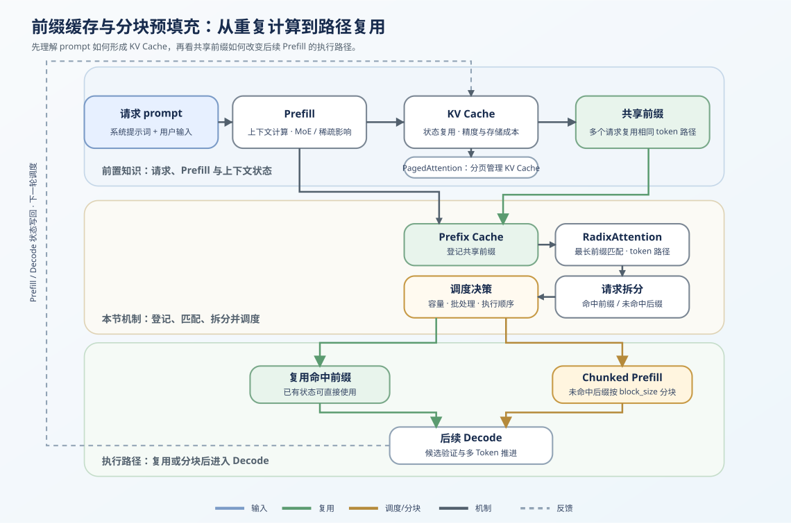
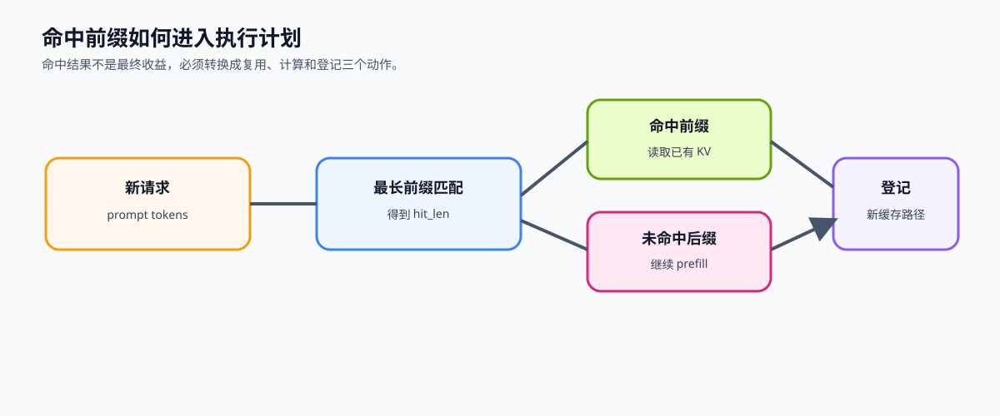

# 34. Prefix Caching and Chunked Prefill | 前缀缓存与分块预填充

**难度：** Hard | **环境：** CPU-first | **标签：** `推理优化`, `KV Cache`, `Prefix Cache` | **目标人群：** 推理优化学习者

> 🚀 **云端运行环境**
>
> 本章节的实战代码可以点击以下链接在免费 GPU 算力平台上直接运行：
>
> [](https://colab.research.google.com/github/datawhalechina/llm-algo-leetcode/blob/main/02_PyTorch_Algorithms/34_Prefix_Caching_and_Chunked_Prefill.ipynb)
> [](https://modelscope.cn/my/mynotebook) *(国内推荐：魔搭社区免费实例)*


---

## 本节导读

长 prompt 的推理压力不只来自 token 数量，还来自重复：很多请求会共享相同 system prompt、工具说明或多轮历史。如果每个请求都重新 prefill 一遍，共享前缀会被反复计算，KV cache 也难以形成稳定复用。

本节先把 Prefix Cache 落成一条可检查的请求路径：登记前缀、匹配最长命中、拆出 suffix，并统计复用账本。Chunked Prefill 作为后续扩展，把未命中的长 suffix 分成多个执行块，观察单次 prefill 的资源压力。

**关键词：** `prefix caching`, `chunked prefill`, `cache reuse`

---

## 前置阅读

**导语：** 进入本节前，先能说明 KV Cache 如何保存历史状态，再比较公共前缀如何被登记、命中和复用。
- [20. FlashAttention Sim | FlashAttention 模拟](./20_FlashAttention_Sim.md)
- [22. vLLM PagedAttention | vLLM 分页注意力](./22_vLLM_PagedAttention.md)
- [24. SGLang RadixAttention | SGLang 基数注意力](./24_SGLang_RadixAttention.md)

---

### Step 1: 共享前缀为什么值得缓存

长 prompt 的压力不只来自 token 数量，还来自重复：系统提示词、工具说明、RAG 模板和多轮历史可能在不同请求中保持不变。如果每个请求都从头执行 prefill，同一段前缀会被重复计算。Prefix Caching 的输入是已缓存的 token 前缀和新请求的 prompt，输出是可复用的前缀范围以及需要继续计算的后缀。

| 要素 | 学习者需要识别的内容 | 作用 |
|---|---|---|
| 重复来源 | System Prompt、工具说明、RAG 模板、历史上下文 | 解释为什么值得缓存 |
| 可复用对象 | 从 prompt 开头连续出现的 token 前缀 | 减少重复 prefill |
| 新增计算 | 首个不一致 token 之后的后缀 | 继续完成本次请求的 prefill |




### Step 2: 命中前缀与未命中后缀

对新请求先做最长前缀匹配，再把输入拆成两部分。只有从 prompt 开头连续相同的 token 才能命中，中间位置偶然相同的 token 不构成前缀命中：

$$
prompt = reusable\_prefix + suffix
$$

| 输出部分 | 来源 | 执行含义 |
|---|---|---|
| `reusable_prefix` | 已缓存且从开头连续命中的 token | 使用已有 prefill 结果 |
| `suffix` | `hit_len` 之后的剩余 token | 继续送入模型计算 |
| 无命中 | `hit_len = 0` | 整个 prompt 都属于 suffix |

### Step 3: 长后缀如何进入分块执行

长 suffix 如果一次性进入 prefill，可能形成较大的工作集。确定可复用前缀后，Chunked Prefill 只处理未命中的 suffix，并把它拆成固定大小的执行块：

$$
chunks = [block_1, block_2, \dots, block_n]
$$

| 分块字段 | 含义 | 对资源压力的影响 |
|---|---|---|
| `block_size` | 每个 chunk 最多包含的 token 数 | 控制单次 prefill 的工作集大小 |
| `chunks` | suffix 被切出的 token 块序列 | 允许按块推进，而不是一次处理全部 suffix |
| 尾块 | 最后一个不足 `block_size` 的 chunk | 保留真实变长输入的边界情况 |



### Step 4: 实现前缀缓存与分块计划

本节用最小 `PrefixCacheManager` 表示上述流程。这里用 token 序列和 tuple block 验证控制逻辑；真实系统还需要把命中范围映射到 KV Cache 的存储和生命周期。

完成后检查命中长度、后缀、`reuse_ratio` 和后缀 chunks 是否符合预期；这些数量用于验证机制账本，不代表真实 KV 显存节省或吞吐提升。

| 实现阶段 | 需要完成的内容 | 输出与检查项 |
|---|---|---|
| 表示与分块 | 统一 token 类型，按 `block_size` 切分 | token 序列、chunk 边界和尾块 |
| 前缀命中 | 登记前缀、计算最长匹配、拆出 suffix | `hit_len`、`reusable_prefix`、`suffix` |
| 执行账本 | 只对 suffix 生成分块计划并统计复用 | `hit_tokens`、`uncached_tokens`、`reuse_ratio` |
### 提示

- **基础表示**：`_normalize_tokens` 和 `_chunk_tokens` 统一 token 类型，并处理不足一个 block 的尾块。
- **命中路径**：`add_prefix`、`match_prefix` 和 `split_prompt` 负责登记公共前缀、找最长命中并拆出 suffix。
- **执行账本**：`chunked_prefill_plan` 只对 suffix 生成分块计划，再统计 `hit_tokens`、`uncached_tokens` 和 `reuse_ratio`。

```python
from typing import List, Sequence, Tuple

```


```python
class PrefixCacheManager:
    """极简版前缀缓存与分块预填充管理器。"""

    def __init__(self, block_size: int = 4):
        if block_size <= 0:
            raise ValueError("block_size must be positive")
        self.block_size = block_size
        self.cached_prefixes: List[Tuple[int, ...]] = []
        self.chunked_prefixes: List[List[Tuple[int, ...]]] = []

    def _normalize(self, tokens: Sequence[int]) -> List[int]:
        # ==========================================
        # TODO 1: 统一 token 表示，便于做前缀匹配
        # 提示: 将输入转换成普通 list，避免 tuple/list 混用导致比较不稳定
        # ==========================================
        # normalized = ???
        return normalized

    def _chunk_tokens(self, tokens: Sequence[int]) -> List[Tuple[int, ...]]:
        # ==========================================
        # TODO 2: 按 block_size 把 prompt 切成多个块
        # 提示: 先 normalize，再每 block_size 个 token 组成一个 tuple
        # ==========================================
        tokens = self._normalize(tokens)
        # chunks = ???
        return chunks

    def add_prefix(self, prefix_tokens: Sequence[int]) -> None:
        # ==========================================
        # TODO 3: 记录一个可复用的前缀
        # 提示: cached_prefixes 存完整前缀，chunked_prefixes 存分块结果
        # ==========================================
        prefix = tuple(self._normalize(prefix_tokens))
        if prefix not in self.cached_prefixes:
            self.cached_prefixes.append(prefix)
            # prefix_chunks = ???
            self.chunked_prefixes.append(prefix_chunks)

    def match_prefix(self, prompt_tokens: Sequence[int]) -> int:
        # ==========================================
        # TODO 4: 计算 prompt 能命中的最长缓存前缀
        # 提示: 只允许从 prompt 开头连续命中，返回最长命中长度
        # ==========================================
        prompt = self._normalize(prompt_tokens)
        best_len = 0
        for cached_prefix in self.cached_prefixes:
            if len(cached_prefix) > len(prompt):
                continue
            # is_match = ???
            if is_match:
                best_len = max(best_len, len(cached_prefix))
        return best_len

    def split_prompt(self, prompt_tokens: Sequence[int]) -> Tuple[List[int], List[int], int]:
        # ==========================================
        # TODO 5: 拆出可复用前缀和待计算后缀
        # 提示: hit_len 之前是可复用前缀，之后是待 prefill 后缀
        # ==========================================
        prompt = self._normalize(prompt_tokens)
        hit_len = self.match_prefix(prompt)
        # reusable_prefix = ???
        # suffix = ???
        return reusable_prefix, suffix, hit_len

    def chunked_prefill_plan(self, prompt_tokens: Sequence[int]) -> List[Tuple[int, ...]]:
        # ==========================================
        # TODO 6: 生成分块预填充执行计划
        # 提示: 直接复用 _chunk_tokens，保持切块逻辑一致
        # ==========================================
        # plan = ???
        return plan

    def cache_stats(self, prompt_tokens: Sequence[int]) -> dict:
        """返回 token 级命中账本；不代表真实 KV 显存收益。"""
        prompt = self._normalize(prompt_tokens)
        # TODO 7: 统计 hit_tokens、uncached_tokens 和 reuse_ratio
        # hit_tokens = ???
        # uncached_tokens = ???
        # reuse_ratio = ???
        return {'hit_tokens': hit_tokens, 'uncached_tokens': uncached_tokens, 'reuse_ratio': reuse_ratio}

    def chunked_suffix_prefill_plan(self, prompt_tokens: Sequence[int]) -> List[Tuple[int, ...]]:
        """只对未命中的 suffix 生成 chunk 计划。"""
        # TODO 8: 复用 split_prompt，只对 suffix 调用 _chunk_tokens
        # _, suffix, _ = ???
        # return ???
        raise NotImplementedError

```

### 测试


```python
# 运行此单元格以测试你的实现
def test_prefix_cache_manager():
    try:
        manager = PrefixCacheManager(block_size=2)
        manager.add_prefix([1, 2, 3])
        manager.add_prefix([1, 2, 9])
        manager.add_prefix([1, 2, 3])  # 重复登记不应增加缓存条目

        assert manager.cached_prefixes == [(1, 2, 3), (1, 2, 9)]
        assert len(manager.chunked_prefixes) == 2, "重复 prefix 不应重复建立分块记录"
        assert manager.chunked_prefixes[0] == [(1, 2), (3,)]
        assert manager.match_prefix([1, 2, 3, 9]) == 3
        assert manager.match_prefix([1, 2, 9, 8]) == 3
        assert manager.match_prefix([1, 2, 0]) == 0

        prefix, suffix, hit_len = manager.split_prompt([1, 2, 3, 9])
        assert prefix == [1, 2, 3]
        assert suffix == [9]
        assert hit_len == 3

        assert manager.chunked_prefill_plan([1, 2, 3, 4, 5]) == [(1, 2), (3, 4), (5,)]
        stats = manager.cache_stats([1, 2, 3, 9])
        assert stats == {'hit_tokens': 3, 'uncached_tokens': 1, 'reuse_ratio': 0.75}
        assert manager.chunked_suffix_prefill_plan([1, 2, 3, 9, 10]) == [(9, 10)]
        assert manager.chunked_suffix_prefill_plan([1, 2, 3]) == [], "完整命中时不应生成 suffix chunk"
        manager_small = PrefixCacheManager(block_size=3)
        assert manager_small.chunked_prefill_plan([1, 2, 3, 4, 5, 6, 7]) == [(1, 2, 3), (4, 5, 6), (7,)], "不同 block_size 下分块边界不正确"
        print("✅ PrefixCacheManager 测试通过")
    except NotImplementedError:
        print("请先完成 TODO 代码！")
        raise
    except (AttributeError, NameError, TypeError, ValueError) as e:
        print("代码可能未完成，导致变量未定义")
        raise NotImplementedError("请先完成 TODO 代码！") from e
    except AssertionError as e:
        print(f"❌ 测试失败: {e}")
        raise NotImplementedError("请先完成 TODO 代码！") from e


test_prefix_cache_manager()

```

---

🛑 **STOP HERE** 🛑
<br><br><br><br><br><br><br><br><br><br>
> 请先尝试自己完成代码并跑通测试。<br>
> 如果你正在 Colab 中运行，并且遇到困难没有思路，可以向下滚动查看参考答案。
<br><br><br><br><br><br><br><br><br><br>

---

## 参考代码与解析

### 代码


```python
class PrefixCacheManager:
    """极简版前缀缓存与分块预填充管理器。"""

    def __init__(self, block_size: int = 4):
        if block_size <= 0:
            raise ValueError("block_size must be positive")
        self.block_size = block_size
        self.cached_prefixes: List[Tuple[int, ...]] = []
        self.chunked_prefixes: List[List[Tuple[int, ...]]] = []

    def _normalize(self, tokens: Sequence[int]) -> List[int]:
        # ==========================================
        # TODO 1: 统一 token 表示，便于做前缀匹配
        # 提示: 将输入转换成普通 list，避免 tuple/list 混用导致比较不稳定
        # ==========================================
        normalized = list(tokens)
        return normalized

    def _chunk_tokens(self, tokens: Sequence[int]) -> List[Tuple[int, ...]]:
        # ==========================================
        # TODO 2: 按 block_size 把 prompt 切成多个块
        # 提示: 先 normalize，再每 block_size 个 token 组成一个 tuple
        # ==========================================
        tokens = self._normalize(tokens)
        chunks = [tuple(tokens[i : i + self.block_size]) for i in range(0, len(tokens), self.block_size)]
        return chunks

    def add_prefix(self, prefix_tokens: Sequence[int]) -> None:
        # ==========================================
        # TODO 3: 记录一个可复用的前缀
        # 提示: cached_prefixes 存完整前缀，chunked_prefixes 存分块结果
        # ==========================================
        prefix = tuple(self._normalize(prefix_tokens))
        if prefix not in self.cached_prefixes:
            self.cached_prefixes.append(prefix)
            prefix_chunks = self._chunk_tokens(prefix)
            self.chunked_prefixes.append(prefix_chunks)

    def match_prefix(self, prompt_tokens: Sequence[int]) -> int:
        # ==========================================
        # TODO 4: 计算 prompt 能命中的最长缓存前缀
        # 提示: 只允许从 prompt 开头连续命中，返回最长命中长度
        # ==========================================
        prompt = self._normalize(prompt_tokens)
        best_len = 0
        for cached_prefix in self.cached_prefixes:
            if len(cached_prefix) > len(prompt):
                continue
            is_match = prompt[: len(cached_prefix)] == list(cached_prefix)
            if is_match:
                best_len = max(best_len, len(cached_prefix))
        return best_len

    def split_prompt(self, prompt_tokens: Sequence[int]) -> Tuple[List[int], List[int], int]:
        # ==========================================
        # TODO 5: 拆出可复用前缀和待计算后缀
        # 提示: hit_len 之前是可复用前缀，之后是待 prefill 后缀
        # ==========================================
        prompt = self._normalize(prompt_tokens)
        hit_len = self.match_prefix(prompt)
        reusable_prefix = prompt[:hit_len]
        suffix = prompt[hit_len:]
        return reusable_prefix, suffix, hit_len

    def chunked_prefill_plan(self, prompt_tokens: Sequence[int]) -> List[Tuple[int, ...]]:
        # ==========================================
        # TODO 6: 生成分块预填充执行计划
        # 提示: 直接复用 _chunk_tokens，保持切块逻辑一致
        # ==========================================
        plan = self._chunk_tokens(prompt_tokens)
        return plan

    def cache_stats(self, prompt_tokens: Sequence[int]) -> dict:
        """返回 token 级命中账本；不代表真实 KV 显存收益。"""
        prompt = self._normalize(prompt_tokens)
        hit_tokens = self.match_prefix(prompt)
        uncached_tokens = len(prompt) - hit_tokens
        reuse_ratio = hit_tokens / len(prompt) if prompt else 0.0
        return {'hit_tokens': hit_tokens, 'uncached_tokens': uncached_tokens, 'reuse_ratio': round(reuse_ratio, 4)}

    def chunked_suffix_prefill_plan(self, prompt_tokens: Sequence[int]) -> List[Tuple[int, ...]]:
        """只对未命中的 suffix 生成 chunk 计划。"""
        _, suffix, _ = self.split_prompt(prompt_tokens)
        return self._chunk_tokens(suffix)

```

### 解析

**1. TODO 1: 统一 token 表示**
- **实现方式**：`normalized = list(tokens)`
- **关键点**：把 `list`、`tuple` 等输入统一成普通 `list[int]`，避免后续比较时表示不一致
- **技术细节**：前缀匹配依赖切片比较，统一表示后可以直接使用 `prompt[:n] == list(cached_prefix)` 这类判断

**2. TODO 2: 按 block_size 分块**
- **实现方式**：`chunks = [tuple(tokens[i : i + self.block_size]) for i in range(0, len(tokens), self.block_size)]`
- **关键点**：每个 chunk 使用 `tuple` 保存，便于表示不可变的缓存块
- **技术细节**：最后一个 chunk 可以不足 `block_size`，这对应真实系统中尾块不满的情况

**3. TODO 3: 登记可复用前缀**
- **实现方式**：`prefix_chunks = self._chunk_tokens(prefix)`，再追加到 `chunked_prefixes`
- **关键点**：`cached_prefixes` 保存完整前缀，`chunked_prefixes` 保存同一个前缀的分块视图
- **技术细节**：只有当前缀尚未登记时才写入缓存，避免重复前缀污染缓存统计

**4. TODO 4: 计算最长命中前缀**
- **实现方式**：`is_match = prompt[: len(cached_prefix)] == list(cached_prefix)`
- **关键点**：这里只允许从 prompt 开头连续命中，不能把中间子串当成可复用前缀
- **技术细节**：遍历所有已缓存前缀并维护 `best_len`，可以在多个候选前缀中选择最长命中

**5. TODO 5: 拆分可复用前缀和待计算后缀**
- **实现方式**：`reusable_prefix = prompt[:hit_len]`，`suffix = prompt[hit_len:]`
- **关键点**：`hit_len` 之前的 token 可以复用缓存，之后的 token 仍需要执行 prefill
- **技术细节**：这个拆分把 prefix caching 的收益显式落到代码里：命中越长，需要重新计算的 suffix 越短

**6. TODO 6：生成完整 prompt 的分块计划**
- **实现方式**：`plan = self._chunk_tokens(prompt_tokens)`。
- **关键点**：这是基础切块接口；它不表示缓存命中后的真实执行路径。

**7. TODO 7：统计命中账本**
- `hit_tokens` 是可以复用的前缀长度，`uncached_tokens` 是仍需 prefill 的 suffix 长度。
- `reuse_ratio` 只反映 token 数量比例，不等于 KV 显存节省比例或吞吐提升。

**8. TODO 8：只对 suffix 分块**
- 真实组合路径是 `split_prompt -> suffix -> _chunk_tokens(suffix)`。
- 命中前缀不应再次进入 prefill 计划；suffix 的 chunk 数才是本次新增计算的执行粒度。

**Prefix Caching 核心机制**
- **重复前缀问题**：多轮对话、系统提示词和 RAG 模板经常共享长前缀，如果每次都重新 prefill，会浪费大量计算
- **缓存命中方式**：系统先判断新 prompt 是否以某个已缓存前缀开头，命中部分直接复用，未命中后缀继续计算
- **分块组织**：把长前缀拆成固定大小的 block 后，更容易管理缓存、复用局部前缀，并控制调度粒度

**工程优化要点**
- **显存管理**：缓存真实系统中的 KV 张量会占用显存，需要配合淘汰策略和 block 管理
- **调度收益**：Chunked Prefill 可以把长 prompt 拆成多个小任务，降低单次 prefill 对延迟和显存峰值的冲击
- **适用场景**：共享系统提示词、多轮会话、Agent 工具调用和 RAG 模板化 prompt 都容易受益于前缀缓存

**证据边界**
- CPU 代码验证 token 匹配、suffix 拆分和 chunk 计划；真实 KV Tensor 的显存占用、cache hit rate、TTFT、TPOT 和吞吐需要 69 节 backend benchmark。
- 这里没有实现 LRU、引用计数、物理 block 分配或跨 worker KV 传输；这些属于 serving / 系统扩展。
### Step 5: GPU 可选实验：观察分块资源压力

本实验用合成 hidden states 观察“一次性处理 suffix”和“按 chunk 处理 suffix”的分配峰值。它用于理解分块带来的资源边界，不等同于真实 Prefix Cache、KV Cache 或 serving benchmark。

```python
# GPU 可选实验配置：默认只输出计划，不申请 CUDA 张量。
RUN_MODE = 'dry_run'  # dry_run / real_gpu
CHUNK_GPU_PROBE = {
    'suffix_tokens': 4096,
    'hidden_size': 1024,
    'chunk_size': 512,
    'dtype': 'float16',
}

def run_chunked_gpu_probe(run_mode='dry_run', config=None):
    """比较合成 suffix 的一次性和分块张量峰值；不代表真实 prefill kernel。"""
    import json
    import torch
    config = dict(config or CHUNK_GPU_PROBE)
    tokens = config['suffix_tokens']
    chunk_size = config['chunk_size']
    chunks = (tokens + chunk_size - 1) // chunk_size
    plan = {'suffix_tokens': tokens, 'chunk_size': chunk_size, 'chunk_count': chunks, 'evidence_level': 'synthetic_gpu_chunk_probe'}
    if run_mode == 'dry_run':
        print(json.dumps({'mode': run_mode, 'plan': plan}, ensure_ascii=False, indent=2))
        return plan
    if run_mode != 'real_gpu':
        raise ValueError("RUN_MODE 只能是 dry_run 或 real_gpu")
    if not torch.cuda.is_available():
        raise RuntimeError('real_gpu 模式需要 CUDA')
    device = torch.device('cuda')
    dtype = getattr(torch, config['dtype'])
    results = {}
    for name, sizes in {'one_shot': [tokens], 'chunked': [min(chunk_size, tokens - i) for i in range(0, tokens, chunk_size)]}.items():
        torch.cuda.empty_cache()
        torch.cuda.reset_peak_memory_stats(device)
        for size in sizes:
            block = torch.empty((size, config['hidden_size']), dtype=dtype, device=device)
            block = block + 1
            del block
        torch.cuda.synchronize(device)
        results[name] = {'peak_allocated_mb': round(torch.cuda.max_memory_allocated(device) / 2**20, 2)}
    torch.cuda.empty_cache()
    result = {'mode': run_mode, 'plan': plan, 'results': results, 'device': torch.cuda.get_device_name(0)}
    print(json.dumps(result, ensure_ascii=False, indent=2))
    return result

run_chunked_gpu_probe(RUN_MODE, CHUNK_GPU_PROBE)
```

## 相关阅读

完成公共前缀登记、最长命中和分块预填充后，可以继续阅读推理引擎中的缓存复用与请求调度实现。

- [SGLang 原论文：Efficient Execution of Structured Language Model Programs](https://arxiv.org/abs/2312.07104)
- [vLLM Automatic Prefix Caching 文档](https://docs.vllm.ai/en/latest/features/automatic_prefix_caching.html)
- [35. Multi-Token Decoding | 多 Token 解码](./35_Multi_Token_Decoding.md)
- [36. Decode Scheduling | 解码调度](./36_Decode_Scheduling.md)
- [37. KV Cache Scheduling | KV Cache 调度](./37_KV_Cache_Scheduling.md)
