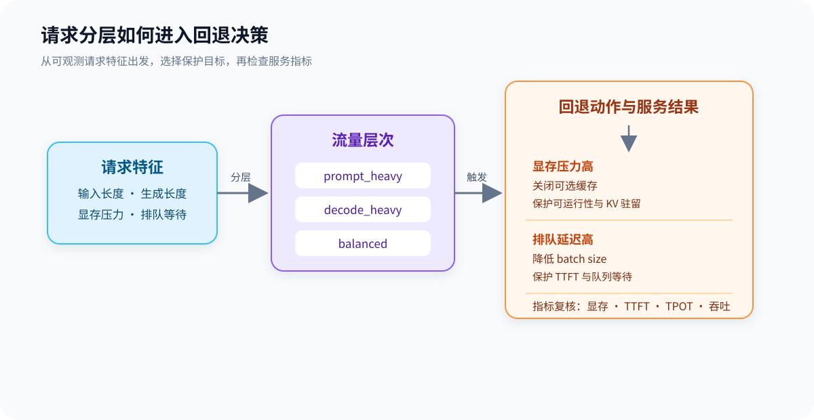

# 39. Inference Fallback and Tiers | 推理分层与回退策略
**难度：** Medium | **环境：** CPU-first | **标签：** `推理优化`, `推理服务`, `回退策略` | **目标人群：** 推理优化学习者

> 🚀 **云端运行环境**
>
> 本章节的实战代码可以点击以下链接在免费 GPU 算力平台上直接运行：
>
> [](https://colab.research.google.com/github/datawhalechina/llm-algo-leetcode/blob/main/02_PyTorch_Algorithms/39_Inference_Fallback_and_Tiers.ipynb)
> [](https://modelscope.cn/my/mynotebook) *(国内推荐：魔搭社区免费实例)*


---

## 本节导读

请求的输入长度、生成长度和当前资源压力不同，适合的 serving 策略也不同。`38` 讨论资源池如何拆分，本节进一步观察：请求如何分层，资源紧张时先采取什么退化动作，以及这些动作会怎样影响延迟与吞吐。

本节先把一个最小决策链跑通：从请求特征得到流量层次，根据显存和排队压力选择退化动作，再用服务指标检查这项动作是否保护了系统目标。学完后，你可以把 fallback 从经验规则写成可检查的输入、动作和结果。

**关键词：** `request mix`, `latency`, `throughput`, `fallback`

---

## 前置阅读

**导语：** 进入本节前，先能读出请求的输入规模、生成规模和当前排队状态，再观察这些信息如何进入回退决策。

- [36. Decode Scheduling | Decode 调度](./36_Decode_Scheduling.md)
- [37. KV Cache Scheduling | KV Cache 调度](./37_KV_Cache_Scheduling.md)
- [38. Prefill-Decode Disaggregation | PD 分离](./38_Prefill_Decode_Disaggregation.md)

---

### Step 1: 请求类型如何进入服务分层

请求分层先看两个可直接记录的输入：`prompt_tokens` 和 `decode_tokens`。它们分别近似表示输入处理压力与持续生成压力；把请求分成 `prompt_heavy`、`decode_heavy` 和 `balanced` 后，才能为后续回退动作选择观察重点。

| 请求层次 | 判断依据 | 主要风险 | 后续观察 |
|---|---|---|---|
| `prompt_heavy` | 输入长、生成短 | prefill 时间和输入访存 | TTFT、prefill 吞吐 |
| `decode_heavy` | 输入短、生成长 | KV Cache 驻留和排队 | TPOT、队列等待、显存 |
| `balanced` | 两者都未超过阈值 | 两类压力同时存在 | 端到端延迟与吞吐 |



### Step 2: 资源压力如何触发回退

资源压力进入决策后，回退动作应有稳定的优先级：先保护无法继续运行的资源约束，再处理排队延迟，压力解除时恢复当前计划。这里的策略是教学化的离散动作，重点是让输入条件、动作和保护目标一一对应。

| 触发信号 | 回退动作 | 优先保护的目标 | 需要记录的结果 |
|---|---|---|---|
| `memory_pressure > 0.9` | `disable_optional_cache` | KV Cache 驻留与可运行性 | 显存压力、失败请求数 |
| `queue_delay_ms > 100` | `reduce_batch_size` | 等待延迟 | TTFT、队列等待、吞吐 |
| 其他情况 | `keep_current_plan` | 稳定吞吐 | 当前计划和基线指标 |

### Step 3: 回退策略如何影响服务质量

回退不是单纯改变一个开关，而是用可接受的吞吐损失换取显存安全或延迟稳定。需要把请求层次和回退动作放在一起，检查当前动作保护了什么、牺牲了什么，以及是否值得继续保留。本节 CPU 实验只验证分层、策略选择和结果分类；真实延迟、吞吐与显存效果需要在固定 workload 和真实 backend 中复测。

| 观察维度 | 需要比较的结果 | 判断问题 |
|---|---|---|
| 可运行性 | 显存压力、失败请求数、OOM | 回退是否避免资源失控？ |
| 延迟 | `TTFT`、`TPOT`、`queue_delay_ms` | 等待和生成速度是否改善？ |
| 吞吐 | 请求或 token 吞吐 | 性能损失是否可接受？ |
| 工作负载 | 各层请求数量与比例 | 当前策略是否只适合某一类流量？ |


### Step 4: 实现分层、回退与结果评估

题目区把前面的输入、动作和结果落成三个函数，保持字段名称与 Step 1–3 的表格一致。
| 实现函数 | 输入 | 输出 | 验证重点 |
|---|---|---|---|
| `summarize_inference_tiers` | 请求长度与两个分类阈值 | 三类流量数量 | 数量守恒，阈值边界稳定 |
| `select_fallback_policy` | `memory_pressure`、`queue_delay_ms` | 回退动作与保护目标 | 显存压力优先于排队压力 |
| `evaluate_fallback_outcome` | 流量分层与回退动作 | 风险等级、保护动作和适用范围 | 结果能解释当前策略保护了什么 |

### 提示

- `TODO 1` 先把请求按 `prompt_heavy / decode_heavy / balanced` 分层，再统计数量。
- `TODO 2` 只需要根据 `memory_pressure` 和 `queue_delay_ms` 选择一个最小退化策略。
- `TODO 3` 先根据 fallback 动作确定保护目标，再结合请求分层标记风险等级和工作负载范围。


```python
from typing import Dict, List

```


```python
def summarize_inference_tiers(requests: List[Dict[str, int]], long_prompt_threshold: int, long_decode_threshold: int) -> Dict[str, int]:
    """
    TODO 1: 统计请求层次。
    """
    # 提示：先创建结果字典，再根据 prompt/decode 长度把请求分到三类里。
    # result = ???
    # if ???:
    #     result['prompt_heavy'] += 1
    # elif ???:
    #     result['decode_heavy'] += 1
    # else:
    #     result['balanced'] += 1
    raise NotImplementedError


def select_fallback_policy(system_state: Dict[str, float]) -> Dict[str, object]:
    """
    TODO 2: 根据资源压力选择退化策略。
    """
    # 提示：先判断 memory_pressure，再判断 queue_delay_ms，最后返回默认策略。
    # if ???:
    #     return {'policy': ???, 'priority': ???}
    raise NotImplementedError


def evaluate_fallback_outcome(summary: Dict[str, int], fallback: Dict[str, object]) -> Dict[str, object]:
    """
    TODO 3: 评估回退动作保护的目标和适用的流量范围。
    """
    # 提示：先根据 fallback policy 确定风险和保护目标，再结合 summary 标记流量范围。
    # risk_level = ???
    # action = ???
    raise NotImplementedError

```


```python
def test_inference_reserved_template():
    try:
        requests = [
            {'prompt_tokens': 3000, 'decode_tokens': 64},
            {'prompt_tokens': 128, 'decode_tokens': 512},
            {'prompt_tokens': 800, 'decode_tokens': 128},
        ]
        summary = summarize_inference_tiers(requests, long_prompt_threshold=2048, long_decode_threshold=256)
        assert summary == {'prompt_heavy': 1, 'decode_heavy': 1, 'balanced': 1}
        fallback = select_fallback_policy({'memory_pressure': 0.92, 'queue_delay_ms': 140})
        assert fallback['policy'] == 'disable_optional_cache'
        decision = evaluate_fallback_outcome(summary, fallback)
        assert decision == {'risk_level': 'memory', 'action': 'protect_residency', 'workload_scope': 'mixed'}
        print('测试通过：推理预留页模板可以工作。')
    except NotImplementedError:
        raise
    except (AttributeError, NameError, TypeError, ValueError, AssertionError) as e:
        raise NotImplementedError('请先完成 TODO 代码！') from e


test_inference_reserved_template()

```

---

🛑 **STOP HERE** 🛑
<br><br><br><br><br><br><br><br><br><br>
> 请先尝试自己完成代码并跑通测试。<br>
> 如果你正在 Colab 中运行，并且遇到困难没有思路，可以向下滚动查看参考答案。
<br><br><br><br><br><br><br><br><br><br>

---

## 参考代码与解析

### 代码


```python
def summarize_inference_tiers(requests: List[Dict[str, int]], long_prompt_threshold: int, long_decode_threshold: int) -> Dict[str, int]:
    """
    TODO 1: 统计请求层次。
    """
    # 提示：先创建结果字典，再根据 prompt/decode 长度把请求分到三类里。
    # result = ???
    # if ???:
    #     result['prompt_heavy'] += 1
    # elif ???:
    #     result['decode_heavy'] += 1
    # else:
    #     result['balanced'] += 1
    result = {'prompt_heavy': 0, 'decode_heavy': 0, 'balanced': 0}
    for request in requests:
        prompt_tokens = request.get('prompt_tokens', 0)
        decode_tokens = request.get('decode_tokens', 0)
        if prompt_tokens > long_prompt_threshold and decode_tokens <= long_decode_threshold:
            result['prompt_heavy'] += 1
        elif decode_tokens > long_decode_threshold and prompt_tokens <= long_prompt_threshold:
            result['decode_heavy'] += 1
        else:
            result['balanced'] += 1
    return result


def select_fallback_policy(system_state: Dict[str, float]) -> Dict[str, object]:
    """
    TODO 2: 根据资源压力选择退化策略。
    """
    # 提示：先判断 memory_pressure，再判断 queue_delay_ms，最后返回默认策略。
    # if ???:
    #     return {'policy': ???, 'priority': ???}
    if system_state.get('memory_pressure', 0.0) > 0.9:
        return {'policy': 'disable_optional_cache', 'priority': 'protect_residency'}
    if system_state.get('queue_delay_ms', 0.0) > 100:
        return {'policy': 'reduce_batch_size', 'priority': 'protect_latency'}
    return {'policy': 'keep_current_plan', 'priority': 'stable'}


def evaluate_fallback_outcome(summary: Dict[str, int], fallback: Dict[str, object]) -> Dict[str, object]:
    """
    TODO 3: 评估回退动作保护的目标和适用的流量范围。
    """
    # 提示：先根据 fallback policy 确定风险和保护目标，再结合 summary 标记流量范围。
    # risk_level = ???
    # action = ???
    policy = fallback.get('policy')
    if policy == 'disable_optional_cache':
        risk_level, action = 'memory', 'protect_residency'
    elif policy == 'reduce_batch_size':
        risk_level, action = 'latency', 'protect_latency'
    else:
        risk_level, action = 'stable', 'keep_current_plan'
    mixed = summary.get('prompt_heavy', 0) > 0 and summary.get('decode_heavy', 0) > 0
    return {'risk_level': risk_level, 'action': action, 'workload_scope': 'mixed' if mixed else 'single'}

```

### 解析

**1. TODO 1：统计请求层次**
- 先根据 `prompt_tokens` 和 `decode_tokens` 把请求分成 `prompt_heavy / decode_heavy / balanced` 三类。
- 这一步的目标是先看流量有没有明显分层，因为不同层次的请求通常不能共用同一套最优 serving 策略。

**2. TODO 2：根据资源压力选择退化策略**
- 先看 `memory_pressure`，再看 `queue_delay_ms`，最后再回到默认策略。
- 这一步回答的是“资源紧张时系统先牺牲什么”，把退化规则从隐含经验变成显式策略。

**3. TODO 3：评估回退动作的服务影响**
- 根据 `fallback['policy']` 标记当前主要风险和保护目标，再结合请求层次判断策略适用范围。
- 这一步不宣称真实性能提升；它为后续固定 workload 的 TTFT、TPOT、吞吐和显存复测生成清晰的记录入口。

**4. 这页的定位**
- 本节用最小输入、动作和结果说明 serving 回退如何保护可运行性与服务质量。
- 如果后续需要比较真实 backend 或复杂 workload，再把本节字段带入 benchmark。

## 相关阅读

完成请求分层、回退动作和结果评估后，可以继续阅读推理服务调度、资源隔离与真实 benchmark。

- [Orca 原论文：A Distributed Serving System for Transformer-Based Generative Models](https://www.usenix.org/conference/osdi22/presentation/yu)
- [vLLM 官方仓库](https://github.com/vllm-project/vllm)
- [vLLM 官方文档：Serving 指标与配置](https://docs.vllm.ai/en/latest/)
- [SGLang 官方仓库](https://github.com/sgl-project/sglang)
- [66. Inference Performance Comparison | 推理性能对比实验](./66_Inference_Performance_Comparison.md)
- [70. Serving Scheduler Benchmark | 服务调度基准](./70_Serving_Scheduler_Benchmark.md)
