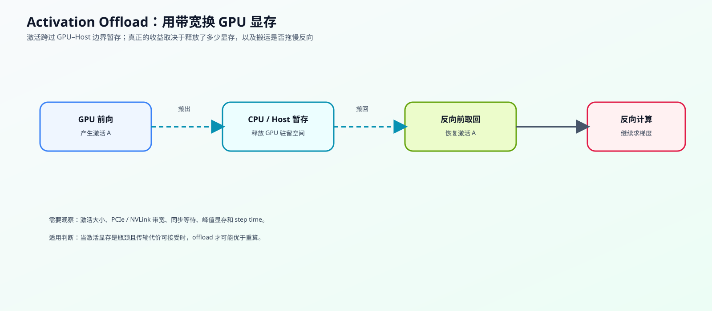
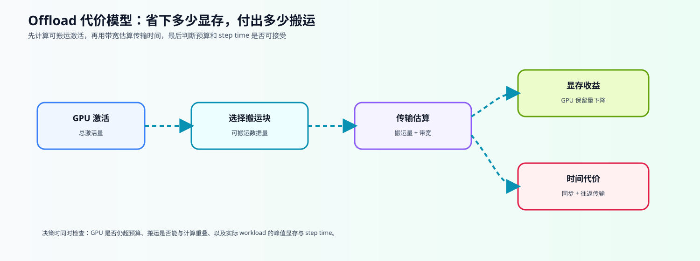

# 42. Activation Offload | 激活卸载

**难度：** Hard | **环境：** CPU-first

> 🚀 **云端运行环境**
>
> 本章节的实战代码可以点击以下链接在免费 GPU 算力平台上直接运行：
>
> [](https://colab.research.google.com/github/datawhalechina/llm-algo-leetcode/blob/main/02_PyTorch_Algorithms/42_Activation_Offload.ipynb)
> [](https://modelscope.cn/my/mynotebook) *(国内推荐：魔搭社区免费实例)*

**标签：** `显存优化`, `激活值`, `Offload` | **目标人群：** 显存优化学习者

---

## 本节导读

当 activation 占用超过 GPU 预算时，可以把暂时不用的激活搬到 CPU 或 host memory，并在反向传播需要时取回。本节从一块激活的生命周期出发，计算保留量、搬运量和理论传输时间，帮助你判断显存收益是否值得额外等待。

学习过程中，你会依次回答三个问题：哪些激活可以搬出 GPU、搬运需要付出多少带宽与同步代价、怎样用固定 workload 验证预算判断。完成后，你应该能够解释不同存储层级之间的移动，并把显存、step time 和吞吐放在同一张证据表中比较。

**关键词：** `offload`, `transfer`, `bandwidth`

---

## 前置阅读

**导语：** 进入本节前，先理解反向传播为什么需要激活状态，以及 checkpointing 如何通过重算减少驻留；随后观察 offload 如何通过设备间搬运释放 GPU 空间。

- [19. Activation Checkpointing | 激活检查点](./19_Activation_Checkpointing_and_Activation_Offload.md)
- [18. Activation and Loss Backward | 激活与损失反向](./18_Activation_and_Loss_Backward.md)
- [Part 01 · 03. GPU 物理架构与内存层级](../01_Hardware_Math_and_Systems/03_GPU_Architecture_and_Memory.md)

---
### Step 1: 核心思想与痛点

Activation Offload 处理的是“需要保留、但暂时不用”的 activation：前向后把它从 GPU 搬到 CPU 或 host memory，反向需要时再搬回。它释放的是 GPU 驻留空间，新增的是设备间传输和同步成本。先沿着前向结束、反向取回和策略组合三个阶段阅读表格，再看主图中的驻留路径。

| 训练阶段 | Offload 的动作 | 需要关注的成本 | 与 checkpoint 的区别 |
| --- | --- | --- | --- |
| 前向结束后 | 把暂时不用的 activation 搬出 GPU | 搬出时间、主机内存和同步 | checkpoint 选择少保存 |
| 反向开始前 | 按需把 activation 搬回 GPU | 搬回时间、带宽和等待 | checkpoint 重新执行前向 |
| 策略组合 | 与重算策略共同作用 | 搬运与重算代价可能叠加 | 需要固定 workload 验证 |
| 判断结果 | 显存是否回到预算内 | 释放空间是否值得新增代价 | 同时观察 peak memory、step time 和吞吐 |



### Step 2: 代价模型与边界

设一组激活块的总大小为 `A`，GPU 可用预算为 `B`，带宽为 `bw`。本步先把容量、搬运量和时间放进同一张账；这些数值用于解释机制，不代表真实 PCIe / NVLink 测量。



- 如果总激活量不超过 GPU 预算，理论上不需要 offload；如果超过预算，优先评估距离下一次使用较远且允许搬运的激活块。
- 单程理论时间等于搬运数据量除以假设带宽；真实反向通常还要考虑搬回 GPU 的往返流量。
- offload 不是越多越好：如果留在 GPU 的状态仍超过预算，方案不可行；如果搬运和同步时间过长，显存收益可能不值得。

### Step 3: 驻留选择与预算决策

offload 的决策可以拆成四个机制问题：哪些激活暂时不会被使用、哪些对象允许离开 GPU、搬出后 GPU 是否回到预算内、搬运时间是否值得这次显存收益。表格把这些问题映射到可观察量和判断结果；“距下一次使用的层数”只是教学模型中的冷热近似，不等同于真实运行时调度指标。

| 决策环节 | 需要回答的问题 | 本题中的观察量 | 读数如何解释 |
| --- | --- | --- | --- |
| 选择对象 | 哪些激活距离下一次使用较远，且允许搬运？ | 激活冷热程度、是否允许搬运 | 越冷越适合优先评估，但不等于真实调度顺序 |
| 计算容量 | 搬出后 GPU 是否回到预算内？ | 保留量、超预算量 | 仍然超预算表示当前计划不可行 |
| 计算搬运 | 为释放空间需要搬多少数据、多久？ | 搬运量、理论传输时间 | 理论时间还未包含完整往返和重叠 |
| 输出策略 | 收益和代价是否达到教学阈值？ | 可行性、节省比例、策略判断 | 这是预算模拟决策，不是 GPU 实测结论 |

### Step 4: 动手实战（预算模拟）

完成下面四个函数。先说明边界：本题只验证“预算不足时搬哪些块、理论上搬多少数据、估算单程和往返传输时间”，不创建 CUDA tensor，也不执行真实 CPU↔GPU copy。先用下表把机制概念、代码输入输出和验证重点对齐，完成后仍必须在 `76` 的真实 GPU benchmark 中验证。

例如总激活为 736 MiB、GPU 预算为 384 MiB，需要搬出 352 MiB；若假设带宽为 8 GiB/s，单程理论时间约为 `352 / 8 × 1000 = 44 ms`。真实训练还要考虑搬回 GPU 的另一程，以及 pinned memory、异步拷贝和重叠；这些因素不写入本题的纸面估算。

| 实现对象 | 作用与关键输入 | 输出或关键字段 | 验证重点 |
|---|---|---|---|
| `ActivationChunkSpec` | 描述激活块的大小、预计复用距离和是否允许搬运；`bytes_` 单位为 byte，`reuse_delay_layers` 单位为 layer | 激活块描述 | 非负大小、非负复用距离、名称可区分 |
| `summarize_activation_offload` | 按预算选择需要搬出的激活块；`gpu_budget_bytes` 为 byte，带宽按 GiB/s 解释 | 保留量、搬运量、单程理论时间、预算可行性 | `overflow_bytes`、`pressure_ratio`、`saved_ratio` 和名称列表 |
| `estimate_round_trip_transfer_ms` | 根据搬运量和假设带宽估算搬出与搬回的理论时间 | 往返时间，单位 ms | 往返系数、零字节和非法带宽 |
| `recommend_offload_policy` | 根据节省比例和理论时间阈值给出教学用策略判断 | `accept / tune / reject` | 先检查可行性，再检查收益与时间阈值 |
| `compare_offload_vs_checkpointing` | 用理论节省字节数除以理论额外时间比较两条路线 | 两个 score 与 `preferred` | 零时间、非负输入；结果不替代真实 benchmark |
### 提示

- `reuse_delay_layers` 是教学模型中的“距离下一次使用的层数”，不是硬件指标；数值越大，表示这块激活越冷。
- offload 先搬运冷块，但真实系统还要考虑反向访问顺序、pinned memory、异步拷贝、往返搬运、重叠和同步，这些不在本题模拟范围内。
- `bandwidth_gbps` 是理论有效带宽假设，代码按 GiB/s 解释；它不是 `nvidia-smi` 能直接给出的实测传输带宽。这里保留旧字段名以兼容示例，实际含义更接近 `bandwidth_gib_per_s`。
- 比较 offload 和 checkpointing 时，可以先看“单位时间省了多少显存”，但只有在预算可行、质量和吞吐都满足要求时才有工程意义。


```python
from dataclasses import dataclass

```


```python
@dataclass
class ActivationChunkSpec:
    """描述一个用于预算模拟的激活块。

    这里只记录选择依据和理论大小，不代表真实 CUDA tensor，也不包含 pinned memory、
    异步拷贝或实际生命周期。"""
    name: str  # 激活块名称，便于解释最终搬出/保留了谁
    bytes_: int  # 激活块大小，单位 byte
    reuse_delay_layers: int  # 距离下一次使用的预计层数，越大越冷
    offloadable: bool = True  # 是否允许本策略搬出

@dataclass
class ActivationOffloadSummary:
    """记录一次 offload 预算计划的容量、传输和可行性结果。

    `transfer_ms` 是单程理论时间；真实训练还要测量搬回、同步和重叠。
    `feasible` 只表示当前不可搬运状态没有超过 GPU 激活预算。"""
    total_bytes: int
    gpu_budget_bytes: int
    kept_bytes: int
    offloaded_bytes: int
    transfer_ms: float
    pressure_ratio: float
    saved_ratio: float
    offloaded_names: list
    kept_names: list
    feasible: bool
    overflow_bytes: int


def summarize_activation_offload(chunks, gpu_budget_bytes, bandwidth_gbps=12.0):
    """汇总一次 activation offload 预算计划，不执行真实 tensor 搬运。

    Args:
        chunks: ActivationChunkSpec 或等价 dict 的序列。
        gpu_budget_bytes: 允许保留在 GPU 的 activation 预算，单位 byte。
        bandwidth_gbps: 理论有效带宽，代码按 GiB/s 解释。

    Returns:
        ActivationOffloadSummary；feasible 表示不可搬运对象也没有超预算。
    """
    if gpu_budget_bytes <= 0:
        raise ValueError("gpu_budget_bytes must be positive")
    if bandwidth_gbps <= 0:
        raise ValueError("bandwidth_gbps must be positive")

    normalized = []
    for c in chunks:
        if isinstance(c, ActivationChunkSpec):
            normalized.append(c)
        elif isinstance(c, dict):
            normalized.append(ActivationChunkSpec(**c))
        else:
            raise TypeError("chunks must contain ActivationChunkSpec or dict")

    names = [c.name for c in normalized]
    if len(names) != len(set(names)):
        raise ValueError("chunk names must be unique")
    if any(c.bytes_ < 0 for c in normalized):
        raise ValueError("chunk bytes must be non-negative")
    if any(c.reuse_delay_layers < 0 for c in normalized):
        raise ValueError("reuse_delay_layers must be non-negative")

    total_bytes = sum(c.bytes_ for c in normalized)
    kept_bytes = total_bytes
    offloaded_names = []

    candidates = sorted(
        [c for c in normalized if c.offloadable],
        key=lambda c: (-c.reuse_delay_layers, -c.bytes_, c.name),
    )

    for chunk in candidates:
        if kept_bytes <= gpu_budget_bytes:
            break
        kept_bytes -= chunk.bytes_
        offloaded_names.append(chunk.name)

    kept_names = [c.name for c in normalized if c.name not in offloaded_names]

    # ==========================================
    # TODO 1: 汇总 offload 结果和显存/带宽指标
    # 提示：保持上面的选择结果不变，先算 offloaded_bytes = total_bytes - kept_bytes；
    # 再按 GiB/s 转成字节/秒，估算单程 transfer_ms，并补出 pressure_ratio / saved_ratio。
    # overflow_bytes > 0 时 feasible 必须为 False；total_bytes 为 0 时比例取 0。
    # ==========================================
    overflow_bytes = max(kept_bytes - gpu_budget_bytes, 0)
    feasible = overflow_bytes == 0
    # offloaded_bytes = ???
    # transfer_ms = ???
    # pressure_ratio = ???
    # saved_ratio = ???

    return ActivationOffloadSummary(
        total_bytes=total_bytes,
        gpu_budget_bytes=gpu_budget_bytes,
        kept_bytes=kept_bytes,
        offloaded_bytes=offloaded_bytes,
        transfer_ms=round(transfer_ms, 2),
        pressure_ratio=round(pressure_ratio, 3),
        saved_ratio=round(saved_ratio, 3),
        offloaded_names=offloaded_names,
        kept_names=kept_names,
        feasible=feasible,
        overflow_bytes=overflow_bytes,
    )


def estimate_round_trip_transfer_ms(offloaded_bytes: int, bandwidth_gbps: float):
    """估算 activation 搬出 GPU 再搬回的理论时间，不执行真实 copy。

    Args:
        offloaded_bytes: 单次搬运的数据量，单位 byte。
        bandwidth_gbps: 假设有效带宽，代码按 GiB/s 解释。

    Returns:
        搬出加搬回的理论时间，单位 ms；不包含同步和重叠效果。"""
    if offloaded_bytes < 0:
        raise ValueError("offloaded_bytes must be non-negative")
    if bandwidth_gbps <= 0:
        raise ValueError("bandwidth_gbps must be positive")

    # ==========================================
    # TODO 2: 计算往返搬运时间
    # 提示：单程是 bytes / (bandwidth_gbps * 2**30)，
    # 往返需要乘以 2，并换算为毫秒；输入为 0 时返回 0.0。
    # return_ms = ???
    # ==========================================
    pass


def recommend_offload_policy(summary: ActivationOffloadSummary, min_saved_ratio=0.25, max_transfer_ms=60.0):
    """根据教学阈值返回策略建议。

    Args:
        summary: summarize_activation_offload 返回的预算摘要。
        min_saved_ratio: 教学用最低显存节省比例。
        max_transfer_ms: 教学用单程理论传输时间上限。

    Returns:
        'accept'、'tune' 或 'reject'；不代表真实工程决策。
    """
    if summary.offloaded_bytes <= 0:
        return "reject"
    if min_saved_ratio < 0 or max_transfer_ms < 0:
        raise ValueError("policy thresholds must be non-negative")

    if not summary.feasible:
        return "reject"
    # ==========================================
    # TODO 3: 补全策略判断逻辑
    # 提示：先拒绝不可行方案，再检查 saved_ratio 和 transfer_ms；
    # 收益达到阈值且传输可接受时 accept，达到放宽后的教学阈值时 tune，
    # 其余情况 reject。不要把这个教学决策写成真实 GPU 结论。
    # ==========================================
    # if ???:
    #     return "accept"
    # if ???:
    #     return "tune"

    return "reject"


def compare_offload_vs_checkpointing(offload_summary: ActivationOffloadSummary, checkpoint_saved_bytes, checkpoint_extra_ms):
    """用理论节省字节数除以理论额外代价做教学比较。

    Args:
        offload_summary: offload 预算摘要。
        checkpoint_saved_bytes: checkpoint 理论节省字节数。
        checkpoint_extra_ms: checkpoint 理论额外时间，单位 ms。

    Returns:
        包含两种 score 和 preferred 的字典；不替代真实 benchmark。
    """
    if checkpoint_saved_bytes < 0 or checkpoint_extra_ms < 0:
        raise ValueError("checkpoint values must be non-negative")
    # ==========================================
    # TODO 4: 完成 offload 与 checkpointing 的性价比比较
    # 提示：只比较“理论节省字节数 / 理论额外时间”；
    # offload 使用 offloaded_bytes / transfer_ms，checkpoint 使用
    # checkpoint_saved_bytes / checkpoint_extra_ms。使用 max(..., 1e-6)
    # 处理零时间，返回 score 更大的 preferred。
    # ==========================================
    # offload_score = ???
    # checkpoint_score = ???
    # preferred = ???
    return {
        "offload_score": round(offload_score, 3),
        "checkpoint_score": round(checkpoint_score, 3),
        "preferred": preferred,
    }

```

### 测试

运行下面的测试，检查你的 offload 计划、策略判断和路线比较是否正确。

```python
def test_activation_offload():
    try:
        chunks = [
            ActivationChunkSpec("embed", 256 * 1024 * 1024, 0),
            ActivationChunkSpec("mid_a", 192 * 1024 * 1024, 2),
            ActivationChunkSpec("mid_b", 160 * 1024 * 1024, 3),
            ActivationChunkSpec("tail", 128 * 1024 * 1024, 1),
        ]
        summary = summarize_activation_offload(chunks, gpu_budget_bytes=384 * 1024 * 1024, bandwidth_gbps=8.0)
        assert summary.total_bytes == 736 * 1024 * 1024
        assert summary.offloaded_bytes == 352 * 1024 * 1024
        assert summary.kept_bytes == 384 * 1024 * 1024
        assert summary.offloaded_names == ["mid_b", "mid_a"]
        assert summary.kept_names == ["embed", "tail"]
        assert 42.0 < summary.transfer_ms < 44.0
        assert 0.47 < summary.saved_ratio < 0.49
        assert estimate_round_trip_transfer_ms(summary.offloaded_bytes, 8.0) == 85.94
        assert recommend_offload_policy(summary) == "accept"

        tuned = summarize_activation_offload(chunks, gpu_budget_bytes=384 * 1024 * 1024, bandwidth_gbps=4.0)
        assert recommend_offload_policy(tuned) == "tune"

        rejected = summarize_activation_offload(chunks, gpu_budget_bytes=384 * 1024 * 1024, bandwidth_gbps=1.0)
        assert recommend_offload_policy(rejected) == "reject"

        empty = summarize_activation_offload(chunks, gpu_budget_bytes=1024 * 1024 * 1024, bandwidth_gbps=8.0)
        assert empty.offloaded_bytes == 0
        assert empty.feasible is True
        assert empty.overflow_bytes == 0
        assert recommend_offload_policy(empty) == "reject"

        blocked = summarize_activation_offload(
            [ActivationChunkSpec("fixed", 512 * 1024 * 1024, 0, offloadable=False)],
            gpu_budget_bytes=256 * 1024 * 1024,
            bandwidth_gbps=8.0,
        )
        assert blocked.feasible is False
        assert blocked.overflow_bytes == 256 * 1024 * 1024
        assert recommend_offload_policy(blocked) == "reject"

        invalid_specs = [
            [ActivationChunkSpec("bad", -1, 0)],
            [ActivationChunkSpec("bad", 1, -1)],
            [ActivationChunkSpec("dup", 1, 0), ActivationChunkSpec("dup", 1, 1)],
        ]
        for invalid in invalid_specs:
            try:
                summarize_activation_offload(invalid, gpu_budget_bytes=1, bandwidth_gbps=1.0)
            except ValueError:
                pass
            else:
                raise AssertionError("invalid activation metadata should be rejected")

        better_offload = compare_offload_vs_checkpointing(summary, checkpoint_saved_bytes=300 * 1024 * 1024, checkpoint_extra_ms=80.0)
        assert better_offload["preferred"] == "offload"

        better_ckpt = compare_offload_vs_checkpointing(summary, checkpoint_saved_bytes=500 * 1024 * 1024, checkpoint_extra_ms=20.0)
        assert better_ckpt["preferred"] == "checkpointing"

        for kwargs in [
            {"min_saved_ratio": -0.1},
            {"max_transfer_ms": -1.0},
        ]:
            try:
                recommend_offload_policy(summary, **kwargs)
            except ValueError:
                pass
            else:
                raise AssertionError("negative policy thresholds should be rejected")

        for args in [
            (summary, -1, 10.0),
            (summary, 100, -1.0),
        ]:
            try:
                compare_offload_vs_checkpointing(*args)
            except ValueError:
                pass
            else:
                raise AssertionError("negative checkpoint values should be rejected")
        print("✅ 预算模拟验证通过：offload 计划、可行性和教学策略判断符合预期。")
        print("证据边界：这是理论预算模拟，不是实际 CPU↔GPU 搬运或真实 step time 测量。")
    except NotImplementedError:
        print("请先完成 TODO 部分的代码！")
        raise
    except Exception as e:
        print(f"❌ 测试失败: {e}")
        raise


test_activation_offload()
```

---

🛑 **STOP HERE** 🛑
<br><br><br><br><br><br><br><br><br><br>
> 请先尝试自己完成代码并跑通测试。<br>
> 如果你正在 Colab 中运行，并且遇到困难没有思路，可以向下滚动查看参考答案。
<br><br><br><br><br><br><br><br><br><br>

---
## 参考代码与解析

### 代码

```python
@dataclass
class ActivationChunkSpec:
    name: str  # 激活块名称，便于解释最终搬出/保留了谁
    bytes_: int  # 激活块大小，单位 byte
    reuse_delay_layers: int  # 距离下一次使用的预计层数，越大越冷
    offloadable: bool = True  # 是否允许本策略搬出

@dataclass
class ActivationOffloadSummary:
    """记录一次 offload 预算计划的容量、传输和可行性结果。

    `transfer_ms` 是单程理论时间；真实训练还要测量搬回、同步和重叠。
    `feasible` 只表示当前不可搬运状态没有超过 GPU 激活预算。"""
    total_bytes: int
    gpu_budget_bytes: int
    kept_bytes: int
    offloaded_bytes: int
    transfer_ms: float
    pressure_ratio: float
    saved_ratio: float
    offloaded_names: list
    kept_names: list
    feasible: bool
    overflow_bytes: int


def summarize_activation_offload(chunks, gpu_budget_bytes, bandwidth_gbps=12.0):
    """汇总一次 activation offload 预算计划，不执行真实 tensor 搬运。

    Args:
        chunks: ActivationChunkSpec 或等价 dict 的序列。
        gpu_budget_bytes: GPU activation 预算，单位 byte。
        bandwidth_gbps: 理论有效带宽，代码按 GiB/s 解释。

    Returns:
        ActivationOffloadSummary；feasible 表示最终保留量未超过预算。
    """
    if gpu_budget_bytes <= 0:
        raise ValueError("gpu_budget_bytes must be positive")
    if bandwidth_gbps <= 0:
        raise ValueError("bandwidth_gbps must be positive")

    normalized = []
    for c in chunks:
        if isinstance(c, ActivationChunkSpec):
            normalized.append(c)
        elif isinstance(c, dict):
            normalized.append(ActivationChunkSpec(**c))
        else:
            raise TypeError("chunks must contain ActivationChunkSpec or dict")

    names = [c.name for c in normalized]
    if len(names) != len(set(names)):
        raise ValueError("chunk names must be unique")
    if any(c.bytes_ < 0 for c in normalized):
        raise ValueError("chunk bytes must be non-negative")
    if any(c.reuse_delay_layers < 0 for c in normalized):
        raise ValueError("reuse_delay_layers must be non-negative")

    total_bytes = sum(c.bytes_ for c in normalized)
    kept_bytes = total_bytes
    offloaded_names = []

    candidates = sorted(
        [c for c in normalized if c.offloadable],
        key=lambda c: (-c.reuse_delay_layers, -c.bytes_, c.name),
    )

    for chunk in candidates:
        if kept_bytes <= gpu_budget_bytes:
            break
        kept_bytes -= chunk.bytes_
        offloaded_names.append(chunk.name)

    kept_names = [c.name for c in normalized if c.name not in offloaded_names]

    # ==========================================
    # TODO 1: 汇总 offload 结果和显存/带宽指标
    # 提示：先算 offloaded_bytes = total_bytes - kept_bytes，
    # 再根据带宽估算 transfer_ms，并补出 pressure_ratio / saved_ratio；
    # overflow_bytes > 0 时 feasible 必须为 False。
    # ==========================================
    overflow_bytes = max(kept_bytes - gpu_budget_bytes, 0)
    feasible = overflow_bytes == 0
    offloaded_bytes = total_bytes - kept_bytes
    transfer_ms = offloaded_bytes / (bandwidth_gbps * (1024 ** 3)) * 1000 if offloaded_bytes else 0.0
    pressure_ratio = total_bytes / gpu_budget_bytes
    saved_ratio = offloaded_bytes / total_bytes if total_bytes else 0.0

    return ActivationOffloadSummary(
        total_bytes=total_bytes,
        gpu_budget_bytes=gpu_budget_bytes,
        kept_bytes=kept_bytes,
        offloaded_bytes=offloaded_bytes,
        transfer_ms=round(transfer_ms, 2),
        pressure_ratio=round(pressure_ratio, 3),
        saved_ratio=round(saved_ratio, 3),
        offloaded_names=offloaded_names,
        kept_names=kept_names,
        feasible=feasible,
        overflow_bytes=overflow_bytes,
    )


def estimate_round_trip_transfer_ms(offloaded_bytes: int, bandwidth_gbps: float):
    """估算 activation 搬出 GPU 再搬回的理论时间，不执行真实 copy。

    Args:
        offloaded_bytes: 单次搬运的数据量，单位 byte。
        bandwidth_gbps: 假设有效带宽，代码按 GiB/s 解释。

    Returns:
        搬出加搬回的理论时间，单位 ms；不包含同步和重叠效果。"""
    if offloaded_bytes < 0:
        raise ValueError("offloaded_bytes must be non-negative")
    if bandwidth_gbps <= 0:
        raise ValueError("bandwidth_gbps must be positive")
    one_way_ms = offloaded_bytes / (bandwidth_gbps * (1024 ** 3)) * 1000
    return round(2 * one_way_ms, 2)


def recommend_offload_policy(summary: ActivationOffloadSummary, min_saved_ratio=0.25, max_transfer_ms=60.0):
    """根据教学阈值返回策略建议。

    Args:
        summary: summarize_activation_offload 返回的预算摘要。
        min_saved_ratio: 教学用最低显存节省比例。
        max_transfer_ms: 教学用单程理论传输时间上限。

    Returns:
        'accept'、'tune' 或 'reject'；不代表真实工程决策。
    """
    if summary.offloaded_bytes <= 0:
        return "reject"
    if min_saved_ratio < 0 or max_transfer_ms < 0:
        raise ValueError("policy thresholds must be non-negative")

    # ==========================================
    # TODO 3: 补全策略判断逻辑
    # 提示：先拒绝不可行方案，再检查 saved_ratio 和 transfer_ms；
    # 收益达到阈值且传输可接受时 accept，边界放宽时 tune，其余 reject。
    # ==========================================
    if not summary.feasible:
        return "reject"
    if summary.kept_bytes <= summary.gpu_budget_bytes and summary.saved_ratio >= min_saved_ratio and summary.transfer_ms <= max_transfer_ms:
        return "accept"
    if summary.saved_ratio >= min_saved_ratio / 2 and summary.transfer_ms <= max_transfer_ms * 2:
        return "tune"

    return "reject"


def compare_offload_vs_checkpointing(offload_summary: ActivationOffloadSummary, checkpoint_saved_bytes, checkpoint_extra_ms):
    """用理论节省字节数除以理论额外代价做教学比较。

    Args:
        offload_summary: offload 预算摘要。
        checkpoint_saved_bytes: checkpoint 理论节省字节数。
        checkpoint_extra_ms: checkpoint 理论额外时间，单位 ms。

    Returns:
        包含两种 score 和 preferred 的字典；不替代真实 benchmark。
    """
    if checkpoint_saved_bytes < 0 or checkpoint_extra_ms < 0:
        raise ValueError("checkpoint values must be non-negative")
    # ==========================================
    # TODO 4: 完成 offload 与 checkpointing 的性价比比较
    # 提示：只比较“理论节省字节数 / 理论额外时间”；
    # offload 使用 offloaded_bytes / transfer_ms，checkpoint 使用
    # checkpoint_saved_bytes / checkpoint_extra_ms，返回 score 更大的 preferred。
    # ==========================================
    offload_score = offload_summary.offloaded_bytes / max(offload_summary.transfer_ms, 1e-6)
    checkpoint_score = checkpoint_saved_bytes / max(checkpoint_extra_ms, 1e-6)
    preferred = "offload" if offload_score >= checkpoint_score else "checkpointing"
    return {
        "offload_score": round(offload_score, 3),
        "checkpoint_score": round(checkpoint_score, 3),
        "preferred": preferred,
    }
```

### 解析

**1. TODO 1：汇总 offload 结果和显存/带宽指标**
- **实现方式**：先用 `offloaded_bytes = total_bytes - kept_bytes` 得到本题预算模型中的搬运量，再按假设带宽估算 `transfer_ms`，最后补出 `pressure_ratio` 和 `saved_ratio`。它不是实际 CUDA copy 的测量值。
- **关键点**：`kept_bytes` 反映 offload 后还留在 GPU 上的激活量，`offloaded_bytes` 反映这次计划实际搬走了多少。
- **工程意义**：这一组指标把“省了多少显存”和“付出了多少搬运代价”放到同一张账上，是后面做策略判断的前提。

**2. TODO 2：估算往返搬运时间**
- **实现方式**：单程时间按 `offloaded_bytes / bandwidth` 估算，搬出和搬回各发生一次，因此往返时间约为单程的两倍。
- **关键点**：这是理论搬运时间，不包含 pinned memory、异步拷贝、传输重叠和同步调度。
- **工程意义**：第二张图中的“搬出 → 搬回”是完整生命周期；只看搬出时间会低估 offload 的代价。

**3. TODO 3：补全策略判断逻辑**
- **实现方式**：先排除“根本没有发生 offload”的情况，再按“收益足够且搬运可接受”判断 `accept`，最后把“有收益但还不够稳”的情况归到 `tune`。
- **关键点**：这里不是只看显存节省，也不是只看搬运时间，而是两者一起看。
- **工程意义**：offload 不是默认值得做的优化；只有当显存确实被压进预算，且传输成本没有吞掉收益时，才值得接受。

**4. TODO 4：完成 offload 与 checkpointing 的性价比比较**
- **实现方式**：两条路线都按“节省字节数 / 额外时间”计算一个最小 score，再比较谁更大。
- **关键点**：`offload_score` 近似表示“单位搬运时间换回多少显存”，`checkpoint_score` 近似表示“单位重算时间换回多少显存”。
- **工程意义**：这不是精确性能模型，而是一个最小决策框架，帮助你判断当前瓶颈更像带宽问题还是重算问题。
## 相关阅读

Offload 适合放回显存预算和性能证据链中理解：先看设备间传输机制，再用真实 workload 判断显存收益是否值得时延代价。

- [PyTorch `saved_tensors_hooks` 官方文档](https://pytorch.org/docs/stable/autograd.html#saved-tensors-hooks)
- [ZeRO-Infinity 原论文：状态分层与 Offload 扩展](https://arxiv.org/abs/2104.07857)
- [DeepSpeed Activation Checkpointing 文档：与重算路线对照](https://deepspeed.readthedocs.io/en/latest/activation-checkpointing.html)
- [Part 01 · 07. CPU/GPU 异构调度](../01_Hardware_Math_and_Systems/07_CPU_GPU_Heterogeneous_Scheduling.md)
- [19. 激活检查点与激活卸载](./19_Activation_Checkpointing_and_Activation_Offload.md)
- [73. 训练性能分析](./73_Training_Performance_Analysis.md)
- [75. 显存预算压缩项目](./75_Memory_Budget_Compression_Project.md)
- [76. Checkpoint 与 Offload 对比项目](./76_Activation_Checkpoint_Offload_Benchmark.md)
