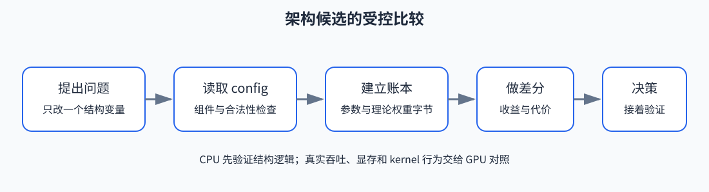
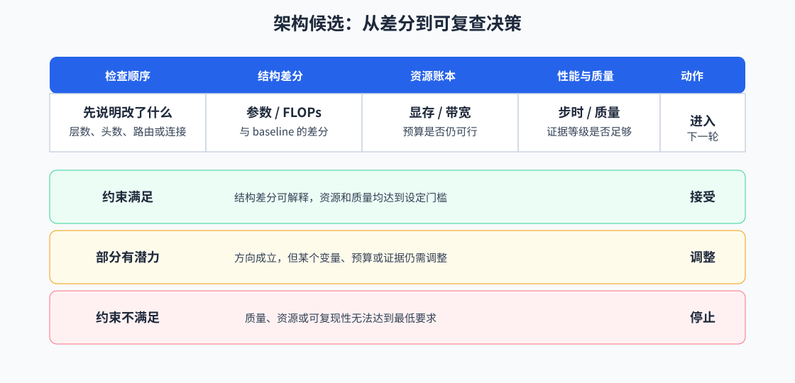

# 61. Model Architecture Exploration | 架构验证
**难度：** Hard | **环境：** CPU-first | **标签：** `模型结构`, `架构验证`, `项目评估` | **目标人群：** 项目决策练习者

> 🚀 **云端运行环境**
>
> 本章节的实战代码可以点击以下链接在免费 GPU 算力平台上直接运行：
>
> [](https://colab.research.google.com/github/datawhalechina/llm-algo-leetcode/blob/main/02_PyTorch_Algorithms/61_Model_Architecture_Exploration.ipynb)
> [](https://modelscope.cn/my/mynotebook) *(国内推荐：魔搭社区免费实例)*


---

## 本节导读

本节承接第 05 节的 Decoder Layer 组合小项目，把“一个结构能否正确实现”推进为“候选结构是否值得继续投入”。先固定 baseline、训练预算和部署边界，再比较候选结构的参数量、吞吐、loss、显存和实现复杂度。最终输出一份结构差异表，并说明候选方案应接受、调整还是淘汰。

实验先在 CPU 上完成结构解析、参数账本和候选决策，再用可选 GPU 扩展读取真实模型 config、检查模块，并在固定 workload 下记录资源。

重点覆盖结构字段、MHA/GQA/MQA、Attention/FFN/Norm/Embedding 参数组成，以及 LoRA target modules 与结构的关系；Sparse / Linear Attention 在这里作为候选结构登记，完整训练交付、数据质量和 QLoRA 选型可继续连接到 60、64 和 65。

**关键词：** `baseline`, `candidate`, `architecture`, `trade-off`, `delivery`

---
## 前置阅读

**导语：** 进入本项目前，先能读出 Decoder Layer 的模块组成和参数来源，再比较结构改动是否值得继续训练或部署。

- [05. LLaMA3 Block Tutorial | LLaMA3 Block 教程](./05_LLaMA3_Block_Tutorial.md)
- [08. Architecture Tricks | 架构技巧](./08_Architecture_Tricks.md)
- [09. SFT Training Loop | SFT 训练循环](./09_SFT_Training_Loop.md)
- [13. End-to-End Fine-Tuning Experiment | 端到端微调实验](./13_End_to_End_Fine_Tuning_Experiment.md)


### Step 1（项目设计）：明确问题与实验目的

本节默认你已经看过 Block、Attention 和最小训练循环；现在不要求你发明新模型，而是练习判断一个结构改动是否值得进入下一轮实验。先写一条可检验的问题，例如“把 MHA 改成 GQA，能否在不超过参数预算的前提下减少 KV 投影规模”。

建立一份实验卡：baseline 结构、候选改动、训练数据、batch、seq_len、优化器、步数和评测指标。CPU 阶段只比较结构账本和预先给出的指标，不把示例数字当作真实训练结果。

| 实验要素 | 本节怎么填写 | 作用 |
|:---|:---|:---|
| 研究变量 | MHA/GQA/MQA、`intermediate_size`、层数或 `tie_word_embeddings` 之一 | 说明这轮只研究什么变化 |
| 固定条件 | 模型、数据、dtype、batch、seq_len、训练步数和评测口径 | 防止把多个变化混成一个结论 |
| 观察指标 | 参数量、理论权重字节数；GPU 扩展再记录步时、峰值显存和任务质量 | 连接结构变化与资源/效果 |
| 产物 | 结构 profile、组件账本、baseline/candidate 差分和下一步动作 | 让别人能复查选择 |


<div align="center"><strong>架构候选的受控比较：</strong>先固定条件并建立账本，再用差分结果决定是否进入 GPU 验证。</div>

### Step 2（项目设计）：固定 baseline 与比较条件

读取 hidden size、layer 数、Attention heads、KV heads、intermediate size 和 vocab size，并把参数拆成 embedding、attention、MLP、norm、lm_head。对每个组件记录公式、参数量和 dtype 字节数；这样候选结构改变时，能指出变化来自哪一部分。账本是容量下界，不包含 activation、workspace 或 allocator reserved。

### Step 3（项目设计）：确定机制、指标与候选方案

用小字典模拟一个模型 config，检查正数约束、hidden size 与 head 数的整除关系，以及 KV heads 是否能被 Attention heads 整除。随后把 `q_proj`、`k_proj`、`v_proj`、`o_proj` 或 FFN 投影登记为候选 target modules，并报告缺失名称；这里只检查结构接口，不加载权重，也不实现新的 kernel。

| 结构字段 | 影响的组件 | 账本中观察什么 | 仍需真实验证什么 |
|:---|:---|:---|:---|
| `num_attention_heads` / `num_key_value_heads` | Q/K/V 投影与每层 Attention | Q 投影、KV 投影规模及 MHA/GQA/MQA 类型 | Attention kernel、decode 带宽、实际 KV Cache 占用 |
| `intermediate_size` | FFN / SwiGLU | MLP 参数量与权重下界 | FFN kernel 吞吐、激活峰值 |
| `num_hidden_layers` | Attention、FFN、Norm 的层数 | 组件参数随层数的变化 | 端到端步时、workspace 和峰值显存 |
| `tie_word_embeddings` | Embedding 与 LM Head | 是否重复计算输出头参数 | 真实 checkpoint 是否共享权重 |

### Step 4（项目设计）：确定报告字段与证据来源

把 baseline 当作参照物，而不是一行示例数字。检查它是否同时有 `params`、`memory_mb`、`step_time_ms`、`score` 和 `deploy_cost`，并确认每个字段的单位和方向已经约定。缺字段时报告问题，不替它补一个看似合理的 GPU 数字。

只有 baseline 口径完整，candidate 的差分才有意义；真实 GPU 的峰值显存、吞吐和 kernel 行为留给可选扩展。

### Step 5（CPU）：实现架构账本与候选比较

对每个 candidate 统一计算 `candidate - baseline`：参数、显存、步时、得分和部署成本分别记录正负方向。再用参数预算、显存上限、步时增量和部署成本上限过滤候选。

这里的 `score` 只是可比较的项目输入，不等于模型能力结论。候选若只提高分数却超出资源或部署约束，应进入 `tune`；没有候选满足全部约束时，应保留失败原因。

### Step 6（项目决策）：给出下一步动作

把候选表、差分表和约束检查合成一条决策：`accept` 表示可以进入扩展评测，`tune` 表示要调整结构范围或预算，`reject` 表示当前证据下不值得继续。

CPU 结论只能说明结构假设和账本是否自洽；若要声称真实吞吐、峰值显存或 kernel 收益，必须在同一模型、数据、dtype 和硬件上运行 GPU 对照。

<div align="center"><strong>架构项目的证据分流：</strong>Step 6 根据约束和证据等级决定进入扩展评测、调整变量，还是停止当前方案。</div>

`61` 不重复实现基础模块，而是把前面几节已经讲过的组件收成一份可比较的结构验证报告。


前面的 04、05、08、09、13 分别提供 Attention、Block、架构约束、训练输入和评测口径；Step 6 将这些信息收成 baseline/candidate 对照和交付决策。

项目页最小产物：

| 模块 | 必须记录 | 用途 |
|:---|:---|:---|
| baseline | 参数量、显存、step time、核心 score | 保证比较合法 |
| candidate | 改动模块、参数变化、资源变化 | 解释结构收益来源 |
| 对比 | score delta、memory delta、部署影响 | 判断是否值得 adopt |
| 决策 | accept / tune / reject | 输出项目结论 |

### 参数口径说明

本节主要是 CPU-first 决策模板，没有真实模型运行配置。`baseline` 固定为参照结构；candidate 的 `changed_modules` 只描述改动位置，`params`、`memory_mb`、`step_time_ms` 和 `score` 分别表示参数量、显存、步时和任务得分；`deploy_cost` 表示实现或部署额外成本。比较 candidate 时一次只改变结构变量，不能同时改变数据、训练步数和评测口径。

**LoRA 插入点的边界：** `q_proj`、`k_proj`、`v_proj`、`o_proj` 属于 Attention 投影，`gate_proj`、`up_proj`、`down_proj` 属于 FFN 投影；它们用于描述候选改动范围，不代表本节已经完成 LoRA 训练。需要训练和适配器产物时转到 60，需要比较不同 target modules 时转到 63，需要低比特基座时转到 65。


```python
from typing import Dict, List

```


```python
# 7 个连续的核心 TODO：从结构读取走到项目决策
# 目标：把结构变体转成可检查、可比较的项目报告；CPU 数字是估算，不是 GPU 实测。
# 这些 TODO 只改变结构字段或决策输入，不实现新的 Attention kernel，也不模拟真实 GPU 吞吐。
# TODO 1：从模型 config 提取结构字段
def extract_architecture_profile(config: Dict[str, object]) -> Dict[str, object]:
    """提取结构字段，并根据 Attention/KV heads 判断 MHA、GQA 或 MQA。

    返回值至少包含 head_dim、attention_type 和 tie_word_embeddings。
    """
    # 提示：num_key_value_heads 缺省时按 num_attention_heads 处理。
    # num_attention_heads = ???；num_key_value_heads = ???；head_dim = ???；attention_type = ???。
    raise NotImplementedError("请先完成 TODO 代码！")
# TODO 2：检查结构字段和 Attention 头数是否合法
def validate_architecture_profile(profile: Dict[str, object]) -> Dict[str, object]:
    """检查字段完整性、正数约束和两组 head 的整除关系。

    返回 {'ready': bool, 'issues': list[str]}，不能只返回一个布尔值。
    """
    # 提示：hidden_size % num_attention_heads == 0；
    #       num_attention_heads % num_key_value_heads == 0。
    # required_keys = ???；issues = ???；ready = ???。
    raise NotImplementedError("请先完成 TODO 代码！")
# TODO 3：建立组件级参数与理论权重账本
def build_architecture_parameter_ledger(profile: Dict[str, object], dtype_bytes: int = 2) -> Dict[str, object]:
    """拆分 Embedding、Attention、MLP、Norm 和 lm_head 的理论账本。

    tie_word_embeddings=True 时不重复计算 lm_head；结果是 CPU 理论估算。
    """
    # 提示：KV 投影使用 num_key_value_heads；不包含 activation、workspace 或 allocator。
    # component_params = ???；weight_bytes = ???；total_bytes = ???。
    raise NotImplementedError("请先完成 TODO 代码！")

# TODO 4：检查 baseline 口径是否合法

def validate_architecture_baseline(baseline: Dict[str, object]) -> Dict[str, object]:
    """检查 baseline 的参数、资源、得分和部署成本字段。

    缺失字段进入 issues；不要替候选补默认分数或虚构 GPU 指标。
    """
    # 提示：至少检查 name、params、memory_mb、step_time_ms、score 和 deploy_cost。
    # required_keys = ???；missing_keys = ???；issues = ???。
    raise NotImplementedError("请先完成 TODO 代码！")

# TODO 5：汇总候选摘要
def summarize_architecture_candidates(candidates: List[Dict[str, object]], baseline_params: int) -> Dict[str, object]:
    """汇总候选数量、参数变化和可比较的候选名称。

    参数变化相对 baseline_params 计算；score 只是输入字段，不等于真实任务质量。
    """
    # 提示：至少输出 candidate_count、valid_count、invalid_names 和 summaries。
    # valid_candidates = ???；invalid_names = ???；summaries = ???。
    raise NotImplementedError("请先完成 TODO 代码！")

# TODO 6：计算 baseline 和 candidate 的差分
def compare_architecture_pair(baseline: Dict[str, object], candidate: Dict[str, object]) -> Dict[str, object]:
    """计算 candidate 相对 baseline 的参数、资源、得分和部署成本差分。

    统一使用 candidate - baseline，并保留字段名让调用方能解释正负方向。
    """
    # 提示：不要把负的 memory_delta 写成显存增加。
    # params_delta = ???；memory_delta = ???；score_delta = ???；deploy_delta = ???。
    raise NotImplementedError("请先完成 TODO 代码！")

# TODO 7：输出项目推荐结论
def recommend_candidate(baseline: Dict[str, object], candidates: List[Dict[str, object]], param_budget: int, max_deploy_delta: float, max_memory_delta_mb: int = 0, max_step_time_delta_ms: float = 0.0) -> Dict[str, object]:
    """按参数、部署成本、显存和步时约束输出 accept/tune/reject。

    没有满足全部约束的候选时返回 recommended_name=None，并给出下一步动作。
    """
    # 提示：先校验 baseline 和候选，再过滤；GPU 指标缺失时不能伪造。
    # feasible = ???；recommended_name = ???；decision = ???；next_action = ???。
    raise NotImplementedError("请先完成 TODO 代码！")

```


```python
# 测试你的实现
def test_architecture_project_template():
    profile = extract_architecture_profile({
        'hidden_size': 16, 'num_hidden_layers': 2,
        'num_attention_heads': 4, 'num_key_value_heads': 2,
        'intermediate_size': 32, 'vocab_size': 100,
    })
    assert profile['head_dim'] == 4
    assert profile['attention_type'] == 'GQA'
    assert validate_architecture_profile(profile)['ready'] is True
    ledger = build_architecture_parameter_ledger(profile, dtype_bytes=2)
    assert ledger['attention_params'] == 2 * (16 * 16 + 2 * 16 * 2 * 4 + 16 * 16)
    assert ledger['mlp_params'] == 2 * 3 * 16 * 32
    assert ledger['evidence_level'] == 'cpu_theoretical_estimate'
    invalid_profile = dict(profile, num_key_value_heads=3)
    assert validate_architecture_profile(invalid_profile)['ready'] is False
    mha = extract_architecture_profile({**profile, 'num_key_value_heads': 4})
    mqa = extract_architecture_profile({**profile, 'num_key_value_heads': 1})
    assert mha['attention_type'] == 'MHA'
    assert mqa['attention_type'] == 'MQA'
    tied = build_architecture_parameter_ledger({**profile, 'tie_word_embeddings': True}, dtype_bytes=2)
    assert tied['lm_head_params'] == 0

    baseline = {'name': 'baseline', 'params': 100, 'memory_mb': 1200, 'step_time_ms': 92.0, 'score': 0.66, 'deploy_cost': 1.0}
    candidates = [
        {'name': 'small_norm', 'params': 96, 'memory_mb': 1100, 'step_time_ms': 90.0, 'changed_modules': ['norm'], 'score': 0.72, 'deploy_cost': 1.05},
        {'name': 'wide_ffn', 'params': 108, 'memory_mb': 1320, 'step_time_ms': 105.0, 'changed_modules': ['ffn'], 'score': 0.68, 'deploy_cost': 1.25},
    ]
    baseline_check = validate_architecture_baseline(baseline)
    assert baseline_check['ready'] is True
    assert baseline_check['issues'] == []

    summary = summarize_architecture_candidates(candidates, baseline_params=baseline['params'])
    assert summary['candidate_count'] == 2
    assert summary['best_candidate'] == 'small_norm'
    assert summary['param_deltas']['wide_ffn'] == 8

    pair = compare_architecture_pair(baseline, candidates[0])
    assert pair['param_delta'] == -4
    assert pair['memory_delta_mb'] == -100
    assert abs(pair['score_delta'] - 0.06) < 1e-8
    assert abs(pair['deploy_delta'] - 0.05) < 1e-8

    decision = recommend_candidate(baseline, candidates, param_budget=102, max_deploy_delta=0.1, max_memory_delta_mb=0, max_step_time_delta_ms=4.0)
    assert decision['decision'] == 'accept'
    assert decision['recommended_name'] == 'small_norm'
    assert decision['next_action'] == 'promote_to_extended_eval'

    tradeoff_candidates = [
        {'name': 'memory_heavy', 'params': 101, 'memory_mb': 1450, 'step_time_ms': 97.0, 'changed_modules': ['ffn'], 'score': 0.78, 'deploy_cost': 1.08},
        {'name': 'balanced', 'params': 100, 'memory_mb': 1180, 'step_time_ms': 94.5, 'changed_modules': ['attn'], 'score': 0.71, 'deploy_cost': 1.06},
    ]
    tradeoff_decision = recommend_candidate(baseline, tradeoff_candidates, param_budget=102, max_deploy_delta=0.1, max_memory_delta_mb=80, max_step_time_delta_ms=4.0)
    assert tradeoff_decision['decision'] == 'accept'
    assert tradeoff_decision['recommended_name'] == 'balanced'

    high_cost_decision = recommend_candidate(baseline, tradeoff_candidates, param_budget=102, max_deploy_delta=0.03, max_memory_delta_mb=80, max_step_time_delta_ms=4.0)
    assert high_cost_decision['decision'] == 'tune'
    assert high_cost_decision['recommended_name'] == 'balanced'

    slow_candidates = [
        {'name': 'slow_gain', 'params': 100, 'memory_mb': 1170, 'step_time_ms': 99.0, 'changed_modules': ['attn'], 'score': 0.73, 'deploy_cost': 1.05},
    ]
    slow_decision = recommend_candidate(baseline, slow_candidates, param_budget=102, max_deploy_delta=0.1, max_memory_delta_mb=0, max_step_time_delta_ms=4.0)
    assert slow_decision['decision'] == 'tune'
    assert slow_decision['recommended_name'] == 'slow_gain'

    invalid_baseline = {'name': 'baseline', 'params': 100, 'memory_mb': 1200, 'score': 0.66}
    invalid_check = validate_architecture_baseline(invalid_baseline)
    assert invalid_check['ready'] is False
    assert 'missing: step_time_ms' in invalid_check['issues']


test_architecture_project_template()
print('测试通过：架构验证项目模板可以工作。')

```

---

🛑 **STOP HERE** 🛑
<br><br><br><br><br><br><br><br><br><br>
> 请先尝试自己完成代码并跑通测试。<br>
> 如果你正在 Colab 中运行，并且遇到困难没有思路，可以向下滚动查看参考答案。
<br><br><br><br><br><br><br><br><br><br>

---

## 参考代码与解析

### 代码


```python
def extract_architecture_profile(config: Dict[str, object]) -> Dict[str, object]:
    hidden_size = int(config['hidden_size'])
    attention_heads = int(config['num_attention_heads'])
    kv_heads = int(config.get('num_key_value_heads', attention_heads))
    return {
        'hidden_size': hidden_size,
        'num_hidden_layers': int(config['num_hidden_layers']),
        'num_attention_heads': attention_heads,
        'num_key_value_heads': kv_heads,
        'intermediate_size': int(config['intermediate_size']),
        'vocab_size': int(config['vocab_size']),
        'head_dim': hidden_size // attention_heads,
        'attention_type': 'MHA' if kv_heads == attention_heads else ('MQA' if kv_heads == 1 else 'GQA'),
        'tie_word_embeddings': bool(config.get('tie_word_embeddings', False)),
    }


def validate_architecture_profile(profile: Dict[str, object]) -> Dict[str, object]:
    issues = []
    required = ['hidden_size', 'num_hidden_layers', 'num_attention_heads', 'num_key_value_heads', 'intermediate_size', 'vocab_size']
    issues.extend(f'missing: {key}' for key in required if key not in profile)
    if not issues:
        if any(int(profile[key]) <= 0 for key in required):
            issues.append('dimensions must be positive')
        if profile['hidden_size'] % profile['num_attention_heads'] != 0:
            issues.append('hidden_size must be divisible by num_attention_heads')
        if profile['num_attention_heads'] % profile['num_key_value_heads'] != 0:
            issues.append('num_attention_heads must be divisible by num_key_value_heads')
    return {'ready': not issues, 'issues': issues}


def build_architecture_parameter_ledger(profile: Dict[str, object], dtype_bytes: int = 2) -> Dict[str, object]:
    if dtype_bytes <= 0:
        raise ValueError('dtype_bytes must be positive')
    validation = validate_architecture_profile(profile)
    if not validation['ready']:
        raise ValueError(f"非法架构配置：{validation['issues']}")
    h, layers = profile['hidden_size'], profile['num_hidden_layers']
    kv_heads, head_dim = profile['num_key_value_heads'], profile['head_dim']
    intermediate, vocab = profile['intermediate_size'], profile['vocab_size']
    embedding = vocab * h
    attention = layers * (h * h + 2 * h * kv_heads * head_dim + h * h)
    mlp = layers * 3 * h * intermediate
    norm = layers * 2 * h
    lm_head = 0 if profile.get('tie_word_embeddings', False) else vocab * h
    total = embedding + attention + mlp + norm + lm_head
    return {
        'embedding_params': embedding, 'attention_params': attention, 'mlp_params': mlp,
        'norm_params': norm, 'lm_head_params': lm_head, 'total_params': total,
        'estimated_weight_memory_mb': round(total * dtype_bytes / 2**20, 3),
        'dtype_bytes': dtype_bytes, 'evidence_level': 'cpu_theoretical_estimate',
    }


def validate_architecture_baseline(baseline: Dict[str, object]) -> Dict[str, object]:
    issues: List[str] = []
    required_fields = ['params', 'memory_mb', 'step_time_ms', 'score', 'deploy_cost']
    for field in required_fields:
        if field not in baseline:
            issues.append(f'missing: {field}')

    if 'params' in baseline and int(baseline.get('params', 0)) <= 0:
        issues.append('invalid params')
    if 'memory_mb' in baseline and int(baseline.get('memory_mb', 0)) <= 0:
        issues.append('invalid memory_mb')
    if 'step_time_ms' in baseline and float(baseline.get('step_time_ms', 0.0)) <= 0.0:
        issues.append('invalid step_time_ms')
    if 'deploy_cost' in baseline and float(baseline.get('deploy_cost', 0.0)) <= 0.0:
        issues.append('invalid deploy_cost')

    return {
        'ready': len(issues) == 0,
        'issues': issues,
    }


def summarize_architecture_candidates(candidates: List[Dict[str, object]], baseline_params: int) -> Dict[str, object]:
    candidate_names: List[str] = []
    param_deltas: Dict[str, int] = {}
    changed_modules = set()
    best_candidate = None
    best_score = None

    for candidate in candidates:
        name = str(candidate.get('name', 'candidate'))
        score = float(candidate.get('score', 0.0))
        params = int(candidate.get('params', baseline_params))
        candidate_names.append(name)
        param_deltas[name] = params - baseline_params
        changed_modules.update(candidate.get('changed_modules', []))
        if best_score is None or score > best_score:
            best_score = score
            best_candidate = name

    return {
        'candidate_count': len(candidates),
        'candidate_names': candidate_names,
        'baseline_params': baseline_params,
        'best_candidate': best_candidate,
        'param_deltas': param_deltas,
        'changed_module_union': sorted(changed_modules),
    }


def compare_architecture_pair(baseline: Dict[str, object], candidate: Dict[str, object]) -> Dict[str, object]:
    return {
        'baseline_name': baseline.get('name', 'baseline'),
        'candidate_name': candidate.get('name', 'candidate'),
        'changed_modules': list(candidate.get('changed_modules', [])),
        'param_delta': int(candidate.get('params', 0)) - int(baseline.get('params', 0)),
        'memory_delta_mb': int(candidate.get('memory_mb', 0)) - int(baseline.get('memory_mb', 0)),
        'step_time_delta_ms': round(float(candidate.get('step_time_ms', 0.0)) - float(baseline.get('step_time_ms', 0.0)), 4),
        'score_delta': float(candidate.get('score', 0.0)) - float(baseline.get('score', 0.0)),
        'deploy_delta': round(float(candidate.get('deploy_cost', 0.0)) - float(baseline.get('deploy_cost', 0.0)), 4),
    }


def recommend_candidate(baseline: Dict[str, object], candidates: List[Dict[str, object]], param_budget: int, max_deploy_delta: float, max_memory_delta_mb: int = 0, max_step_time_delta_ms: float = 0.0) -> Dict[str, object]:
    baseline_check = validate_architecture_baseline(baseline)
    if not baseline_check['ready']:
        return {
            'decision': 'reject',
            'recommended_name': None,
            'reason': 'baseline 口径不完整，不能进入候选比较',
            'next_action': 'repair_baseline_measurement',
        }

    feasible = [candidate for candidate in candidates if int(candidate.get('params', 10**9)) <= param_budget]
    if not feasible:
        return {
            'decision': 'reject',
            'recommended_name': None,
            'reason': '没有候选满足参数预算',
            'next_action': 'reduce_candidate_scope',
        }

    deploy_feasible = [candidate for candidate in feasible if round(float(candidate.get('deploy_cost', 0.0)) - float(baseline.get('deploy_cost', 0.0)), 4) <= max_deploy_delta]
    if not deploy_feasible:
        best = min(
            feasible,
            key=lambda item: (
                round(float(item.get('deploy_cost', 0.0)) - float(baseline.get('deploy_cost', 0.0)), 4),
                int(item.get('memory_mb', 10**9)),
                round(float(item.get('step_time_ms', 10**9)) - float(baseline.get('step_time_ms', 0.0)), 4),
                -float(item.get('score', 0.0)),
            ),
        )
        return {
            'decision': 'tune',
            'recommended_name': best.get('name', 'candidate'),
            'reason': '候选有收益，但部署代价整体超出边界',
            'next_action': 'refine_modules_or_capacity',
        }

    memory_feasible = [
        candidate for candidate in deploy_feasible
        if int(candidate.get('memory_mb', 10**9)) - int(baseline.get('memory_mb', 0)) <= max_memory_delta_mb
    ]
    step_time_feasible = [
        candidate for candidate in deploy_feasible
        if float(candidate.get('step_time_ms', 10**9)) - float(baseline.get('step_time_ms', 0.0)) <= max_step_time_delta_ms
    ]
    pool = [candidate for candidate in step_time_feasible if candidate in memory_feasible] or step_time_feasible or memory_feasible or deploy_feasible
    best = max(pool, key=lambda item: (float(item.get('score', 0.0)), -int(item.get('memory_mb', 10**9))))
    comparison = compare_architecture_pair(baseline, best)

    if comparison['score_delta'] > 0 and comparison['deploy_delta'] <= max_deploy_delta and comparison['memory_delta_mb'] <= max_memory_delta_mb and comparison['step_time_delta_ms'] <= max_step_time_delta_ms:
        return {
            'decision': 'accept',
            'recommended_name': best.get('name', 'candidate'),
            'reason': '收益、预算和部署代价都达标',
            'next_action': 'promote_to_extended_eval',
        }
    if comparison['score_delta'] > 0:
        return {
            'decision': 'tune',
            'recommended_name': best.get('name', 'candidate'),
            'reason': '分数提升可用，但显存、step time 或部署代价仍偏高',
            'next_action': 'refine_modules_or_capacity',
        }
    return {
        'decision': 'reject',
        'recommended_name': best.get('name', 'candidate'),
        'reason': '候选未带来稳定收益',
        'next_action': 'fallback_to_baseline',
    }

```

### 解析

这一页保留 `7` 个核心 TODO：结构解析、结构合法性、组件参数账本、baseline 校验、候选摘要、差异对比和项目决策。前三个 TODO 把架构字段变成可检查的 CPU 理论账本，后四个 TODO 负责候选比较；它刻意保持轻量，避免把架构验证写成第二个完整训练交付页。

**1. TODO 1：提取结构 profile**
- **实现方式**：从 config 读取层数、Hidden Size、Attention Heads、KV Heads、FFN 宽度和词表大小，并计算 `head_dim` 与 MHA/GQA/MQA 类型。
- **边界**：缺省 `num_key_value_heads` 时按 MHA 处理；这是常见 Decoder-only config 的兼容约定，不是对所有模型格式的保证。

**2. TODO 2：检查结构合法性**
- **实现方式**：检查维度为正、Hidden Size 能被 Attention Heads 整除、Attention Heads 能被 KV Heads 整除。
- **边界**：检查通过不代表权重、模型实现或 kernel 一定可运行。

**3. TODO 3：建立组件参数账本**
- **实现方式**：按 Embedding、Attention、MLP、Norm 和 LM Head 分项统计参数，并按 `dtype_bytes` 给出理论权重大小。
- **边界**：账本按 Qwen/LLaMA 类无 bias 投影、SwiGLU 三个 FFN 投影估算；没有包含 RoPE、activation、optimizer state、CUDA workspace、allocator reserved 和通信开销。遇到其他结构应先核对实现，再使用账本。

**4-7. 其余 TODO**

**4. TODO 4：检查 baseline 口径是否合法**
- **实现方式**：检查 `params`、`memory_mb`、`step_time_ms`、`score`、`deploy_cost` 是否齐全，并把缺失或非法字段收进 `issues`。
- **关键点**：baseline 不可信时，不应该直接进入 candidate 比较；这是项目闭环的第一道闸门。
- **项目意义**：这一步把“baseline 必须先合法”真正落到代码层，而不是只停在正文里。

**5. TODO 5：汇总候选摘要**
- **实现方式**：统计候选数量、候选名称、最佳候选、参数差分和改动模块并集。
- **关键点**：这里先按 score 最高记录最佳候选，目的是生成候选面貌，不在这一步直接做项目结论。
- **项目意义**：这一步让架构变体先变成可比较的候选池，而不是零散改动点列表。

**6. TODO 6：计算 baseline 和 candidate 的差分**
- **实现方式**：统一计算 `param / memory / step time / score / deploy` 的 delta。
- **关键点**：差分要保持同一口径，后面的项目决策才能同时看效果、资源和部署成本。
- **项目意义**：这一步把“结构改了什么”推进到“这次改动值不值得继续验证”。

**7. TODO 7：输出项目推荐结论**
- **实现方式**：先校验 baseline，再按参数预算、显存、step time 和部署边界输出 `accept / tune / reject`。
- **关键点**：`accept` 要求收益与边界同时达标；只要 score 提升但资源或部署边界仍偏高，就更适合 `tune`。
- **项目意义**：这一步让页面真正回答“这次架构改动值不值得继续采用”，而不是只做候选排序。

### 可选：统一项目报告导出
默认不导出，避免把演示数据误当成实测结果。完成 baseline、candidate 和评测后，将 `PROJECT_REPORT` 组装完整，再把 `RUN_PROJECT_EXPORT` 改为 `True`。报告模板见 `docs/verification/fine_tuning_projects.md`。

```python
try:
    from tools.fine_tuning_project_runtime import runtime_snapshot, save_project_report, validate_project_config
except ModuleNotFoundError:
    runtime_snapshot = lambda: {'device': 'unknown'}
    validate_project_config = lambda config: []
    save_project_report = None

PROJECT_ID = '61_model_architecture_exploration'
PROJECT_RESULT_PATH = 'benchmarks/results/61_architecture_exploration.json'
PROJECT_CONFIG = {
    'project': PROJECT_ID, 'model': 'template', 'dtype': 'fp32',
    'batch_size': 1, 'seq_len': 128, 'steps': 1, 'seed': 42,
}
RUN_PROJECT_EXPORT = False  # True 只保存你已经完成的报告，不会自动制造测量结果。
config_errors = validate_project_config(PROJECT_CONFIG)
if config_errors:
    raise ValueError('; '.join(config_errors))
print('runtime:', runtime_snapshot())

if RUN_PROJECT_EXPORT:
    if 'PROJECT_REPORT' not in globals():
        raise RuntimeError('请先组装包含 baseline/candidates/quality/resources/decision 的 PROJECT_REPORT')
    PROJECT_REPORT.setdefault('project', PROJECT_ID)
    PROJECT_REPORT.setdefault('config', PROJECT_CONFIG)
    PROJECT_REPORT.setdefault('environment', runtime_snapshot())
    save_project_report(PROJECT_RESULT_PATH, PROJECT_REPORT)

```

## 相关阅读

完成结构字段、参数账本和候选决策后，可以继续阅读真实模型配置与架构实现，再进入微调项目比较结构改动的代价。

- [LLaMA 原论文：LLaMA](https://arxiv.org/abs/2302.13971)
- [Hugging Face Transformers 官方仓库](https://github.com/huggingface/transformers)
- [62. Instruction Fine-Tuning Project | 指令微调项目](./62_Instruction_Fine_Tuning_Project.md)
- [63. LoRA Variants Benchmark | LoRA 变体对比项目](./63_LoRA_Variants_Benchmark.md)
