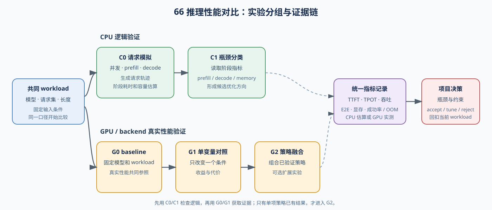
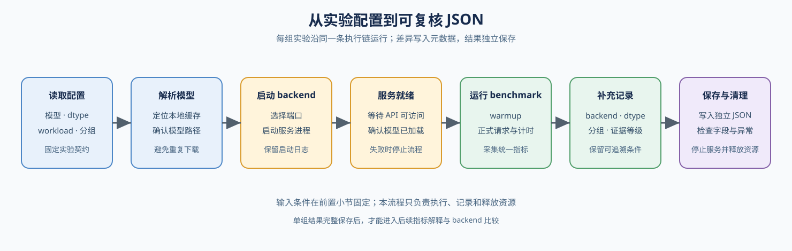
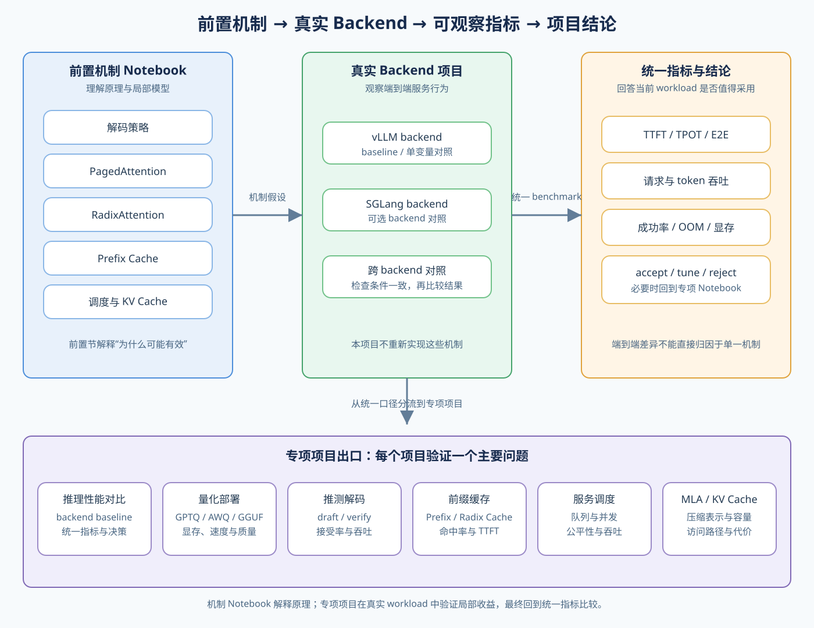
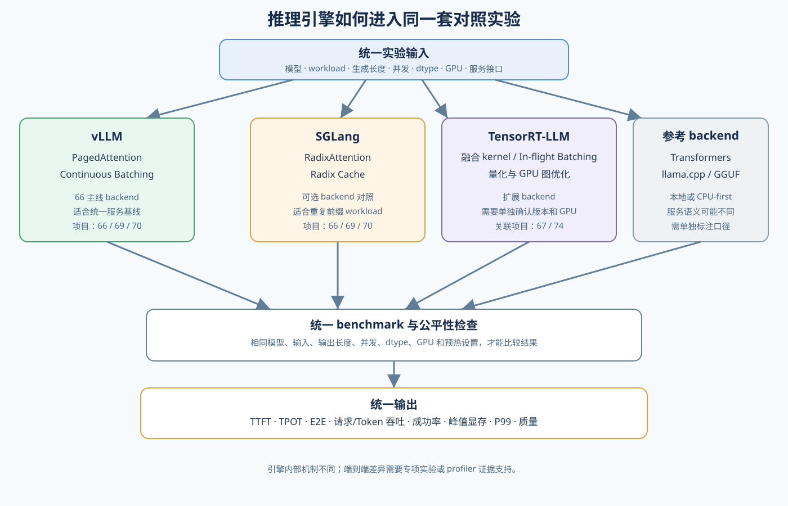

# 66. Inference Performance Comparison | 推理性能对比实验

**难度：** Hard | **环境：** CPU-first | **标签：** `推理优化`, `基准对比`, `性能对比` | **目标人群：** 项目决策练习者

> 🚀 **云端运行环境**
>
> 本章节的实战代码可以点击以下链接在免费 GPU 算力平台上直接运行：
>
> [](https://colab.research.google.com/github/datawhalechina/llm-algo-leetcode/blob/main/02_PyTorch_Algorithms/66_Inference_Performance_Comparison.ipynb)
> [](https://modelscope.cn/my/mynotebook) *(国内推荐：魔搭社区免费实例)*


---

## 本节导读

本节要求你比较一个推理 baseline 与候选优化方案在固定 workload 下的表现。先统一 batch、输入长度、生成长度和 warm-up 方式，再分别测量 TTFT、端到端延迟、吞吐和峰值显存。最终输出一张对比表，并说明该方案适合低延迟、高吞吐还是显存受限场景。
本节的浮点 baseline 用于给其他推理项目提供共同参照，不实现 GPTQ/AWQ/GGUF 的格式转换、校准或加载。量化 artifact 与专用 backend 由 `67` 验证，再将已确认的结果带回本节做统一 workload 对照。
**层级定位：** 本项目主落在 L4，关注单个模型实例如何执行请求；会调用 L2 的算子/后端能力和 L3 的运行时，但不负责 L5 的多模型发布、集群扩缩容或流量治理。

> 运行提示：运行真实 backend 前，先查看[使用指南中的项目环境预检与安装说明](../guide.md#项目环境预检与安装)。默认使用当前 Notebook runtime；本地只有在 vLLM 与 PyTorch 依赖冲突时才需要额外环境。

**关键词：** `benchmark`, `TTFT`, `TPOT`, `throughput`, `KV cache`

---
## 前置阅读

**导语：** 先把解码、KV cache 和推理后端的最小口径理顺，再做推理性能对比；本节不重复讲每个优化机制，而是把它们放到同一个 benchmark 口径里比较。
- [21. Decoding Strategies | 解码策略](./21_Decoding_Strategies.md)
- [22. vLLM PagedAttention | vLLM 分页注意力](./22_vLLM_PagedAttention.md)
- [20. FlashAttention Sim | FlashAttention 模拟](./20_FlashAttention_Sim.md)
- [P1: 11. KV Cache and Memory Growth | KV Cache 与显存增长](../01_Hardware_Math_and_Systems/11_KV_Cache_and_Memory_Growth.md)

## 相关阅读

**导语：** 完成基础推理对比后，可以沿两条路径继续：用 68、69、70 拆解具体优化收益，或用 67 把结论推进到量化部署。
- [68. Speculative Decoding Benchmark | 推测解码基准](./68_Speculative_Decoding_Benchmark.md)
- [67. Quantized Inference and Deployment | 量化推理与部署](./67_Quantized_Inference_and_Deployment.md)

---
### Step 1: 定义问题、工作负载与实验分组
本节从一个实际问题开始：给定一组模型请求和运行环境，哪种推理方案更适合当前目标？要回答这个问题，先准备模型、请求集、backend 和 workload，再把运行结果整理为 TTFT、TPOT、端到端延迟、吞吐、峰值显存和失败状态。下表与流程图展示从实验输入到项目结论的完整过程；具体固定条件和变量控制放在 Step 2。


| 实验阶段 | 你要做什么 | 阶段产出 |
|:---|:---|:---|
| C0 请求模拟 | 在 CPU 上模拟请求、并发和 prefill / decode | 请求轨迹与阶段耗时 |
| C1 瓶颈分类 | 在 CPU 上读取模拟指标 | prefill-bound、decode-bound 或 memory-bound |
| G0 真实基线 | 在 GPU/backend 上运行 baseline | 真实性能共同参照 |
| G1 单变量对照 | 在 GPU/backend 上运行 candidate | 单变量收益与代价 |
| G2 策略融合与决策 | 可选组合已验证策略，并汇总指标 | 当前 workload 下的项目结论 |


<div align="center"><strong>先固定 workload，再做单变量对照；指标解释完成后，才输出选型结论。</strong></div>

### Step 2: 固定对照条件，选择一个变化变量

Step 2 先在固定 workload 下跑通 baseline，再让 candidate 只改变一个主要变量。大多数条件保持不变；被选为变量的条件不再属于固定项。按下表逐项准备实验。

| 实验部分 | 具体怎么做 | 目的 |
|:---|:---|:---|
| 固定条件 | 模型及权重版本、请求集、输入长度、输出长度、dtype、Cache 配置、预热次数和重复次数保持一致 | 保证两次实验可以比较 |
| 唯一变化 | 从并发数、batch、dtype、Cache 配置或 backend 中选择一个作为变量；选中的条件不再作为固定条件 | 让性能变化能够归因 |
| 记录结果 | 记录 TTFT、TPOT、端到端延迟、吞吐、峰值显存、成功率和 OOM | 为 Step3 指标分析和 Step4 决策提供数据 |

### Step 3: 运行候选并读取指标

Step 3 读取每个候选的结果，并整理成可比较的指标记录。下面的指标分别观察请求体验、生成效率和资源占用；Step 4 再根据这些结果判断瓶颈。

| 指标 | 单位 | 主要回答的问题 |
|:---|:---|:---|
| TTFT | ms | 用户等待第一个输出 token 多久？ |
| TPOT | ms/token | decode 阶段每生成一个 token 多久？ |
| E2E latency | ms | 一次请求从开始到结束总共多久？ |
| output throughput | token/s | 系统每秒生成多少输出 token？ |
| peak memory | MB / MiB | 当前 workload 的显存峰值是否接近预算？ |
| success / OOM | 次数 / 状态 | 请求是否完成，是否发生显存不足？ |

### Step 4: 判断瓶颈并输出决策

对照 Step 3 的指标，先找出最明显的性能或显存信号，再从下表选择优先检查方向。CPU 路径用阶段占比和显存预算做初步分类；GPU/backend 路径用 G0/G1 的真实 TTFT、TPOT、吞吐、峰值显存和 OOM 验证这些现象。只有 profiler 提供计算利用率、显存带宽或 kernel 时间后，才能进一步判断 Roofline 意义上的计算受限或带宽受限。吞吐提升但 TTFT 变差时，要检查是否更适合离线批处理；显存下降但 TPOT 变差时，要判断是否值得用计算或带宽换取更大 batch 或更长上下文。最后结合收益、代价和当前 workload 输出 `accept / tune / reject`。

| 你观察到的现象 | 瓶颈判断 | 优先检查方向 | 决策时看什么 |
|:---|:---|:---|:---|
| 长输入导致首 token 等待时间明显增加 | Prefill 瓶颈（输入处理） | FlashAttention、chunked prefill | TTFT 是否下降，是否增加显存或启动成本 |
| 每个输出 token 生成较慢 | Decode 瓶颈（逐 token 生成） | KV Cache、投机解码、解码调度 | TPOT 和吞吐是否改善，输出质量是否稳定 |
| 显存接近上限或无法提高 batch | 显存瓶颈 | PagedAttention、KV Cache 量化、GQA/MQA | 显存是否下降，速度是否仍可接受 |
| 各项指标没有明显短板 | 暂不明确 | 保持 baseline 或继续 Profiling | 是否有足够证据支持切换策略 |

### Step 5：CPU 实验——实现指标链路

Step 5 用 CPU 成本模型把前面的实验设计落成函数，先完成下表对应的指标链路，再运行题目区测试；真实 backend 执行见 Step 6。完成 Step 5 后，进入 Step 6 获取真实 GPU/backend 结果。

| 函数 | CPU 中完成的工作 | 观察重点 |
|:---|:---|:---|
| `simulate_inference_requests` | 按并发把请求分批，计算排队、prefill、decode、E2E 和显存估算 | 并发如何改变排队时间和容量估算 |
| `build_inference_config` | 汇总模型、backend、token 数、dtype 和 cache policy | 对照实验是否使用同一 workload |
| `summarize_prefill_decode` / `compute_inference_metrics` | 从阶段耗时计算 TTFT、TPOT、吞吐和总延迟 | 总延迟变化来自 prefill 还是 decode |
| `diagnose_inference_bottleneck` | 根据阶段占比和预算分类瓶颈 | 下一步应优先检查哪类机制 |
| `compare_inference_candidates` / `recommend_inference_decision` | 计算 baseline 与 candidate 的差值，并输出 accept / tune / reject | 收益是否值得承担对应代价 |


```python
import time

```


```python
# 补全请求模拟和推理性能对比的七个关键函数
# 目标：完成 request -> workload -> metrics -> bottleneck -> comparison -> decision 链路。
# CPU 题目区只验证离散事件和指标口径；真实 kernel、KV Cache 和 backend 行为由 GPU 扩展验证。
def simulate_inference_requests(requests, concurrency=1, prefill_ms_per_token=0.5, decode_ms_per_token=1.0, peak_mem_per_request_mb=512.0, kv_cache_mb_per_token=0.0):
    """在 CPU 上模拟请求排队和 prefill/decode 阶段，不测真实 kernel 性能。

    requests 至少包含 prompt_tokens 和 generated_tokens；返回每个请求的时间轨迹及汇总指标。
    """
    if concurrency <= 0 or prefill_ms_per_token < 0 or decode_ms_per_token < 0 or peak_mem_per_request_mb < 0 or kv_cache_mb_per_token < 0:
        raise ValueError('concurrency 和成本参数必须合法')
    # ==========================================
    # TODO 0: 按 concurrency 分批，计算每个请求的 queue / prefill / decode / e2e
    # 提示：每一批同时执行，批次耗时取该批请求 prefill+decode 的最大值；
    #       queue_ms 是等待时间，peak_memory 取同时执行请求数 * 单请求预算，
    #       kv_cache_mb_per_token 只作为教学估算项，不是实际 KV Cache 分配。
    # request_results = ???  # 每个请求的 queue / prefill / decode / e2e 轨迹
    # duration_ms = ???  # 所有执行批次完成所需的总时间
    # peak_mem_mb = ???  # 同一批次同时执行请求的显存估算峰值
    # kv_cache_tokens_peak = ???  # 同一批次的 token 总量峰值
    # ==========================================
    raise NotImplementedError("请先完成 TODO 代码！")

def build_inference_config(model_name, backend, batch_size, prompt_tokens, generated_tokens, dtype, cache_policy):
    """汇总推理 workload 配置，形成统一比较口径。

    prompt_tokens 和 generated_tokens 必须是非负整数；total_tokens 是两者之和。
    """
    # ==========================================
    # TODO 1: 汇总推理 workload 配置
    # 提示：total_tokens = prompt_tokens + generated_tokens；不要把 batch 重复加进 token 数。
    # ==========================================
    # total_tokens = ???
    return {
        'model_name': model_name,
        'backend': backend,
        'batch_size': batch_size,
        'prompt_tokens': prompt_tokens,
        'generated_tokens': generated_tokens,
        'total_tokens': total_tokens,
        'dtype': dtype,
        'cache_policy': cache_policy,
    }

def summarize_prefill_decode(prefill_ms, decode_ms, generated_tokens):
    """汇总 prefill / decode 延迟，形成最小延迟摘要。

    TTFT 近似为 prefill_ms，TPOT 只在 generated_tokens > 0 时计算；
    prefill_share 与 decode_share 应在 total_ms 上归一化。
    """
    # ==========================================
    # TODO 2: 汇总 prefill / decode 延迟
    # 提示：TTFT 近似等于 prefill_ms；TPOT = decode_ms / generated_tokens。
    #       generated_tokens 为 0 时应明确处理，而不是产生除零错误。
    # ==========================================
    # total_ms = ???
    # ttft_ms = ???
    # tpot_ms = ???
    # prefill_share = ???
    # decode_share = ???
    return {
        'prefill_ms': round(prefill_ms, 2),
        'decode_ms': round(decode_ms, 2),
        'total_ms': round(total_ms, 2),
        'ttft_ms': round(ttft_ms, 2),
        'tpot_ms': round(tpot_ms, 4),
        'prefill_share': round(prefill_share, 3),
        'decode_share': round(decode_share, 3),
    }

def compute_inference_metrics(config, latency_summary, peak_mem_mb):
    """把 workload 和延迟摘要收束成统一推理指标。

    throughput_tok_s 表示该 workload 的输出 token 吞吐；peak_mem_mb 是输入的估算或实测值，
    必须沿用其证据等级，不能在函数内改写来源。
    """
    # ==========================================
    # TODO 3: 计算推理项目核心指标
    # 提示：throughput 表示整个 batch 每秒生成 token 数，即 batch * generated_tokens / total_ms。
    # ==========================================
    # output_tokens = ???
    # throughput_tok_s = ???
    return {
        'backend': config['backend'],
        'batch_size': config['batch_size'],
        'prompt_tokens': config['prompt_tokens'],
        'generated_tokens': config['generated_tokens'],
        'ttft_ms': latency_summary['ttft_ms'],
        'tpot_ms': latency_summary['tpot_ms'],
        'throughput_tok_s': round(throughput_tok_s, 2),
        'total_ms': latency_summary['total_ms'],
        'prefill_share': latency_summary['prefill_share'],
        'decode_share': latency_summary['decode_share'],
        'peak_mem_mb': round(peak_mem_mb, 2),
    }

def diagnose_inference_bottleneck(metrics, memory_budget_mb=None):
    """根据显存预算与 prefill/decode 占比诊断推理瓶颈。

    返回 bottleneck 和 reason；这是规则化诊断，不是 profiler 的最终归因。
    """
    # ==========================================
    # TODO 4: 诊断推理瓶颈
    # 规则：显存接近预算优先判为 memory-bound；否则按 prefill/decode 占比判断。
    # 提示：memory_budget_mb 为空时，memory_pressure 应为 False；占比达到 0.6 才算对应阶段偏重。
    # 只需要补全三个判断变量，下面的分支和报告文案已经给出。
    # ==========================================
    # memory_pressure = ???  # peak_mem_mb >= 0.9 * memory_budget_mb；预算为空时为 False
    # prefill_heavy = ???  # prefill_share >= 0.6
    # decode_heavy = ???  # decode_share >= 0.6
    if memory_pressure:
        bottleneck = 'memory-bound'
        reason = 'peak memory 接近预算，优先检查 KV cache、batch size、量化和分页策略。'
    elif prefill_heavy:
        bottleneck = 'prefill-bound'
        reason = 'prefill 占比高，优先检查 prompt length、FlashAttention、chunked prefill 和 batching。'
    elif decode_heavy:
        bottleneck = 'decode-bound'
        reason = 'decode 占比高，优先检查 KV cache 读写、decode scheduling、speculative decoding 或 multi-token decoding。'
    else:
        bottleneck = 'balanced'
        reason = 'prefill、decode 和显存压力都不突出，先保持 baseline 或继续做细粒度 profiling。'
    return {'bottleneck': bottleneck, 'reason': reason}

def compare_inference_candidates(baseline_metrics, candidate_metrics):
    """统一比较 baseline 与 candidate 的推理收益和代价。

    两者必须使用同一 workload；延迟和显存差值采用 baseline - candidate，
    throughput_gain 采用 (candidate - baseline) / baseline。
    """
    # ==========================================
    # TODO 5: 比较 baseline 和 candidate
    # 提示：latency / TTFT / TPOT / memory 的 delta 用 baseline - candidate；throughput gain 用比例增益。
    #       baseline throughput 为 0 时应显式处理，不能静默返回无穷大。
    # ==========================================
    # total_latency_delta_ms = ???
    # ttft_delta_ms = ???
    # tpot_delta_ms = ???
    # peak_mem_delta_mb = ???
    # throughput_gain = ???
    return {
        'total_latency_delta_ms': round(total_latency_delta_ms, 2),
        'ttft_delta_ms': round(ttft_delta_ms, 2),
        'tpot_delta_ms': round(tpot_delta_ms, 4),
        'peak_mem_delta_mb': round(peak_mem_delta_mb, 2),
        'throughput_gain': round(throughput_gain, 4),
    }

def recommend_inference_decision(comparison, candidate_bottleneck, min_throughput_gain=0.1, max_ttft_regression_ms=20.0):
    """根据吞吐、TTFT 和瓶颈类型输出推理选型建议。

    返回 decision 和 reason；阈值属于当前教学 workload，不是通用 SLA。
    """
    # ==========================================
    # TODO 6: 输出推理选型建议
    # 规则：吞吐明显提升且 TTFT 没明显退化则 accept；有收益但仍有瓶颈则 tune；否则 reject。
    # 提示：throughput_good、ttft_ok、still_tunable 分别对应三个判断条件。
    # ==========================================
    # throughput_good = ???
    # ttft_ok = ???
    # still_tunable = ???
    # if ???:
    #     decision = ???
    #     reason = ???
    # elif ???:
    #     decision = ???
    #     reason = ???
    # else:
    #     decision = ???
    #     reason = ???
    return {'decision': decision, 'reason': reason}

```


```python
# 测试你的实现
def test_inference_project_template():
    try:
        requests = [
            {'prompt_tokens': 100, 'generated_tokens': 20},
            {'prompt_tokens': 200, 'generated_tokens': 10},
            {'prompt_tokens': 100, 'generated_tokens': 20},
        ]
        simulation = simulate_inference_requests(
            requests, concurrency=2, prefill_ms_per_token=0.5,
            decode_ms_per_token=1.0, peak_mem_per_request_mb=256.0,
        )
        assert simulation['request_count'] == 3, "请求数量统计不正确！"
        assert simulation['duration_ms'] == 180.0, "批次执行时长计算不正确！"
        assert simulation['request_results'][2]['queue_ms'] == 110.0, "排队时间计算不正确！"
        assert simulation['peak_mem_mb'] == 512.0, "并发显存预算计算不正确！"
        scaled = simulate_inference_requests(
            [{'prompt_tokens': 100, 'generated_tokens': 20}],
            peak_mem_per_request_mb=256.0, kv_cache_mb_per_token=1.0,
        )
        assert scaled['kv_cache_tokens_peak'] == 120, "KV Cache token 数计算不正确！"
        assert scaled['peak_mem_mb'] == 376.0, "KV Cache 显存随 token 增长的计算不正确！"
        empty = simulate_inference_requests([])
        assert empty['request_count'] == 0 and empty['duration_ms'] == 0.0, "空请求列表应返回空结果！"
        zero_decode = summarize_prefill_decode(prefill_ms=20.0, decode_ms=0.0, generated_tokens=0)
        assert zero_decode['tpot_ms'] == 0.0, "没有输出 token 时 TPOT 应为 0！"
        for invalid in ({'concurrency': 0}, {'prefill_ms_per_token': -1.0}, {'kv_cache_mb_per_token': -1.0}):
            try:
                simulate_inference_requests(requests, **invalid)
            except ValueError:
                pass
            else:
                raise AssertionError('非法请求模拟参数应明确拒绝！')

        config = build_inference_config(
            model_name='tiny-llama',
            backend='pytorch-eager',
            batch_size=2,
            prompt_tokens=128,
            generated_tokens=32,
            dtype='fp16',
            cache_policy='static-kv-cache',
        )
        assert config['total_tokens'] == 160, "total_tokens 计算不正确！"
        assert config['batch_size'] == 2, "batch_size 应保留原始配置！"

        latency = summarize_prefill_decode(prefill_ms=80.0, decode_ms=160.0, generated_tokens=32)
        assert latency['total_ms'] == 240.0, "total_ms 计算不正确！"
        assert latency['ttft_ms'] == 80.0, "ttft_ms 计算不正确！"
        assert latency['tpot_ms'] == 5.0, "tpot_ms 计算不正确！"
        assert latency['prefill_share'] == 0.333, "prefill_share 计算不正确！"
        assert latency['decode_share'] == 0.667, "decode_share 计算不正确！"

        metrics = compute_inference_metrics(config, latency, peak_mem_mb=4096.0)
        assert metrics['throughput_tok_s'] == 266.67, "throughput_tok_s 计算不正确！"
        assert metrics['peak_mem_mb'] == 4096.0, "peak_mem_mb 记录不正确！"

        memory_bound = diagnose_inference_bottleneck(metrics, memory_budget_mb=4400.0)
        assert memory_bound['bottleneck'] == 'memory-bound', "显存接近预算时应优先判为 memory-bound！"

        decode_bound = diagnose_inference_bottleneck(metrics, memory_budget_mb=8192.0)
        assert decode_bound['bottleneck'] == 'decode-bound', "decode 占比高时应判为 decode-bound！"

        candidate_config = build_inference_config(
            model_name='tiny-llama',
            backend='paged-attention',
            batch_size=2,
            prompt_tokens=128,
            generated_tokens=32,
            dtype='fp16',
            cache_policy='paged-kv-cache',
        )
        candidate_latency = summarize_prefill_decode(prefill_ms=85.0, decode_ms=120.0, generated_tokens=32)
        candidate_metrics = compute_inference_metrics(candidate_config, candidate_latency, peak_mem_mb=3584.0)
        comparison = compare_inference_candidates(metrics, candidate_metrics)

        assert comparison['total_latency_delta_ms'] == 35.0, "total latency delta 计算不正确！"
        assert comparison['ttft_delta_ms'] == -5.0, "TTFT delta 计算不正确！"
        assert comparison['tpot_delta_ms'] == 1.25, "TPOT delta 计算不正确！"
        assert comparison['peak_mem_delta_mb'] == 512.0, "peak memory delta 计算不正确！"
        assert comparison['throughput_gain'] > 0.15, "throughput gain 应体现候选方案收益！"

        decision = recommend_inference_decision(comparison, decode_bound)
        assert decision['decision'] == 'accept', "吞吐提升且 TTFT 未明显退化时应建议 accept！"

        weak_comparison = dict(comparison)
        weak_comparison['throughput_gain'] = 0.02
        weak_comparison['ttft_delta_ms'] = 1.0
        assert recommend_inference_decision(weak_comparison, decode_bound)['decision'] == 'tune', "小幅收益但仍有瓶颈时应建议 tune！"

        bad_comparison = dict(comparison)
        bad_comparison['throughput_gain'] = -0.05
        bad_comparison['ttft_delta_ms'] = -30.0
        assert recommend_inference_decision(bad_comparison, {'bottleneck': 'balanced'})['decision'] == 'reject', "没有收益且 TTFT 退化时应建议 reject！"

        print("✅ 推理性能对比项目模板代码通过基础校验。")

    except NotImplementedError:
        print("请先完成 TODO 代码！")
        raise
    except (AttributeError, NameError, TypeError, ValueError, AssertionError, RuntimeError) as e:
        if isinstance(e, AttributeError):
            print("代码未完成，无法找到必要的属性")
        elif isinstance(e, NameError):
            print("代码可能未完成，导致了变量未定义")
        elif isinstance(e, TypeError):
            print("代码可能未完成，导致了操作错误")
        elif isinstance(e, ValueError):
            print("代码可能未完成，导致了数值错误")
        elif isinstance(e, AssertionError):
            print(f"❌ 测试失败: {e}")
        elif isinstance(e, RuntimeError):
            print("代码可能未完成，导致了运行时错误")
        else:
            print("代码可能未完成，导致了断言失败")
        raise NotImplementedError("请先完成 TODO 代码！") from e
    except Exception as e:
        print(f"❌ 发生未知异常: {e}")
        raise


test_inference_project_template()

```

---

🛑 **STOP HERE** 🛑
<br><br><br><br><br><br><br><br><br><br>
> 请先尝试自己完成代码并跑通测试。<br>
> 如果你正在 Colab 中运行，并且遇到困难没有思路，可以向下滚动查看参考答案。
<br><br><br><br><br><br><br><br><br><br>

---
## 参考代码与解析

### 代码

```python
def simulate_inference_requests(requests, concurrency=1, prefill_ms_per_token=0.5, decode_ms_per_token=1.0, peak_mem_per_request_mb=512.0, kv_cache_mb_per_token=0.0):
    """模拟并发请求的排队、prefill、decode 和显存占用。"""
    if concurrency <= 0 or prefill_ms_per_token < 0 or decode_ms_per_token < 0 or peak_mem_per_request_mb < 0 or kv_cache_mb_per_token < 0:
        raise ValueError('concurrency 和成本参数必须合法')
    if not requests:
        return {'request_count': 0, 'duration_ms': 0.0, 'request_results': [], 'peak_mem_mb': 0.0}
    results = []
    clock_ms = 0.0
    for start in range(0, len(requests), concurrency):
        wave = requests[start:start + concurrency]
        wave_results = []
        for request in wave:
            prompt_tokens = int(request['prompt_tokens'])
            generated_tokens = int(request['generated_tokens'])
            if prompt_tokens <= 0 or generated_tokens <= 0:
                raise ValueError('每个请求的 token 数必须为正数')
            prefill_ms = prompt_tokens * prefill_ms_per_token
            decode_ms = generated_tokens * decode_ms_per_token
            wave_results.append({
                'prompt_tokens': prompt_tokens,
                'generated_tokens': generated_tokens,
                'queue_ms': clock_ms,
                'prefill_ms': prefill_ms,
                'decode_ms': decode_ms,
                'ttft_ms': clock_ms + prefill_ms,
                'tpot_ms': decode_ms / generated_tokens,
                'e2e_ms': clock_ms + prefill_ms + decode_ms,
                'kv_cache_tokens': prompt_tokens + generated_tokens,
                'kv_cache_mem_mb': peak_mem_per_request_mb + (prompt_tokens + generated_tokens) * kv_cache_mb_per_token,
            })
        results.extend(wave_results)
        clock_ms += max(item['prefill_ms'] + item['decode_ms'] for item in wave_results)
    total_output_tokens = sum(item['generated_tokens'] for item in results)
    total_prompt_tokens = sum(item['prompt_tokens'] for item in results)
    return {
        'request_count': len(results),
        'total_prompt_tokens': total_prompt_tokens,
        'total_output_tokens': total_output_tokens,
        'duration_ms': round(clock_ms, 4),
        'peak_mem_mb': round(max(sum(item['kv_cache_mem_mb'] for item in results[start:start + concurrency]) for start in range(0, len(results), concurrency)), 2),
        'kv_cache_tokens_peak': max((sum(item['kv_cache_tokens'] for item in results[start:start + concurrency]) for start in range(0, len(results), concurrency)), default=0),
        'request_results': results,
    }

# TODO 1: 汇总推理 workload 配置
def build_inference_config(model_name, backend, batch_size, prompt_tokens, generated_tokens, dtype, cache_policy):
    total_tokens = prompt_tokens + generated_tokens
    return {
        'model_name': model_name,
        'backend': backend,
        'batch_size': batch_size,
        'prompt_tokens': prompt_tokens,
        'generated_tokens': generated_tokens,
        'total_tokens': total_tokens,
        'dtype': dtype,
        'cache_policy': cache_policy,
    }

# TODO 2: 汇总 prefill / decode 延迟
def summarize_prefill_decode(prefill_ms, decode_ms, generated_tokens):
    total_ms = prefill_ms + decode_ms
    ttft_ms = prefill_ms
    tpot_ms = decode_ms / generated_tokens if generated_tokens else 0.0
    prefill_share = prefill_ms / total_ms if total_ms else 0.0
    decode_share = decode_ms / total_ms if total_ms else 0.0
    return {
        'prefill_ms': round(prefill_ms, 2),
        'decode_ms': round(decode_ms, 2),
        'total_ms': round(total_ms, 2),
        'ttft_ms': round(ttft_ms, 2),
        'tpot_ms': round(tpot_ms, 4),
        'prefill_share': round(prefill_share, 3),
        'decode_share': round(decode_share, 3),
    }

# TODO 3: 计算推理项目核心指标
def compute_inference_metrics(config, latency_summary, peak_mem_mb):
    output_tokens = config['batch_size'] * config['generated_tokens']
    total_seconds = latency_summary['total_ms'] / 1000.0
    throughput_tok_s = output_tokens / total_seconds if total_seconds else 0.0
    return {
        'backend': config['backend'],
        'batch_size': config['batch_size'],
        'prompt_tokens': config['prompt_tokens'],
        'generated_tokens': config['generated_tokens'],
        'ttft_ms': latency_summary['ttft_ms'],
        'tpot_ms': latency_summary['tpot_ms'],
        'throughput_tok_s': round(throughput_tok_s, 2),
        'total_ms': latency_summary['total_ms'],
        'prefill_share': latency_summary['prefill_share'],
        'decode_share': latency_summary['decode_share'],
        'peak_mem_mb': round(peak_mem_mb, 2),
    }

# TODO 4: 诊断推理瓶颈
def diagnose_inference_bottleneck(metrics, memory_budget_mb=None):
    if memory_budget_mb is not None and metrics['peak_mem_mb'] >= 0.9 * memory_budget_mb:
        bottleneck = 'memory-bound'
        reason = 'peak memory 接近预算，优先检查 KV cache、batch size、量化和分页策略。'
    elif metrics['prefill_share'] >= 0.6:
        bottleneck = 'prefill-bound'
        reason = 'prefill 占比高，优先检查 prompt length、FlashAttention、chunked prefill 和 batching。'
    elif metrics['decode_share'] >= 0.6:
        bottleneck = 'decode-bound'
        reason = 'decode 占比高，优先检查 KV cache 读写、decode scheduling、speculative decoding 或 multi-token decoding。'
    else:
        bottleneck = 'balanced'
        reason = 'prefill、decode 和显存压力都不突出，先保持 baseline 或继续做细粒度 profiling。'
    return {'bottleneck': bottleneck, 'reason': reason}

# TODO 5: 比较 baseline 和 candidate
def compare_inference_candidates(baseline_metrics, candidate_metrics):
    total_latency_delta_ms = baseline_metrics['total_ms'] - candidate_metrics['total_ms']
    ttft_delta_ms = baseline_metrics['ttft_ms'] - candidate_metrics['ttft_ms']
    tpot_delta_ms = baseline_metrics['tpot_ms'] - candidate_metrics['tpot_ms']
    peak_mem_delta_mb = baseline_metrics['peak_mem_mb'] - candidate_metrics['peak_mem_mb']
    throughput_gain = (
        candidate_metrics['throughput_tok_s'] / baseline_metrics['throughput_tok_s'] - 1.0
        if baseline_metrics['throughput_tok_s'] else 0.0
    )
    return {
        'total_latency_delta_ms': round(total_latency_delta_ms, 2),
        'ttft_delta_ms': round(ttft_delta_ms, 2),
        'tpot_delta_ms': round(tpot_delta_ms, 4),
        'peak_mem_delta_mb': round(peak_mem_delta_mb, 2),
        'throughput_gain': round(throughput_gain, 4),
    }

# TODO 6: 输出推理选型建议
def recommend_inference_decision(comparison, candidate_bottleneck, min_throughput_gain=0.1, max_ttft_regression_ms=20.0):
    ttft_regression_ms = -comparison['ttft_delta_ms']
    if comparison['throughput_gain'] >= min_throughput_gain and ttft_regression_ms <= max_ttft_regression_ms:
        decision = 'accept'
        reason = 'candidate 吞吐提升明显，TTFT 退化在可接受范围内，值得进入正式推理方案。'
    elif comparison['throughput_gain'] > 0.0 and candidate_bottleneck['bottleneck'] != 'balanced':
        decision = 'tune'
        reason = 'candidate 已有收益，但瓶颈仍然存在，继续围绕诊断结果调参或换策略。'
    else:
        decision = 'reject'
        reason = 'candidate 收益不足或交互延迟退化明显，当前不值得切换。'
    return {'decision': decision, 'reason': reason}

baseline_config = build_inference_config('tiny-llama', 'pytorch-eager', 2, 128, 32, 'fp16', 'static-kv-cache')
baseline_latency = summarize_prefill_decode(prefill_ms=80.0, decode_ms=160.0, generated_tokens=32)
baseline_metrics = compute_inference_metrics(baseline_config, baseline_latency, peak_mem_mb=4096.0)
print(baseline_config)
print(baseline_metrics)
print(diagnose_inference_bottleneck(baseline_metrics, memory_budget_mb=8192.0))

candidate_config = build_inference_config('tiny-llama', 'paged-attention', 2, 128, 32, 'fp16', 'paged-kv-cache')
candidate_latency = summarize_prefill_decode(prefill_ms=85.0, decode_ms=120.0, generated_tokens=32)
candidate_metrics = compute_inference_metrics(candidate_config, candidate_latency, peak_mem_mb=3584.0)
comparison = compare_inference_candidates(baseline_metrics, candidate_metrics)
print(candidate_metrics)
print(comparison)
print(recommend_inference_decision(comparison, diagnose_inference_bottleneck(candidate_metrics, memory_budget_mb=8192.0)))

```

### 解析

**0. TODO 0: 模拟请求执行**
- **实现方式**：按 `concurrency` 将请求分成多个执行批次；同一批并行完成，批次耗时取其中最长请求的 prefill + decode 时间。
- **关键点**：后续批次会产生 queue time；`TTFT` 包含排队和 prefill，`TPOT` 只表示 decode 阶段的平均每 token 时间。
- **项目意义**：CPU 可以解释并发、排队和阶段指标的关系，但这些是教学成本模型，不是 vLLM / SGLang 的真实调度或 CUDA 测量。
- **显存扩展**：当 `kv_cache_mb_per_token > 0` 时，模拟器按 `prompt_tokens + generated_tokens` 估算每个请求的 KV Cache 增量，并按同一执行波次累加；这只能说明 token 数、并发与容量之间的关系，不能替代 backend 的 allocated/reserved 显存或 OOM 测量。

**1. TODO 1: 汇总推理 workload 配置**
- **实现方式**：把模型、backend、batch size、prompt tokens、generated tokens、dtype 和 cache policy 放进同一个配置对象。
- **关键点**：推理 benchmark 的第一原则是固定 workload。没有 workload，TTFT、TPOT、吞吐和显存都没有可比性。
- **项目意义**：后续 baseline 和 candidate 只能改一个变量，否则很难判断收益来自哪里。

**2. TODO 2: 汇总 prefill / decode 延迟**
- **实现方式**：`total_ms = prefill_ms + decode_ms`，TTFT 近似取 `prefill_ms`，TPOT 取 `decode_ms / generated_tokens`。
- **关键点**：prefill 和 decode 的瓶颈不同。总耗时下降不代表交互体验一定变好，TTFT 和 TPOT 必须拆开看。
- **项目意义**：这一步把推理性能从一个笼统 latency 拆成可诊断的两段。

**3. TODO 3: 计算推理项目核心指标**
- **实现方式**：用 `batch_size * generated_tokens / total_seconds` 计算 generated tokens/s，并和 TTFT、TPOT、total latency、peak memory 放在同一张账本里。
- **关键点**：throughput 统计的是整个 batch 的输出 token 产出，不是单条请求的 token 数。
- **项目意义**：同一个 candidate 可能吞吐更高但 TTFT 更差，指标必须一起看。

**4. TODO 4: 诊断推理瓶颈**
- **实现方式**：显存接近预算时优先判为 `memory-bound`；否则用 prefill/decode 占比判断主要瓶颈。
- **关键点**：显存预算是硬约束。如果显存已经接近上限，即使 decode 占比高，也要先处理 KV cache、batch size 或量化。
- **项目意义**：诊断结果决定下一步选 FlashAttention、chunked prefill、PagedAttention、KV cache 量化还是 decode scheduling。

**5. TODO 5: 比较 baseline 和 candidate**
- **实现方式**：latency、TTFT、TPOT 和 peak memory 使用 `baseline - candidate`，正数表示 candidate 更好；throughput 使用比例增益。
- **关键点**：delta 的方向要固定，否则报告容易把退化误写成收益。
- **项目意义**：项目报告不只写绝对值，更要说明 candidate 相比 baseline 改善或退化了多少。

**6. TODO 6: 输出推理选型建议**
- **accept**：吞吐提升达标，TTFT 退化在可接受范围内，说明候选方案值得采用。
- **tune**：candidate 有收益，但瓶颈仍然存在，需要继续沿诊断方向调参。
- **reject**：candidate 收益不足，或交互延迟退化明显，当前不值得切换。
- **项目意义**：推理选型不能只看一个指标。最终结论要同时考虑 workload、吞吐、TTFT、TPOT、显存和瓶颈类型。

**推理性能对比的实验原则**
- **变量控制**：同一轮对比中只改一个变量，例如 batch size、precision、推理后端或 cache 策略。
- **指标闭环**：每次实验至少记录 TTFT、TPOT、throughput 和 peak memory。
- **阶段拆分**：把 prefill 和 decode 分开看，避免把长 prompt 问题误判成 decode 问题。
- **结果复盘**：最终输出要回扣 Step 1 的问题：在给定约束下，哪种推理策略最划算，理由是什么。

## Step 6（可选）：GPU/backend 实验——真实基线与候选对照

GPU/backend 的环境安装和平台差异见[使用指南：Part 02 环境分层与决策树](../guide.md#part-02-环境分层与决策树)。Step 6 只处理真实 GPU/backend 的执行顺序和配置入口。

下面的单元按 G0 → G1 → G2 执行：先准备模型、dtype、端口和服务，再运行 baseline，最后进行单变量对照或可选的策略融合。默认 `RUN_REAL_BACKEND = False`；具备 GPU 和 vLLM 时再改为 `True`。

66 只比较端到端结果；量化、Prefix Cache、Speculative Decoding 和 Scheduler 的机制与专项实验分别由 67–70 承担。

本地 GPU、Colab 和 ModelScope 使用同一条链路：预检内核 → 准备 backend → 下载模型 → 启动服务 → 运行 benchmark → 保存 JSON。

开始前查看下面的实验资产表；它同时说明执行阶段、代码入口和阶段产出。Notebook 内核负责发起请求和保存报告，vLLM backend 可以运行在当前环境，也可以运行在单独环境中。

| 阶段 | 使用资产 | 学习者操作 | 阶段产出 |
|:---|:---|:---|:---|
| 环境预检 | `66_backend_preflight`；`tools/environment_preflight.py` | 检查 CUDA、GPU、显存、dtype 和 vLLM 命令 | 当前环境可执行 |
| 实验配置 | 配置单元；`MODEL_SOURCE`、`MODEL_CACHE_DIR`、G0/G1/G2 | 选择模型、workload、dtype 和实验组 | 固定实验条件 |
| backend 启动 | `tools/backend_runtime.py`；`VLLM_COMMAND`、`VLLM_ENV` | 自动解析模型、选择端口并启动 vLLM | API 服务可访问 |
| benchmark | `tools/benchmark_inference_backend.py`；`benchmarks/workloads/fixed.jsonl` | 发送请求并采集 TTFT、TPOT、E2E、吞吐和成功率 | 统一指标结果 |
| 结果保存 | `benchmarks/results/66_*.json` | 每组使用独立结果路径，并检查 OOM 和报告字段 | 可复核 JSON |




<div align="center"><strong>前置小节解释机制，66 节验证服务表现；指标支持结论，但不替代专项机制实验。</strong></div>
<div align="center"><strong>先确认运行环境，再运行 baseline；完成单项对照后，才进入策略融合。</strong></div>

模型下载和服务启动会消耗显存、磁盘与时间；完成实验后运行清理单元。
### 运行环境与配置边界

先按 Step 6 前面的实验资产表执行；本小节的兼容表用于排查启动错误。真实 backend 能否运行，取决于 vLLM CUDA 扩展、PyTorch CUDA wheel、NVIDIA 驱动和 GPU 架构是否匹配。当前已验证的本机兼容组合如下：

| 项目 | 本机已验证配置 | 说明 |
|---|---|---|
| OS | Linux x86_64 | vLLM 的主要支持环境 |
| GPU | NVIDIA GeForce RTX 5070 Ti Laptop GPU（SM120 / Blackwell） | 约 12 GB 显存；小模型可运行 |
| NVIDIA driver | 570.211.01，CUDA 12.8 | 不要与 CUDA 13.0 wheel 混用 |
| client 环境 | `llm_algo`，PyTorch 2.11.0+cu128 | 运行 Notebook 和 benchmark client |
| backend 环境 | `vllm_legacy_cu128`，Python 3.12，PyTorch 2.8.0+cu128，vLLM 0.11.0 | 单独运行 vLLM 服务；通过 HTTP 与 client 解耦 |
| 模型 | `Qwen/Qwen2.5-0.5B-Instruct` | 权重约 0.92 GiB，适合 smoke test |
| 启动约束 | `bfloat16`、`max_model_len=2048`、`gpu_memory_utilization=0.8`、`--enforce-eager` | 本机需要关闭 TorchInductor/CUDAGraph |

这里的 vLLM 0.11.0 不是教程要求的最低版本，而是本机经过验证的兼容版本。较新的 vLLM 版本可能自动选择 CUDA 13.0 runtime，或在 RTX 5070 Ti 的 SM120 kernel 路径上启动失败；因此教程应固定已验证版本，而不是无条件安装最新版。vLLM 官方的旧版安装文档也提供了 CUDA 12.8 预编译组合。

真实 backend 实验还需要：可访问 HuggingFace 或 ModelScope 的网络、足够的模型缓存磁盘空间、可用的本地端口（默认 8000），以及允许启动本地进程。没有这些条件时，仍可完成本节的 CPU-first 模拟 benchmark。

**重要限制**：当前实测使用 `--enforce-eager`，并且 FlashInfer 不可用时回退到 PyTorch-native sampler。因此本节实测代表“vLLM eager + Triton/原生采样”的可复现结果，不应直接宣称为最新版 vLLM 默认优化配置的性能。

平台差异只保留为执行提示：本机 RTX 5070 Ti 使用已验证的 `vLLM 0.11.0 + cu128` 和 `bfloat16`；Colab T4 优先尝试 `float16`，L4/A100/H100 再根据实测选择 `bfloat16`。Colab 先运行 `!nvidia-smi` 和 `torch.cuda.get_device_name(0)`，更换驱动、CUDA 或 vLLM 版本后必须重新完成 smoke test。

驱动升级到 580 后，首先验证 `nvidia-smi`、`torch.version.cuda` 和 `torch.cuda.is_available()`，再验证 vLLM 服务；驱动版本变新不等于 vLLM 的 Blackwell/SM120 自定义 kernel 一定可用。

```python
"""只检查当前 Notebook 内核和 backend 命令，不启动服务、不下载模型。"""
import importlib.util
import shutil
import torch

# 1. 检查 Notebook client 使用的 PyTorch、CUDA 和 GPU。
print({'torch': torch.__version__, 'torch_cuda': torch.version.cuda, 'cuda_available': torch.cuda.is_available()})
if torch.cuda.is_available():
    print({'device': torch.cuda.get_device_name(0), 'capability': torch.cuda.get_device_capability(0), 'bf16_supported': torch.cuda.is_bf16_supported()})
# 2. 检查 vLLM 是否安装在当前内核；独立 backend 环境可以显示 False。
print({'vllm_on_current_kernel': importlib.util.find_spec('vllm') is not None, 'vllm_command': shutil.which('vllm')})

# 如果 vLLM 在独立 conda 环境中运行，这里可以保持 vllm_on_current_kernel=False；
# Step 6 的运行单元会通过 VLLM_ENV 调用独立环境，或复用已启动的 OpenAI-compatible API。
```


```python
# 实验配置：先运行本单元，再运行下面的环境预检和 benchmark。
# 本单元只设置变量并检查 G0/G1/G2 的填写，不下载模型、不启动 backend。
RUN_REAL_BACKEND = False  # 是否启动真实 vLLM；False 只完成 CPU-first 模板。
EXPERIMENT_GROUP = 'G0'  # G0=baseline，G1=单变量对照，G2=策略融合。
STRATEGIES = []  # G0 为空；G1 填一个策略名；G2 填两个或更多已单独验证的策略名。
STRATEGY_NOTE = '固定 workload 的 vLLM baseline'  # 说明本次实验实际改变了什么。
MODEL_SOURCE = 'auto'  # 模型来源：auto / modelscope / huggingface / local。
MODEL_CACHE_DIR = 'model_cache'  # 模型缓存目录；通常不需要修改。
MODEL_PROFILES = {
    'qwen25_small': 'Qwen/Qwen2.5-0.5B-Instruct',
    'deepseek_r1_small': 'deepseek-ai/DeepSeek-R1-Distill-Qwen-1.5B',
}
MODEL_PROFILE = 'qwen25_small'  # 先用小模型完成 smoke test。
MODEL_ID = MODEL_PROFILES[MODEL_PROFILE]  # 实际加载的模型 ID。
DTYPE = 'auto'  # auto 根据 GPU 选择；也可显式写 bfloat16 / float16。
CACHE_POLICY = 'default'  # vLLM / SGLang 使用的 cache 标记；跨 backend 对比时保持一致。
VLLM_COMMAND = None  # 为空时自动查找当前环境中的 vllm
VLLM_ENV = None  # 云端保持当前 runtime；本地多环境时再填写环境名
RUN_SGLANG = False  # 可选：只在已安装并确认版本兼容时启动 SGLang。
SGLANG_COMMAND_TEMPLATE = None  # 例如 python -m sglang.launch_server --model-path {model_path} --port {port}
SGLANG_READY_TIMEOUT_S = 180  # SGLang 冷启动等待时间；超时会自动停止子进程。
SGLANG_RESULT_PATH = 'benchmarks/results/66_g0_sglang.json'  # 与 vLLM 结果分开保存。
MAX_MODEL_LEN = 2048  # 最大上下文长度；越大越占 KV Cache。
GPU_MEMORY_UTILIZATION = 0.8  # vLLM 使用显存比例；需为桌面和其他进程留余量。
ENFORCE_EAGER = True  # 先保证 RTX 50 系列等架构可复现；稳定后可尝试 False
WORKLOAD_PATH = 'benchmarks/workloads/fixed.jsonl'  # G1 workload 变量通过替换此文件实现。
NUM_PROMPTS = 5  # 请求总数；正式实验应大于 smoke test。
BATCH_SIZE = 1  # 单请求 batch 配置；修改后必须在结果中保留。
CONCURRENCY = 1  # 同时在途请求数；只做并发实验时改变它。
WARMUP = 1  # 预热请求数；正式实验建议提高到 3-10。
RESULT_PATH = 'benchmarks/results/66_g0_vllm_baseline.json'  # 每组实验使用独立路径，避免覆盖。
PEAK_MEMORY_MB = None  # 可选：由外部 nvidia-smi/监控采集后填入；None 表示本次未测 GPU 峰值显存。

SUPPORTED_AUTO_STRATEGIES = {'concurrency', 'batch', 'dtype', 'workload'}  # 当前 vLLM 入口确实能执行的 G1 变量。
if EXPERIMENT_GROUP not in {'G0', 'G1', 'G2'}:
    raise ValueError('EXPERIMENT_GROUP 只能是 G0、G1 或 G2')
if EXPERIMENT_GROUP == 'G0' and STRATEGIES:
    raise ValueError('G0 baseline 不应填写 STRATEGIES')
if EXPERIMENT_GROUP == 'G1' and len(STRATEGIES) != 1:
    raise ValueError('G1 单变量对照必须填写一个策略')
if EXPERIMENT_GROUP == 'G2' and len(STRATEGIES) < 2:
    raise ValueError('G2 策略融合至少填写两个策略')
if RUN_REAL_BACKEND and EXPERIMENT_GROUP == 'G1' and not set(STRATEGIES).issubset(SUPPORTED_AUTO_STRATEGIES):
    raise ValueError('当前 GPU 入口只自动执行 concurrency / batch / dtype / workload 对照；FlashAttention、Prefix Cache、量化等请使用专项项目或手动 backend 参数。')
if RUN_REAL_BACKEND and EXPERIMENT_GROUP == 'G2':
    raise ValueError('G2 策略融合目前只有配置与报告元数据入口，尚未自动启用组合 backend；请先完成单项策略验证。')
EXPERIMENT_METADATA = {'group': EXPERIMENT_GROUP, 'strategies': list(STRATEGIES), 'note': STRATEGY_NOTE}
print('实验配置：', EXPERIMENT_METADATA)

```


```python
"""执行一次 vLLM 实验：解析模型、启动服务、运行 benchmark、保存 JSON 并清理进程。"""
import json
import os
import subprocess
import sys
from pathlib import Path

if RUN_REAL_BACKEND:
    project_root = next((path for path in [Path.cwd(), *Path.cwd().parents] if (path / 'tools').is_dir()), None)
    if project_root is None:
        raise RuntimeError('未找到项目根目录。请从仓库根目录启动 Jupyter，或把仓库根目录加入 sys.path。')
    os.chdir(project_root)
    if str(project_root) not in sys.path:
        sys.path.insert(0, str(project_root))
    from tools.backend_runtime import resolve_model, start_vllm, stop_backend

    # 1. 定位项目根目录和模型缓存；模型只在首次运行时下载。
    model_path = resolve_model(MODEL_ID, MODEL_SOURCE, cache_dir=MODEL_CACHE_DIR)
    # 2. 启动 vLLM，自动选择可用端口并等待服务就绪。
    server, server_log, port, selected_dtype = start_vllm(
        model_path, DTYPE, vllm_command=VLLM_COMMAND,
        vllm_environment=VLLM_ENV,
        max_model_len=MAX_MODEL_LEN,
        gpu_memory_utilization=GPU_MEMORY_UTILIZATION,
        enforce_eager=ENFORCE_EAGER,
        served_model_name=MODEL_ID,
    )
    print({'model_path': model_path, 'dtype': selected_dtype, 'port': port})

    try:
        output_path = Path(RESULT_PATH)
        output_path.parent.mkdir(parents=True, exist_ok=True)
        # 3. 使用固定 workload 发起请求；G0/G1 的差异来自配置单元。
        benchmark_command = [
            sys.executable, 'tools/benchmark_inference_backend.py',
            '--base-url', f'http://127.0.0.1:{port}',
            '--model', MODEL_ID,
            '--label', f'vllm-{EXPERIMENT_GROUP.lower()}',
            '--project', '66',
            '--backend', 'vllm',
            '--dtype', selected_dtype,
            '--batch', str(BATCH_SIZE),
            '--cache-policy', 'default',
            '--workload', WORKLOAD_PATH,
            '--num-prompts', str(NUM_PROMPTS),
            '--concurrency', str(CONCURRENCY),
            '--warmup', str(WARMUP),
            '--output', str(output_path),
        ]
        if PEAK_MEMORY_MB is not None:
            benchmark_command.extend(['--peak-memory-mb', str(PEAK_MEMORY_MB)])
        subprocess.run(benchmark_command, check=True)
        # 4. 追加实验元数据后保存报告，确保每组结果可以单独复核。
        saved = json.loads(output_path.read_text(encoding='utf-8'))
        saved['experiment'] = EXPERIMENT_METADATA
        output_path.write_text(json.dumps(saved, ensure_ascii=False, indent=2), encoding='utf-8')
        print(saved['metrics'])
        print('统一结果：', json.dumps(saved['normalized_result'], ensure_ascii=False, indent=2))
    finally:
        # 5. 无论 benchmark 是否成功，都停止服务并释放子进程。
        stop_backend(server, server_log)
else:
    print('跳过真实 backend：保持 CPU-first 模式。')

```

## Step 7（可选）：SGLang backend 对照

本步要回答：在相同模型、请求集、生成长度、并发和 dtype 下，SGLang 与 vLLM 的端到端表现是否不同？SGLang 的 RadixAttention / Radix Cache 由 backend 自己实现，本节不重新实现其内部算法，只验证服务链路并读取统一指标。

执行顺序是：先确认当前环境已安装并验证 SGLang，再填写启动命令模板；代码自动准备模型路径和端口、启动 OpenAI-compatible 服务、复用同一个 workload 运行 benchmark，最后将结果单独保存到 JSON。SGLang 命令不会由 Notebook 猜测，避免把不同版本的启动参数混在一起。

输入是已验证的 `SGLANG_COMMAND_TEMPLATE`、模型、workload 和并发配置；输出是 backend 名称、dtype、请求成功率、TTFT、TPOT、E2E、吞吐和结果文件。只有 vLLM 与 SGLang 的硬件、模型、输入、输出长度和并发完全一致时，Step 8 才能进行跨 backend 对比。


<div align="center"><strong>不同引擎可以共用 benchmark 口径，但必须先确认服务接口、硬件和实验条件一致。</strong></div>

```python
"""可选的 SGLang 对照：复用统一 workload，独立启动服务并保存 JSON。"""
# 默认关闭，不影响 vLLM 主线。
if RUN_SGLANG:
    if not SGLANG_COMMAND_TEMPLATE:
        raise ValueError('RUN_SGLANG=True 时必须填写 SGLANG_COMMAND_TEMPLATE，并包含 {model_path} 和 {port}。')
    from tools.inference_project_runtime import (
        locate_repo_root, run_backend_benchmark, start_external_openai_backend,
    )
    from tools.backend_runtime import find_free_port, resolve_model, stop_backend
    root = locate_repo_root()
    model_path = resolve_model(MODEL_ID, MODEL_SOURCE, cache_dir=MODEL_CACHE_DIR)
    sglang_port = find_free_port()
    sglang_log = root / 'benchmarks/results/66_sglang.log'
    sglang_server, sglang_log_path = start_external_openai_backend(
        SGLANG_COMMAND_TEMPLATE, model_path=str(model_path), port=sglang_port,
        log_path=sglang_log, ready_timeout_s=SGLANG_READY_TIMEOUT_S,
    )
    try:
        sglang_report = run_backend_benchmark(
            project='66', base_url=f'http://127.0.0.1:{sglang_port}',
            model=MODEL_ID, label='sglang-g0', output=SGLANG_RESULT_PATH,
            workload=WORKLOAD_PATH, num_prompts=NUM_PROMPTS,
            concurrency=CONCURRENCY, warmup=WARMUP, backend='sglang',
            dtype=DTYPE, batch=BATCH_SIZE, cache_policy=CACHE_POLICY,
        )
        sglang_report['experiment'] = {**EXPERIMENT_METADATA, 'backend': 'sglang', 'command_template': SGLANG_COMMAND_TEMPLATE}
        Path(SGLANG_RESULT_PATH).write_text(json.dumps(sglang_report, ensure_ascii=False, indent=2), encoding='utf-8')
        print('SGLang 结果：', json.dumps(sglang_report.get('metrics', {}), ensure_ascii=False, indent=2))
    finally:
        stop_backend(sglang_server, sglang_log_path)
else:
    print('跳过 SGLang：默认只验证 vLLM；需要独立安装和确认 SGLang 版本后再开启。')

```

## Step 8（可选）：跨 backend 结果对比

只有 Step 6 和 Step 7 使用相同模型、输入分布、生成长度、并发、dtype 和硬件时，才可以进行跨 backend 比较。报告要保留 backend 名称和版本；vLLM 的 PagedAttention 与 SGLang 的 RadixAttention 不视为同一种策略，端到端差异不能直接归因给某个单一机制。

当前学习顺序：先完成 vLLM G0/G1，再完成可选的 SGLang 对照，最后比较两份统一 JSON。没有可运行的 SGLang 环境时，保留 Step 7 关闭状态即可。

### 附录：本机实测记录与当前结论

下面的记录对应 Step 6 的 G0/G1：并发 1 是固定 workload 的 baseline，并发 4 是只改变 concurrency 的单变量对照。它们不是两个不同的推理 backend，也不是两种已经验证的优化策略。

为方便比较和补采，下面把固定条件与结果合并为一张总表。当前本机记录还固定了 `max_model_len=2048`、`gpu_memory_utilization=0.8` 和 `--enforce-eager`；如果新配置修改了这些启动参数，应在对应单元格中写明。每一行是一组完整实验：先填写 GPU、模型、backend 和 workload，再填写该组唯一变化和指标；新增模型、GPU 或 workload 时，复制一行并保留完整条件。

表中的 `P50` 是 **50 分位数（中位数）**：把成功请求按延迟从小到大排序后，位于中间位置的请求延迟约为该值，约一半请求不超过它。`TTFT` 是首个输出 token 的等待时间，`TPOT` 是后续每个输出 token 的平均时间，`E2E` 是一次请求从发送到完成的总延迟。当前只有 5 条请求，P50 适合帮助理解结果，但还不足以代表稳定线上分布；正式实验还应增加请求量并记录 P99。

| 类别 | 项目 | 单位 | G0 baseline | G1 concurrency | 新配置 1 | 新配置 2 | 说明 |
|:---|:---|:---:|:---|:---|:---|:---|:---|
| 共同条件 | GPU / 显存 | — | RTX 5070 Ti Laptop / 12 GB | 同左 | 待填写 | 待填写 | 记录硬件差异 |
| 共同条件 | 模型 | — | `Qwen/Qwen2.5-0.5B-Instruct` | 同左 | 待填写 | 待填写 | 同一对照应保持一致 |
| 共同条件 | Backend / 版本 | — | vLLM 0.11.0 | 同左 | 待填写 | 待填写 | 记录 backend 版本 |
| 共同条件 | PyTorch / CUDA | — | 2.11.0+cu128 | 同左 | 待填写 | 待填写 | 记录 client runtime |
| 共同条件 | dtype | — | `bfloat16` | `bfloat16` | 待填写 | 待填写 | 改变 dtype 时单独分组 |
| 共同条件 | workload / 生成长度 | — | `fixed.jsonl` / 64 tokens | 同左 | 待填写 | 待填写 | 记录请求数量和生成长度 |
| 共同条件 | 启动参数 | — | `max_model_len=2048`、`gpu_memory_utilization=0.8`、`--enforce-eager` | 同左 | 待填写 | 待填写 | 参数改变时注明 |
| 实验设置 | 改变变量 / 并发 | — | 无 / 1 | `concurrency` / 4 | 待填写 | 待填写 | 每个 G1 只改变一个变量 |
| 结果 | 成功 / 失败 | 请求数 | 5 / 0 | 5 / 0 | 待填写 | 待填写 | 必须记录异常 |
| 结果 | 请求吞吐 | req/s | 3.1189 | 4.2972 | 待填写 | 待填写 | 越高越好 |
| 结果 | 输出吞吐 | token/s | 182.1461 | 250.9544 | 待填写 | 待填写 | 越高越好 |
| 结果 | TTFT P50 | ms | 33.776 | 234.566 | 待填写 | 待填写 | 中位首 token 等待时间 |
| 结果 | TPOT P50 | ms | 4.859 | 11.528 | 待填写 | 待填写 | 越低越好 |
| 结果 | E2E P50 | ms | 337.176 | 956.383 | 待填写 | 待填写 | 越低越好 |
| 结果 | 结果文件 | — | `66_vllm_real.json` | `66_vllm_concurrency4.json` | 待填写 | 待填写 | 每组独立保存 |

**如何解读**：并发从 1 提升到 4 后，输出吞吐由 182.15 提升到 250.95 token/s，但 TTFT P50 由 33.78 ms 增至 234.57 ms，E2E P50 由 337.18 ms 增至 956.38 ms。说明本次配置通过批处理提高了吞吐，同时增加了交互延迟；在只有 5 条请求的 smoke test 中，P99 只作记录，不作为稳定结论。

**当前结论**：真实 backend 链路已打通。若目标是交互式单请求，优先关注并发 1 的 TTFT/E2E；若目标是批量吞吐，再继续测试更大的 workload 和并发 sweep，并同时采集 GPU 显存。现有两份历史 JSON 没有 `peak_memory` 字段，因此这里只能下延迟/吞吐结论，不能反推出 KV Cache 或并发显存结论。

当前本机记录仅用于展示报告填写方式；学习者应使用自己的 GPU、模型和 workload 重新采集。
**可选附录：手动启动方式**

如果需要单独调试服务，也可以在终端运行 `vllm serve <model-id> --dtype bfloat16 --port 8000`，再运行 `tools/benchmark_inference_backend.py`。Notebook 主流程不依赖手动查端口或拼接命令。