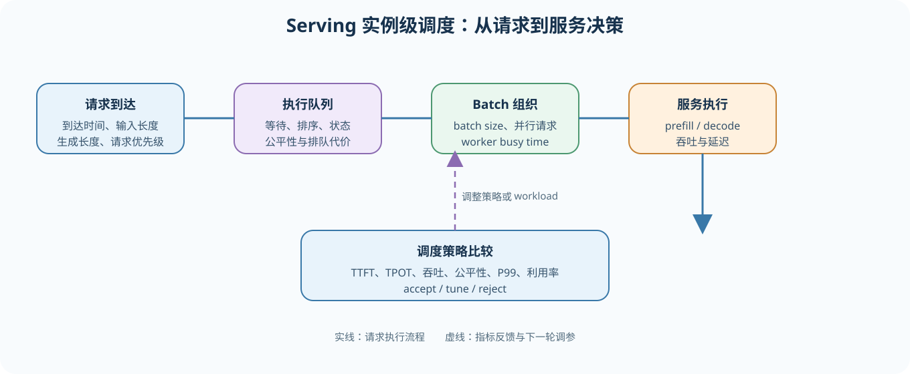
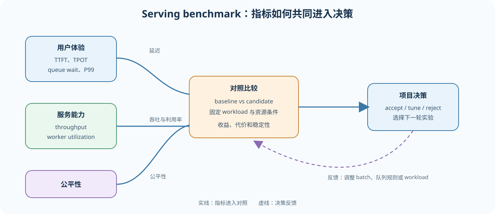
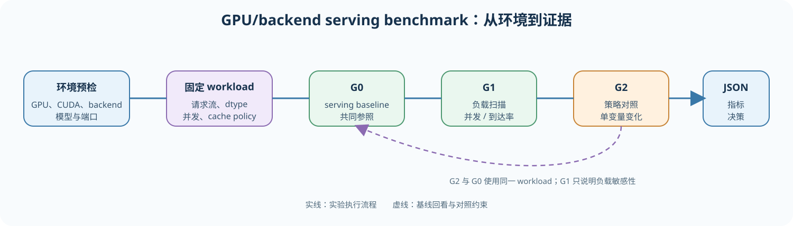

# 70. Serving Scheduler Benchmark | 推理服务调度基准
**难度：** Hard | **环境：** CPU-first | **标签：** `推理优化`, `推理服务`, `调度`, `基准对比` | **目标人群：** 项目决策练习者

> 🚀 **云端运行环境**
>
> 本章节的实战代码可以点击以下链接在免费 GPU 算力平台上直接运行：
>
> [](https://colab.research.google.com/github/datawhalechina/llm-algo-leetcode/blob/main/02_PyTorch_Algorithms/70_Serving_Scheduler_Benchmark.ipynb)
> [](https://modelscope.cn/my/mynotebook) *(国内推荐：魔搭社区免费实例)*


---
## 本节导读

本节要求你在固定请求流量和队列约束下比较两种 serving 调度策略。统一 workload 后，分别测量 TTFT、TPOT、吞吐、公平性和 worker 利用率，并观察不同请求之间的等待代价。最终输出调度方案的适用场景，而不是只按单一吞吐指标排序。
**层级定位：** 本项目主落在 L4，研究服务实例内部的 batching、队列和请求调度；副本扩缩容、跨模型路由、灰度发布和 SLA 治理属于 L5，只有在扩展实验中才继续接入。
**主责与复用边界：** 本项目主责是单实例内的请求调度和排队代价；66 复用其 TTFT、TPOT、吞吐口径，显存优化只观察调度造成的 batch / cache 容量变化，不在本项目内验证集群扩缩容或多模型治理。

**关键词：** `serving scheduler`, `TTFT`, `TPOT`, `throughput`, `fairness`, `utilization`

---
## 前置阅读

**导语：** 先把 decode 调度、KV cache 调度、PD 分离和前缀缓存 benchmark 理顺，再进入这个项目；本节默认你已经知道基本调度对象，重点转向调度策略是否值得保留。
- [36. Decode Scheduling | 解码调度](./36_Decode_Scheduling.md)
- [37. KV Cache Scheduling | KV Cache 调度](./37_KV_Cache_Scheduling.md)
- [38. Prefill Decode Disaggregation | PD 分离](./38_Prefill_Decode_Disaggregation.md)
- [69. Prefix Caching Benchmark | 前缀缓存基准](./69_Prefix_Caching_Benchmark.md)

## 相关阅读

**导语：** 完成 serving 调度 benchmark 后，可用 79 和 81 检查并行通信、分布式推理对请求延迟和资源组织的影响。
- [79. Distributed Parallel Benchmark | 分布式并行基准项目](./79_Distributed_Parallel_Benchmark.md)
- [81. Distributed Inference Logic Validation | 分布式推理逻辑验证](./81_Distributed_Inference_Project.md)

---
### Step 1: 定义 serving 实例级调度目标

这里的调度对象是 serving 实例中的请求，不是模型参数或单个 KV Cache block。调度器主要决定三件事：请求何时进入执行队列、哪些请求组成一个 batch、资源有限时优先服务谁。

本节关注单模型 serving 实例内部的队列和 batch 组织。FIFO、shortest 和 batch 调度是可解释的教学策略，不等同于 vLLM / SGLang 的完整 continuous batching；36、37、38 分别提供请求推进、KV Cache 和 PD 分离机制，本节把它们放回服务 workload 中比较。

实验先固定请求到达模式、prompt/decode 长度和资源配置，再区分负载扫描与策略对照；统一记录 TTFT、TPOT、吞吐、公平性、队列等待和 worker 利用率。

| 本节问题 | 观察对象 | 不要混淆为 |
| --- | --- | --- |
| 请求如何排队 | 到达时间、等待时间、batch 选择 | 单个 decode token 的生成规则 |
| 服务如何批处理 | batch size、batch speedup、worker busy time | 真实 GPU kernel 加速比例 |
| 策略是否值得保留 | TTFT、TPOT、吞吐、公平性和尾延迟 | 只看吞吐的单指标排序 |


### Step 2: 固定 baseline 与请求分布

serving benchmark 不能脱离 workload 讨论。相同模型、请求流、生成长度、cache policy 和资源配置，才构成可比较的对照。先运行 G0，确认请求都完成，再决定后续是扫描负载还是比较策略。

| 实验组 | 固定条件 | 唯一变化 | 结论类型 |
| --- | --- | --- | --- |
| G0 serving baseline | 模型、backend、dtype、请求流、cache policy、worker 配置 | 无 | 共同参照和成功率基线 |
| G1 负载扫描 | 继承 G0 的模型和调度配置 | 并发或请求到达率 | 负载敏感性，不是策略收益 |
| G2 策略对照 | 继承 G0 的请求流和资源配置 | 明确可控的调度策略或 scheduler 参数 | 单变量策略收益与代价 |

只改变并发或到达率时，报告应写成“负载敏感性”；只有 G2 改变了可控调度规则，才可以讨论调度策略收益。
### Step 3: 用统一指标比较收益与代价

这些指标要一起阅读：延迟类指标解释用户体验，吞吐和利用率解释整体服务能力，公平性和队列等待解释收益是否由少数请求承担。

| 指标 | 单位 | 主要回答的问题 | 趋势方向 |
| --- | --- | --- | --- |
| TTFT | ms | 用户等待第一个 token 多久 | 越低越好 |
| TPOT | ms/token | decode 阶段每个 token 间隔多久 | 越低越好 |
| queue wait | ms | 请求在执行前等待了多久 | 越低越好 |
| throughput | token/s 或 request/s | serving 实例整体处理能力是否提高 | 越高越好 |
| fairness | 0–1 | 是否牺牲部分请求换取整体吞吐 | 越高越好 |
| utilization | 0–1 | worker 是否持续工作 | 结合延迟和公平性判断 |

CPU 实验可以验证队列顺序、batch 选择和指标方向；GPU/backend 实验才能验证真实 continuous batching、KV Cache 约束、GPU 利用率和 P99。


### Step 4: 根据门槛输出 benchmark 结论

只有在调度规则确实可控、workload 对齐、指标重复稳定时，才能比较策略收益。若只是并发扫描，应输出负载敏感性结论。决策时同时检查吞吐、延迟和公平性，不能用单一指标替代整体判断。

| 决策 | 条件 | 下一步 |
| --- | --- | --- |
| `accept` | 吞吐达到最低增益，TTFT / TPOT 没有超出可接受范围，公平性达到门槛 | 进入真实 serving rollout 或更大 workload |
| `tune` | 吞吐或利用率有改善，但延迟、公平性或重复稳定性仍有权衡 | 调整队列规则、batch 或 worker 配置 |
| `reject` | 没有可信收益，或延迟、公平性明显恶化 | 回到 baseline 或重新设计策略 |

CPU 题目区只验证决策逻辑；GPU/backend 报告还需要补充 P99、OOM、GPU 利用率和运行环境信息。
#### 图解：36-37-38-69 如何收束到 70 推理服务调度基准

```text
36 decode scheduling -> 37 KV cache scheduling -> 38 PD disaggregation -> 69 prefix serving baseline
                                          |
                                          v
                          70 serving scheduler benchmark + delivery decision
```
项目页最小产物：

| 模块 | 必须记录 | 用途 |
|:---|:---|:---|
| baseline | workload、TTFT、TPOT、throughput、公平性 | 保证比较合法 |
| candidate | 调度规则、worker 利用率、缓存/队列收益 | 解释 serving 收益来源 |
| 对比 | 延迟变化、吞吐增益、公平性变化、利用率变化 | 判断是否值得 adopt |
| 决策 | accept / tune / reject | 输出 benchmark 结论 |

```python
from typing import Dict, List

```


```python
# 4 个核心 TODO：请求调度模拟、workload 汇总、baseline 对比、项目判断
# 目标：先用 CPU 验证排队/批处理状态，再把调度收益转成可比较的 benchmark 报告。
# CPU 题目区验证单 worker 的队列状态转移；真实 serving 的 batch、P99、GPU 利用率和平台扩缩容属于 GPU/backend 扩展。

def simulate_serving_scheduler(requests: List[Dict[str, float]], policy: str = 'fifo', batch_size: int = 1, batch_speedup: float = 1.0) -> Dict[str, object]:
    """模拟单 worker 的到达、排队、批处理和完成时间；不测真实 GPU serving。

    arrival_ms、service_ms 和 output_tokens 分别表示请求到达时间、理想服务时长和输出 token 数；
    batch_speedup 是教学模型中的批处理加速因子，不代表线性或硬件实测加速。
    """
    if policy not in {'fifo', 'shortest'}:
        raise ValueError('policy 只能是 fifo 或 shortest')
    if batch_size < 1 or batch_speedup <= 0:
        raise ValueError('batch_size 必须 >= 1，batch_speedup 必须 > 0')
    # ==========================================
    # TODO 0: 按到达时间推进队列，按 policy 取 batch，计算等待/完成指标。
    # 提示：FIFO 按到达顺序（request_id 只作为稳定 tie-break）；shortest 按 service_ms 从小到大。
    # 变量提示：使用 pending、queue、completed、now、busy、batch；
    #       每个请求至少读取 request_id、arrival_ms、service_ms、output_tokens。
    #       返回 request_count、completed_count、makespan_ms、throughput_tps、
    #       utilization、fairness、avg_queue_wait_ms 和 requests 明细。
    #       fairness 需基于请求等待/完成表现定义并保持可解释；不能用单一吞吐代替公平性。
    # ==========================================
    raise NotImplementedError("请先完成 TODO 代码！")

def summarize_serving_scheduler_runs(runs: List[Dict[str, float]]) -> Dict[str, object]:
    """汇总同一请求流和 batch 配置下的调度运行结果。

    输入至少包含 name、ttft_ms 和 throughput_tps；空列表返回可解释的空摘要。
    只汇总同一请求流、worker 和 batch 配置的运行；缺失指标不能补成真实的 0。"""
    # TODO 1：使用 run_count、avg_throughput_tps、best_latency_run；
    # run_count = ???；avg_throughput_tps = ???；best_latency_run = ???。
    #         缺失指标不能静默解释为真实的 0。
    #         avg_throughput_tps 是报告均值，不等于单请求 latency。
    raise NotImplementedError("请先完成 TODO 代码！")

def compare_scheduler_to_baseline(baseline: Dict[str, float], candidate: Dict[str, float]) -> Dict[str, float]:
    """计算 candidate 相对 baseline 的延迟、吞吐、公平性和利用率变化。

    TTFT/TPOT 差值越低越好，吞吐、公平性和利用率增益越高越好；两组结果
    必须使用同一请求流和资源配置。"""
    # TODO 2：返回 ttft_delta_ms、tpot_delta_ms、throughput_gain_tps、
    # ttft_delta_ms = ???；tpot_delta_ms = ???；throughput_gain_tps = ???；fairness_delta = ???。
    #         fairness_delta 和 utilization_delta。
    #         延迟差使用 candidate - baseline；吞吐、公平性、利用率增益也使用 candidate - baseline。
    raise NotImplementedError("请先完成 TODO 代码！")

def recommend_serving_scheduler_run(
    baseline: Dict[str, float], candidate: Dict[str, float], min_throughput_gain: float, min_fairness: float
) -> Dict[str, object]:
    """按延迟、吞吐和公平性门槛给出教学决策。

    min_throughput_gain、min_fairness 属于当前 workload 的配置；该函数是
    可解释的筛选模板，不代表生产环境 SLA 或自动调参器。"""
    # TODO 3：先得到 comparison，再使用两个门槛输出 decision、reason、
    # throughput_ok = ???；fairness_ok = ???；decision = ???；next_action = ???。
    #         next_action；允许的 decision 是 accept / tune / reject。
    #         吞吐达标但公平性未达标时不能直接 accept；没有可接受候选时返回 reject。
    raise NotImplementedError("请先完成 TODO 代码！")

```


```python
# 测试你的实现
def test_serving_scheduler_benchmark_template():
    requests = [
        {'request_id': 'r1', 'arrival_ms': 0, 'service_ms': 10, 'output_tokens': 20},
        {'request_id': 'r2', 'arrival_ms': 0, 'service_ms': 2, 'output_tokens': 20},
        {'request_id': 'r3', 'arrival_ms': 1, 'service_ms': 3, 'output_tokens': 20},
    ]
    simulation = simulate_serving_scheduler(requests, policy='fifo', batch_size=1)
    assert simulation['request_count'] == 3
    assert simulation['completed_count'] == 3
    assert simulation['makespan_ms'] == 15.0
    assert simulation['throughput_tps'] == 4000.0
    assert simulation['utilization'] == 1.0
    assert simulation['avg_queue_wait_ms'] == round((0.0 + 10.0 + 11.0) / 3, 4)
    assert simulation['requests'][0]['queue_wait_ms'] == 0.0
    assert simulation['requests'][1]['ttft_ms'] == 10.0
    assert 0.0 <= simulation['fairness'] <= 1.0
    shortest = simulate_serving_scheduler(requests, policy='shortest', batch_size=1)
    assert shortest['requests'][0]['request_id'] == 'r2'
    assert shortest['requests'][-1]['request_id'] == 'r1'
    batched = simulate_serving_scheduler(requests, policy='fifo', batch_size=2, batch_speedup=1.0)
    assert batched['completed_count'] == len(requests)
    assert batched['makespan_ms'] == 13.0
    assert batched['makespan_ms'] < simulation['makespan_ms']
    empty = simulate_serving_scheduler([])
    assert empty['request_count'] == 0 and empty['completed_count'] == 0
    try:
        simulate_serving_scheduler(requests, policy='unknown')
    except ValueError:
        pass
    else:
        raise AssertionError('非法调度策略应明确拒绝！')
    for invalid in ({'batch_size': 0}, {'batch_speedup': 0.0}):
        try:
            simulate_serving_scheduler(requests, **invalid)
        except ValueError:
            pass
        else:
            raise AssertionError('非法 batch 参数应明确拒绝！')
    baseline = {
        'name': 'fifo',
        'ttft_ms': 220,
        'tpot_ms': 42,
        'throughput_tps': 180,
        'fairness': 0.78,
        'utilization': 0.70,
    }
    candidate = {
        'name': 'priority_scheduler',
        'ttft_ms': 180,
        'tpot_ms': 36,
        'throughput_tps': 205,
        'fairness': 0.81,
        'utilization': 0.79,
    }
    summary = summarize_serving_scheduler_runs([baseline, candidate])
    assert summary['run_count'] == 2
    assert summary['best_latency_run'] == 'priority_scheduler'
    assert summary['avg_throughput_tps'] == 192.5
    assert summarize_serving_scheduler_runs([]) == {'run_count': 0, 'best_latency_run': None, 'avg_throughput_tps': 0.0}

    comparison = compare_scheduler_to_baseline(baseline, candidate)
    assert comparison['ttft_delta_ms'] == -40
    assert comparison['tpot_delta_ms'] == -6
    assert comparison['throughput_gain_tps'] == 25
    assert comparison['fairness_delta'] == 0.03
    assert comparison['utilization_delta'] == 0.09

    decision = recommend_serving_scheduler_run(baseline, candidate, min_throughput_gain=20, min_fairness=0.8)
    assert decision['decision'] == 'accept'
    assert decision['next_action'] == 'promote_to_serving_rollout'

    weak_candidate = {
        'name': 'aggressive_batching',
        'ttft_ms': 195,
        'tpot_ms': 38,
        'throughput_tps': 202,
        'fairness': 0.76,
        'utilization': 0.82,
    }
    weak_decision = recommend_serving_scheduler_run(baseline, weak_candidate, min_throughput_gain=20, min_fairness=0.8)
    assert weak_decision['decision'] == 'tune'
    assert comparison['throughput_gain_tps'] > 0
    assert comparison['fairness_delta'] > 0

    bad_candidate = {
        'name': 'overfit_scheduler',
        'ttft_ms': 260,
        'tpot_ms': 48,
        'throughput_tps': 170,
        'fairness': 0.60,
        'utilization': 0.66,
    }
    bad_decision = recommend_serving_scheduler_run(baseline, bad_candidate, min_throughput_gain=20, min_fairness=0.8)
    assert bad_decision['decision'] == 'reject'


test_serving_scheduler_benchmark_template()
print('测试通过：推理服务调度基准模板可以工作。')
```

🛑 **STOP HERE** 🛑

请先尝试自己完成代码并跑通测试。如果你在 Colab 中运行，并且暂时没有思路，再继续看下面的参考答案。
### Step 5：CPU 实验——请求流、队列与批处理

CPU 代码只验证到达过程、队列状态、批处理顺序和指标方向；结果会显式给出每个请求的 `queue_wait_ms`，以及整体的 `avg_queue_wait_ms`。本模型把首 token 生成时间简化为 0，因此这里的 queue wait 与 TTFT 数值相同。

`utilization` 是模拟 worker 的 busy time / makespan，不是 GPU SM 利用率；`fairness` 也只是教学代理指标。

## 参考代码与解析

### 代码

```python
from typing import Dict, List

def simulate_serving_scheduler(requests: List[Dict[str, float]], policy: str = 'fifo', batch_size: int = 1, batch_speedup: float = 1.0) -> Dict[str, object]:
    """模拟单 worker 的到达、排队、批处理和完成时间。

    在本模型中，queue_wait_ms 是请求从到达到 batch 开始的等待时间；
    它与 TTFT 相同只是因为模型把首 token 生成时间简化为 0。"""
    if policy not in {'fifo', 'shortest'}:
        raise ValueError('policy 只能是 fifo 或 shortest')
    if batch_size < 1 or batch_speedup <= 0:
        raise ValueError('batch_size 必须 >= 1，batch_speedup 必须 > 0')
    if not isinstance(requests, list):
        raise TypeError('requests 必须是 list[dict]')
    if not requests:
        return {'request_count': 0, 'completed_count': 0, 'makespan_ms': 0.0, 'throughput_tps': 0.0, 'utilization': 0.0, 'fairness': 1.0, 'requests': []}
    pending = []
    for index, item in enumerate(requests):
        arrival = float(item.get('arrival_ms', 0.0))
        service = float(item.get('service_ms', 0.0))
        tokens = int(item.get('output_tokens', 0))
        if arrival < 0 or service <= 0 or tokens < 0:
            raise ValueError('arrival_ms >= 0，service_ms > 0，output_tokens >= 0')
        pending.append({**item, '_index': index, 'arrival_ms': arrival, 'service_ms': service, 'output_tokens': tokens})
    pending.sort(key=lambda item: (item['arrival_ms'], item['_index']))
    queue, completed, cursor = [], [], 0
    now = busy = 0.0
    while cursor < len(pending) or queue:
        if not queue and cursor < len(pending):
            now = max(now, pending[cursor]['arrival_ms'])
        while cursor < len(pending) and pending[cursor]['arrival_ms'] <= now:
            queue.append(pending[cursor]); cursor += 1
        if policy == 'shortest':
            queue.sort(key=lambda item: (item['service_ms'], item['_index']))
        else:
            queue.sort(key=lambda item: item['_index'])
        batch = queue[:batch_size]; del queue[:len(batch)]
        start = now
        duration = max(item['service_ms'] for item in batch) / batch_speedup
        now += duration; busy += duration
        for item in batch:
            completed.append({
                'request_id': item.get('request_id', f"request-{item['_index']}"),
                'queue_wait_ms': round(start - item['arrival_ms'], 4),
                'ttft_ms': round(start - item['arrival_ms'], 4),
                'e2e_ms': round(now - item['arrival_ms'], 4),
                'output_tokens': item['output_tokens'],
            })
    makespan = now - min(item['arrival_ms'] for item in pending)
    waits = [item['ttft_ms'] for item in completed]
    mean_wait = sum(waits) / len(waits) if waits else 0.0
    spread = (max(waits) - min(waits)) if waits else 0.0
    fairness = max(0.0, 1.0 - spread / max(mean_wait, 1.0))
    total_tokens = sum(item['output_tokens'] for item in completed)
    avg_queue_wait_ms = sum(item['queue_wait_ms'] for item in completed) / len(completed) if completed else 0.0
    return {
        'request_count': len(pending), 'completed_count': len(completed),
        'makespan_ms': round(makespan, 4),
        'throughput_tps': round(total_tokens / (makespan / 1000.0), 4) if makespan else 0.0,
        'utilization': round(busy / makespan, 4) if makespan else 0.0,
        'avg_queue_wait_ms': round(avg_queue_wait_ms, 4),
        'fairness': round(fairness, 4), 'requests': completed,
    }

def summarize_serving_scheduler_runs(runs: List[Dict[str, float]]) -> Dict[str, object]:
    """汇总同一请求流和 batch 配置下的调度运行结果。

    每条 run 应包含 name、ttft_ms 和 throughput_tps；空列表返回空摘要。
    缺失指标不能静默解释为真实的 0。"""
    if not isinstance(runs, list):
        raise TypeError('runs 必须是 list[dict]')
    required = {'name', 'ttft_ms', 'throughput_tps'}
    for index, item in enumerate(runs):
        if not isinstance(item, dict) or not required.issubset(item):
            raise ValueError(f'第 {index} 条 run 必须包含 {sorted(required)}')
    best = None
    run_count = len(runs)
    avg_throughput_tps = sum(item.get('throughput_tps', 0.0) for item in runs) / run_count if run_count else 0.0
    for item in runs:
        if best is None or item.get('ttft_ms', float('inf')) < best.get('ttft_ms', float('inf')):
            best = item
    return {'run_count': run_count, 'best_latency_run': best.get('name', 'run') if best else None, 'avg_throughput_tps': avg_throughput_tps}


def compare_scheduler_to_baseline(baseline: Dict[str, float], candidate: Dict[str, float]) -> Dict[str, float]:
    """计算 candidate 相对 baseline 的延迟、吞吐、公平性和利用率变化。"""
    required = {'ttft_ms', 'tpot_ms', 'throughput_tps', 'fairness', 'utilization'}
    for name, item in (('baseline', baseline), ('candidate', candidate)):
        if not isinstance(item, dict) or not required.issubset(item):
            raise ValueError(f'{name} 必须包含 {sorted(required)}')
    return {
        'ttft_delta_ms': round(candidate.get('ttft_ms', 0.0) - baseline.get('ttft_ms', 0.0), 4),
        'tpot_delta_ms': round(candidate.get('tpot_ms', 0.0) - baseline.get('tpot_ms', 0.0), 4),
        'throughput_gain_tps': round(candidate.get('throughput_tps', 0.0) - baseline.get('throughput_tps', 0.0), 4),
        'fairness_delta': round(candidate.get('fairness', 0.0) - baseline.get('fairness', 0.0), 4),
        'utilization_delta': round(candidate.get('utilization', 0.0) - baseline.get('utilization', 0.0), 4),
    }


def recommend_serving_scheduler_run(
    baseline: Dict[str, float], candidate: Dict[str, float], min_throughput_gain: float, min_fairness: float
) -> Dict[str, object]:
    """按延迟、吞吐和公平性门槛给出教学决策。"""
    if min_throughput_gain < 0:
        raise ValueError('min_throughput_gain 不能为负数')
    if not 0 <= min_fairness <= 1:
        raise ValueError('min_fairness 必须位于 [0, 1]')
    comparison = compare_scheduler_to_baseline(baseline, candidate)
    if (
        comparison['ttft_delta_ms'] < 0
        and comparison['tpot_delta_ms'] <= 0
        and comparison['throughput_gain_tps'] >= min_throughput_gain
        and candidate.get('fairness', 0.0) >= min_fairness
    ):
        return {
            'decision': 'accept',
            'reason': '延迟、吞吐和公平性都达标，适合进入真实 serving 验证',
            'next_action': 'promote_to_serving_rollout',
        }
    if comparison['throughput_gain_tps'] >= 0 and comparison['utilization_delta'] >= 0:
        return {
            'decision': 'tune',
            'reason': '吞吐和利用率已有改善，但公平性或延迟边界还不够稳',
            'next_action': 'refine_queue_rules_or_worker_split',
        }
    return {
        'decision': 'reject',
        'reason': 'candidate 没有形成可信的 serving 调度收益',
        'next_action': 'fallback_to_scheduler_audit',
    }
```

### 解析

这页现在按 `simulate -> measure -> compare -> decide` 的最小 serving scheduler 项目闭环组织，不再只是罗列某种调度技巧的收益。

#### TODO 0

- 实现方式：按请求到达时间推进单 worker 时钟，把已到达请求放入队列；再按 FIFO 或 shortest policy 选择一个 batch，计算每个请求的等待、TTFT、E2E 和整体吞吐。
- 关键点：这里的 `service_ms` 是人为给定的 CPU 成本模型；`utilization` 是 busy time / makespan，不能解释成 GPU SM 利用率。
- 项目意义：CPU 可以验证队列状态、策略顺序和指标方向；真实 continuous batching、KV cache 约束、GPU 利用率和服务尾延迟仍需 backend 验证。
- 边界：这是单 worker 教学模拟，不等同于 vLLM / SGLang 的完整调度器实现。

#### TODO 1

- 实现方式：先汇总 run 数量和平均吞吐，再找出 TTFT 最低的 run。
- 关键点：这里的 `best_latency_run` 用来定位哪种调度策略最值得优先回看，不等于最终项目结论。
- 项目意义：先把 workload 摘要做平，后面才能在同一请求流量和队列条件下比较调度收益。

#### TODO 2

- 实现方式：统一计算 `ttft_delta_ms`、`tpot_delta_ms`、`throughput_gain_tps`、`fairness_delta` 和 `utilization_delta`。
- 关键点：延迟类指标越低越好，其余三类指标越高越好，所以方向一定要统一。
- 项目意义：这一步把 serving scheduler 从“技巧演示”转成“收益和代价能否一起成立”的 benchmark 对比。

#### TODO 3

- 实现方式：先复用 baseline 对比结果，再按吞吐阈值、公平性边界和延迟收益输出 `accept / tune / reject`。
- 关键点：`tune` 主要对应吞吐和利用率已有改善，但公平性、TTFT 或 TPOT 还没有一起收稳。
- 项目意义：serving 调度项目不是只追吞吐，而是判断这套调度策略值不值得继续上线、调优或回退。
### Step 6（可选）：GPU/backend 实验——真实 serving workload 对照

真实实验沿着“环境预检 → 固定 workload → G0 baseline → G1 负载扫描 → G2 策略对照 → JSON 报告”的顺序执行。先确认 backend 能启动，再解释指标变化；不要把 G1 的负载变化写成调度策略收益。



**实验条件表**

| 项目 | G0 serving baseline | G1 负载扫描 | G2 调度策略对照 |
|---|---|---|---|
| 请求流 | 固定到达模式 | 改变并发或到达率 | 与 G0 相同 |
| 调度配置 | 默认 | 默认 | 必须明确可控策略 |
| backend / 硬件 | 固定 | 固定 | 尽量固定 |

**结果表模板**

| 实验组 | model / backend / dtype | concurrency | TTFT P50/P99 | TPOT | throughput | queue wait | fairness | peak memory | decision |
|---|---|---:|---|---:|---:|---:|---:|---:|---|
| G0 baseline | 待填写 | 固定 | 待采集 | 待采集 | 待采集 | 待采集 | 参考值 | 待采集 | 待判断 |
| G1 负载扫描 | 与 G0 相同 | 扫描 | 待采集 | 待采集 | 待采集 | 待采集 | 待采集 | 待采集 | 待判断 |
| G2 策略对照 | 与 G0 相同 | 固定 | 待采集 | 待采集 | 待采集 | 待采集 | 待采集 | 待采集 | 待判断 |

**证据边界**：CPU 模拟只能说明队列、批处理和指标方向；改变并发量只是负载敏感性实验，不等于调度策略改变。GPU 利用率、尾延迟和正式 SLA 需要真实 backend 或外部调度器证据。
按 66 的统一分组执行：G0 是 serving baseline，G1 扫描并发或请求到达负载，G2 才比较确实可控的调度策略或外部 scheduler。只改变并发量属于 workload sensitivity，不应命名为调度策略对比。

本节可以复用 vLLM / SGLang 的 OpenAI-compatible endpoint，但调度策略是否真正生效取决于 backend 的启动参数和版本。当前自动入口只执行 G0/G1 负载扫描；只有确认 backend 暴露了可控 scheduler 参数后，才填写并执行 G2。共享字段固定记录模型、backend、dtype、batch、并发与 cache policy；公平性、队列长度和 GPU 利用率等调度指标放入 `strategy_metrics`。

```python
try:
    from tools.inference_project_runtime import locate_repo_root
    REPO_ROOT = locate_repo_root()
    from tools.inference_project_runtime import (
        shared_project_config, save_project_result, start_optional_vllm,
        stop_optional_vllm, run_backend_benchmark,
    )
except ModuleNotFoundError:
    RUN_REAL_BACKEND = False
    def shared_project_config(**kwargs): return kwargs
    def save_project_result(*args, **kwargs): raise RuntimeError('需要从仓库根目录运行真实 backend 入口')

import json
MODEL_ID = 'Qwen/Qwen2.5-0.5B-Instruct'  # G0/G1 使用同一基座模型。
WORKLOAD = 'benchmarks/workloads/fixed.jsonl'  # 两组必须使用同一请求分布。
EXPERIMENT_TYPE = 'load_sensitivity'  # load_sensitivity / scheduler_compare；当前入口默认前者。
SCHEDULER_NOTE = 'G2 需要 backend 暴露可控调度参数后再执行'
RESULT_PATH = 'benchmarks/results/70_scheduler.json'  # 保存负载扫描总清单。
MAX_TOKENS = 64
NUM_PROMPTS = 5  # smoke 规模；正式结论应提高请求数并重复运行。
WARMUP = 1
GROUPS = (
    {'name': 'g0_concurrency1', 'concurrency': 1},
    {'name': 'g1_concurrency4', 'concurrency': 4},
)
project_config = shared_project_config(
    model=MODEL_ID, backend='vllm', dtype='auto', generated_tokens=MAX_TOKENS,
    workload=WORKLOAD, num_prompts=NUM_PROMPTS, warmup=WARMUP,
    experiment_type=EXPERIMENT_TYPE, scheduler_note=SCHEDULER_NOTE, groups=GROUPS,
)
print(project_config)
RUN_REAL_BACKEND = False  # 改为 True 才启动 backend；默认保持 CPU-first。
if RUN_REAL_BACKEND:
    reports = []
    server, log_path, port, selected_dtype, model_path = start_optional_vllm(
        model_id=MODEL_ID, model_source='auto', dtype='auto',
        served_model_name=MODEL_ID,
    )
    try:
        for group in GROUPS:
            result_path = f"benchmarks/results/70_scheduler_{group['name']}.json"
            report = run_backend_benchmark(
                project='70', base_url=f'http://127.0.0.1:{port}', model=MODEL_ID,
                label=f"vllm-{group['name']}", output=result_path, workload=WORKLOAD,
                num_prompts=NUM_PROMPTS, max_tokens=MAX_TOKENS,
                concurrency=group['concurrency'], warmup=WARMUP,
                dtype=selected_dtype, cache_policy='default',
            )
            reports.append({'group': group, 'report_path': result_path,
                            'normalized_result': report.get('normalized_result')})
            print(reports[-1])
    finally:
        stop_optional_vllm(server, log_path)
    manifest_path = Path(RESULT_PATH)
    manifest_path.parent.mkdir(parents=True, exist_ok=True)
    manifest_path.write_text(json.dumps({
        'project': '70', 'config': project_config, 'groups': reports,
        'evidence_boundary': 'load_sensitivity_not_scheduler_strategy_comparison',
    }, ensure_ascii=False, indent=2), encoding='utf-8')
    print(f'负载扫描清单已保存: {manifest_path}')
```
