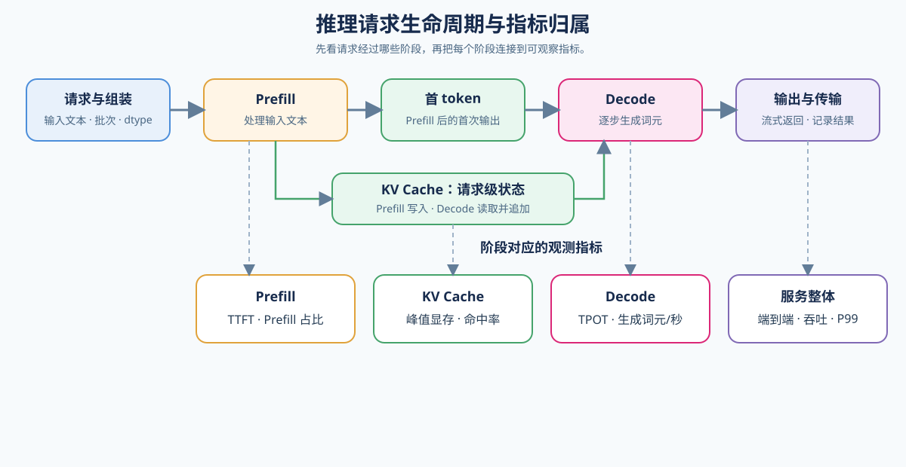

# 01. Request Path and Metrics | 请求链路与指标口径

## 页面目标

从一次最小推理请求开始，沿着 `Prefill`、`KV Cache` 和 `Decode` 走一遍，认识 `TTFT`、`TPOT`、throughput、P99 和 peak memory。完成请求阶段与指标的映射后，你应该能够说明请求经过了哪些阶段，把阶段连接到可观察指标，并根据现象判断下一步该看哪类机制。需要补充 Attention 基础时，可先阅读 [04 Attention（MHA / GQA）](../../02_PyTorch_Algorithms/04_Attention_MHA_GQA.md)。

## 核心机制

请求可以先拆成 `Prefill`、`Decode` 和输出三个主要处理阶段；`KV Cache` 不是独立的串行阶段，而是由 Prefill 写入、由 Decode 持续读取和追加的状态对象。`TTFT` 是首 token 延迟，`TPOT` 是后续 token 的平均生成间隔；吞吐、P99 和峰值显存分别帮助我们观察系统产出、尾部延迟和资源占用。下图把主要阶段、状态对象与指标放在同一条链路中。

不同阶段关注的指标不同：

| 指标 | 它回答的问题 | 主要关联阶段 |
|:---|:---|:---|
| `TTFT` | 首个 token 多久返回？ | prefill、Attention、prompt length |
| `TPOT` | 后续 token 多久生成一个？ | decode、KV Cache、调度 |
| `throughput` | 单位时间生成多少 token？ | batching、调度、生成策略 |
| `peak memory` | 运行期间最高占用多少显存？ | 权重、KV Cache、batch、量化 |
| `P50 / P95 / P99` | 典型请求和慢请求的延迟是多少？ | 排队、batch、调度、系统抖动 |

把指标放回请求链路时，先区分“阶段耗时”和“用户看到的结果”。`TTFT` 主要覆盖请求进入系统后到首 token 返回的路径，`TPOT` 主要反映首 token 之后的 Decode 循环；排队、数据传输和调度可能同时影响两者。因此一次实验至少要同时记录阶段时间、端到端延迟和请求条件，避免只用一个平均值解释整个系统。

| 证据层 | 需要记录的内容 | 用途 |
|:---|:---|:---|
| 请求条件 | prompt tokens、generated tokens、batch、concurrency、模型和 dtype | 判断两次测量是否可比较 |
| 阶段表现 | prefill 时间、decode 时间、TTFT、TPOT | 定位请求链路中的主要阶段 |
| 服务表现 | E2E latency、throughput、P50/P99、排队时间 | 判断优化是否改善用户可见结果 |
| 资源表现 | peak memory、GPU 利用率、Cache 使用量 | 判断收益来自计算、访存还是容量变化 |

同一个模型在不同请求形态下，瓶颈可能完全不同。因此进入后续机制前，先给 workload 标注请求长度、到达方式和服务目标，而不是只记录一个平均 Prompt 长度。

| workload 类型 | 典型请求形态 | 优先关注的指标 | 主要进入方向 |
|:---|:---|:---|:---|
| 交互式短请求 | Prompt 和输出都较短，关注首 token 体验 | TTFT、P99、超时率 | Prefill、队列和调度 |
| 长上下文 | Prompt 很长或上下文持续增长 | TTFT、peak memory、Cache 使用量 | Attention、Chunked Prefill、KV Cache |
| 批处理 | 请求可等待，追求单位时间产出 | throughput、tokens/s、成本 | batching、kernel、量化 |
| 突发并发 | 到达率短时间快速上升 | 排队时间、P95/P99、拒绝率 | 接纳控制、调度、扩缩容 |

一次推理请求还要经过多个系统对象。模型决定计算图和状态结构，运行时或 backend 负责把模型映射到设备，调度器组织请求和 Cache，硬件执行 kernel 并提供显存与互联能力。性能问题应先定位到对象，再选择机制；否则容易把模型结构问题误判成 backend 问题，或把调度等待误判成 kernel 变慢。

| 系统对象 | 主要负责什么 | 可观察证据 |
|:---|:---|:---|
| 模型与权重 | 层结构、dtype、权重和 KV 表示 | 参数量、dtype、模型 revision |
| Runtime / backend | loader、kernel、Cache 实现和请求执行 | backend 版本、kernel、执行路径 |
| Scheduler | 批次、队列、接纳、暂停与服务池 | batch、queue time、调度事件 |
| 硬件与互联 | 计算、显存、带宽和跨设备传输 | GPU 利用率、显存、带宽、通信时间 |

Attention 的架构变化会沿着请求链路影响不同成本：MHA、GQA 和 MQA 主要改变 KV Cache 的规模，MLA 改变 Cache 的内部表示，FlashAttention 则改变 Attention 的执行和访存路径。它们属于不同层次，应该分别观察架构、状态和 kernel 证据。

| Attention 方向 | 主要改变 | 影响的推理成本 | 后续正文 |
|:---|:---|:---|:---|
| MHA → GQA / MQA | KV heads 数量 | KV Cache 显存、Decode 访存 | 04 |
| MHA / GQA → MLA | KV 状态表示 | Cache 容量、恢复或重构计算 | 04、71 |
| 标准 Attention → FlashAttention | 中间矩阵与访存路径 | Prefill 时间、工作集、带宽 | 02 |
| 单请求 Cache → Paged / Prefix Cache | 状态分配与复用 | 并发容量、TTFT、碎片 | 04、07 |

MoE 是另一类架构变量：总参数量不等于每个 token 的实际计算量。推理时还要观察 Router 选择的专家数、专家负载、容量因子和 token dispatch 通信；这些因素会在多 GPU Serving 中进一步影响负载均衡和吞吐。

参考入口：指标定义可看 [vLLM Metrics](https://github.com/vllm-project/vllm/blob/main/docs/design/metrics.md)；Serving 实现可看 [vLLM](https://github.com/vllm-project/vllm)。

## 判断框架

比较前先固定 `workload`，也就是一组可复现的输入和运行条件：模型、backend（实际执行推理的框架或服务）、Prompt（输入文本）、generated tokens（输出长度）、batch（一次并行处理的请求数）、并发、dtype（计算数据类型）和 cache policy（缓存管理方式）。然后根据现象选择下一步：

| 观察到的现象 | 优先怀疑的瓶颈 | 下一步 |
|:---|:---|:---|
| 长 prompt 使 `TTFT` 明显升高 | `prefill-bound`（输入处理受限）或 Attention 访存 | 进入 `02` |
| `TPOT` 高、生成阶段占比大 | `decode-bound`（逐 token 生成受限）、KV Cache 或调度 | 进入 `03` / `04` |
| peak memory 接近预算、batch 上不去 | `memory-bound`（显存或访存受限）或 Cache 容量 | 进入 `04` / `05` |
| 多请求时 P99 明显升高 | 排队、batch 组织或调度 | 进入 `04` / `06` |
| 没有明显单点瓶颈 | 需要端到端比较 | 进入 `06` |
