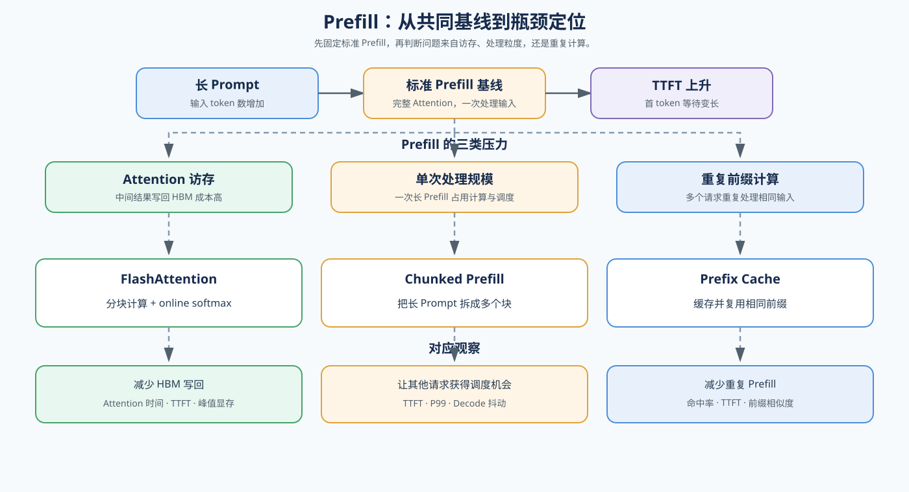

# 02. Prefill and Attention Kernel | Prefill 与 Attention Kernel

## 页面目标

从一个长 Prompt 请求开始，观察 Prefill 为什么会推高 `TTFT`，再区分 Attention 访存、Chunked Prefill 和 Prefix Cache 分别解决哪类问题。

## 核心机制

Prefill 处理已有 Prompt，Prompt 变长通常会推高 `TTFT`。先把“标准 Attention + 一次完整 Prefill”作为参考行为：不使用 FlashAttention、不分块，也不复用前缀，在固定 Prompt、模型和硬件下记录 `TTFT`、Attention 时间与峰值显存。再区分三类瓶颈：Attention 访存、单次 Prefill 规模，以及重复前缀计算。下图呈现基线与候选机制的关系，表格用于快速分流；三种机制可以协作，但不能视为同一种优化。

| 机制 | 主要改变什么 | 适合解决的问题 |
|:---|:---|:---|
| 标准 Attention + 完整 Prefill（基线） | 一次处理完整 Prompt，不分块、不复用前缀 | 建立 `TTFT`、Attention 时间和峰值显存参照 |
| FlashAttention | Attention 的访存路径和中间结果写回 | Attention 计算受 HBM 读写拖慢 |
| Chunked Prefill | 长 Prompt 的处理和调度方式 | 单次 Prefill 过大、影响其他请求 |
| Prefix Cache | 重复前缀是否重新计算 | 多请求共享相同前缀 |

参考入口：论文 [FlashAttention](https://arxiv.org/abs/2205.14135)；开源实现 [FlashAttention](https://github.com/Dao-AILab/flash-attention)。

## 判断框架

本节承接 `01` 的请求阶段和指标：先用 [20 FlashAttention Sim](../../02_PyTorch_Algorithms/20_FlashAttention_Sim.md) 理解 Attention 访存，再用 [34 Prefix Caching and Chunked Prefill](../../02_PyTorch_Algorithms/34_Prefix_Caching_and_Chunked_Prefill.md) 观察长 Prompt 的分块与前缀复用，最后在 [66 Inference Performance Comparison](../../02_PyTorch_Algorithms/66_Inference_Performance_Comparison.md) 中固定 workload，检查这些机制是否真的改善了请求表现。阅读下表时，先找最接近当前现象的一行，再决定下一步学习或实验。

| 观察到的现象 | 优先判断 | 下一步 |
|:---|:---|:---|
| Prompt 变长时 `TTFT` 持续升高 | Prefill 或 Attention 访存受限 | 检查 FlashAttention 和硬件支持 |
| 长 Prompt 阻塞其他请求 | 单次 Prefill 影响调度 | 检查 Chunked Prefill |
| 多请求包含相同前缀 | 重复计算占主要成本 | 检查 Prefix Cache |
| `TTFT` 高但 Prefill 占比不高 | 排队、batch 组装或服务调度 | 进入 `04` / `06` |
