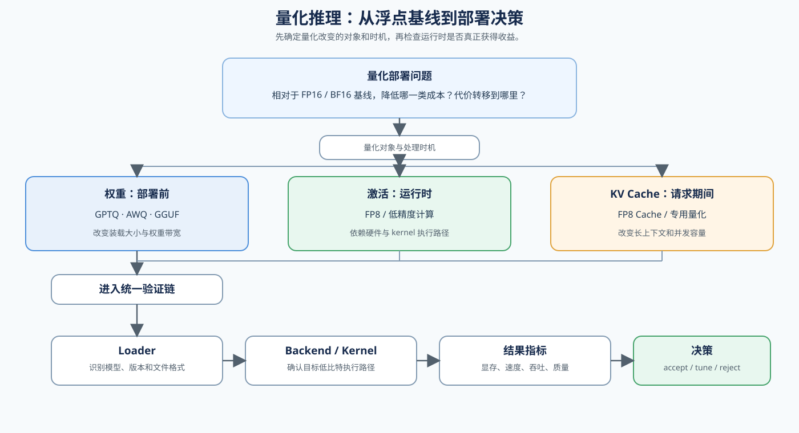

# 05. Quantized Inference and Deployment | 量化推理与部署

## 页面目标

从一个准备上线的模型开始：先观察模型装载、长上下文和并发分别受到什么约束，再区分权重、激活和 KV Cache 三类量化改变的是哪一部分成本。接着把量化算法或文件格式连接到 loader、backend 和 kernel，理解为什么同样的 bit 数在不同硬件和运行时上可能得到不同结果。完成量化对象、运行时和部署指标的对应后，你应该能够根据显存、速度、质量和部署支持条件，选择下一步要验证的量化路线，而不是只因为显存下降就切换方案。

## 核心机制

量化可以看成“资源占用与表示误差”的交换：降低 bit 可能减少装载、显存读写或计算成本，但收益取决于硬件、kernel 和 backend 是否真正支持这条低比特路径。比较方案前，先用同一模型、backend 和 workload 下的 FP16 / BF16 浮点部署建立基线。

还要区分量化的处理时机：GPTQ / AWQ 通常在部署前根据校准数据生成量化权重；FP8 可能由模型转换流程或运行时 kernel 处理；KV Cache 量化发生在请求执行期间。GGUF 是量化权重的文件格式与部署封装，需要匹配的 loader / backend；`llama.cpp` 是常见实现，不能把 GGUF 当成 GPTQ / AWQ 算法。

参考入口：论文 [GPTQ](https://arxiv.org/abs/2210.17323) 与 [AWQ](https://arxiv.org/abs/2306.00978)；实现 [GPTQ](https://github.com/IST-DASLab/gptq)、[AWQ](https://github.com/mit-han-lab/llm-awq) 和 [llama.cpp](https://github.com/ggml-org/llama.cpp)。下面的图和表分别用于理解部署链与选择量化对象。

| 分类 | 量化对象 | 对应小节 | 常见路线 / 格式 | 适用场景 |
|:---|:---|:---|:---|:---|
| FP16 / BF16 浮点部署（基线） | 未量化的权重与运行态张量 | `66` | 原始浮点模型、固定 backend | 为显存、速度、吞吐和质量提供对照 |
| 权重量化 | 模型权重 | `25`、`40` | W8A16、GPTQ、AWQ、GGUF | 模型装不下、权重带宽或部署成本受限 |
| 运行态量化 | 激活或计算张量 | `25`、`41` | FP8、低精度 activation | 计算和带宽成为瓶颈，且硬件 / kernel 支持目标 dtype |
| Cache 量化 | KV Cache | `41` | FP8 KV Cache、专用 Cache 量化 | 长上下文或高并发时 Cache 预算不足 |

## 判断框架

本节承接 `04` 的资源边界，先沿 `21 → 25 → 40 → 41` 理解量化机制，再用 `66` 的浮点模型结果作为 baseline，最后通过 [67 Quantized Inference and Deployment](../../02_PyTorch_Algorithms/67_Quantized_Inference_and_Deployment.md) 验证真实部署。阅读下表时，先固定 bit 数、量化粒度、校准数据、目标 dtype、backend、硬件和质量指标，再根据现象选择下一步动作。

| 观察到的现象 | 优先判断 | 下一步 |
|:---|:---|:---|
| 模型无法装入显存 | 权重驻留是主要约束 | 检查权重量化和 backend 格式 |
| 格式可以加载但 backend 不支持 | loader 与运行时不匹配 | 检查 GGUF / GPTQ / AWQ 的 backend 和启动方式 |
| 显存下降但速度没有改善 | 带宽或 kernel 没有受益 | 检查低比特 kernel 和 workload |
| 长上下文 / 高并发受限 | KV Cache 占用过高 | 检查 KV Cache 量化 |
| 速度提升但质量回归 | 量化误差超过目标 | 调整 bit、粒度或校准数据 |
