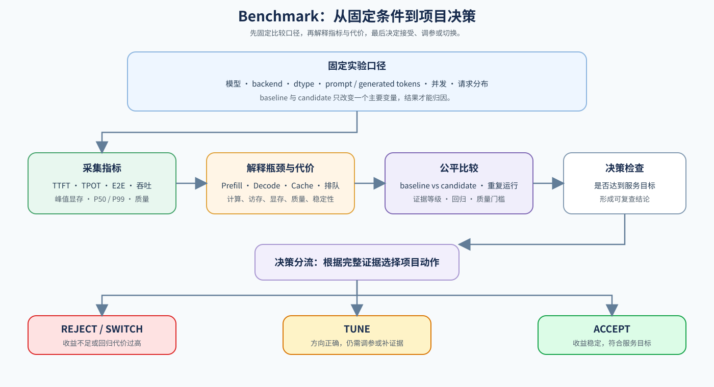

# 06. Benchmark and Decision | 端到端对比与选型

## 页面目标

把前面识别出的候选机制放回同一 workload 和服务目标，比较它们是否真的值得保留，并形成可以复查的项目决策。

## 核心机制

`01–05` 负责解释瓶颈和候选动作，`06` 负责把它们放回同一套实验口径。公平比较要固定模型、backend、dtype、prompt tokens、generated tokens、batch、concurrency 和 cache policy，并确保 baseline 与 candidate 只改变一个主要变量。下图先展示从 workload 到决策的完整流程，表格再说明每个阶段需要产出什么。

| 阶段 | 主要任务 | 关键输出 |
|:---|:---|:---|
| 固定 workload | 统一输入、请求分布和服务目标 | 可复现的实验条件 |
| baseline / candidate | 只改变一个主要变量 | 成对运行结果 |
| 指标与质量 | 采集 TTFT、TPOT、E2E、吞吐、P99、显存和质量 | 可比较的报告字段 |
| 策略决策 | 对照约束和证据等级 | `accept / tune / reject` 与下一步动作 |

参考入口：论文 [MLPerf Inference Benchmark](https://arxiv.org/abs/1911.02549)；开源基准套件 [MLPerf Inference](https://github.com/mlcommons/inference)。

66 是核心综合项目；67、69、71 验证量化、Prefix Cache 和 MLA / KV Cache 等主题机制；68、70 分别扩展 Decode 策略和 Serving 调度。主题项目提供局部证据，最终仍需回到统一 workload 判断。

## 判断框架

本节承接 `01–05` 的指标和机制判断。先明确服务目标：在线交互优先关注 TTFT / P99，离线批处理可能优先 throughput / cost；再检查报告是否记录下表字段。`accept` 表示当前约束下值得采用，`tune` 表示方向有效但证据或配置不足，`reject` 表示收益不足、代价过高或质量不达标。

运行开关、结果文件和 JSON schema 见 [66–70 推理项目验证清单](../../verification/inference_projects.md)；CPU 可先验证指标聚合和决策逻辑，真实服务指标仍需固定 workload 的 GPU backend。

| 类别 | 最小字段 |
|:---|:---|
| 条件 | model、backend、dtype、prompt tokens、generated tokens、batch、concurrency、cache policy |
| 性能 | TTFT、TPOT、E2E latency、throughput、P99、peak memory |
| 策略约束 | quality、acceptance rate、cache hit rate 或公平性 |
| 结论 | accept、tune、reject、下一步动作 |
