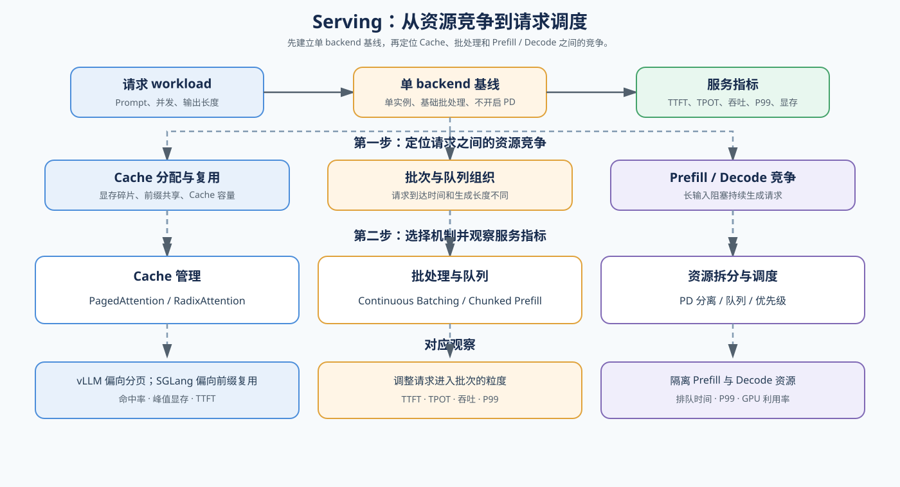

# 07. Serving Scheduling and PD Disaggregation | Serving 调度与 PD 分离

## 页面目标

从多个请求同时到达开始，观察 Prefill 和 Decode 如何争用计算、显存与队列资源，再理解 Continuous Batching、PD 分离和服务级调度的作用。

## 核心机制

Serving 调度面对的不是单个算子，而是请求之间的资源竞争。先用“单 backend、基础批处理、单实例、不开启 PD 分离”的 Serving 配置建立参考行为，固定请求分布、并发度和输出长度，记录 TTFT、TPOT、吞吐、P99 与峰值显存。Prefill 通常带来突发计算和显存申请，Decode 则需要持续、稳定地读取 KV Cache；如果把两者简单混在同一批次，长 Prompt 可能阻塞正在生成的请求。因此需要分别观察批处理、队列、Cache 预算和 GPU 资源分配。

vLLM 和 SGLang 都是 Serving backend，但它们适合观察的机制重点不同：vLLM 适合作为统一基线，关注 PagedAttention、连续批处理和调度；SGLang 更适合观察 RadixAttention、前缀复用、结构化程序和 PD 分离。下面的图片先说明共同的请求链路，再对照两种 backend 的侧重点。

| Backend | 重点机制 | 更适合观察的问题 | 对应项目 |
|:---|:---|:---|:---|
| 单 backend 基线 | 基础批处理、单实例、不开启 PD 分离 | 建立 TTFT、TPOT、吞吐、P99 和峰值显存参照 | 66 的基础 Serving 配置 |
| vLLM | PagedAttention、连续批处理、请求调度 | Cache 分配、吞吐、TTFT / TPOT、P99 | 66 基线与 backend 对照、70 调度 |
| SGLang | RadixAttention、前缀复用、结构化执行、PD 分离 | Prefix Cache、共享前缀、请求组织与资源拆分 | 66 可选对照、69 缓存、70 调度 |

| 机制 | 主要解决的问题 | 观察指标 |
|:---|:---|:---|
| Continuous Batching | 请求到达时间不同、生成长度不同 | 吞吐、TPOT、P99 |
| Chunked Prefill | 单次长 Prefill 阻塞其他请求 | TTFT、P99、Decode 抖动 |
| Prefill / Decode 分离 | 两类计算互相争用资源 | TTFT、TPOT、GPU 利用率 |
| 队列与资源调度 | 并发、容量和服务等级变化 | 排队时间、并发容量、SLA |

参考入口：开源项目 [vLLM](https://github.com/vllm-project/vllm) 与 [SGLang](https://github.com/sgl-project/sglang)；论文 [SGLang](https://arxiv.org/abs/2312.07104) 和官方文档 [PD Disaggregation](https://github.com/sgl-project/sglang/blob/main/docs_new/docs/advanced_features/pd_disaggregation.mdx)。

## 判断框架

本节承接 `04` 的 Cache 资源边界，先阅读 [37 KV Cache Scheduling](../../02_PyTorch_Algorithms/37_KV_Cache_Scheduling.md) 和 [38 Prefill / Decode Disaggregation](../../02_PyTorch_Algorithms/38_Prefill_Decode_Disaggregation.md)，再通过 [70 Serving Scheduler Benchmark](../../02_PyTorch_Algorithms/70_Serving_Scheduler_Benchmark.md) 观察真实请求 workload。阅读下表时，先固定请求分布、Prompt 长度、generated tokens、并发度、batch 策略和 Cache policy，再区分计算、排队与资源分配问题。

| 观察到的现象 | 优先判断 | 下一步 |
|:---|:---|:---|
| 长 Prompt 到达后 Decode 请求明显抖动 | Prefill 抢占或批次组织不合理 | 检查 Chunked Prefill 和 Continuous Batching |
| TTFT 可接受但 TPOT / P99 变差 | Decode 资源被挤占或排队积累 | 检查 Decode 调度和资源配额 |
| 单实例无法同时满足两类请求 | Prefill 与 Decode 资源需求不同 | 评估 PD 分离 |
| GPU 利用率低但排队时间高 | 调度粒度、批次或跨实例通信不合理 | 进入 profiling 和 serving benchmark |
