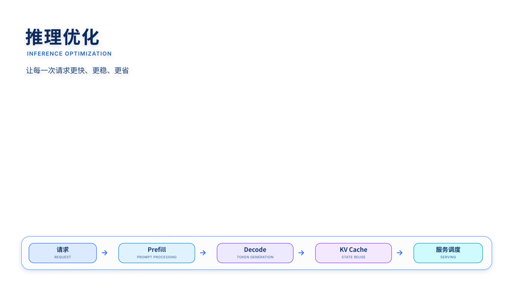
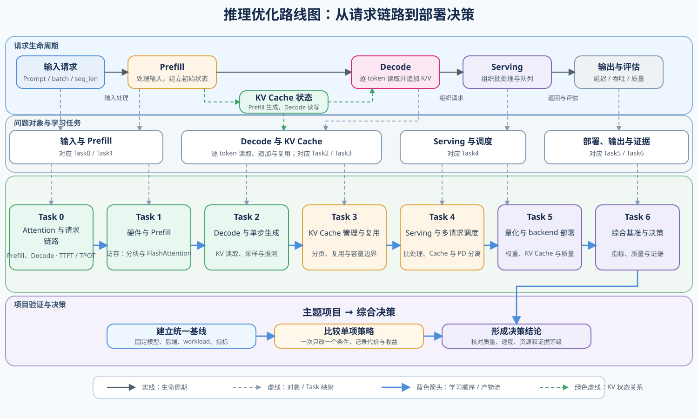
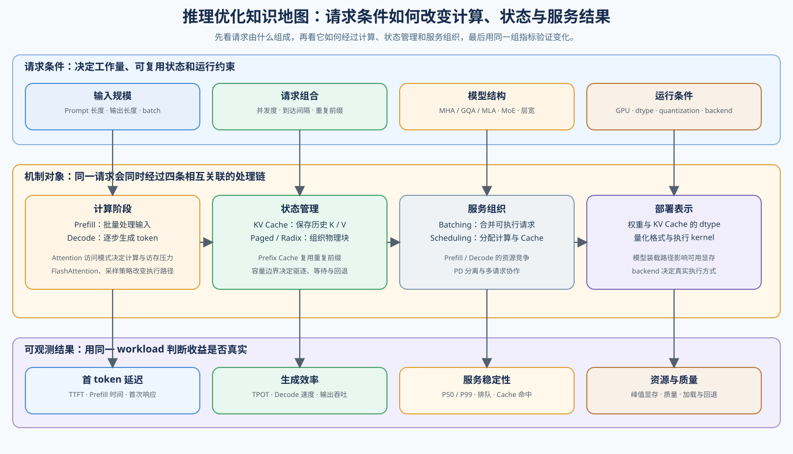
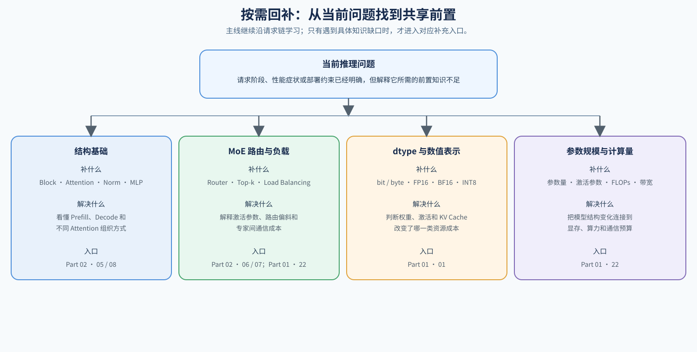

# 推理优化（Inference Optimization）

> 专题类型：主学习路线　主服务目标：请求性能与 Serving 决策

## 页面导语

本专题面向希望定位 LLM 请求瓶颈、优化延迟与吞吐，并能做出 Serving 选择的学习者。学习重点是把请求性能问题转化为可测量的指标、可验证的机制和可复查的部署决策。

想沿着一个在线服务问题连续学习时，先读[推理优化问题链：从性能症状到项目决策](./walkthrough.md)；想按知识和实验顺序学习时，从下方 Task0 开始。

## 如何开始

按知识顺序学习时，从 Part 02 的 [2.6 核心推理优化](../../02_PyTorch_Algorithms/2_6.md) 进入，再按 Task0–6 依次学习。想先运行真实服务时，先按[使用指南](../../guide.md)完成 vLLM / SGLang 预检，再运行 66 的最小 backend 实验；遇到 Attention、KV Cache、MoE 或 dtype 知识缺口时，回补对应 Notebook。

路线图把请求阶段、Task0–6 的学习顺序和各阶段的验证出口放在一起。

## 主学习路线与验证出口

下表按“要回答的问题 → 学习入口 → 验证出口”组织；先沿学习顺序阅读机制，再根据问题选择扩展内容和项目。

| Task / 主题 | 本阶段要回答的问题 | 学习入口与验证出口 | 学习顺序 | 主要正文入口 |
|:---|:---|:---|:---|:---|
| Task0 · 请求结构与指标 | 一次请求如何经过 Attention、Prefill 和 Decode，并用 TTFT、TPOT 观察它？ | 核心：[Part 02 · 04 Attention（MHA / GQA）](../../02_PyTorch_Algorithms/04_Attention_MHA_GQA.md) | 先理解 Attention，再建立请求和指标 | [01 请求链路与指标](./01_request_path_and_metrics.md) |
| Task1 · Prefill 与 Attention Kernel | 为什么 Prefill 会受访存和中间矩阵影响，FlashAttention 改变了什么？ | 核心：[Part 01 · 03 GPU 架构与显存](../../01_Hardware_Math_and_Systems/03_GPU_Architecture_and_Memory.md) → [Part 01 · 14 FlashAttention 显存模型](../../01_Hardware_Math_and_Systems/14_FlashAttention_Memory_Model.md) → [Part 02 · 20 FlashAttention 模拟](../../02_PyTorch_Algorithms/20_FlashAttention_Sim.md)；扩展：[Part 01 · 24 SRAM 优化](../../01_Hardware_Math_and_Systems/24_SRAM_Optimization_Techniques.md) | GPU 约束 → 访存与 Tiling → Prefill | [02 Prefill 与 Attention Kernel](./02_prefill_and_attention_kernel.md) |
| Task2 · KV Cache 状态与单步生成 | Decode 如何读写 KV Cache，采样、推测和多 Token 解码改变了什么？ | 核心：[Part 01 · 11 KV Cache 增长](../../01_Hardware_Math_and_Systems/11_KV_Cache_and_Memory_Growth.md) → [Part 02 · 21 解码策略](../../02_PyTorch_Algorithms/21_Decoding_Strategies.md)；扩展：[Part 02 · 23 投机解码](../../02_PyTorch_Algorithms/23_Speculative_Decoding.md)、[Part 02 · 35 多 Token 解码](../../02_PyTorch_Algorithms/35_Multi_Token_Decoding.md)；项目：[Part 02 · 68 投机解码基准](../../02_PyTorch_Algorithms/68_Speculative_Decoding_Benchmark.md) | KV Cache 状态 → 单步生成 → Decode 加速 | [03 解码策略](./03_decoding_strategies.md) |
| Task3 · KV Cache 生命周期 | KV Cache 如何保存状态、分页分配、复用前缀并控制容量边界？架构变化会改变什么？ | 核心：[Part 02 · 22 vLLM PagedAttention](../../02_PyTorch_Algorithms/22_vLLM_PagedAttention.md) → [Part 02 · 24 SGLang RadixAttention](../../02_PyTorch_Algorithms/24_SGLang_RadixAttention.md) → [Part 02 · 34 Prefix Cache 与 Chunked Prefill](../../02_PyTorch_Algorithms/34_Prefix_Caching_and_Chunked_Prefill.md)；项目：[Part 02 · 69 Prefix Cache](../../02_PyTorch_Algorithms/69_Prefix_Caching_Benchmark.md)；扩展：[Part 02 · 71 MLA](../../02_PyTorch_Algorithms/71_MLA_KV_Cache_Architecture_Benchmark.md) | 状态保存 → 分页分配 → 前缀复用 → 容量治理 → 架构扩展 | [04 KV Cache 生命周期与复用](./04_kv_cache_lifecycle_and_reuse.md) |
| Task4 · 多请求调度与 Serving | 多请求如何共享资源、排队并完成 Serving 调度？ | 核心：[Part 02 · 36 Decode 调度](../../02_PyTorch_Algorithms/36_Decode_Scheduling.md) → [Part 02 · 37 KV Cache 调度](../../02_PyTorch_Algorithms/37_KV_Cache_Scheduling.md) → [Part 02 · 38 Prefill / Decode 分离](../../02_PyTorch_Algorithms/38_Prefill_Decode_Disaggregation.md)；项目：[Part 02 · 70 Serving 调度](../../02_PyTorch_Algorithms/70_Serving_Scheduler_Benchmark.md)；扩展：[Part 02 · 39 推理回退与分层](../../02_PyTorch_Algorithms/39_Inference_Fallback_and_Tiers.md)、[Part 02 · 79–81 分布式项目](../../02_PyTorch_Algorithms/79_Distributed_Parallel_Benchmark.md) | Decode 调度 → Cache 资源 → PD 分离 → Serving 验证 → 分布式扩展 | [07 Serving 调度与 PD 分离](./07_serving_scheduling_and_pd.md) |
| Task5 · 量化部署与成本 | 权重和 KV 量化如何改变显存、速度、质量与 backend 选择？ | 核心：[Part 01 · 21 量化理论与 INT4/INT8](../../01_Hardware_Math_and_Systems/21_Quantization_Theory_and_INT4_INT8.md) → [Part 02 · 25 W8A16](../../02_PyTorch_Algorithms/25_Quantization_W8A16.md) → [Part 02 · 40 GPTQ / AWQ](../../02_PyTorch_Algorithms/40_GPTQ_and_AWQ_Weight_Quantization.md) → [Part 02 · 41 FP8 / KV Cache 量化](../../02_PyTorch_Algorithms/41_FP8_and_KV_Cache_Quantization.md)；项目：[Part 02 · 67 量化推理与部署](../../02_PyTorch_Algorithms/67_Quantized_Inference_and_Deployment.md)；GGUF 走独立 backend | 表示与时机 → 权重 / KV 量化 → backend 验证 | [05 量化推理与部署](./05_quantized_inference_and_deployment.md) |
| Task6 · 基准比较与决策 | 如何在统一 workload 下比较方案，并根据指标、质量和证据等级做出决策？ | 项目：[Part 02 · 66 推理性能比较](../../02_PyTorch_Algorithms/66_Inference_Performance_Comparison.md)；汇总 66–71 的结果 | 统一 workload → 比较指标 → 检查质量 → 输出 accept / tune / reject | [06 基准测试与决策](./06_benchmark_and_decision.md) |

## 按需回补：架构与共享前置

遇到架构、MoE、dtype 或精度方面的知识缺口时，从下表回补对应入口，再回到当前 Task 继续学习。

| 补充主题 | Notebook 入口 | 建议时机 |
|:---|:---|:---|
| 架构基础 | [05 LLaMA3 Block](../../02_PyTorch_Algorithms/05_LLaMA3_Block_Tutorial.md)、[08 Architecture Tricks](../../02_PyTorch_Algorithms/08_Architecture_Tricks.md) | Task0 后按需阅读 |
| MoE 架构 | [06 MoE Router](../../02_PyTorch_Algorithms/06_MoE_Router.md)、[07 MoE Load Balancing](../../02_PyTorch_Algorithms/07_MoE_Load_Balancing_Loss.md) | 需要 MoE 或进入多卡前 |
| 硬件与精度 | [Part 01 · 01 数据类型与精度](../../01_Hardware_Math_and_Systems/01_Data_Types_and_Precision.md) | 需要补充 dtype、精度或表示基础时 |
| MoE 计算 | [Part 01 · 22 MoE 参数与计算](../../01_Hardware_Math_and_Systems/22_MoE_Parameter_and_Compute.md) | 学 MoE 或分布式前按需回补 |

## 跨专题入口

项目入口已经列在上面的主学习路线表中；需要按现象分流时阅读[推理优化判断手册](./casebook.md)，需要沿请求问题链连续阅读时阅读[推理优化问题链](./walkthrough.md)。如果问题跨到其他方向，可转到[性能分析](../profiling/intro.md)、[显存优化](../memory_performance_tuning/intro.md)、[量化与压缩](../quantization/intro.md)、[算子优化](../operator_optimization/intro.md)或[编译与图优化](../compiler_graph_optimization/intro.md)。

## 环境与验证

按实验目标选择环境组合：CPU 环境用于机制和指标逻辑，GPU 或 backend 环境用于真实性能与部署结果。

| 实验类型 | 环境组合 | 适用内容 |
|:---|:---|:---|
| CPU 机制 | [base.txt](../../requirements/base.txt) + [torch-cpu.txt](../../requirements/torch-cpu.txt) | Attention、解码、指标和机制模拟 |
| GPU / Transformers | [base.txt](../../requirements/base.txt) + [torch-cu128.txt](../../requirements/torch-cu128.txt) | GPU 延迟、吞吐和显存测量 |
| vLLM backend | [torch-cu128.txt](../../requirements/torch-cu128.txt) + [inference-vllm.txt](../../requirements/inference-vllm.txt) | 66、67–71 的 vLLM 实验 |
| SGLang backend | [torch-cu128.txt](../../requirements/torch-cu128.txt) + [inference-sglang.txt](../../requirements/inference-sglang.txt) | 66、69、70 的 SGLang 对照实验 |
| Profiling | [torch-cu128.txt](../../requirements/torch-cu128.txt) + [profiling.txt](../../requirements/profiling.txt) | trace、TensorBoard 和性能证据 |

每次真实实验都记录模型、后端、数据类型、序列长度、并发度和结果文件；用报告中的 `evidence level` 区分 smoke test 与稳定 benchmark。

开始真实实验前，先看[使用指南](../../guide.md)中的环境边界；需要逐条执行时，使用[66–70 推理项目验证清单](../../verification/inference_projects.md)。
