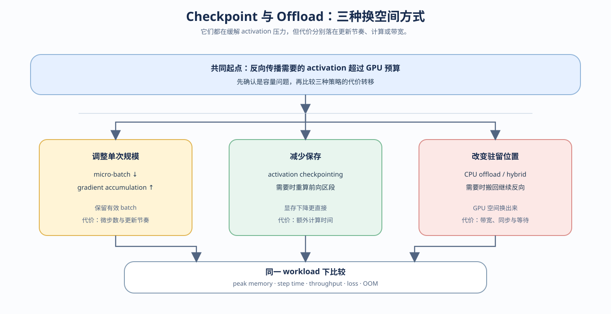

# 03. Checkpointing and Offload | Checkpointing 与 Offload

## 页面目标

本节对应 **Task2：单机训练显存策略**。确认 activation 是训练峰值主因后，比较缩小单次计算、减少状态保存和改变状态驻留位置三类方案，并把显存压力、代价来源和验证指标连成一条判断链。

## 核心机制

训练侧的 activation 策略有三个切入点：改变一次计算处理多少数据，改变反向前保存多少状态，或改变状态暂时存放在哪一层内存。它们都可能降低 GPU 峰值，但代价分别落在更新节奏、额外计算或设备间传输上。

| 机制方向 | 改变的对象 | 主要代价 | 适合提出的实验问题 |
|:---|:---|:---|:---|
| 调整单次计算规模 | micro-batch、累积步数和一次更新的样本量 | 更新节奏与吞吐 | 单步峰值下降后，训练口径是否仍一致？ |
| 减少状态保存 | 部分 activation 不再完整驻留 | 反向阶段重算 | 显存收益是否值得额外计算？ |
| 改变状态驻留 | activation 暂时离开 GPU | 搬运、同步和带宽等待 | 搬运是否抵消显存收益？ |
| 组合策略 | 同时改变多个维度 | 多种代价叠加 | 在预算和质量门槛下是否仍可行？ |

两种机制都不会自动减少参数、梯度或 optimizer state。它们的收益必须回到同一 workload 下的 `peak memory`、`step time`、吞吐、质量和 OOM 状态进行判断。

## 从显存压力到代价转移

判断顺序应保持稳定：先看单次计算规模，再看反向状态的保存方式，最后看状态是否需要跨设备搬运。这样可以先排除改变过多变量的方案，再把计算和带宽代价带入比较。

| 机制方向 | 解决的问题 | 改变的对象 | 主要代价 | 先验证什么 |
|:---|:---|:---|:---|:---|
| 调整单次计算规模 | 单次输入放不下，但仍希望保持一次更新看到的样本量 | 单次 activation 规模与更新节奏 | 更多 micro-step、吞吐变化 | loss 缩放、梯度对齐、参数更新次数 |
| 减少状态保存 | 反向所需的中间 activation 过多 | activation 的保存方式 | 反向重算 | 输出/输入梯度、区段边界、粒度 |
| 改变状态驻留 | activation 暂时不用但又不能丢弃 | activation 的存储位置 | 搬出、搬回、同步和带宽 | 预算可行性、单程/往返理论代价 |

共同的 GPU 观察量是 `peak memory`、`step time`、吞吐和 OOM；训练质量指标也要保持可比。CPU 练习用于验证机制和账本关系，不能替代 GPU 对重算、搬运和 allocator 峰值的实测。完成机制练习后，再把候选方案放进固定 workload，比较显存收益和时间代价。

## 判断与验证

先确认 activation 确实是主要压力，再按“固定口径 → 比较策略 → 检查预算 → 解释峰值”的证据链形成候选方案：

| 证据阶段 | 要固定或改变什么 | 主要回答的问题 | 结果形式 |
|:---|:---|:---|:---|
| 基线 | 固定模型、dtype、batch、seq_len、warmup、iters 和 seed | 当前峰值和吞吐是多少？ | baseline |
| 策略比较 | 只改变 checkpoint、offload 或 hybrid | 显存收益换来了多少时间代价？ | candidate metrics |
| 预算决策 | 改变显存上限、吞吐下限和质量门槛 | 可行策略集合是否稳定？ | accept / tune / reject |
| 证据解释 | 对照 profiler 的阶段和 trace | 峰值变化来自 activation、重算还是搬运？ | 可复查解释 |

候选策略的选择可以先按压力对象和代价做初筛：

| 当前压力 | 优先尝试 | 需要重点观察 | 不应直接推出的结论 |
|:---|:---|:---|:---|
| 单次计算规模过大 | 调整 micro-batch 与累积步数 | 单步峰值、有效 batch、吞吐 | 不能把有效 batch 当成单次 forward batch |
| 只差少量显存，计算余量充足 | Checkpointing | 峰值、重算时间、吞吐 | 不能认为所有 workload 都会同样节省显存 |
| 显存压力明显，但 CPU 内存和带宽充足 | Offload | 搬运时间、同步和传输重叠 | 不能把账本中的转移量写成真实 GPU 收益 |
| 单一策略仍无法满足预算 | Hybrid | 重算与搬运是否叠加，是否出现新瓶颈 | 不能只因为显存最低就接受方案 |
| 质量或吞吐门槛严格 | 先保留 baseline，再逐项比较 | loss、eval loss、step time、OOM | 不能用短 smoke test 代替稳定结论 |

机制练习先建立可读的预算、梯度和生命周期模型；它们不替代固定 workload 下的 GPU 测量，也不能把理论搬运量、重算量直接写成真实收益。

CPU 可以验证梯度对齐、状态变化和策略账本；GPU 才能确认真实峰值、重算时间、搬运时间、吞吐和 OOM 边界。最终出口是 [73](../../02_PyTorch_Algorithms/73_Training_Performance_Analysis.md) → [76](../../02_PyTorch_Algorithms/76_Activation_Checkpoint_Offload_Benchmark.md) → [75](../../02_PyTorch_Algorithms/75_Memory_Budget_Compression_Project.md) → [74](../../02_PyTorch_Algorithms/74_Profiling_Driven_End_to_End_Optimization.md)。
