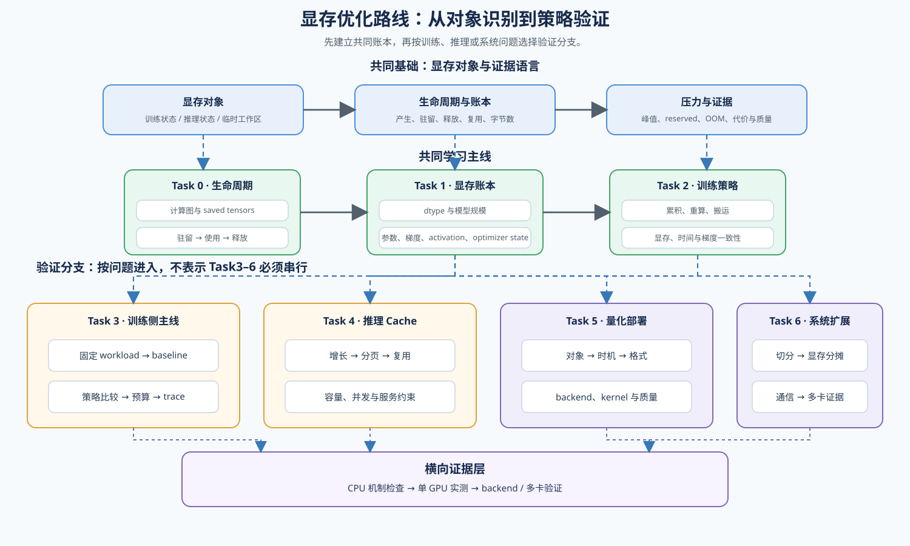
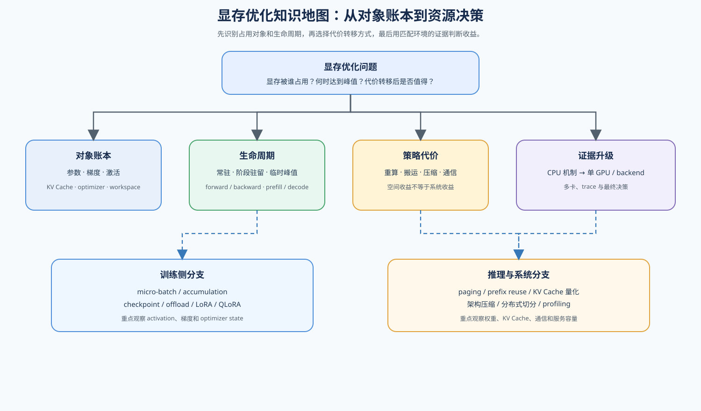

# 显存优化（Memory Optimization）

> 专题类型：主学习路线　主服务目标：显存预算与资源取舍

## 页面导语

本专题研究训练和推理中的显存对象、生命周期与预算取舍，回答显存被什么占用、压力出现在哪个阶段、优化代价转移到哪里，以及当前方案是否值得采用。

训练侧关注参数、梯度、optimizer state、activation 和临时张量；推理侧关注权重、KV Cache、请求并发和临时 attention 空间。两者共享 dtype、内存层级、带宽和 Profiling 基础，但项目证据不能混用。

适合希望理解训练或推理显存占用，并在有限硬件上做资源取舍的学习者。建议先从显存对象、账本和单机训练策略进入；CPU 可完成机制学习，GPU、backend 和多卡只在进入相应项目时使用。

## 如何开始

- **主学习路线：** 从 Part 02 的 [2.5 反向传播与显存优化](../../02_PyTorch_Algorithms/2_5.md) 进入，再按下方 Task0–6 表格学习；需要补通用训练计算图时先看 [Part 00 · 07 自动求导与反向传播](../../00_Prerequisites/07_PyTorch_Autograd_and_Backward.md)。
- **快速上手：** 如果当前问题是训练显存不足，先完成 Task0–2 的 CPU 机制练习，再进入 Part 02 · 73 训练性能分析或 Part 02 · 76 激活检查点与卸载对比；需要补 GPU 内存层级时回看 [Part 01 · 03 GPU 物理架构与内存层级](../../01_Hardware_Math_and_Systems/03_GPU_Architecture_and_Memory.md)。
- **按需扩展：** 如果问题转向 LoRA / QLoRA、推理 KV Cache、量化或多卡显存，再从路线表中的扩展入口进入，不需要先完成全部 Task0–2。

## 主学习路线与验证出口

主线先完成 Task0–2，建立显存对象、账本和单机策略；之后按问题进入训练侧 Task3，或进入推理侧 Task4–5。Task6 提供多卡与系统级扩展，Profiling 作为训练项目链的收口证据，同时复用于性能分析专题。每个 Task 都按“机制 → 策略 → 验证出口”组织，扩展内容不要求全部作为共同前置。

路线图保留 Task0–6 主线，并把参数高效微调放在训练侧扩展中：它复用显存账本和训练测量，但不替代 73–76 的训练显存项目链。具体 Notebook、项目编号和链接以路线表为准。

<strong>先判断显存对象和生命周期，再选择减少驻留、重算、搬运或压缩的策略。</strong>

路线图说明 Task0–6 的学习顺序；知识地图补充显存对象、训练/推理策略和证据升级之间的关系，不替代路线表中的具体入口。

<strong>同一套显存账本可以服务训练、推理和参数高效微调，但证据不能混用。</strong>

Task1 的共同前置只保留 `dtype → 参数规模 → 硬件条件 → 显存账本` 这条核心链；Attention、混合精度、FlashAttention 和模型架构作为共享支撑或按需扩展，不要求在进入 Task2 前全部完成。

| Task | 学习内容 | 核心问题 | 主学习线 / 项目入口 | 学习顺序 | 专题正文 |
|:---|:---|:---|:---|:---|:---|
| Task0 | 显存对象与生命周期 | 哪些状态会产生、驻留并在 backward 后释放？ | [Part 00 · 07 自动求导与反向传播](../../00_Prerequisites/07_PyTorch_Autograd_and_Backward.md) → [Part 02 · 18 激活与损失反向](../../02_PyTorch_Algorithms/18_Activation_and_Loss_Backward.md) → [Part 02 · 17 注意力反向传播与自定义自动求导](../../02_PyTorch_Algorithms/17_Autograd_Basics.md)；CPU 检查局部梯度、saved tensors、梯度和 activation 生命周期 | 计算图 → 局部 backward → Attention backward → 状态驻留与释放 | [02 训练侧显存压力](./02_training_memory_pressure.md) |
| Task1 | dtype、模型规模、硬件与显存账本 | 当前显存压力来自哪个对象，理论容量和实际峰值应如何估算？ | **核心：** [Part 01 · 01 数据格式与混合精度](../../01_Hardware_Math_and_Systems/01_Data_Types_and_Precision.md) → [Part 01 · 02 参数量与算力推导](../../01_Hardware_Math_and_Systems/02_LLM_Params_and_FLOPs.md) → [Part 01 · 03 GPU 物理架构与内存层级](../../01_Hardware_Math_and_Systems/03_GPU_Architecture_and_Memory.md) → [Part 01 · 06 显存计算与 ZeRO 优化](../../01_Hardware_Math_and_Systems/06_VRAM_Calculation_and_ZeRO.md)；**共享支撑：** [Part 02 · 04 多头注意力](../../02_PyTorch_Algorithms/04_Attention_MHA_GQA.md)、[Part 01 · 12 Tensor Core 与混合精度](../../01_Hardware_Math_and_Systems/12_TensorCore_and_Mixed_Precision.md)、[Part 01 · 14 FlashAttention 显存模型](../../01_Hardware_Math_and_Systems/14_FlashAttention_Memory_Model.md)；**架构扩展：** [Part 02 · 05 LLaMA3 Block 教程](../../02_PyTorch_Algorithms/05_LLaMA3_Block_Tutorial.md)、[Part 02 · 06 MoE 路由器](../../02_PyTorch_Algorithms/06_MoE_Router.md)、[Part 02 · 07 MoE 负载均衡损失](../../02_PyTorch_Algorithms/07_MoE_Load_Balancing_Loss.md)、[Part 02 · 08 架构技巧](../../02_PyTorch_Algorithms/08_Architecture_Tricks.md)、[Part 02 · 61 架构验证](../../02_PyTorch_Algorithms/61_Model_Architecture_Exploration.md) | **核心：** dtype → 参数规模 → 硬件条件 → 显存账本；**共享支撑按需回补；架构扩展不作为共同前置** | [01 显存账本与指标](./01_vram_ledger_and_metrics.md) |
| Task2 | 单机训练显存策略 | 显存不够时，应该用更小的 micro-batch、更多重算，还是 CPU-GPU 搬运来换取空间？ | [Part 02 · 12 梯度累积](../../02_PyTorch_Algorithms/12_Gradient_Accumulation.md) → [Part 02 · 19 激活检查点](../../02_PyTorch_Algorithms/19_Activation_Checkpointing_and_Activation_Offload.md) → [Part 02 · 42 激活卸载](../../02_PyTorch_Algorithms/42_Activation_Offload.md)；CPU 检查逻辑、梯度对齐和状态变化 | micro-step → 重算 → CPU-GPU 搬运 | [03 检查点与卸载](./03_checkpointing_and_offload.md) |
| Task3 | 训练侧测量与预算决策 | 哪个训练策略在固定 workload、质量门槛和显存上限下值得采用？ | 机制入口：[Part 00 · 20 性能剖析与显存账本](../../00_Prerequisites/20_Profiling_and_Memory_Ledger.md) → [Part 01 · 13 性能分析与瓶颈定位](../../01_Hardware_Math_and_Systems/13_Profiling_and_Bottleneck_Analysis.md)；项目链：[Part 02 · 73 训练性能分析](../../02_PyTorch_Algorithms/73_Training_Performance_Analysis.md) → [Part 02 · 76 激活检查点与卸载对比](../../02_PyTorch_Algorithms/76_Activation_Checkpoint_Offload_Benchmark.md) → [Part 02 · 75 显存预算压缩](../../02_PyTorch_Algorithms/75_Memory_Budget_Compression_Project.md) → [Part 02 · 74 Profiling 驱动的显存优化](../../02_PyTorch_Algorithms/74_Profiling_Driven_End_to_End_Optimization.md) | 测量对象与指标 → 固定 workload → baseline → 策略比较 → 预算敏感性 → trace 解释 | [06 基准测试与权衡决策](./06_benchmark_and_tradeoff_decision.md) |
| Task4 | 推理侧 KV Cache 与容量 | 上下文和并发增加时，KV Cache 为什么成为容量边界，如何组织、复用和验证？ | [Part 01 · 11 KV Cache 与显存增长](../../01_Hardware_Math_and_Systems/11_KV_Cache_and_Memory_Growth.md) → [Part 02 · 22 vLLM 分页注意力](../../02_PyTorch_Algorithms/22_vLLM_PagedAttention.md) → [Part 02 · 34 前缀缓存与分块预填充](../../02_PyTorch_Algorithms/34_Prefix_Caching_and_Chunked_Prefill.md)；项目 [Part 02 · 66 推理性能对比实验](../../02_PyTorch_Algorithms/66_Inference_Performance_Comparison.md)、[Part 02 · 69 前缀缓存基准](../../02_PyTorch_Algorithms/69_Prefix_Caching_Benchmark.md)；架构扩展 [Part 02 · 71 MLA 与 KV Cache 结构基准](../../02_PyTorch_Algorithms/71_MLA_KV_Cache_Architecture_Benchmark.md)、[Part 02 · 24 SGLang 基数注意力](../../02_PyTorch_Algorithms/24_SGLang_RadixAttention.md) | 增长 → 分页 → 复用 → 容量验证；扩展：RadixAttention / MLA | [04 推理 Cache 与显存预算](./04_inference_cache_and_memory_budget.md) |
| Task5 | 量化与显存容量扩展 | 压缩哪类对象、在什么时候压缩，才能真正换来更大的模型、上下文或并发？ | [Part 01 · 21 量化理论与 INT4/INT8](../../01_Hardware_Math_and_Systems/21_Quantization_Theory_and_INT4_INT8.md) → [Part 02 · 25 W8A16 量化](../../02_PyTorch_Algorithms/25_Quantization_W8A16.md) → [Part 02 · 40 GPTQ 与 AWQ 权重量化](../../02_PyTorch_Algorithms/40_GPTQ_and_AWQ_Weight_Quantization.md) → [Part 02 · 41 FP8 与 KV Cache 量化](../../02_PyTorch_Algorithms/41_FP8_and_KV_Cache_Quantization.md) → 项目 [Part 02 · 67 量化推理与部署](../../02_PyTorch_Algorithms/67_Quantized_Inference_and_Deployment.md) | 对象与时机 → 权重格式 → 量化算法 → backend → 显存 / 质量验证 | [05 量化作为显存工具](./05_quantization_as_a_memory_tool.md) |
| Task6 | 分布式显存与系统级扩展 | 单卡放不下时如何分摊状态，并解释通信、重算和搬运代价？ | 分布式：[Part 02 · 27 ZeRO 优化器模拟](../../02_PyTorch_Algorithms/27_ZeRO_Optimizer_Sim.md) → [Part 02 · 28 Pipeline 并行微批次](../../02_PyTorch_Algorithms/28_Pipeline_Parallelism_MicroBatch.md) → [Part 02 · 29 Tensor 并行模拟](../../02_PyTorch_Algorithms/29_Tensor_Parallelism_Sim.md) → [Part 02 · 79 分布式并行基准](../../02_PyTorch_Algorithms/79_Distributed_Parallel_Benchmark.md) / [Part 02 · 80 MoE 专家并行基准](../../02_PyTorch_Algorithms/80_MoE_Expert_Parallel_Benchmark.md) / [Part 02 · 81 分布式推理逻辑验证](../../02_PyTorch_Algorithms/81_Distributed_Inference_Project.md)；Profiling 作为共享扩展，复用 [Part 01 · 13 性能分析与瓶颈定位](../../01_Hardware_Math_and_Systems/13_Profiling_and_Bottleneck_Analysis.md) 与 [Part 02 · 74 Profiling 驱动的显存优化](../../02_PyTorch_Algorithms/74_Profiling_Driven_End_to_End_Optimization.md) | 分布式切分 → 单卡显存分摊 → 通信代价 → 多卡证据；Profiling 不作为本 Task 的共同前置 | [06 基准测试与权衡决策](./06_benchmark_and_tradeoff_decision.md) |

Task1 建立显存账本，Task2 比较单机训练策略；Task3 通过 `Part 02 · 73 训练性能分析 → Part 02 · 76 激活检查点与卸载对比 → Part 02 · 75 显存预算压缩 → Part 02 · 74 Profiling 驱动的显存优化` 完成训练侧项目闭环；Task4–5 分别处理推理缓存和量化分支；Task6 提供分布式扩展，Profiling 作为跨分支的证据方法。Part 02 · 61 架构验证是架构扩展项目，Part 02 · 71 MLA 与 KV Cache 结构基准属于推理显存分支；Part 02 · 08 架构技巧、Part 02 · 06 MoE 路由器、Part 02 · 07 MoE 负载均衡损失和 LoRA / QLoRA 也不属于共同前置。

### 学习入口与证据边界

路线表负责选择入口，正文负责解释机制；需要按现象分流时进入[显存优化判断手册](./casebook.md)，需要沿“发现问题 → 建账本 → 做实验 → 下结论”连续阅读时进入[显存优化深入阅读](./walkthrough.md)，项目页负责在指定环境中采集报告。

| 证据层级 | CPU 可以完成 | GPU、backend 或多卡才可确认 |
|:---|:---|:---|
| Task0–1 机制与账本 | 生命周期、shape、dtype、参数、梯度、optimizer state 和 activation 的理论关系 | 实际峰值、allocator reserved、带宽和 OOM 边界 |
| Task2 单机策略 | accumulation、checkpoint、offload 的逻辑和梯度对齐 | 显存节省、重算 / 搬运代价、吞吐和 OOM |
| Task3 训练项目 | workload、指标、报告和预算决策逻辑 | 73 / 76 的真实 baseline 与策略比较；74 的 trace 解释 |
| Task4–5 推理与量化 | KV Cache shape、容量估算、量化误差和决策逻辑 | backend 命中、TTFT / TPOT、格式、kernel、真实显存和质量 |
| Task6 分布式扩展 | ZeRO、pipeline、tensor、expert parallel 的切分模拟 | 多卡显存分摊、通信时间、拓扑影响和 profiler 归因 |

CPU 运行可以使用 GPU 机器，但 `device='cpu'` 的结果仍属于 CPU 证据；不能因为运行环境有 GPU，就把 CPU 计算写成 GPU 实测。

## 训练项目链与证据要求

73、76、75 使用匹配的模型、dtype、batch、seq_len 和 workload；74 是跨项目的 profiling 收口，不把不同条件下的数字直接横向比较。

| 项目 | 负责什么 | 最低证据 |
|---|---|---|
| 73 | 建立训练 baseline | step time、吞吐、显存、loss / eval loss、OOM 和完整配置 |
| 76 | 比较 `baseline`、`checkpoint`、`offload`、`hybrid` | 同 workload 下的显存、吞吐、质量和状态 |
| 75 | 读取 76 报告并做预算敏感性分析 | 显存/吞吐门槛、可行候选和 `accept / tune / reject` |
| 74 | 用真实 trace 解释重算、搬运、optimizer step 和端到端代价 | baseline / candidate trace；没有 trace 时标记证据缺口 |

FP32 长序列 OOM 是需要记录的容量边界，不应直接视为代码失败。更高 activation 压力可以使用 BF16、LoRA / QLoRA、分块 loss 或 activation-only benchmark，但必须作为独立 workload 保存配置和 JSON 报告。

## 延伸阅读与跨专题入口

### 复用规则与证据等级

同一 Notebook 在不同路线中只切换观察目标：显存路线关注对象账本、峰值和容量，推理路线关注 KV Cache、TTFT / TPOT 和并发，算子与编译路线关注 kernel、访存和融合，训练微调路线关注 loss、梯度和稳定性。Notebook 只保留一份权威内容，路线正文负责提出不同问题；不同模型、设备、dtype 和 workload 的结果不能直接合并。

| 等级 | 环境 | 可以形成的结论 |
|:---|:---|:---|
| 机制验证 | `CPU-first` | 公式、shape、梯度、生命周期和决策逻辑 |
| 单 GPU 项目 | `GPU required` | 峰值显存、吞吐、OOM 边界和固定 workload 下的策略比较 |
| 高级扩展 | GPU、backend 或多卡 | profiler trace、服务并发、通信和部署结论 |

不要把“代码运行成功”写成“显存优化成功”。CPU 或 toy 结果只能说明机制；单次 GPU 运行只能说明当前环境观察；稳定决策至少需要固定 workload、baseline / candidate、质量门槛和报告文件。

Part00 / Part01 只提供共享机制和测量语言，不需要重复学习全部内容；具体前置映射、判断标准和实验步骤分别由上面的正文入口与项目页承接。

如果问题首先表现为请求链路速度，进入[推理优化](../inference_optimization/intro.md)；如果重点是低比特压缩，进入[量化与压缩](../quantization/intro.md)；如果需要 profiler 证据，进入[性能分析](../profiling/intro.md)；如果涉及多卡切分和通信，进入[通信与并行](../communication_parallel/intro.md)。

## 环境与证据边界

基础机制可以 CPU-first；真实训练、显存峰值和策略对比需要 NVIDIA GPU。运行前确认 PyTorch CUDA 可用，并按 Notebook 输出保存 JSON。项目运行顺序、GPU 检查、结果文件和 74 profiling 要求见[73–76 显存优化项目验证清单](../../verification/memory_projects.md)。
