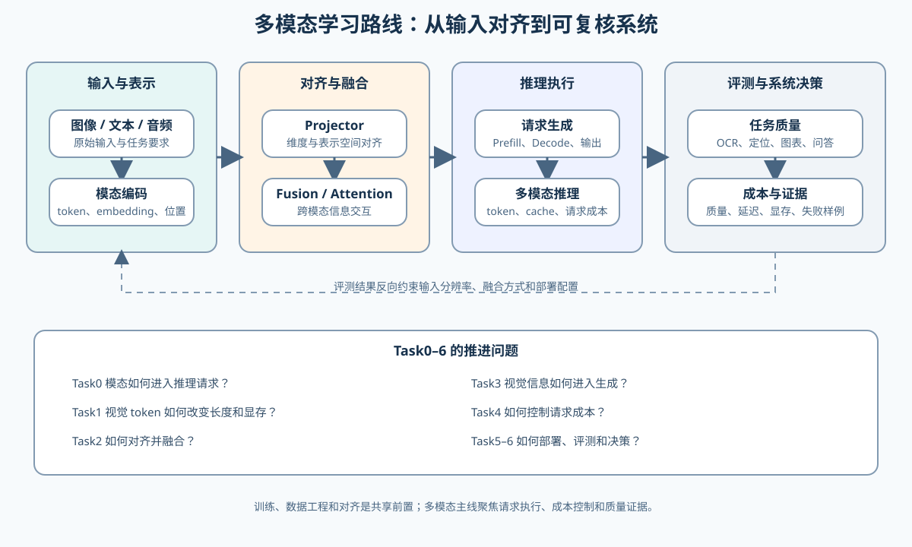

# 多模态（Multimodal）

> 专题类型：横切支撑专题（建设中）　主服务目标：以多模态推理为主线，理解视觉输入如何影响模型执行、显存、服务和质量

## 页面导语

多模态推理的难点不只是“把图片传给模型”，而是要把不同模态转换成可以共同计算的表示，并继续回答三个工程问题：信息如何对齐、视觉 Token 如何改变请求成本、输出是否真的依据了输入内容。

本专题面向已经掌握 Transformer、Attention 和基础推理流程，希望进入视觉语言模型、文档理解或图文推理的学习者。训练、数据工程和评测作为共享支撑出现；主线先解决多模态请求如何运行、如何测量和如何部署。当前专题先建立路线和问题框架，具体 Notebook、数据集与 GPU 项目将按 Task 逐步补齐。

上图先说明多模态系统的共同链路；下面的 Task0–6 再把每个环节对应到需要回答的问题和验证出口。

## 如何开始

- **主学习线：** 先从 Task0 建立模态、表示和任务的共同语言，再按 Task1–6 进入表示、融合、训练、推理和评测。
- **已有推理基础：** 可以从 Task1 或 Task4 进入，重点观察视觉 token 如何改变序列长度、KV Cache 和请求成本。
- **已有训练基础：** 可以从 Task2 或 Task3 进入，重点观察视觉表示如何进入生成过程。
- **只想做应用验证：** 可以从 Task5 开始，先固定图文请求和质量指标，再回补前面的机制。

多模态推理会复用推理优化、显存优化、量化与压缩、后训练优化和性能分析的方法，但不会把这些专题的项目结果直接当成多模态结论。

## 主学习线与核心问题

`Task0–6` 是规划中的学习顺序。当前只有共享前置和关联项目入口，具体多模态 Notebook、数据集和真实 GPU 项目会在对应任务开发时补入。

| Task | 核心问题 | 主要机制 | 预期验证出口 |
|:---|:---|:---|:---|
| Task0 | 图片、文本和其他模态如何进入同一个推理请求？ | 模态、token、embedding、任务形式与输入输出契约 | 能画出一次图文请求的数据流，并区分原始输入、模型输入和模型输出 |
| Task1 | 图像如何被转换成视觉 token，分辨率为什么会改变成本？ | patch / visual token、位置编码、动态分辨率、视觉序列长度 | 计算 token 数、显存和上下文预算，解释输入分辨率变化的代价 |
| Task2 | 不同模态如何对齐并交互？ | projector、线性映射、cross-attention、early / late fusion | 用小规模例子检查形状、维度、mask 和跨模态信息流 |
| Task3 | 多模态模型如何把视觉信息带入 Prefill 和 Decode？ | 视觉 Token 注入、生成路径、Prefill / Decode、输出条件依赖 | 在固定图文请求上观察视觉输入对首 token 和后续生成的影响 |
| Task4 | 多图、长图和高分辨率请求为什么更容易变慢或爆显存？ | 视觉 Token 缓存、KV Cache、批处理、动态分辨率、请求调度 | 在固定模型和 workload 下记录延迟、吞吐、峰值显存与 OOM 边界 |
| Task5 | 如何选择多模态量化、缓存和 backend 部署方案？ | 权重量化、视觉编码器开销、batch、并发和服务配置 | 同时记录任务质量、延迟、吞吐、显存和失败样例 |
| Task6 | 如何根据质量、性能和成本做出多模态部署决策？ | 质量—延迟—显存—数据成本的联合决策与回归验证 | 输出可复查的 benchmark 报告和 accept / tune / reject 决策 |

## 共享前置与关联专题

| 需要补的能力 | 入口 | 作用 |
|:---|:---|:---|
| Attention 与 Block | [04 Attention（MHA / GQA）](../../02_PyTorch_Algorithms/04_Attention_MHA_GQA.md)、[05 LLaMA3 Block](../../02_PyTorch_Algorithms/05_LLaMA3_Block_Tutorial.md) | 理解文本 token、视觉 token 与注意力计算的共同形式 |
| 模型架构 | [大模型架构专题](../model_architecture/intro.md) | 补充视觉塔、投影层、融合层和模型变体的结构背景 |
| 训练与微调 | [09 SFT Training Loop](../../02_PyTorch_Algorithms/09_SFT_Training_Loop.md)、[10 LoRA](../../02_PyTorch_Algorithms/10_LoRA_Tutorial.md) | 作为视觉语言模型训练和参数高效微调的共享前置 |
| 推理与显存 | [推理优化](../inference_optimization/intro.md)、[显存优化](../memory_performance_tuning/intro.md) | 分析视觉 token、KV Cache、并发和显存预算 |
| 证据与评测 | [性能分析](../profiling/intro.md)、[后训练优化](../post_training_alignment/intro.md) | 建立性能证据、任务指标和输出质量的联合判断 |

## 环境与验证

前期机制可使用 CPU 和基础 PyTorch 环境完成；真实视觉语言模型、图像预处理、GPU 显存、吞吐和 backend 对比需要 GPU 环境。数据集、模型权重和评测协议确定后，再在本页补充对应的环境组合与自动化入口。

多模态项目至少需要记录：模型与视觉编码器、图像分辨率、视觉 token 数、文本长度、dtype、batch / concurrency、任务指标、延迟、吞吐、峰值显存和失败样例。

## 当前建设状态

- 已完成：以多模态推理为主线的路线定位、Task0–6 核心问题、与现有专题的共享前置关系。
- 待补齐：视觉 token / projector 机制 Notebook、图文数据工程、真实模型项目、评测数据表和 GPU 验证脚本。
- 当前不输出：没有真实模型和固定数据集之前，不给出多模态模型或 backend 的性能排名。
