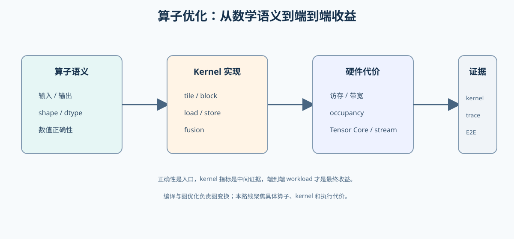
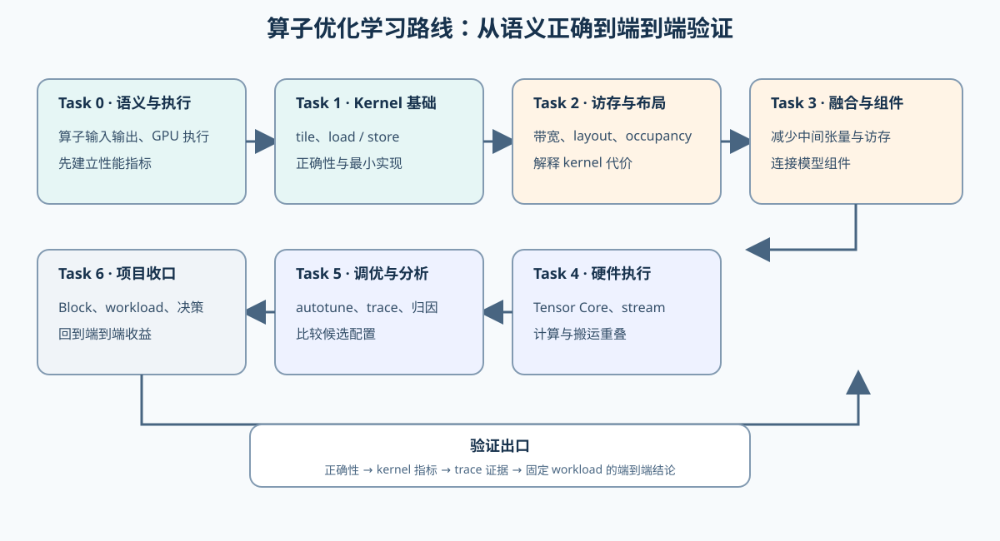
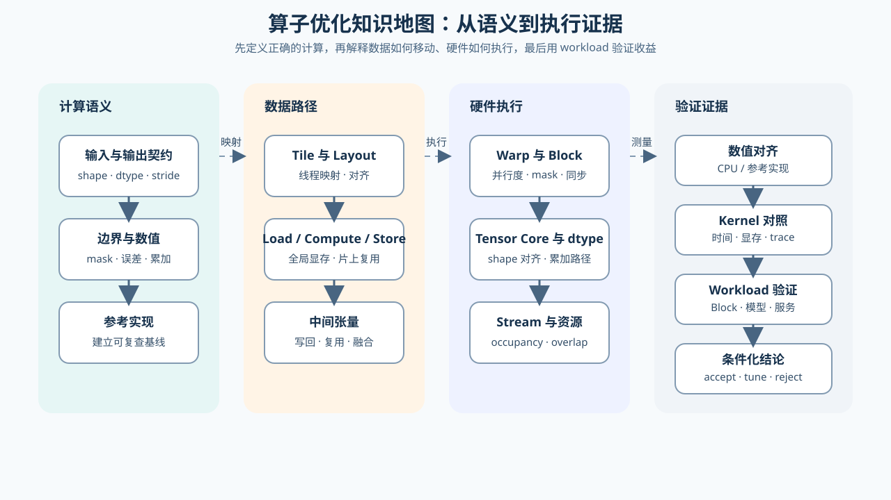
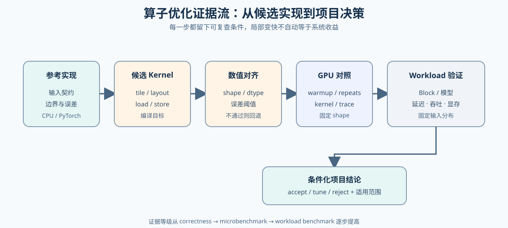
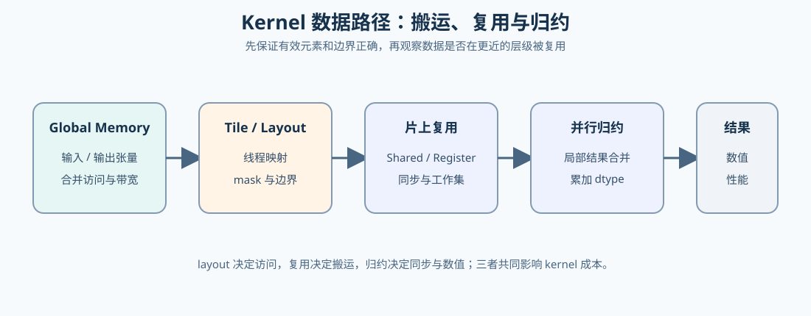
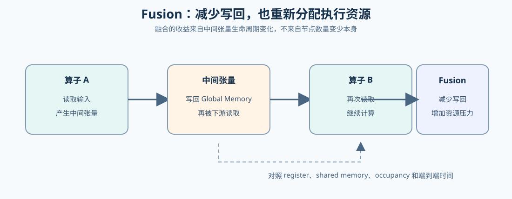
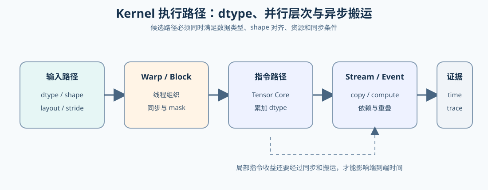
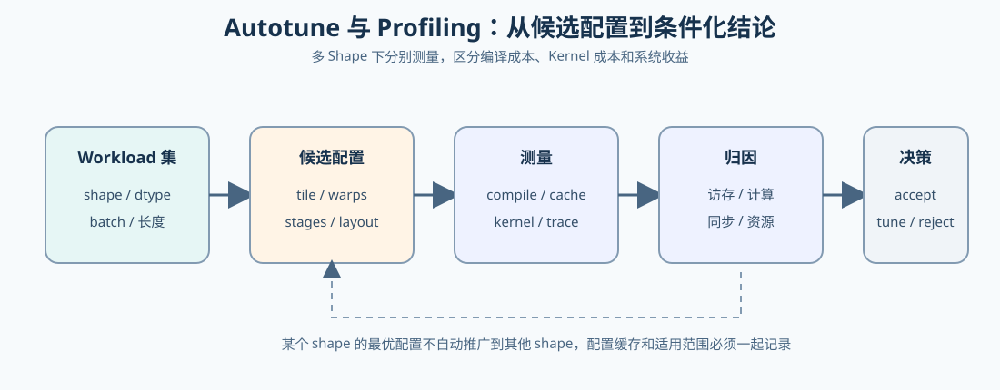

# 07. Visual Assets | 图册收口

## 页面目标

本页登记算子优化专题的图像资产，明确每张图承担的阅读职责，避免用一张图同时承载路线、机制和实验报告。

## 图册职责

| 图 | 主要职责 | 适合放置的位置 |
|:---|:---|:---|
| `operator_optimization_overview.svg` | 说明算子从数学语义到端到端收益的总体方向 | `intro` 导语、`walkthrough` 开头 |
| `operator_optimization_task_route.svg` | 展示 Task0–6 的学习顺序和实践入口 | `intro` 主学习线前 |
| `operator_optimization_knowledge_map.svg` | 展示语义、数据路径、硬件执行和验证证据的概念关系 | `intro` 任务表后、`casebook` 开头 |
| `operator_optimization_evidence_flow.svg` | 展示从参考实现到项目决策的证据链 | `intro` 项目产出、正文 06 |
| `operator_memory_flow.svg` | 展示 Global Memory、Tile、片上复用和归约的数据路径 | 正文 02 |
| `operator_fusion_lifecycle.svg` | 展示 Fusion 如何改变中间张量写回与资源压力 | 正文 03 |
| `operator_execution_path.svg` | 展示 dtype、Warp / Block、Tensor Core 和 Stream 的执行关系 | 正文 04 |
| `operator_autotune_evidence.svg` | 展示多 Shape 下的候选搜索、测量和归因 | 正文 05 |

## 阅读顺序

第一次进入专题时，先看概览图和路线图，了解学习目标与 Task 顺序；再看知识地图，理解各机制之间的关系；开始实验时，使用证据流图检查验证是否完整。

图中的节点使用概念名称，不重复具体 Notebook 标题。具体入口和实验条件以 [`intro.md`](./intro.md) 的 Task 表和环境说明为准。

## 图片维护规则

- 图片使用中文概念，标题保持简短，详细解释放在正文或表格中。
- 主图采用总分结构：从总体问题展开到概念分支，不在底部重复增加总结节点。
- 连接线必须真正落到目标节点边界，箭头大小保持一致，转角后保留一段直线再放箭头。
- 连接线上的文字只保留必要关系；如果文字遮挡节点或连线，应优先移动文字或删减文字。
- 机制图不写具体实验结果；实测数字放在项目页的结果表中。

## 当前资产

### 算子优化总体方向

### Task0–6 学习路线

### 算子优化知识地图

### 算子优化证据流

### Kernel 数据路径

### Fusion 生命周期

### Kernel 执行路径

### Autotune 证据链

## 后续扩展

如果后续增加 FlashAttention、Tensor Core 或 CUDA Graph 的专门机制图，应放在对应正文页或 walkthrough 的机制段落中；只有当它承担专题级导航职责时，才加入本页资产表。
