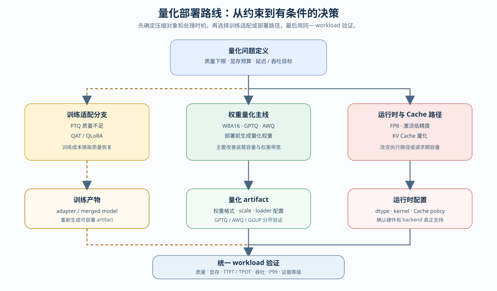
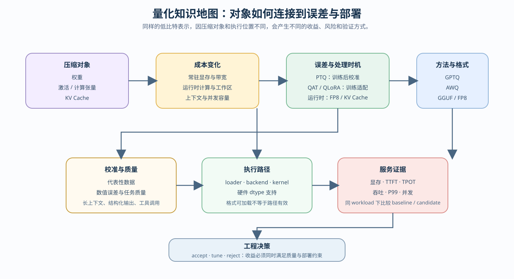

# 量化与压缩（Quantization and Compression）

> 专题类型：横切支撑　主服务目标：精度、显存与部署取舍

## 页面导语

本专题面向需要判断“什么值得量化、什么时候量化、量化后能否真正部署”的学习者。你将从压缩对象和误差开始，逐步区分 PTQ、QAT、QLoRA、GPTQ、AWQ、FP8 和 KV Cache 量化，最后把候选方案放回同一 workload，比较质量、显存、速度和 backend 支持。

量化不是单一的“降低 bit 数”。权重、激活和 KV Cache 位于不同的运行阶段，处理时机、误差来源和执行路径也不同。本专题的学习重点，是把量化方法连接到模型产物、loader、kernel、推理服务和最终决策。

## 如何开始

想沿着问题链连续阅读时，先看[量化与压缩深入阅读](./walkthrough.md)；想快速根据现象选择方法时，使用[量化与压缩正文](./casebook.md)。想按知识和实验顺序学习时，从下面的 Task1 开始。

量化的部署主线是 `66 浮点 baseline → 67 量化推理与部署`；如果 PTQ 后质量不足，再转入 `65 QLoRA 选型` 训练适配，然后重新回到 66 / 67 验证。真实 GPU 或 backend 实验前，先按[使用指南](../../guide.md)准备对应环境。

## 主学习路线

`Task1–6` 指向 Part 01 / Part 02 的具体学习入口；专题正文负责解释概念、连接机制和整理判断条件，不替代 Notebook 的实现。

| Task | 学习内容 | 主学习线 | 专题正文 |
|:---|:---|:---|:---|
| Task1 | 量化基础与硬件直觉 | [Part 01 · 01 数据类型与精度](../../01_Hardware_Math_and_Systems/01_Data_Types_and_Precision.md) → [Part 01 · 12 Tensor Core 与混合精度](../../01_Hardware_Math_and_Systems/12_TensorCore_and_Mixed_Precision.md) → [Part 01 · 21 量化理论与 INT4/INT8](../../01_Hardware_Math_and_Systems/21_Quantization_Theory_and_INT4_INT8.md) | [01 量化对象与误差](./01_quantization_object_and_error.md) |
| Task2 | PTQ / QAT 的介入时机 | [Part 01 · 21 量化理论与 INT4/INT8](../../01_Hardware_Math_and_Systems/21_Quantization_Theory_and_INT4_INT8.md) → [Part 02 · 25 W8A16](../../02_PyTorch_Algorithms/25_Quantization_W8A16.md)；需要训练适配时转入 [Part 02 · 26 QLoRA 与 4bit 量化](../../02_PyTorch_Algorithms/26_QLoRA_and_4bit_Quantization.md) | [02 PTQ 与 QAT 的时机](./02_ptq_and_qat_timing.md) |
| Task3 | 低比特训练与适配 | [Part 02 · 26 QLoRA 与 4bit 量化](../../02_PyTorch_Algorithms/26_QLoRA_and_4bit_Quantization.md) | [03 低比特训练适配](./03_low_bit_training_adaptation.md) |
| Task4 | GPTQ / AWQ 的后训练压缩 | [Part 02 · 25 W8A16](../../02_PyTorch_Algorithms/25_Quantization_W8A16.md) → [Part 02 · 40 GPTQ / AWQ](../../02_PyTorch_Algorithms/40_GPTQ_and_AWQ_Weight_Quantization.md) | [04 权重量化](./04_weight_only_compression.md) |
| Task5 | FP8 与 KV Cache 量化 | [Part 01 · 03 GPU 架构与显存](../../01_Hardware_Math_and_Systems/03_GPU_Architecture_and_Memory.md) → [Part 01 · 12 Tensor Core 与混合精度](../../01_Hardware_Math_and_Systems/12_TensorCore_and_Mixed_Precision.md) → [Part 02 · 41 FP8 与 KV Cache 量化](../../02_PyTorch_Algorithms/41_FP8_and_KV_Cache_Quantization.md) | [05 FP8 与 KV Cache 量化](./05_fp8_and_kv_cache_quantization.md) |
| Task6 | 量化部署、benchmark 与项目收口 | [Part 02 · 66 推理性能比较](../../02_PyTorch_Algorithms/66_Inference_Performance_Comparison.md) → [Part 02 · 67 量化推理与部署](../../02_PyTorch_Algorithms/67_Quantized_Inference_and_Deployment.md)；训练侧适配另走 [Part 02 · 65 QLoRA 选型](../../02_PyTorch_Algorithms/65_QLoRA_Selection_Project.md) | [06 部署与基准测试决策](./06_deployment_and_benchmark_decision.md) |

这条路线包含一条部署主线和一条训练适配分支：Task2 先判断 PTQ 是否足够；质量不足且需要训练时进入 Task3 / 65；只做部署前权重量化时进入 Task4 / 40；需要 FP8 或 KV Cache 量化时进入 Task5 / 41；最终回到 66 的浮点 baseline，再用 67 验证量化 artifact 和 backend。

路线主图用于选择学习和实验分支；知识地图用于理解压缩对象、误差、执行路径和服务证据之间的关系。

## 按需回补：量化基础与部署前置

| 需要补充的内容 | 学习入口 | 建议时机 |
|:---|:---|:---|
| 量化对象与误差 | [Part 01 · 21 量化理论与 INT4/INT8](../../01_Hardware_Math_and_Systems/21_Quantization_Theory_and_INT4_INT8.md) | 开始 Task1 时 |
| Tensor Core 与 dtype | [Part 01 · 12 Tensor Core 与混合精度](../../01_Hardware_Math_and_Systems/12_TensorCore_and_Mixed_Precision.md) | 进入 FP8 或真实 GPU 前 |
| W8A16 与量化实现 | [Part 02 · 25 W8A16](../../02_PyTorch_Algorithms/25_Quantization_W8A16.md) | 比较权重量化前 |
| GPTQ / AWQ 机制 | [Part 02 · 40 GPTQ / AWQ](../../02_PyTorch_Algorithms/40_GPTQ_and_AWQ_Weight_Quantization.md) | 选择后训练权重量化时 |
| FP8 / KV Cache 量化 | [Part 02 · 41 FP8 与 KV Cache 量化](../../02_PyTorch_Algorithms/41_FP8_and_KV_Cache_Quantization.md) | 进入运行时量化时 |

## 跨专题入口

量化与其他专题的职责可以这样衔接：

- [推理优化](../inference_optimization/intro.md)：服务速度、请求阶段和 backend 行为；
- [显存优化](../memory_performance_tuning/intro.md)：参数、激活、优化器状态和 KV Cache 的显存账本；
- [监督微调与训练工程](../fine_tuning_training/intro.md)：QLoRA、LoRA 和训练适配过程；
- [性能分析](../profiling/intro.md)：kernel、显存、通信和端到端证据归因。

需要快速分流时回到[量化与压缩正文](./casebook.md)，需要沿“问题出现—方案选择—部署验证”连续阅读时进入[量化与压缩深入阅读](./walkthrough.md)。

## 项目收口

最终报告应区分训练适配产物和推理量化产物：QLoRA 可能输出 adapter 或 merged model；GPTQ、AWQ、GGUF、FP8 和 KV Cache 量化对应不同的推理 artifact 或运行时配置。结论至少记录质量、显存、TTFT / TPOT、吞吐、backend、kernel、硬件和证据等级，并使用 `accept / tune / reject` 表达决策。

## 环境与验证

量化理论、误差计算和部分 W8A16 模拟可以使用 CPU；真实权重量化、GPU 推理和 backend 部署通常需要 GPU。环境选择应与实验对象一致：训练适配使用监督微调或 QLoRA 环境，FP8 / KV Cache 和真实部署使用 GPU + 对应推理 backend 环境。

不同显卡、驱动、PyTorch、量化库和 serving backend 可能改变结果。每次实验都记录模型 revision、量化配置、校准数据、dtype、硬件、backend、workload 和结果文件，并区分 simulation、load smoke、fixed benchmark 与 deployment decision。
