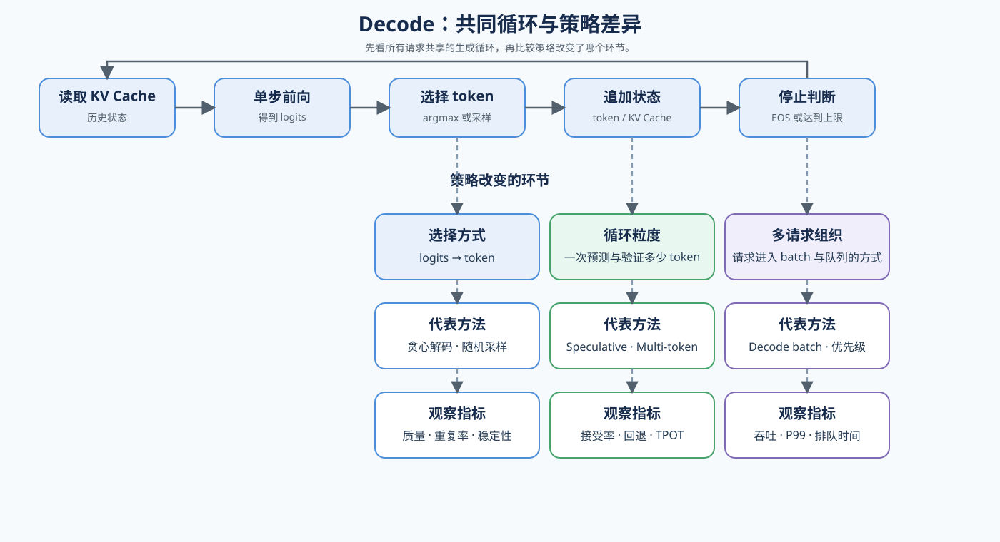

# 03. Decoding Strategies | 解码策略

## 页面目标

从首 token 之后的生成循环开始，观察每轮 Decode 如何读取 KV Cache、产生输出，再比较生成策略和请求组织对速度的影响。

## 核心机制

Decode 是一轮一轮的小步生成：每一步读取已有 KV Cache，得到 logits，再选择下一个 token，并把新的 token 和 KV 状态追加到序列中。先用贪心解码建立基线：直接选择 logits 最大的 token，直到遇到 EOS 或达到最大长度；再比较采样、speculative decoding 和 multi-token decoding。前三者改变单个请求的生成过程，调度则改变多个请求的组织方式。

| 策略 | 主要改变什么 | 需要观察什么 |
|:---|:---|:---|
| 贪心 Decode（基线） | 每轮选择 logits 最大的一个 token | 输出长度、TPOT、KV Cache 访问、质量 |
| 随机采样 | 按 temperature、top-k / top-p 选择 token | 质量、重复率、TPOT、输出稳定性 |
| Speculative Decoding | draft 提议、target 验证 | acceptance rate、draft cost、TPOT |
| Multi-token Decoding | 单轮尝试产出多个 token | 接受与回退、generated tokens/s |
| Decode Scheduling | 不同请求的执行顺序 | 吞吐、TPOT、P99 |

参考入口：论文 [Fast Inference from Transformers via Speculative Decoding](https://arxiv.org/abs/2211.17192)；开源实现 [vLLM Speculative Decoding](https://docs.vllm.ai/en/latest/features/speculative_decoding/)。

## 判断框架

本节承接 `02` 的 Prefill 与 Attention，先用 [21 Decoding Strategies](../../02_PyTorch_Algorithms/21_Decoding_Strategies.ipynb) 建立单步生成口径，再用 [23 Speculative Decoding](../../02_PyTorch_Algorithms/23_Speculative_Decoding.ipynb) 和 [35 Multi Token Decoding](../../02_PyTorch_Algorithms/35_Multi_Token_Decoding.ipynb) 比较生成策略，最后通过 [36 Decode Scheduling](../../02_PyTorch_Algorithms/36_Decode_Scheduling.ipynb) 观察请求组织。阅读下表时，先固定 `TPOT`、`decode_share`、generated tokens 和质量约束，再根据现象选择下一步动作。

| 观察到的现象 | 优先判断 | 下一步 |
|:---|:---|:---|
| 每轮生成耗时高 | Decode 计算、KV Cache 访问或 sampling | 检查基础 Decode 和 `04` |
| 循环次数过多 | 生成长度或单轮产出受限 | 检查 speculative / multi-token |
| acceptance rate 低 | draft model 或 proposal 不匹配 | 调整 draft、长度或放弃策略 |
| 多请求吞吐低、P99 高 | 请求组织或调度问题 | 进入 `07` / `06` |
