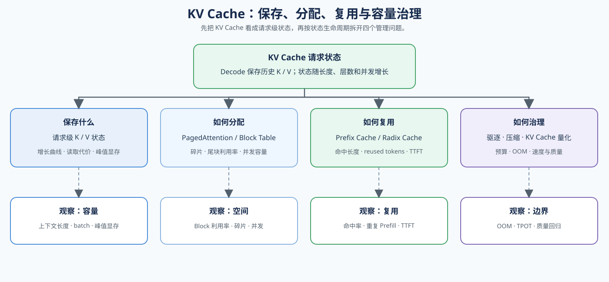
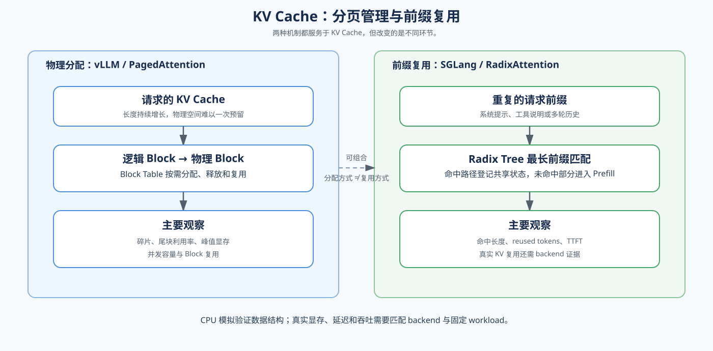

# 04. KV Cache Lifecycle and Reuse | KV Cache 生命周期与复用

## 页面目标

从 Decode 持续读取历史状态开始，跟踪 KV Cache 如何增长、复用并逐渐成为上下文、batch 和并发的容量边界。

本节是 Cache 主题的主要正文入口：22、24、34 分别展开分页分配、前缀匹配和 Prefix Cache；69 负责真实复用收益验证；71 作为 MLA 表示方式的架构扩展。多请求队列、批处理和 PD 分离在后续 Serving 正文中继续展开。

## 核心机制

KV Cache 随层数、KV heads、上下文长度和 batch 增长。先把“每个请求独立建立 Cache、没有前缀复用”的普通 Cache 作为参考行为，观察 Cache 随序列长度和并发增长的显存曲线。它能减少 Decode 的重复计算，却会持续占用显存；当 cache 接近预算时，batch、上下文和并发都会受到限制。图片先展示“增长 → 复用 → 容量边界”的关系，表格再区分不同机制；请求排队和 Prefill / Decode 拆池将在 07 中继续展开。

| Cache 角色 | 主要改变什么 | 适用问题 | 主要指标与入口 |
|:---|:---|:---|:---|
| 请求级状态 | 保存 Decode 需要的历史 K / V | Cache 随上下文、层数和 batch 增长 | 峰值显存、TPOT；11、Task2 |
| 物理分配 | 按 Block 管理逻辑与物理位置 | 碎片、尾块浪费、并发容量不足 | Block 利用率、峰值显存；22 |
| 前缀复用 | 查找并复用相同前缀状态 | 重复 Prefill、共享 system prompt 或历史 | 命中长度、reused tokens、TTFT；24、34、69 |
| 容量治理 | 控制 Cache 驻留、压缩或量化 | Cache 接近预算、OOM 或并发受限 | OOM、速度、质量、并发；41、显存优化 |

图中的“分页”和“前缀复用”是两条不同机制：前者改变 KV Cache 的物理分配方式，后者改变已有状态的查找与复用方式。下面的对照图只比较 vLLM 与 SGLang 在这两条机制上的典型抽象，不把它们延伸成完整 Serving 调度结论。

把四类 Cache 角色放回一次请求的生命周期，可以按“建立、追加、复用、释放”观察：

| 阶段 | 发生什么 | 重点观察 |
|:---|:---|:---|
| Prefill | 为请求建立初始 KV Cache，并完成初始 Block 分配 | 初始容量、Block 分配、prompt tokens |
| Decode | 逐 token 读取历史状态，并在跨越边界时追加 Cache | TPOT、扩容次数、峰值显存 |
| Prefix Hit | 命中已有前缀，跳过部分重复 Prefill | `hit_len`、`reused_tokens`、TTFT |
| Request Finish | 释放、驱逐或保留已经完成的 Cache | 引用计数、回收情况、并发边界 |

实验时先固定模型、backend、dtype、prompt tokens、generated tokens、batch 和 concurrency，再记录策略开关与证据来源：

| 记录项 | 用来回答什么问题 |
|:---|:---|
| `peak_memory`、Block 利用率 | Cache 是否成为容量或碎片瓶颈 |
| `hit_rate`、`reused_tokens` | 前缀复用是否真的发生 |
| `TTFT`、`TPOT`、throughput、P99 | Cache 策略是否改善请求性能 |
| `quality`、OOM、`evidence_level` | 结果是否可以形成可复查结论 |

CPU 实验可以验证 token 匹配、Block 账本和生命周期逻辑；真实 Cache、显存、backend 命中率和服务指标需要 GPU/backend workload。TTFT 的变化只能说明请求表现发生变化，不能单独证明 Cache 命中。

这里使用 vLLM 的 PagedAttention 和 SGLang 的 RadixAttention 作为两种典型机制的学习入口；实际 backend 可能同时支持分页、前缀复用和其他 Cache 管理策略，不能把机制名称理解成 backend 的唯一能力。

MLA 放在本路线中属于架构扩展：它改变 KV Cache 的内部表示方式，而不是改变物理 Block 分配或前缀匹配规则。需要比较 MHA、GQA 和 MLA 时，进入 [71 MLA / KV Cache 结构基准](../../02_PyTorch_Algorithms/71_MLA_KV_Cache_Architecture_Benchmark.ipynb)。

参考入口：论文 [PagedAttention](https://arxiv.org/abs/2309.06180)；开源项目 [vLLM](https://github.com/vllm-project/vllm) 与 [SGLang](https://github.com/sgl-project/sglang)。

## 判断框架

本节承接 `03` 的 Decode 状态，先用 `11`、`22`、`24` 和 `34` 理解 Cache 的增长、分页与复用，再通过 [69 Prefix Caching Benchmark](../../02_PyTorch_Algorithms/69_Prefix_Caching_Benchmark.ipynb) 验证复用，最后用 [66 Inference Performance Comparison](../../02_PyTorch_Algorithms/66_Inference_Performance_Comparison.ipynb) 做综合比较。阅读下表时，先固定请求分布、Prompt 长度、generated tokens、batch、并发窗口和 cache policy，再根据现象分流。

| 观察到的现象 | 优先判断 | 下一步 |
|:---|:---|:---|
| cache 随上下文或 batch 快速增长 | 容量边界 | 先估算预算，再看压缩或限制 |
| 重复前缀明显但 TTFT 没有下降 | 复用没有生效 | 检查 Prefix / Radix Cache |
| 并发上升后显存碎片和 P99 变差 | 分配或分页问题 | 检查 PagedAttention 和调度 |
| Cache 仍可用但吞吐低 | 可能是请求组织问题 | 进入 Task4 / `07` / `70` |
