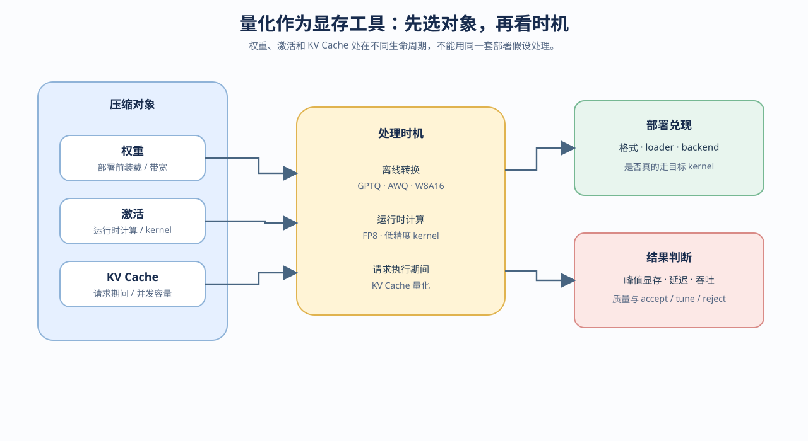

# 05. Quantization as a Memory Tool | 量化作为显存手段

## 页面目标

本节把量化放回显存预算中理解：先判断压缩的是权重、activation 还是 KV Cache，再判断模型是否因此装得下，以及速度、质量和 backend 代价是否可接受。

## 核心机制

量化降低数值表示的存储或计算成本，但不同对象的处理时机和部署约束不同。

| 量化对象 | 典型时机 | 主要收益 | 主要风险 |
|:---|:---|:---|:---|
| 权重 | 部署前或加载前 | 模型更容易装入显存 | 精度、格式和 kernel 约束 |
| activation | 运行时计算 | 中间张量和带宽压力下降 | 数值稳定性、硬件支持 |
| KV Cache | 请求执行过程中 | 长上下文或高并发更容易装下 | 误差、cache dtype 和 backend 支持 |

学习顺序是 [21 量化理论](../../01_Hardware_Math_and_Systems/21_Quantization_Theory_and_INT4_INT8.ipynb) → [25 W8A16](../../02_PyTorch_Algorithms/25_Quantization_W8A16.ipynb) → [40 GPTQ / AWQ](../../02_PyTorch_Algorithms/40_GPTQ_and_AWQ_Weight_Quantization.ipynb) → [41 FP8 / KV Cache 量化](../../02_PyTorch_Algorithms/41_FP8_and_KV_Cache_Quantization.ipynb) → [67 量化部署](../../02_PyTorch_Algorithms/67_Quantized_Inference_and_Deployment.ipynb)。其中 `41` 既覆盖运行时量化，也覆盖 KV Cache 量化；Task4 只引用它的 Cache 相关部分，完整量化判断统一在本 Task 收口。

GGUF 是文件格式和部署封装，需要匹配 llama.cpp 等 backend；不能把 GGUF 的启动方式和 GPTQ / AWQ 的 backend 直接混写。

三类量化对象对应不同的验证入口：

| 量化对象 | 先确认什么 | 主要验证入口 | 最终证据 |
|:---|:---|:---|:---|
| 权重 | 文件格式、加载方式和底座 dtype | `21 → 25 → 40` | `67` 的真实 artifact、backend、kernel 和显存 |
| activation | 计算路径、硬件支持和数值稳定性 | `21`、混合精度与算子支撑 | GPU 前向 / 训练吞吐和质量 |
| KV Cache | 请求阶段、cache dtype 和 backend 支持 | `41`，并与 Task4 的 Cache 机制衔接 | 长上下文、并发、显存和任务质量 |

GGUF、GPTQ、AWQ 和 FP8 不是同一层面的名称：前者可能描述文件格式和部署封装，后者可能描述量化算法或计算表示。实验报告应分别记录格式、算法、backend 和 kernel，不能只写“INT4 / FP8”。

## 判断与验证

先按“对象 → 时机 → backend → 指标”做判断：

1. 如果模型首先装不下，先检查权重表示和加载格式。
2. 如果长上下文或并发首先装不下，再检查 KV Cache 表示。
3. 如果理论压缩有效，仍要确认真实模型能加载、使用了什么 kernel，并和 FP16 / BF16 baseline 使用同一 workload 对比。
4. 最终同时记录峰值显存、延迟、吞吐、质量、格式和加载状态，输出 `accept / tune / reject`。

量化实验的最小对照应包含：同一模型和 revision、同一请求或评测集、同一生成长度、同一 batch / concurrency，以及 FP16 或 BF16 baseline。只有量化模型成功加载并完成同口径对照，才能讨论部署收益。

CPU 可以验证量化误差、理论字节数、输出 shape 和预算逻辑；GPU backend 才能确认格式加载、kernel、峰值显存、吞吐和任务质量。理论压缩率不等于端到端收益。
