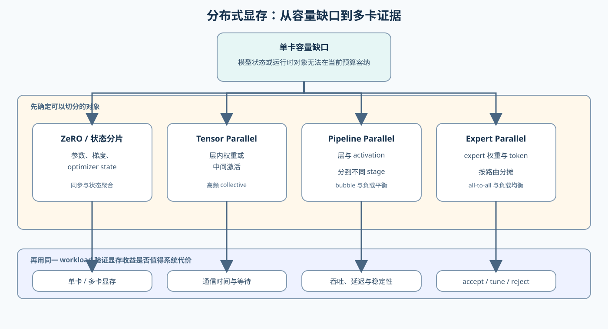

# 07. Distributed Memory and System Extension | 分布式显存与系统扩展

## 页面目标

本节对应 **Task6：分布式显存与系统级扩展**。当单卡账本已经说明模型或训练状态无法在当前预算中容纳时，学习者需要判断哪些状态可以切分、切分后增加什么通信代价，以及多卡结果是否值得采用。

## 从单卡账本到多卡分摊

分布式显存优化不是简单地把显存容量相加。首先要明确分摊对象，再判断每张卡需要保留什么副本、哪些数据需要跨卡交换，最后用通信和端到端结果验证方案。

| 策略 | 主要分摊的对象 | 单卡显存变化 | 新增系统代价 |
|:---|:---|:---|:---|
| ZeRO / 参数状态分片 | 参数、梯度、optimizer state | 训练状态按 rank 分摊 | gather、reduce-scatter 和同步 |
| Tensor Parallel | 层内权重或中间激活 | 单卡权重和部分激活下降 | 高频 all-reduce / all-gather |
| Pipeline Parallel | 层和 activation | 每卡只保留部分层状态 | pipeline bubble、stage 不均衡 |
| Expert Parallel | MoE expert 权重和 token | 每卡只保留部分 expert | all-to-all、路由不均和容量因子 |

这四类策略解决的对象不同，不能只按“单卡显存下降多少”排序。相同模型在不同拓扑、batch、序列长度和并发下，通信占比可能完全不同。

## 选择策略的判断顺序

建议按下面顺序筛选，而不是一开始就选择并行方式：

1. **确认容量缺口。** 判断放不下的是参数、梯度、optimizer state、activation、KV Cache 还是运行时 buffer。
2. **确认可切分对象。** 参数状态适合分片，层内矩阵适合 Tensor Parallel，层序列适合 Pipeline Parallel，expert 权重和 token 路由适合 Expert Parallel。
3. **确认通信条件。** 记录 GPU 数量、拓扑、互联带宽、消息大小和通信频率。
4. **确认 workload。** 固定模型、dtype、batch、序列长度、micro-batch、并发和 warmup。
5. **确认端到端代价。** 同时比较单卡显存、通信时间、总耗时、吞吐、扩展效率和稳定性。

## 机制练习与真实证据

先用 Part 02 的模拟小节理解切分关系：

- [27 ZeRO 优化器模拟](../../02_PyTorch_Algorithms/27_ZeRO_Optimizer_Sim.ipynb)：观察参数、梯度和 optimizer state 的分摊；
- [28 Pipeline 并行微批次](../../02_PyTorch_Algorithms/28_Pipeline_Parallelism_MicroBatch.ipynb)：观察 stage、micro-batch 和 pipeline bubble；
- [29 Tensor 并行模拟](../../02_PyTorch_Algorithms/29_Tensor_Parallelism_Sim.ipynb)：观察张量切分和通信边界。

模拟结果可以验证 shape、切分关系、账本和调度逻辑，但不能直接证明多 GPU 的通信时间或扩展效率。真实验证进入：

- [79 分布式并行基准](../../02_PyTorch_Algorithms/79_Distributed_Parallel_Benchmark.ipynb)；
- [80 MoE 专家并行基准](../../02_PyTorch_Algorithms/80_MoE_Expert_Parallel_Benchmark.ipynb)；
- [81 分布式推理项目](../../02_PyTorch_Algorithms/81_Distributed_Inference_Project.ipynb)。

## 证据与决策

| 阶段 | 需要固定或记录什么 | 主要回答的问题 |
|:---|:---|:---|
| 单卡 baseline | 单卡显存、step time / latency、吞吐、质量和 OOM | 不切分时的真实成本是什么？ |
| 分布式配置 | rank、GPU 数、拓扑、切分策略和通信配置 | 状态如何分摊，通信发生在哪里？ |
| 通信测量 | collective 类型、消息大小、通信时间和等待 | 显存收益是否被通信代价抵消？ |
| 端到端对照 | 相同 workload 下的总耗时、吞吐、显存和稳定性 | 多卡方案是否真正改善目标指标？ |

CPU 可以验证切分公式、shape、账本和决策逻辑；真实多 GPU 才能确认通信时间、拓扑影响、显存分摊和端到端扩展效率。没有单卡 baseline，不能直接把多卡更快或更慢归因于某一种并行策略。

当显存确实下降、目标吞吐或延迟达到要求，且通信与稳定性满足约束时，方案才可以进入 `accept`；显存可行但通信或负载不稳定时进入 `tune`；如果端到端没有收益或系统代价过大，则进入 `reject`。

## 与其他正文的关系

本节承接 [01 显存账本](./01_vram_ledger_and_metrics.md) 的对象和容量估算，复用 [06 Benchmark 与取舍决策](./06_benchmark_and_tradeoff_decision.md) 的对照与证据口径。需要解释通信热点和 overlap 时，再回到[性能分析专题](../profiling/intro.md)；需要理解推理请求的调度和 backend，则转到[推理优化专题](../inference_optimization/intro.md)。
