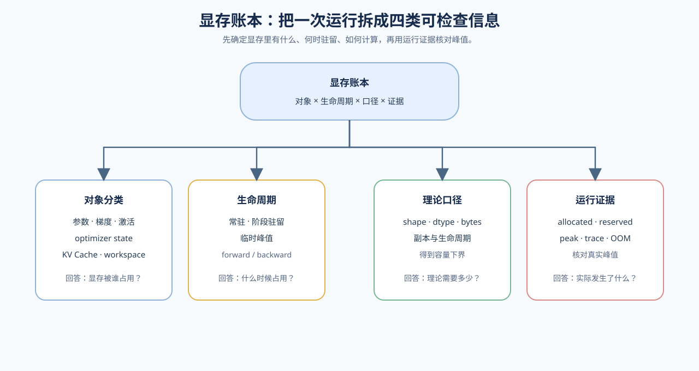
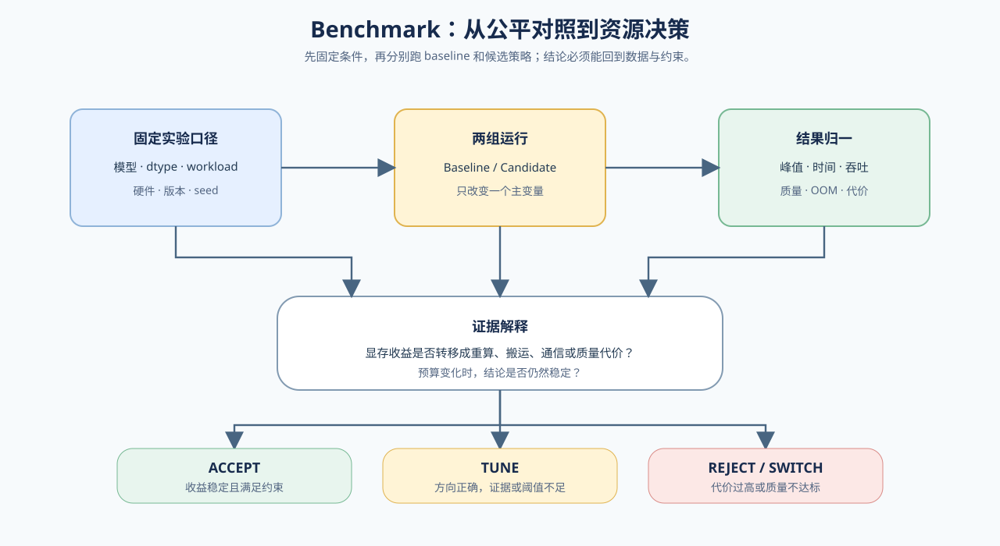

# 显存优化判断手册

> 这份判断手册按问题组织，不属于 Task0–6 的顺序学习内容。完成机制学习后，遇到实际显存问题时，用它选择排查方向和验证项目。

显存优化不应从技巧名称开始，而应从现象开始判断：当前是哪类对象超过预算，发生在什么生命周期，应该优先减少驻留、重算、搬运还是压缩表示。

统一判断链是：

```text
现象 → 显存对象 → 生命周期 → 策略代价 → 证据出口
```

训练和推理共享这套判断方法，但对象账本和实验结论不能混用。训练主要观察 activation、梯度和 optimizer state；推理主要观察权重、KV Cache 和运行时 buffer。

## 显存对象与问题入口



| 显存对象 | 主要生命周期 | 常见问题 | 主要学习入口 |
|:---|:---|:---|:---|
| 参数 | 模型加载到运行结束 | 模型或 checkpoint 装不下 | Task1、量化与分布式 |
| 梯度 | backward 后产生 | 训练峰值升高 | Task0、Task2 |
| optimizer state | optimizer step 后驻留 | 训练状态过大 | Task1、73 |
| activation | forward 保存到 backward | 中后段 OOM | Task0、Task2、76 |
| KV Cache | Prefill 到请求结束 | 长上下文、并发受限 | Task4、66、69、71 |
| 通信 buffer | 多卡通信期间 | 多卡峰值和通信开销 | Task6、79–81 |

## 按现象选择策略

| 现象 | 先判断的对象 | 先测什么 | 候选策略 | 主要代价 | 验证出口 |
|:---|:---|:---|:---|:---|:---|
| 训练前几步正常，中后段 OOM | activation、临时张量 | forward / backward 峰值和 saved tensors | checkpoint、offload | 重算、搬运、同步 | [73](../../02_PyTorch_Algorithms/73_Training_Performance_Analysis.ipynb) → [76](../../02_PyTorch_Algorithms/76_Activation_Checkpoint_Offload_Benchmark.ipynb) |
| 单步显存可接受，但有效 batch 不够 | activation 与 micro-batch | 单步峰值和有效 batch | gradient accumulation、checkpoint | 微步数、重算时间 | [12](../../02_PyTorch_Algorithms/12_Gradient_Accumulation.ipynb) → [73](../../02_PyTorch_Algorithms/73_Training_Performance_Analysis.ipynb) |
| 模型加载阶段就超过预算 | 权重、dtype、运行时 buffer | 参数账本和加载峰值 | 量化、分片、改变 dtype | 质量、kernel、通信 | [67](../../02_PyTorch_Algorithms/67_Quantized_Inference_and_Deployment.ipynb) / [79](../../02_PyTorch_Algorithms/79_Distributed_Parallel_Benchmark.ipynb) |
| 上下文变长后显存持续上涨 | KV Cache | Cache 增长和并发边界 | paging、prefix reuse、cache quantization | 命中率、误差、backend 约束 | [66](../../02_PyTorch_Algorithms/66_Inference_Performance_Comparison.ipynb) → [69](../../02_PyTorch_Algorithms/69_Prefix_Caching_Benchmark.ipynb) |
| 并发增加后 Cache 无法容纳 | KV Cache、临时请求空间 | Cache 容量、命中和请求 workload | cache budget、复用、架构扩展 | 并发、质量、调度约束 | [69](../../02_PyTorch_Algorithms/69_Prefix_Caching_Benchmark.ipynb) / [71](../../02_PyTorch_Algorithms/71_MLA_KV_Cache_Architecture_Benchmark.ipynb) |
| 峰值显存下降但速度变慢 | 重算、搬运或 kernel | forward / backward / 搬运时间 | 先做 profiling，再调策略 | 时间、带宽、通信 | [74](../../02_PyTorch_Algorithms/74_Profiling_Driven_End_to_End_Optimization.ipynb) |
| 理论账本与实测差距很大 | buffer、碎片、生命周期 | allocator 和 trace | 对齐账本与实测证据 | 分析成本 | [01 显存账本](./01_vram_ledger_and_metrics.md) → [74](../../02_PyTorch_Algorithms/74_Profiling_Driven_End_to_End_Optimization.ipynb) |

## Profiling、Benchmark 与项目决策



Profiling 和 Benchmark 解决不同问题：Profiling 用来发现和解释瓶颈，Benchmark 用来比较候选策略；75 进一步检查预算变化后结论是否稳定，74 当前作为最终 trace 收口。实际项目顺序是 `73 baseline → 76 策略比较 → 75 预算敏感性 → 74 Profiling 收口`。

| 环节 | 主要问题 | 代表项目 | 可以形成的证据 |
|:---|:---|:---|:---|
| baseline | 当前配置的真实成本是多少 | 73 | step time、吞吐、峰值显存、loss、OOM |
| profiling | 时间和显存花在哪里 | 74 | 重算、搬运、optimizer step、kernel 代价 |
| strategy benchmark | 哪个候选策略更合适 | 76 | baseline / checkpoint / offload / hybrid 对比 |
| budget analysis | 不同预算下是否仍然成立 | 75 | budget sensitivity、可行策略集合 |
| final decision | 是否采用当前方案 | 74 + 75 | accept / tune / reject |

| Task | 在 casebook 中承担的角色 |
|:---|:---|
| Task0 | 理解状态产生、驻留和释放 |
| Task1 | 建立 dtype、参数、activation 和 optimizer state 账本 |
| Task2 | 选择 accumulation、checkpoint、offload 等单机策略 |
| Task3 | 用 73、76、75 完成训练侧测量和预算决策 |
| Task4 | 处理 KV Cache、分页、复用和推理容量 |
| Task5 | 通过量化改变权重或 Cache 的容量 |
| Task6 | 用分布式切分和 Profiling 完成系统收口 |

形成结论时按以下顺序检查：

1. **先确认对象。** 不要把 activation、optimizer state 和 KV Cache 放在同一个账本条目里。
2. **再确认阶段。** 训练看 forward / backward / optimizer step；推理看 prefill / decode / cache 增长。
3. **再选择策略。** 说明策略减少了哪类 GPU 驻留，以及代价转移到了计算、带宽、通信、延迟还是质量。
4. **最后选择证据。** CPU 只能验证公式、shape、梯度和决策逻辑；GPU、backend、多卡或 profiler 才能证明对应的系统结论。

`accept / tune / reject` 只用于固定 workload 下的策略判断：显存收益、性能、质量和稳定性同时满足约束时才是 `accept`；证据不足或阈值敏感时保持 `tune`；副作用过大或质量不达标时 `reject`。

## 阅读入口

- 想按顺序学习机制：回到 [显存优化入口](./intro.md)，再读 [01–06 正文](./01_vram_ledger_and_metrics.md)。
- 想沿一个问题完整走一遍：阅读[显存优化深入阅读](./walkthrough.md)。
- 想采集真实数据：进入 73–76、66–71 或 79–81 对应的项目页，并遵守各自环境与报告要求。
- 如果问题首先是请求速度、服务调度或版本治理，应转到[推理优化](../inference_optimization/intro.md)，而不是把所有问题都归入显存优化。
