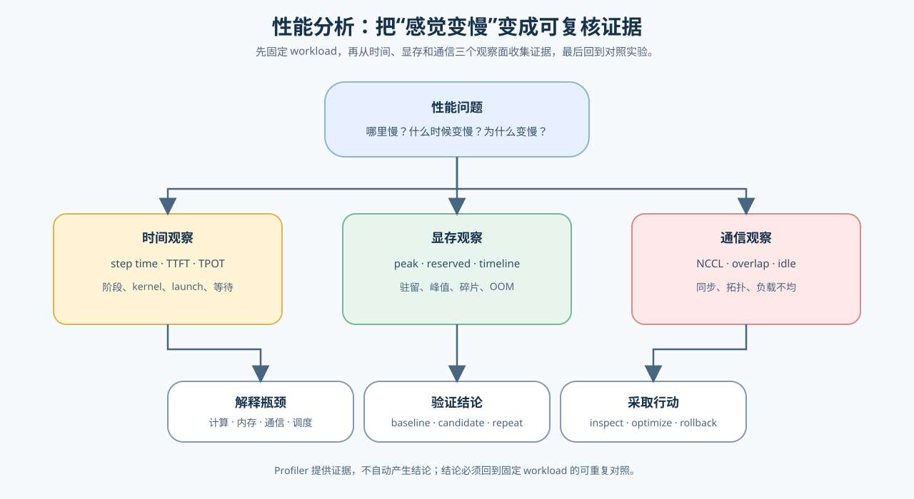
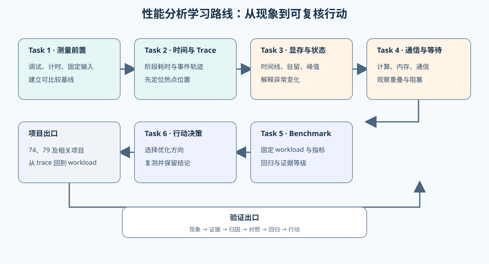

# 性能分析（Performance Analysis）

> 专题类型：横切支撑　主服务目标：瓶颈定位与证据归因

## 页面导语

本专题面向需要回答“哪里慢、为什么慢、改完是否真的更好”的学习者。你将把性能现象改写成可测量的问题，建立可重复的 baseline，再用时间线、显存、通信和 benchmark 证据验证瓶颈假设，最后形成 `inspect / optimize / validate / revert` 的行动决策。

性能分析不是某一个 profiler 的按钮集合，而是一套跨层证据方法：Part00 提供基础取证，Part01 建立计算、内存、传输和调度模型，Part02 在固定模型、硬件和 workload 下完成真实项目验证。

## 如何开始

想沿着一次完整问题连续阅读时，先看[性能分析深入阅读](./walkthrough.md)；想快速根据指标、工具和证据等级选择下一步时，使用[性能分析正文](./casebook.md)。想按知识和实验顺序学习时，从下面的 Task0 开始。

推荐先阅读 [Part 00 · 0E 调试基础](../../00_Prerequisites/0E.md)，再进入 [Part 01 · 13 性能分析与瓶颈定位](../../01_Hardware_Math_and_Systems/13_Profiling_and_Bottleneck_Analysis.ipynb)，最后根据问题进入 Part02 的真实项目。Colab / ModelScope 学习者完成 Level 0–1 即可；Level 2–3 属于 GPU 服务器和多卡扩展。

## 主学习路线

本专题使用 Task0–6 组织一条证据路线：先定义问题，再建立 baseline，随后读取时间、显存和通信证据，最后用对照实验和回归检查形成行动决策。一个 Task 可以连接多个来源小节或项目；专题正文负责解释概念和串联判断，不替代 Notebook 的实现。

| Task | 核心问题 | 学习内容 | 主要产出 | 主学习线 | 专题正文 |
|:---|:---|:---|:---|:---|:---|
| Task0 | “慢”具体表现在哪个指标和阶段？ | 定义现象、指标、假设和测量边界 | 一份可测量的问题定义 | [Part 00 · 0E 调试基础](../../00_Prerequisites/0E.md) → [Part 01 · 13 性能分析与瓶颈定位](../../01_Hardware_Math_and_Systems/13_Profiling_and_Bottleneck_Analysis.ipynb) | [01 为什么需要性能分析](./01_why_profiling_matters.md) |
| Task1 | 怎样得到可重复的 baseline？ | 固定 workload、环境、同步方式、warmup 和重复次数 | baseline 指标与环境快照 | [Part 00 · 17 Profiling 基础](../../00_Prerequisites/17_PyTorch_Profiling_Basics.ipynb) → [Part 00 · 20 Profiling 与显存账本](../../00_Prerequisites/20_Profiling_and_Memory_Ledger.ipynb) | [02 时间分解与 Trace 阅读](./02_time_breakdown_and_trace_reading.md) |
| Task2 | 时间到底消耗在计算、启动还是等待？ | 读取 operator、kernel、launch、同步和阶段切换 | 时间热点与待验证假设 | [Part 00 · 17 Profiling 基础](../../00_Prerequisites/17_PyTorch_Profiling_Basics.ipynb) → [Part 00 · 20 Profiling 与显存账本](../../00_Prerequisites/20_Profiling_and_Memory_Ledger.ipynb) | [02 时间分解与 Trace 阅读](./02_time_breakdown_and_trace_reading.md) |
| Task3 | 显存峰值和驻留行为如何影响性能？ | 观察 allocation、residency、异常和对象生命周期 | memory timeline / snapshot 与归因线索 | [Part 00 · 18 显存分析与优化](../../00_Prerequisites/18_Memory_Profiling_and_Optimization.ipynb) → [Part 00 · 19 调试与异常定位](../../00_Prerequisites/19_Debugging_and_Anomaly_Localization.ipynb) | [03 显存时间线与驻留状态](./03_memory_timeline_and_residency.md) |
| Task4 | 多卡收益为什么被通信和同步吃掉？ | 对齐单卡 baseline，观察 collective、拓扑、等待和 overlap | 通信归因与扩展效率假设 | [Part 02 · 46 NCCL 通信性能分析](../../02_PyTorch_Algorithms/46_Communication_Profiling_with_NCCL.ipynb) → [Part 02 · 79 分布式并行基准测试](../../02_PyTorch_Algorithms/79_Distributed_Parallel_Benchmark.ipynb) | [04 通信等待与重叠](./04_communication_wait_and_overlap.md) |
| Task5 | 候选优化是否在同一 workload 下有效？ | 设计 baseline / candidate、统计口径和回归检查 | 可比较的结果表与失败记录 | [Part 02 · 66 推理性能对比](../../02_PyTorch_Algorithms/66_Inference_Performance_Comparison.ipynb) → [Part 02 · 73 训练性能分析](../../02_PyTorch_Algorithms/73_Training_Performance_Analysis.ipynb) → [Part 02 · 79 分布式并行基准测试](../../02_PyTorch_Algorithms/79_Distributed_Parallel_Benchmark.ipynb) | [05 基准测试设计与回归验证](./05_benchmark_design_and_regression_validation.md) |
| Task6 | 证据是否足以支持保留、继续取证或回退？ | 汇总 evidence level、收益、代价、质量和复查结果 | 带行动理由的项目结论 | [Part 02 · 74 Profiling 驱动的端到端优化](../../02_PyTorch_Algorithms/74_Profiling_Driven_End_to_End_Optimization.ipynb) → [Part 02 · 76 Activation Checkpoint / Offload 基准](../../02_PyTorch_Algorithms/76_Activation_Checkpoint_Offload_Benchmark.ipynb) → [Part 02 · 75 显存预算压缩项目](../../02_PyTorch_Algorithms/75_Memory_Budget_Compression_Project.ipynb) | [06 诊断与行动决策](./06_diagnosis_and_action_decision.md) |

## 工具分层与测量口径

工具随着问题粒度逐级增加：先用轻量测量确认现象，再用框架级 profiler 找方向，只有需要解释系统重叠或 kernel 细节时，才进入 Nsight 和分布式工具。

| 层级 | 工具 | 主要回答的问题 | 环境要求 |
|:---|:---|:---|:---|
| Level 0：轻量测量 | `time.perf_counter()`、`torch.cuda.Event`、`torch.cuda.synchronize()`、`nvidia-smi` | 总耗时、GPU 计时、峰值显存和进程状态 | CPU 可做部分验证；GPU 计时需要 CUDA |
| Level 1：框架级 | `torch.profiler`、Chrome Trace、TensorBoard | 时间热点、CPU/GPU 时间线、算子排序和训练阶段 | CPU 可运行基础示例；CUDA trace 需要 GPU |
| Level 2：系统级 | Nsight Systems | CPU-GPU overlap、stream、同步点、数据搬运和服务阶段 | NVIDIA GPU、Nsight Systems |
| Level 3：kernel / 分布式级 | Nsight Compute、NCCL trace / debug log | occupancy、访存吞吐、Tensor Core、通信等待和 overlap | GPU；多卡分析还需要分布式环境 |

| 字段 | 统一含义 | 常用单位 | 使用范围与注意事项 |
|:---|:---|:---|:---|
| `step_time_ms` | 一次训练 step 从开始到完成的耗时 | ms/step | 明确是否包含数据加载和同步 |
| `latency_ms` | 一次请求或一次运行的端到端耗时 | ms | 注明是单次、E2E 还是阶段耗时 |
| `TTFT` / `TPOT` | 首 token 延迟 / 后续 token 平均间隔 | ms、ms/token | 只用于生成式推理请求 |
| `throughput` | 单位时间完成的工作量 | samples/s、tokens/s、req/s | 写清分子是样本、token 还是请求 |
| `peak_memory` | 测量区间内达到的显存峰值 | MB / MiB | 区分 allocated 与 reserved |
| `hotspot` | 值得继续检查的算子、阶段或等待区间 | — | 观察证据，不等于已确认瓶颈 |
| `P50 / P99` | 延迟分布的中位数和高分位数 | ms | 需要足够请求样本 |
| `evidence_level` | 当前结论获得的证据层级 | 枚举 | 区分 CPU、GPU smoke、固定 benchmark 和稳定结果 |

## Part 之间的职责

- **Part00：基础取证。** 17 建立时间与 trace 记录，18 拆分训练显存对象，19 检查正确性异常，20 把证据整理成下一项验证动作。
- **Part01：瓶颈模型。** 13 把硬件、计算、内存、传输和调度联系起来，帮助提出可测量的瓶颈假设。
- **Part02：项目验证。** 66–70、73–76、79–81 等项目在固定模型、硬件和 workload 下采集真实时间、显存、通信和质量证据，比较 baseline 与 candidate，并输出工程结论。

因此，Part00 的热点列表和 Part01 的理论账本需要在 Part02 项目中通过匹配 workload、重复测量和回归检查升级为项目结论。

## 跨专题入口与项目收口

如果问题已经明确变成显存预算，进入[显存优化](../memory_performance_tuning/intro.md)；如果问题是请求阶段和 backend 行为，进入[推理优化](../inference_optimization/intro.md)；如果问题是多卡等待和切分代价，进入[通信与并行](../communication_parallel/intro.md)。单个热点、单次 trace 或单项显存下降只能支持继续检查；完整结论需要经过：

`固定 workload → baseline → 可证伪假设 → 匹配证据 → candidate 对照 → 质量与回归 → 行动决策`

## 环境与验证

基础 trace 阅读和部分模拟实验可先用 CPU；真实 GPU profiling、显存时间线和多卡通信需要对应 GPU 或分布式环境。固定 workload、warmup、迭代次数和随机种子，并将结果保存为 JSON；跨机器比较时同时记录 PyTorch、CUDA、驱动、GPU 型号和并行配置。

想快速查字段、工具和判断条件时，进入[性能分析正文](./casebook.md)；想沿完整问题链阅读时，进入[性能分析深入阅读](./walkthrough.md)。
